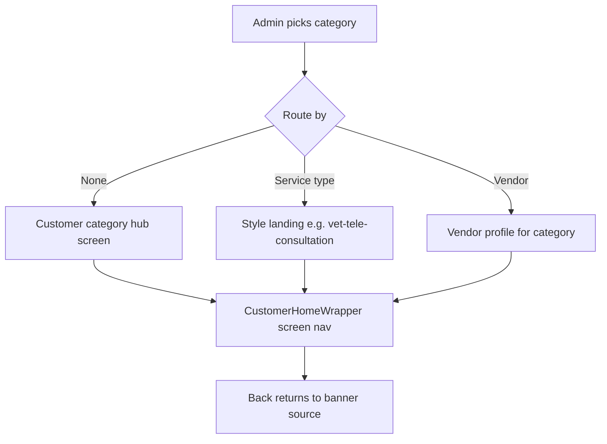

# Dynamic Banner Destination Selection

## Current state

- Admin banner modal in [`apps/admin-web/app/marketing/page.tsx`](apps/admin-web/app/marketing/page.tsx) uses hardcoded `BANNER_CTA_PERSONAS` / `BANNER_SERVICE_STYLES` from [`apps/admin-web/lib/banner-admin.ts`](apps/admin-web/lib/banner-admin.ts).
- Saved metadata is vendor-centric: `{ persona, serviceStyle, vendorId }` — category-only and category+service-type targets are not resolved.
- Backend resolver in [`backend/lambda/src/utils/banner-cta-resolver.ts`](backend/lambda/src/utils/banner-cta-resolver.ts) returns `null` unless `vendorId` is present (`resolveFromBannerTarget` line ~475).
- Customer back flow always resets to home via [`apps/customer-web/lib/banner-navigation-origin.ts`](apps/customer-web/lib/banner-navigation-origin.ts) and `backFromBannerOr` → `handleBack()` in [`CustomerHomeWrapper.tsx`](apps/customer-web/components/customer/wrappers/CustomerHomeWrapper.tsx).
- Checkout banners still render a clickable CTA in [`CustomerPlacementBanners.tsx`](apps/customer-web/components/customer/shared/CustomerPlacementBanners.tsx).

## Target behavior



| Admin selection | Customer lands on |
|---|---|
| Category only | Category hub (`mapCatalogCategoryIdToCustomerHomeScreen`) |
| Category + service type | Style-aware screen (reuse logic from [`promotion-navigation.ts`](apps/customer-web/lib/promotion-navigation.ts): vet+tele → `vet-tele-consultation`, grooming+at_center → `grooming_center`, etc.) |
| Category + vendor | Existing vendor profile resolution (updated to use dynamic `categoryId` / `customerScreen`) |
| Checkout position | Display only — no CTA navigation |

## 1. Extend metadata model (backward compatible)

Update [`apps/admin-web/lib/banner-admin.ts`](apps/admin-web/lib/banner-admin.ts) and resolver types:

```ts
bannerTarget: {
  categoryId: string;           // service_categories.category_id (e.g. "veterinary", "grooming")
  customerScreen: string;     // from mapCatalogCategoryIdToCustomerHomeScreen
  targetLevel: 'category' | 'service_type' | 'vendor';
  serviceStyle?: string;        // required when targetLevel === 'service_type'
  vendorId?: string;
  vendorName?: string;
  persona?: string;             // legacy alias of customerScreen — keep for old rows
}
```

- `parseBannerTargetFromAdminRow`: accept new shape; fall back to legacy `persona + vendorId`.
- `buildBannerMetadata`: persist new fields; set `linkUrl` to a descriptive path only when vendor selected (legacy display), otherwise empty or `#`.
- Remove hardcoded `BANNER_CTA_PERSONAS` / `BANNER_SERVICE_STYLES` exports (replace with dynamic API types).

## 2. New admin API: destination options

Add to [`backend/lambda/src/endpoints/admin/endpoints/admin-governance-enhanced.ts`](backend/lambda/src/endpoints/admin/endpoints/admin-governance-enhanced.ts):

**`GET /admin/banners/destination-options`**

Query: `categoryId` (optional)

Response:

- **`categories`** (always): active rows from `service_categories` where `is_active = true` and `customer_dashboard_card_active != false`, each enriched with:
  - `categoryId`, `name`, `customerScreen` via `@warmpawz/service-launch-mappings`
  - Filter out categories with empty `customerScreen` (prevents broken redirects)
- **`serviceStyles`** (when `categoryId` provided): distinct `service_style` values from **published, enabled** `vendor_services` for approved/active vendors whose category/role matches `getSearchCategoryAliases(categoryId)`; union with role `config.serviceStyles.selected` for matching roles; normalize to `at_center | at_home | tele` with human labels
- **`vendors`** (when `categoryId` provided): approved/active vendors filtered by same alias matching (reuse pattern from `/admin/vendors/active?category=` but driven by catalog `category_id`, not hardcoded persona list)

This keeps admin dropdowns correct even when new categories/vendors/styles are added in DB.

## 3. Rewrite backend resolver for three levels

In [`backend/lambda/src/utils/banner-cta-resolver.ts`](backend/lambda/src/utils/banner-cta-resolver.ts):

1. **Extract shared style→screen mapping** into `@warmpawz/service-launch-mappings` (new export e.g. `resolveCustomerScreenForCategoryAndStyle(customerScreen, serviceStyle)`) — port logic from `styleAwareScreenFromPromo` in [`promotion-navigation.ts`](apps/customer-web/lib/promotion-navigation.ts) so backend and frontend stay in sync.
2. **`resolveFromBannerTarget`** branches:
   - `targetLevel === 'category'` → `{ screen: customerScreen, data: { categoryId } }`
   - `targetLevel === 'service_type'` → `{ screen: resolveCustomerScreenForCategoryAndStyle(...), data: { serviceStyle, categoryId } }`
   - `targetLevel === 'vendor'` → existing vendor lookup + `buildVendorProfileNavTarget`, but derive persona/screen from `customerScreen` instead of hardcoded `PERSONA_CONFIG` keys
3. **Legacy path**: if old metadata has `persona + vendorId` only, keep current behavior.
4. **`enrichBannersWithNavTargets`**: skip resolution (return banner without `navTarget`) when banner `type/position === 'checkout'`.

Update tests in [`backend/lambda/src/utils/__tests__/banner-cta-resolver.test.ts`](backend/lambda/src/utils/__tests__/banner-cta-resolver.test.ts) for all three levels + legacy + checkout skip.

## 4. Admin UI changes

In [`apps/admin-web/app/marketing/page.tsx`](apps/admin-web/app/marketing/page.tsx):

- On modal open: `GET /admin/banners/destination-options` → populate category dropdown (replace `BANNER_CTA_PERSONAS.map`).
- On category change: refetch options with `?categoryId=` → populate service-type and vendor dropdowns.
- Rename state mentally from `bannerCtaPersona` → `bannerCtaCategoryId` (can keep variable name, store `categoryId`).
- **Route by** radio (already present): `none` | `service_type` | `vendor` — enforce mutual exclusivity on save.
- **Checkout position** (`bannerForm.position === 'checkout'`):
  - Hide/disable entire "Banner destination" section
  - Do not require category/vendor/service type on save
  - Clear `bannerTarget` in metadata (informational only)
- Save validation (non-checkout): category required; if mode is `service_type` require style; if `vendor` require vendorId.
- Replace client-side `vendorMatchesBannerPersona` with server-filtered vendor list; keep selected vendor in list on edit even if temporarily inactive.

## 5. Customer navigation + back to source

### Pass banner source on click

| Banner placement | `returnScreen` / source |
|---|---|
| `home_top`, `home_middle`, `home_lower` | `home` |
| `category` (Find All Services at `/services/all`) | `problem_grid` |
| `checkout` | N/A (no click) |

Changes:

- [`apps/customer-web/lib/banner-navigation-origin.ts`](apps/customer-web/lib/banner-navigation-origin.ts): `withBannerNavigationOrigin(data, returnScreen?)` — use provided screen instead of hardcoding `'home'`.
- [`apps/customer-web/lib/banner-cta-navigation.ts`](apps/customer-web/lib/banner-cta-navigation.ts): accept optional `bannerPlacement` / `returnScreen` in input; pass into origin helper.
- [`CustomerHomeComplete.tsx`](apps/customer-web/components/customer/homepage/CustomerHomeComplete.tsx): pass `returnScreen: 'home'` on home banner clicks.
- [`CustomerPlacementBanners.tsx`](apps/customer-web/components/customer/shared/CustomerPlacementBanners.tsx):
  - `category` → pass `returnScreen: 'problem_grid'`
  - `checkout` → render banner without clickable CTA (hide button or disable handler)
- [`CustomerHomeWrapper.tsx`](apps/customer-web/components/customer/wrappers/CustomerHomeWrapper.tsx): update `backFromBannerOr` to read `returnScreen` from nav context (`vetServiceData`, etc.) and `setCurrentScreen(returnScreen)` instead of always calling `handleBack()` → home. For `problem_grid`, ensure back works when user arrived from `/services/all`.

### Resolver `returnScreen`

Stop hardcoding `returnScreen: 'home'` in `buildVendorProfileNavTarget` / booking targets — omit it from server payload; customer client sets it from placement at click time (server should not override client source).

## 6. Deploy

After implementation, deploy all three for end-to-end:

```bash
./scripts/deploy-lambda-direct.sh
./scripts/deploy-admin-web.sh
./scripts/deploy-customer-web.sh
```

Re-create or edit banners via admin so they carry the new `bannerTarget` shape.

## Key files

| Area | Files |
|---|---|
| Shared mapping | [`packages/service-launch-mappings/src/index.ts`](packages/service-launch-mappings/src/index.ts) |
| Admin API | [`admin-governance-enhanced.ts`](backend/lambda/src/endpoints/admin/endpoints/admin-governance-enhanced.ts) |
| Resolver | [`banner-cta-resolver.ts`](backend/lambda/src/utils/banner-cta-resolver.ts) |
| Admin UI | [`marketing/page.tsx`](apps/admin-web/app/marketing/page.tsx), [`banner-admin.ts`](apps/admin-web/lib/banner-admin.ts) |
| Customer | [`banner-cta-navigation.ts`](apps/customer-web/lib/banner-cta-navigation.ts), [`banner-navigation-origin.ts`](apps/customer-web/lib/banner-navigation-origin.ts), [`CustomerPlacementBanners.tsx`](apps/customer-web/components/customer/shared/CustomerPlacementBanners.tsx), [`CustomerHomeWrapper.tsx`](apps/customer-web/components/customer/wrappers/CustomerHomeWrapper.tsx) |

## Risks / edge cases

- **Categories without style sub-screens** (e.g. boarding): service-type level falls back to category hub with `serviceStyle` in data — acceptable; dropdown only shows styles that exist in published vendor services.
- **Legacy banners** without new metadata continue to resolve via persona+vendor CTA path until re-saved in admin.
- **Inactive category/vendor** on edit: show stored value with warning; block save if target no longer valid (optional soft warning vs hard error — prefer warning + block navigation resolve on customer side with existing toast).
