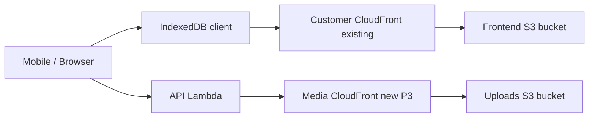

# Static Image Cache & Media CDN — AWS / Infra Ops Guide

**Branch:** `feature/abhi-static-image-cache` (from `develop` @ `72af353e1`)  
**Region:** `ap-south-1`  
**Account:** `057442119249`  
**Rule:** This document covers **configuration outside application code**. No deploys are implied by reading it — apply steps only when you explicitly choose to.

**Related code plan:** [image_pipeline_phase_3.2+ plan](image_pipeline_phase_3.2+_52d47d2c.plan.md)

---

## 1. What runs where (two CDN layers)

| Layer | Assets | AWS resources | Config owner |
|-------|--------|---------------|--------------|
| **L1 Static (P1)** | `/images/**`, `/logo.webp` in customer-web `public/` | **Existing** customer frontend S3 + CloudFront | Terraform `infra/modules/cloudfront` + deploy script |
| **L2 Client cache** | Same URLs + later S3 thumbs | **None** (IndexedDB in browser/Capacitor WebView) | App code only; **requires L1 `Cache-Control`** for HTTP cache |
| **L3 Media CDN (P3)** | Uploads bucket `*.webp` / `*.thumb.webp` | **New** CloudFront dist on `warmpawz-*-user-uploads` + Lambda `MEDIA_CDN_DOMAIN` | New Terraform module + Lambda env |



---

## 2. Resource reference (dev vs prod)

### Frontend (customer app — static `/images/**`)

| | Dev | Prod |
|--|-----|------|
| S3 bucket | `warmpawz-dev-customer-frontend-ap-south-1` | `warmpawz-prod-customer-frontend-ap-south-1` |
| CloudFront ID | `E2RDORGXSWJJ87` | `E2F29N49KVOOBP` |
| CloudFront URL | `https://d2aoyjj8ine0wk.cloudfront.net` | `https://dg69gqp2frh39.cloudfront.net` |
| Custom domain | (varies / cert) | `https://customer.warmpawz.com` |

Source: [`scripts/deploy-customer-web.sh`](../scripts/deploy-customer-web.sh), [`prodscripts/PRODUCTION_CONFIG.md`](../prodscripts/PRODUCTION_CONFIG.md)

### Uploads (dynamic images — P3 only)

| | Dev | Prod |
|--|-----|------|
| S3 bucket | `warmpawz-dev-user-uploads-057442119249` | `warmpawz-prod-user-uploads-057442119249` |
| Lambda handler | `warmpawz-dev-api-handler` | `warmpawz-prod-api-handler` |
| API URL | `https://z0b3obweb6.execute-api.ap-south-1.amazonaws.com` | `https://mss9sa4y01.execute-api.ap-south-1.amazonaws.com` |
| Media CDN | **Not provisioned yet** | **Not provisioned yet** |

Terraform S3 module: [`infra/modules/s3/main.tf`](../infra/modules/s3/main.tf)

---

## 3. P1 — Static hardcoded images (configure first)

**Goal:** Long-lived edge cache for `/images/*` and `/logo.webp` on the **existing** customer CloudFront. No new distribution.

### 3.1 Terraform — CloudFront cache behavior

**File to change:** [`infra/modules/cloudfront/main.tf`](../infra/modules/cloudfront/main.tf)

**Today:** Only `/_next/*` has `max_ttl = 31536000`. `/images/*` falls through **default** behavior (`default_ttl = 3600`, `max_ttl = 86400`).

**Add** after the `/_next/*` `ordered_cache_behavior` block:

```hcl
ordered_cache_behavior {
  path_pattern     = "/images/*"
  allowed_methods  = ["GET", "HEAD", "OPTIONS"]
  cached_methods   = ["GET", "HEAD"]
  target_origin_id = "S3-${each.key}"

  forwarded_values {
    query_string = false
    cookies { forward = "none" }
  }

  viewer_protocol_policy = "redirect-to-https"
  min_ttl                = 0
  default_ttl            = 86400
  max_ttl                = 31536000
  compress               = true
}

ordered_cache_behavior {
  path_pattern     = "/logo.webp"
  # ... same settings as /images/*
}
```

**Scope:** Apply to **customer** distribution. Vendor/admin have no `public/images` tree today — skip unless you add static assets there later.

**Apply order:**

```bash
cd infra/envs/dev
terraform plan   # review only — customer distribution behavior change
# terraform apply   # when you approve — NOT part of this branch mandate

cd infra/envs/prod
terraform plan
# terraform apply   # prod after dev validated
```

**Console alternative (no Terraform):** CloudFront → Distribution `E2RDORGXSWJJ87` (dev) → Behaviors → Create behavior:

- Path: `/images/*`
- Origin: S3-customer
- Cache policy: consider **CachingOptimized** managed policy, or legacy TTL: Min 0, Default 86400, Max 31536000
- Compress objects automatically: Yes
- Repeat for `/logo.webp`

### 3.2 S3 object metadata — Cache-Control on upload

**File to change (code repo, run at deploy time):** [`scripts/deploy-customer-web.sh`](../scripts/deploy-customer-web.sh)

**Today:** `aws s3 sync dist/` with **no** per-type cache headers.

**After code change, deploy will:**

```bash
# Main sync (HTML/JS — shorter cache or default)
aws s3 sync apps/customer-web/dist/ s3://$S3_BUCKET/ --delete --exclude "*.map" --exclude "images/*" --exclude "logo.webp"

# Static images — immutable long cache
aws s3 sync apps/customer-web/dist/images/ s3://$S3_BUCKET/images/ \
  --cache-control "public, max-age=31536000, immutable"

aws s3 cp apps/customer-web/dist/logo.webp s3://$S3_BUCKET/logo.webp \
  --cache-control "public, max-age=31536000, immutable"
```

**One-time fix for objects already in S3 (no full redeploy):**

```bash
# Dev example — read-only copy with new metadata
aws s3 cp s3://warmpawz-dev-customer-frontend-ap-south-1/images/ \
  s3://warmpawz-dev-customer-frontend-ap-south-1/images/ \
  --recursive --metadata-directive REPLACE \
  --cache-control "public, max-age=31536000, immutable" \
  --content-type "$(file -b --mime-type)"   # or set per extension in a script
```

Prefer a small script that sets `Content-Type` by extension (`.webp` → `image/webp`).

### 3.3 CloudFront invalidation policy

**Today:** Every customer-web deploy runs:

```bash
aws cloudfront create-invalidation --distribution-id $CLOUDFRONT_DIST_ID --paths "/*"
```

That **wipes** `/images/**` edge cache even when images did not change.

**Target policy (deploy script change):**

| Deploy changed | Invalidate paths |
|----------------|------------------|
| App code / `_next` only | `/index.html`, `/runtime-config.js`, `/_next/*` |
| `public/images/` or `logo.webp` | Add `/images/*`, `/logo.webp` |
| Never by default | `/*` |

**Detect images diff (example):**

```bash
git diff --name-only HEAD~1 -- apps/customer-web/public/images/ apps/customer-web/public/logo.webp
```

### 3.4 Verification (read-only)

```bash
# Headers from edge
curl -sI "https://d2aoyjj8ine0wk.cloudfront.net/images/home/vet.webp"
# Expect: cache-control: public, max-age=31536000, immutable
# Second request: x-cache: Hit from cloudfront

# Prod
curl -sI "https://customer.warmpawz.com/images/home/vet.webp"
```

CloudWatch → CloudFront → Distribution → Monitoring → **Cache hit rate** for behaviors (after traffic).

---

## 4. L2 — In-browser caching (no AWS bill; depends on L1)

IndexedDB / `CachedImage` is **application code** — no AWS service to provision.

**What infra must provide for it to work well:**

| Requirement | Provided by |
|-------------|-------------|
| Stable URLs (`/images/home/vet.webp` never change without deploy) | Frontend paths + immutable keys |
| Long `Cache-Control` on first network fetch | §3.2 S3 metadata |
| Edge cache on repeat cold opens | §3.1 CloudFront behavior |
| CORS not needed | Same-origin static paths |

**Capacitor WebView:** Uses system HTTP cache when `Cache-Control` is set. IndexedDB is the reliable layer for in-app navigation (shop → home → shop).

**No AWS config for:** IndexedDB quota, LRU size, pre-warm list — all client-side.

---

## 5. P3 — Media CDN for uploads (configure after P1)

**Goal:** Stable `https://media.warmpawz.com/{s3-key}` URLs instead of presigned S3 URLs for product thumbs, profiles, etc.

**Code already supports it:** [`backend/lambda/src/services/image/image-url-builder.ts`](../backend/lambda/src/services/image/image-url-builder.ts) reads `MEDIA_CDN_DOMAIN`.

### 5.1 New Terraform resources (not in repo yet — to be added)

Suggested layout: `infra/modules/cloudfront-media/` or extend `infra/modules/s3/`.

| Resource | Purpose |
|----------|---------|
| `aws_cloudfront_origin_access_control` | OAC for uploads bucket |
| `aws_cloudfront_distribution` | Origin = `warmpawz-{env}-user-uploads-057442119249` |
| `aws_s3_bucket_policy` statement | Allow `cloudfront.amazonaws.com` GetObject with `AWS:SourceArn` condition |
| `aws_route53_record` (optional) | `media.warmpawz.com` → distribution |
| `aws_acm_certificate` (us-east-1) | `*.warmpawz.com` or `media.warmpawz.com` — **must be us-east-1 for CloudFront** |

**Cache behavior (media dist):**

- Path `/*`
- Allowed GET, HEAD, OPTIONS
- TTL: min 0, default 86400, max 31536000 (objects already have `Cache-Control: immutable` from ImageService)
- **Do not** attach URL-rewrite function (not HTML)
- **Do not** map 404 → index.html

**Price class:** `PriceClass_200` (match existing frontends) or `PriceClass_100` if 100% India.

### 5.2 Lambda environment variable

**File:** [`infra/envs/dev/main.tf`](../infra/envs/dev/main.tf) / [`infra/envs/prod/main.tf`](../infra/envs/prod/main.tf)

Add to `common_env_vars` (or `api-handler` `env_vars`):

```hcl
MEDIA_CDN_DOMAIN = "media.warmpawz.com"   # or d123.cloudfront.net until DNS ready
```

**Hotfix without Terraform (console only):**

Lambda → `warmpawz-dev-api-handler` → Configuration → Environment variables → Add `MEDIA_CDN_DOMAIN`.

**Important:** Dev and prod must each point at the **correct** distribution domain for that environment.

### 5.3 S3 lifecycle (already in Terraform, may need apply)

[`infra/modules/s3/main.tf`](../infra/modules/s3/main.tf) — rules for `cleanup/` and `legacy/` prefixes. Apply when ready; unrelated to CDN cutover but part of image pipeline hygiene.

### 5.4 CORS on uploads bucket

ImageService objects are served via CloudFront GET — **browser does not call S3 directly** when `MEDIA_CDN_DOMAIN` is set. Ensure CloudFront forwards only GET; no CORS change required on bucket for CDN reads.

### 5.5 Cutover checklist (when you choose to deploy)

1. Terraform apply media distribution (dev)
2. Set `MEDIA_CDN_DOMAIN` on dev Lambda
3. Deploy Lambda (`./scripts/deploy-lambda-direct.sh`) — **you control when**
4. Smoke: `GET /ecommerce/products?limit=5` → image URLs host = media CDN domain
5. `curl -sI https://media.../products/...thumb.webp` → 200, cache-control immutable
6. Repeat for prod with explicit approval

### 5.6 Verification

```bash
# API returns CDN URLs (after cutover)
curl -s "$API/ecommerce/products?limit=1" | jq '.products[0].images[0]'

# Direct CDN fetch
curl -sI "https://<MEDIA_CDN_DOMAIN>/products/<vendorId>/<key>.thumb.webp"
```

CloudWatch:

- Media distribution **CacheHitRate** > 60%
- Uploads bucket **GetRequests** down vs prior week
- Lambda **Duration** on product list endpoints down

---

## 6. What you do NOT need to configure

| Item | Why |
|------|-----|
| New S3 bucket for static `/images` | Stay on frontend bucket |
| API Gateway for static images | Same-origin paths |
| ElastiCache / Redis | Client IndexedDB + CloudFront sufficient |
| Backfill `public/images` to uploads bucket | Reintroduces S3 calls; rejected in architecture decision |
| WAF on media CDN (initially) | Optional later |
| CloudFront for vendor-web static images | No `public/images` tree today |

---

## 7. Implementation sequence (ops + code)

| Step | Owner | AWS action | Code action (same branch) |
|------|-------|------------|---------------------------|
| 1 | Ops | — | Branch `feature/abhi-static-image-cache` ✓ |
| 2 | Ops/Terraform | Plan CF `/images/*` behavior (dev) | Edit `infra/modules/cloudfront/main.tf` |
| 3 | Ops | `terraform apply` dev (when approved) | — |
| 4 | Dev | — | `image-asset-cache.ts`, `CachedImage.tsx` |
| 5 | Ops | — | Deploy customer-web dev (when approved) with new sync + invalidation |
| 6 | Ops | One-time S3 metadata fix if needed | — |
| 7 | QA | `curl -I`, CloudWatch cache hit | Capacitor home revisit test |
| 8 | Ops | Prod TF + deploy after dev sign-off | — |
| 9 (later) | Ops | Media CDN TF + `MEDIA_CDN_DOMAIN` | Already in `image-url-builder.ts` |
| 10 (later) | Ops | Lambda deploy prod | PresignableImage v2 / shop thumbs |

---

## 8. Cost monitoring (after go-live)

| Service | Billing line | P1 static | P3 media |
|---------|--------------|-----------|----------|
| CloudFront | Data transfer out | Existing customer dist — **$0 new dist** | New dist — ~$0–30/mo |
| CloudFront | Requests | Slight decrease if cache hits | +$10–20/mo requests |
| S3 frontend | GET requests | **Should decrease** | — |
| S3 uploads | GET + egress | — | **Should decrease** with CF hits |
| Lambda | Duration | — | **Should decrease** (no presign) |

Set a monthly review: Cost Explorer → filter by service CloudFront + S3 + Lambda for the week after P1 deploy.

---

## 9. Rollback

| Change | Rollback |
|--------|----------|
| CF `/images/*` behavior | Remove ordered behavior or lower max_ttl; invalidate `/images/*` |
| S3 Cache-Control | Re-sync without header or `max-age=3600` |
| `MEDIA_CDN_DOMAIN` | Unset env var → API reverts to presigned URLs |
| Media distribution | Unset env first; disable distribution |

---

## 10. Quick command cheat sheet

```bash
# Current branch
git branch --show-current   # feature/abhi-static-image-cache

# Dev CF distribution
aws cloudfront get-distribution-config --id E2RDORGXSWJJ87 --query 'DistributionConfig.CacheBehaviors'

# Prod CF distribution
aws cloudfront get-distribution-config --id E2F29N49KVOOBP --query 'DistributionConfig.CacheBehaviors'

# Sample object metadata
aws s3api head-object --bucket warmpawz-dev-customer-frontend-ap-south-1 --key images/home/vet.webp

# Lambda env (read-only)
aws lambda get-function-configuration --function-name warmpawz-dev-api-handler \
  --query 'Environment.Variables.MEDIA_CDN_DOMAIN'
```

---

**Next:** Implement P1 code + Terraform on `feature/abhi-static-image-cache`. Apply AWS changes only when you explicitly approve — this guide is the runbook.

---

## 11. Single deploy verification (dev) — full P1+P2 package

After code on `feature/abhi-static-image-cache` is merged locally, one session can verify everything:

### Deploy order (dev)

```bash
# 1) CloudFront behaviors (Terraform)
cd infra/envs/dev && terraform plan && terraform apply

# 2) API read layer (vendor listing thumbs + SKU list context)
./scripts/deploy-lambda-direct.sh

# 3) Customer web (CachedImage + static sync headers)
./scripts/deploy-customer-web.sh
```

### Smoke checklist

| # | Check | Pass criteria |
|---|--------|----------------|
| 1 | Static CF headers | `curl -sI https://d2aoyjj8ine0wk.cloudfront.net/images/home/vet.webp` → `cache-control: public, max-age=31536000, immutable` |
| 2 | CF cache hit | Second `curl` → `x-cache: Hit from cloudfront` |
| 3 | Home hub IDB | DevTools → Application → IndexedDB `warmpawz-image-cache-v1` has `static:/images/...` entries after home load |
| 4 | Home revisit | Network tab: 0 requests for category chip images on second home visit |
| 5 | Shop grid | `GET /ecommerce/products?limit=10` → `images[0]` are thumb-sized URLs; grid renders via `CachedImage` |
| 6 | Vendor search | Listing photos resolve (smaller thumb URLs when WebP keys exist) |
| 7 | Invalidation scope | Deploy without `public/images` change → invalidation paths exclude `/images/*` (check deploy script log) |

### Rollback

Unset Terraform behaviors / redeploy prior customer-web; Lambda revert via previous deploy artifact if needed.
