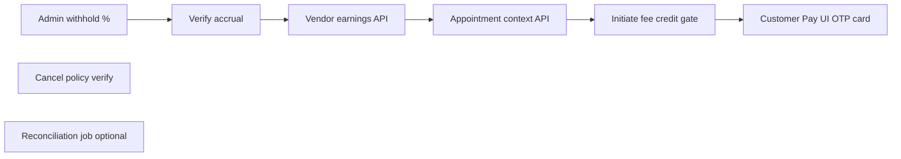

# WAPPT + Warmpawz Pay — unified implementation plan

## Product flow (authoritative)

```mermaid
sequenceDiagram
  participant C as Customer
  participant WP as WarmpawzPay
  participant B as WAPPT_Booking
  participant V as Vendor_OTP
  participant S as Settlement

  C->>B: Book slot (appointment fee only)
  Note over C,V: In-person services; vendor quotes bill
  C->>WP: Enter quoted amount at vendor Pay screen
  WP->>B: Lookup open appointment (same vendor, not completed)
  alt Has open appointment
    WP->>C: Show booking detail + OTP
    V->>B: Complete booking via existing OTP API
    WP->>WP: Re-quote: (quoted - appointmentFee) then apply discount%
  else No appointment
    WP->>WP: Quote: quoted × discount% only
  end
  C->>WP: Razorpay pay
  WP->>S: Verify → accrue settlement (platform withhold on paid amount)
  S->>V: Earnings row (customer name, date, net amount)
```


**Admin-only config (no vendor config UI):**


| Parameter                              | Where today                                            | Gap                           |
| -------------------------------------- | ------------------------------------------------------ | ----------------------------- |
| Pay Bill discount %                    | `warmpawz_pay_merchant_pricing.discount_value`         | Exists                        |
| Appointment fixed fee                  | `warmpawz_appointments_vendor_catalog.appointment_fee` | Exists                        |
| Platform withhold % on **paid** amount | —                                                      | **New column + admin API/UI** |


**Cancellation (appointments):** cancel **before** 1h → wallet refund; **within** 1h or missed (no OTP) → no refund. Partially implemented in `[wappt-booking-cancel.service.ts](backend/lambda/src/endpoints/warmpawz-appointments/shared/wappt-booking-cancel.service.ts)` + policy migrations `1091`/`1092` — verify tiers match this spec, do not touch marketplace cancel APIs.

---

## RCA — what exists vs what’s missing

### Already built (reuse, don’t rewrite)

- **WAPPT booking create** — `commerce_mode` on bookings via `[bookings-enhanced.booking.ts](backend/lambda/src/endpoints/booking/endpoints/bookings-enhanced.booking.ts)`; flat fee from `[vendor_fee_get](backend/lambda/src/endpoints/customer/warmpawz-appointments/services/vendor_fee_get.service.ts)`
- **Pay Bill customer APIs** — `[customer/warmpawz-pay/](backend/lambda/src/endpoints/customer/warmpawz-pay/)` (vendors list, initiate, verify, transactions)
- **Discount math** — `[wpay-discount.ts](backend/lambda/src/endpoints/customer/warmpawz-pay/shared/wpay-discount.ts)` (`computeWpayDiscountQuote`)
- **OTP booking completion** — existing vendor booking complete / OTP verify in `[vendor.gpstracking.ts](backend/lambda/src/endpoints/gpsTracking/endpoints/vendor.gpstracking.ts)` — **reuse as-is**; do not fork for WAPPT
- **Schema hooks for Pay Bill settlement** — migration `[1080](db/migrations/1080_warmpawz_pay_phase1_schema.sql)`: `payments.payment_source=warmpawz_pay`, unique `settlements(payment_id) WHERE order_type='warmpawz_pay'`
- **Admin Pay pricing** — `[warmpawz-pay/admin/pricing/](backend/lambda/src/endpoints/warmpawz-pay/admin/pricing/)`
- **Customer Pay UI shell** — `[WarmpawzPayVendorClient.tsx](apps/customer-web/app/warmpawz-pay/vendors/[vendorId]/WarmpawzPayVendorClient.tsx)`

### Gaps (root cause of “Pay doesn’t show in vendor earnings”)

1. **Verify stops at payment row** — `[customer_warmpawz_pay_verify_post.service.ts](backend/lambda/src/endpoints/customer/warmpawz-pay/services/customer_warmpawz_pay_verify_post.service.ts)` completes `payments` only; **no settlement accrual**
2. **Initiate ignores appointments** — `[customer_warmpawz_pay_initiate_post.service.ts](backend/lambda/src/endpoints/customer/warmpawz-pay/services/customer_warmpawz_pay_initiate_post.service.ts)` always `computeWpayDiscountQuote(amount, %, null)` — no appointment lookup, no fee credit, no `bookingId` in metadata
3. **Platform withhold %** — not in DB or admin pricing
4. **Vendor earnings API** — `[vendor-dashboard-enhanced.ts](backend/lambda/src/endpoints/vendor/endpoints/vendor-dashboard-enhanced.ts)` joins `vendor_earnings` → `bookings` only; Pay Bill has **no booking row** → invisible
5. **Customer Pay UX** — no appointment-context step or OTP booking card between quote and pay

---

## Architecture principle: isolate marketplace, extend Warmpawz

**Do not** add `if (commerce_mode)` branches inside marketplace booking create, marketplace cancel, or marketplace settlement hooks.


| Surface                                  | Strategy                                                                          |
| ---------------------------------------- | --------------------------------------------------------------------------------- |
| Marketplace bookings/checkout/settlement | **Zero changes** when toggle = `marketplace`                                      |
| WAPPT                                    | Existing `customer/warmpawz-appointments/`*, `warmpawz-appointments/admin/*`      |
| Pay Bill                                 | Extend only `customer/warmpawz-pay/*`, new `vendor/warmpawz-pay/*` read APIs      |
| Shared OTP complete                      | Keep single vendor endpoint; **Pay Bill layer** enforces eligibility + fee credit |


Commerce Switch already routes discovery/booking UI; backend isolation is by **route namespace + `commerce_mode` on rows**, not by mutating shared handlers.

---

## Pricing pipeline (single helper — extend, don’t duplicate)

Extend `[computeWpayDiscountQuote](backend/lambda/src/endpoints/customer/warmpawz-pay/shared/wpay-discount.ts)`:

```ts
// billBase = quotedAmount - appointmentFeeCredit (0 if no completed linked booking)
// discountAmount = billBase * discountPercent / 100
// payableAmount = billBase - discountAmount (min ₹0.01)
```

**Appointment fee credit rules (enforce server-side on initiate + verify):**

- Eligible booking: `commerce_mode = warmpawz_pay`, same `customer_id` + `vendor_id`, appointment fee captured, status in `{confirmed, in_progress, …}` **not** `completed`/`cancelled`, slot not in distant past (define: same calendar day or within slot window — pick one constant in repo query)
- Credit applied **only if** `booking.status = completed` (OTP verified) at initiate/verify time
- **Idempotency:** `payments.metadata.appointmentFeeBookingId` + flag `appointmentFeeConsumed`; one credit per booking ever (DB unique partial index on metadata or link table — prefer small migration `warmpawz_pay_appointment_credits(booking_id UNIQUE)`)

**Stored on payment metadata (and settlement breakup):**

- `quotedAmount` — vendor quote (gross bill)
- `appointmentFeeCredit` — fee deducted from quote (0 if walk-in)
- `discountPercent`, `discountAmount`
- `payableAmount` — Razorpay charged amount
- `platformWithholdPercent`, `platformWithholdAmount`
- `vendorNetAmount` — what vendor earns

---

## Settlement accrual (P0 — unblocks vendor earnings)

**New module** (one file, called from verify only):

`backend/lambda/src/endpoints/customer/warmpawz-pay/shared/accrue-wpay-settlement.ts`

On successful verify (inside existing transaction as `dbWpayCompletePayment`):

1. Read completed payment + metadata
2. `platformWithhold = payableAmount × withholdPercent / 100`
3. `vendorNet = payableAmount - platformWithhold`
4. **Idempotent insert** into `settlements`:
  - `order_type = 'warmpawz_pay'`, `payment_id`, `booking_id = NULL` (or linked WAPPT booking id for traceability only — not for commission base)
  - `total_amount = payableAmount`, `commission_amount = platformWithhold`, `vendor_amount = vendorNet`
  - `settlement_breakup` JSON with quoted/discount/credit/withhold labels
5. **Vendor earnings visibility** (lazy mirror of delivery_settlements pattern):
  - **Option A (smaller migration):** extend `GET /vendor/:id/earnings` to `UNION` `settlements WHERE order_type='warmpawz_pay'` joined to `payments` + `customers` for name/date — **no `vendor_earnings` schema change**
  - **Option B (payout-batch parity):** migration nullable `vendor_earnings.booking_id` + `payment_id UUID UNIQUE`; insert row on accrual — use if existing payout job only reads `vendor_earnings`

**Recommend Option A first** (extend earnings API + settlements list); add Option B only if payout batch ignores `settlements` for Warmpawz Pay.

**Do not** call `[insertVendorEarningsFromSettlementSnapshot](backend/lambda/src/finance/settlement/create-vendor-earnings-from-snapshot.ts)` — that is booking/commission-tier logic; Pay Bill uses flat **platform withhold %**, not vendor tier commission.

---

## API changes (Warmpawz namespace only)

### Customer


| Endpoint                                                   | Change                                                                                                                                                                                                                                               |
| ---------------------------------------------------------- | ---------------------------------------------------------------------------------------------------------------------------------------------------------------------------------------------------------------------------------------------------- |
| `GET /customer/warmpawz-pay/appointment-context?vendorId=` | **New** — returns eligible open WAPPT booking summary + OTP display fields (reuse booking detail shape from `[customer_bookings_bookingid_get](backend/lambda/src/endpoints/customer/bookings/services/customer_bookings_bookingid_get.service.ts)`) |
| `POST /customer/warmpawz-pay/quote`                        | **New (optional)** — server-side quote preview with optional `bookingId`; keeps initiate thin                                                                                                                                                        |
| `POST /customer/warmpawz-pay/initiate`                     | Accept optional `bookingId`; resolve credit only if booking completed; persist full quote in metadata                                                                                                                                                |
| `POST /customer/warmpawz-pay/verify`                       | After payment complete → `accrueWpaySettlement`                                                                                                                                                                                                      |


### Vendor


| Endpoint                            | Change                                                                                    |
| ----------------------------------- | ----------------------------------------------------------------------------------------- |
| `GET /vendor/warmpawz-pay/payments` | **New** — list completed Pay Bill payments for vendor (date, customer, quoted, paid, net) |
| `GET /vendor/:vendorId/earnings`    | **Extend** — merge `warmpawz_pay` settlements; `flowType: 'pay_bill'` in response         |


### Admin


| Endpoint                                    | Change                                    |
| ------------------------------------------- | ----------------------------------------- |
| `PUT /admin/warmpawz-pay/pricing/:vendorId` | Add `platformWithholdPercent` (0–100)     |
| WAPPT catalogue                             | No change (appointment fee already there) |


---

## Customer UI (`[WarmpawzPayVendorClient.tsx](apps/customer-web/app/warmpawz-pay/vendors/[vendorId]/WarmpawzPayVendorClient.tsx)`)

1. On vendor load + after amount entry → fetch `appointment-context`
2. If open appointment → render **same booking detail card** as My Bookings (reuse `[BookingDetailModal](apps/customer-web/components/customer/BookingDetailModal.tsx)` or slim inline variant) with OTP visible to customer
3. Poll booking status (or refetch context) until `completed`
4. Re-run quote showing line items: Quoted → Appointment fee credit → Discount → Payable
5. Existing Razorpay checkout unchanged (Bindu’s timing rule preserved)

Walk-in (no appointment): current UX — percentage discount only.

---

## Vendor UI

Extend `[VendorEarningsSettlementDashboard.tsx](apps/vendor-web/components/vendor/VendorEarningsSettlementDashboard.tsx)`:

- New row type: **Warmpawz Pay** — columns: pet parent name, date, quoted amount, paid amount, **your earnings** (after withhold)
- Optional dedicated Pay Bill tab fed by `GET /vendor/warmpawz-pay/payments`

---

## WAPPT cancellation alignment (verify, minimal edits)

In `[wappt-booking-cancel.service.ts](backend/lambda/src/endpoints/warmpawz-appointments/shared/wappt-booking-cancel.service.ts)` + policy tiers:

- Confirm preview API returns **100% wallet refund** when `hoursUntilStart >= 1`
- Confirm **0% refund** when `< 1` hour or no-show
- Customer cancel UI: warn within 1h (“you will lose the money”) — use existing `wappt_booking_cancellation_policy_get`

**No marketplace cancel path changes.**

---

## Migrations (additive only)

1. `10XX_warmpawz_pay_platform_withhold.sql` — `ALTER warmpawz_pay_merchant_pricing ADD COLUMN platform_withhold_percent NUMERIC(5,2) DEFAULT 0 CHECK (0..100)`
2. `10XX_warmpawz_pay_appointment_credit.sql` — `warmpawz_pay_appointment_credits(booking_id UUID PRIMARY KEY, payment_id UUID, amount NUMERIC, consumed_at TIMESTAMPTZ)` — prevents double credit

---

## Execution order (ponytail: money trail first)




| Phase  | Deliverable                                                  | Why first                                       |
| ------ | ------------------------------------------------------------ | ----------------------------------------------- |
| **P0** | Withhold config + verify → settlement + vendor earnings list | Proves money path; walk-in Pay works end-to-end |
| **P1** | Appointment context + fee credit + OTP-gated re-quote + UI   | Ties WAPPT to Pay                               |
| **P2** | Cancel policy audit/fix if tiers drift                       | Policy mostly done                              |
| **P3** | Idempotent backfill job for payments missing settlements     | Safety net                                      |


---

## Team roles & ground rules

**Integration branch:** `feature/warmpawz-pay-appointments-unified` → single PR to `develop` when S11 passes.

**Ping-pong rule:** Only one person **builds + pushes** at a time. The other **waits** (no overlapping commits on shared files). Before your step: `git fetch origin && git pull origin feature/warmpawz-pay-appointments-unified`. After push: paste commit hash in the changelog row + ping the other person.

**Migrations & dev RDS:** **Bindu only.** Her machine does not time out on RDS. Abhi must not run `run-migration-rds-node.js` for this feature.

**Deploys:** Whoever owns the step deploys the component they touched (lambda / customer-web / vendor-web / admin-web). Note deploy in changelog.

### Responsibility map


| Area | Owner | Notes |
| ---- | ----- | ----- |
| All `db/migrations/` files + `ENVIRONMENT=dev node scripts/run-migration-rds-node.js …` | **Bindu** | 1093 withhold, 1094 appointment credits |
| Admin withhold % field (`warmpawz-pay/admin/pricing`) | **Bindu** | API + admin-web UI |
| `accrue-wpay-settlement.ts` + verify hook | **Bindu** | P0 money trail |
| Vendor earnings API + `GET /vendor/warmpawz-pay/payments` | **Bindu** | `vendor-dashboard-enhanced.ts` |
| Vendor earnings UI (`VendorEarningsSettlementDashboard`) | **Bindu** | `flowType: pay_bill` rows |
| `wpay-discount.ts` extend (appointmentFeeCredit param) | **Abhi** | Shared helper; Bindu consumes in accrual |
| `GET /customer/warmpawz-pay/appointment-context` | **Abhi** | New 4-layer route under warmpawz-pay |
| Initiate/verify credit gate + metadata | **Abhi** | Uses 1094 table from Bindu |
| `WarmpawzPayVendorClient` OTP card + quote lines | **Abhi** | Razorpay timing unchanged |
| WAPPT cancel 1h policy audit | **Abhi** | Fix only if tiers drift |
| Joint E2E sign-off | **Both** | S11 checklist below |
| Optional backfill job | **Bindu** | S12, after E2E |

---

## Sequential execution & changelog

**How to use this table:** Treat it as the living changelog. When you finish a step, set Status to `done`, fill Commit + Date, add Verifier notes. The **next row's owner** pulls, verifies the prior step if needed, then builds. Take over a blocked step only after pinging in Slack/chat.

| Step | Builder | Waits | Deliverable | Status | Commit | Date | Verifier / notes |
| ---- | ------- | ----- | ----------- | ------ | ------ | ---- | ---------------- |
| **S00** | Both | — | Align on branch; read this plan; confirm latest `git pull` | `pending` | | | |
| **S01** | **Bindu** | Abhi | `1093_warmpawz_pay_platform_withhold.sql` + admin pricing API/UI for `platformWithholdPercent` | `done` | `acc8e2ab5` | 2026-08-04 | Abhi: pull + confirm admin can save withhold % |
| **S02** | **Abhi** | Bindu | Extend `computeWpayDiscountQuote(quoted, %, { appointmentFeeCredit })` + unit test in `wpay-discount` | `pending` | | | Bindu: pull + use helper in S03 |
| **S03** | **Bindu** | Abhi | `accrue-wpay-settlement.ts`; wire `customer_warmpawz_pay_verify_post`; **apply 1093 on dev RDS**; deploy lambda dev | `pending` | | | Abhi: walk-in Pay Bill smoke — payment completes |
| **S04** | **Bindu** | Abhi | Extend `GET /vendor/:vendorId/earnings` — UNION `settlements` where `order_type='warmpawz_pay'` (customer name, date, net) | `pending` | | | Abhi: confirm API shape for UI |
| **S05** | **Bindu** | Abhi | `1094_warmpawz_pay_appointment_credits.sql` + **apply on dev RDS** | `pending` | | | Abhi: table exists before S07 |
| **S06** | **Abhi** | Bindu | `GET /customer/warmpawz-pay/appointment-context?vendorId=` — open WAPPT booking + OTP fields | `pending` | | | Bindu: optional API smoke |
| **S07** | **Abhi** | Bindu | Initiate/verify: optional `bookingId`, credit only if booking `completed`, idempotent insert into `warmpawz_pay_appointment_credits` | `pending` | | | Bindu: deploy lambda if handler changed |
| **S08** | **Bindu** | Abhi | `GET /vendor/warmpawz-pay/payments` + vendor-web earnings dashboard Pay Bill rows; deploy vendor-web dev | `pending` | | | Abhi: vendor UI shows walk-in Pay from S03 |
| **S09** | **Abhi** | Bindu | Customer Pay UI: appointment card, OTP display, poll until completed, quote line items; deploy customer-web dev | `pending` | | | Bindu: full WAPPT→Pay counter flow |
| **S10** | **Abhi** | Bindu | Audit WAPPT cancel: ≥1h wallet refund, <1h no refund; fix tiers/UI warning only if drift | `pending` | | | Bindu: cancel smoke on dev |
| **S11** | **Both** | — | Joint E2E — all checks in **Verification checklist** below must pass | `pending` | | | Either marks blockers in notes column |
| **S12** | **Bindu** | Abhi | Optional: backfill job for completed `warmpawz_pay` payments missing settlements | `pending` | | | Skip if S11 clean |

### Handoff commands (copy-paste)

```bash
# Before your step
git fetch origin
git checkout feature/warmpawz-pay-appointments-unified
git pull origin feature/warmpawz-pay-appointments-unified

# After your step
git push origin feature/warmpawz-pay-appointments-unified
# Then update changelog row + ping teammate
```

```bash
# Bindu only — after committing migration file
ENVIRONMENT=dev node scripts/run-migration-rds-node.js 1093_warmpawz_pay_platform_withhold.sql
ENVIRONMENT=dev node scripts/run-migration-rds-node.js 1094_warmpawz_pay_appointment_credits.sql
```

---

## Verification checklist (S11 — sign-off)

Run on **dev** with Commerce Switch = `warmpawz_pay`. Check each box in the changelog when done; all must pass before PR to `develop`.

| # | Scenario | Expected | S11 done |
| - | -------- | -------- | -------- |
| V1 | Walk-in Pay Bill: quote ₹1000, 10% discount, 5% withhold | Payable ₹900; settlement `vendor_amount` = ₹855 (900 × 0.95) | [ ] |
| V2 | Walk-in appears in vendor earnings / Pay Bill list | Customer name, date, quoted, paid, net earnings visible | [ ] |
| V3 | WAPPT book (appointment fee only) → in-person → vendor OTP complete | Booking status `completed` | [ ] |
| V4 | Same customer Pay Bill ₹800 quote with completed WAPPT | Fee credit ₹(appointment fee) deducted before discount; payable math correct | [ ] |
| V5 | Second Pay Bill with same `bookingId` | Credit rejected or 0 (idempotent — no double credit) | [ ] |
| V6 | Pay Bill with **open** (not completed) appointment | No fee credit; % discount only; UI shows OTP card until completed | [ ] |
| V7 | Cancel WAPPT ≥1h before slot | Wallet refund of appointment fee | [ ] |
| V8 | Cancel WAPPT <1h before slot | Warning shown; no refund | [ ] |
| V9 | Marketplace booking (toggle = marketplace) | Unchanged create/settle/cancel — no regression | [ ] |
| V10 | Admin: set discount %, appointment fee, withhold % | All three configurable from admin only (no vendor config) | [ ] |

**Sign-off:** Abhi _____ / Bindu _____ / Date _____

---

## Deliberate simplifications (`ponytail:` ceilings)

- **Reuse marketplace OTP complete** — ceiling: WAPPT-specific completion rules later need a dedicated vendor route; upgrade path: `POST /vendor/warmpawz-appointments/:id/complete` wrapper
- **Earnings via settlements UNION first** — ceiling: payout batch may need `vendor_earnings.payment_id`; upgrade: migration + insert on accrual
- **Appointment eligibility = same vendor + unpaid-completed slot heuristic** — ceiling: edge cases (multiple open bookings); upgrade: explicit `link_booking_id` on initiate request
