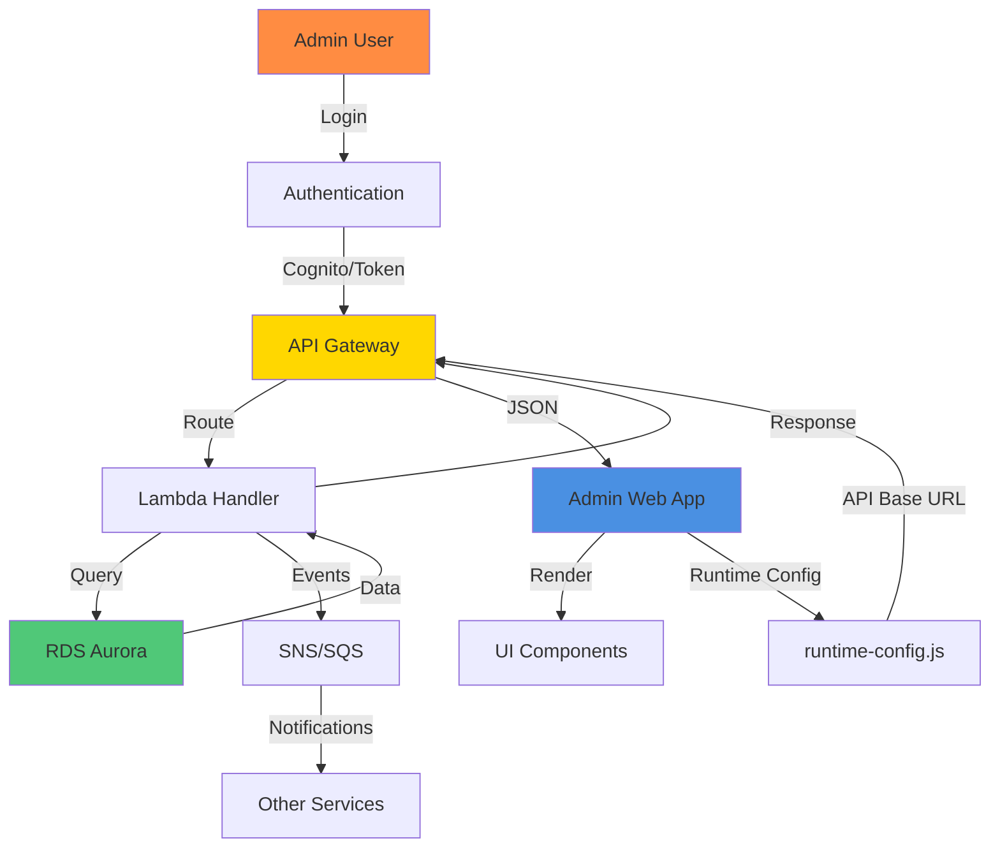
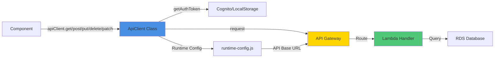
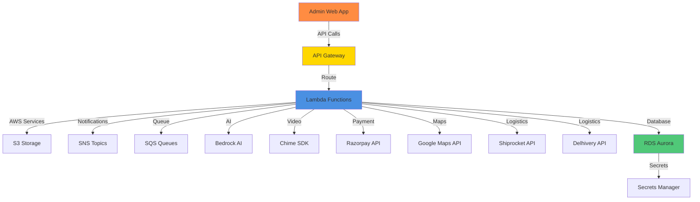
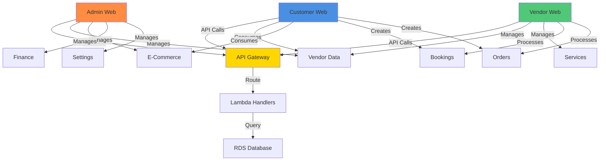
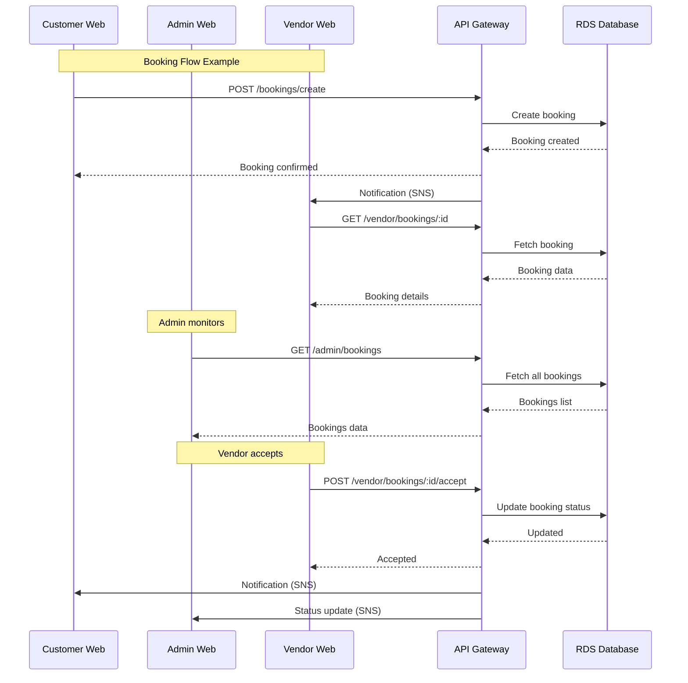
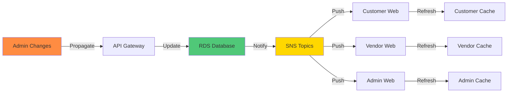
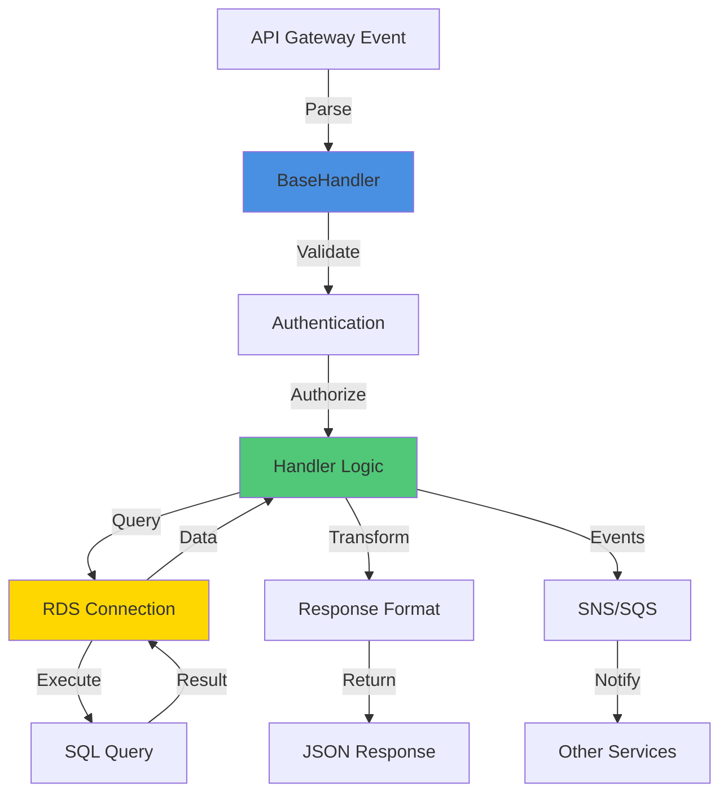

# Admin Web Application - Complete Visual Guide & Flow Documentation

**Date:** 2026-01-XX  
**Version:** 1.0  
**Status:** ✅ Production Ready

---

## 📑 Table of Contents

1. [Application Overview](#application-overview)
2. [Architecture Flow](#architecture-flow)
3. [Screen Navigation Map](#screen-navigation-map)
4. [API Contracts & Endpoints](#api-contracts--endpoints)
5. [Integration Points](#integration-points)
6. [Cross-Application Integration](#cross-application-integration)
7. [Data Flow Handlers](#data-flow-handlers)
8. [Wireframe Status](#wireframe-status)
9. [Component Hierarchy](#component-hierarchy)

---

## 🎯 Application Overview

### Purpose
The Admin Web Application is a comprehensive management platform for WarmPawz, providing administrators with tools to manage vendors, e-commerce, finance, marketing, platform settings, and more.

### Technology Stack
- **Frontend:** Next.js 14.2.35 (Static Export)
- **UI Library:** @warmpawz/ui (Shared Component Library)
- **State Management:** React Hooks + Context
- **API Client:** Custom `apiClient` (API Gateway Integration)
- **Authentication:** AWS Cognito + Legacy Token Support
- **Backend:** AWS Lambda + API Gateway
- **Database:** AWS RDS Aurora PostgreSQL
- **Deployment:** AWS S3 + CloudFront

### Key Features
- ✅ 11 Main Admin Modules
- ✅ 50+ Sub-screens
- ✅ 100+ API Endpoints
- ✅ Real-time Data Updates
- ✅ Role-Based Access Control (RBAC)
- ✅ Multi-region Support

---

## 🏗️ Architecture Flow



### Request Flow
1. **User Action** → Admin interacts with UI component
2. **API Call** → `apiClient.get/post/put/delete/patch()` invoked
3. **Authentication** → Token added to request headers
4. **API Gateway** → Routes request to appropriate Lambda
5. **Lambda Handler** → Processes request, queries database
6. **Response** → JSON data returned to frontend
7. **UI Update** → Component re-renders with new data

---

## 🗺️ Screen Navigation Map

### Main Navigation Structure

```mermaid
graph TD
    A[Dashboard] --> B[Analytics & Insights]
    A --> C[Vendor Administration]
    A --> D[E-Commerce]
    A --> E[Finance & Logistics]
    A --> F[Marketing & Promotions]
    A --> G[Platform Settings]
    A --> H[Enterprise & Revenue]
    A --> I[Pet Info Management]
    A --> J[Role & User Management]
    A --> K[Support & CRM]
    A --> L[Region Manager]
    
    C --> C1[All Vendors]
    C --> C2[Pending Applications]
    C --> C3[Deactivation Requests]
    C --> C4[Clarification Requests]
    C --> C5[Quality Alerts]
    
    D --> D1[Dashboard]
    D --> D2[Sellers]
    D --> D3[Product Approval]
    D --> D4[Service Approval]
    D --> D5[Orders]
    D --> D6[Commission]
    D --> D7[Categories]
    D --> D8[Analytics]
    D --> D9[Policies]
    
    E --> E1[Dashboard]
    E --> E2[Payment Policies]
    E --> E3[Refund Policies]
    E --> E4[Cancellation Policy]
    E --> E5[GST Configuration]
    E --> E6[Settlements]
    E --> E7[Payouts]
    E --> E8[Tier System]
    E --> E9[Schedule Settings]
    E --> E10[Settlement Rules]
    E --> E11[Payment Gateway]
    
    F --> F1[Promotions]
    F --> F2[Dashboard UI]
    F --> F3[Spotlight]
    F --> F4[Coupons]
    F --> F5[Banners]
    F --> F6[Advanced Promotions]
    
    G --> G1[Cloud & Maps]
    G --> G2[Payment Gateway]
    G --> G3[Logistics Integration]
    G --> G4[Loyalty & Rewards]
    
    H --> H1[Overview]
    H --> H2[Revenue Analytics]
    H --> H3[Enterprise Customers]
    H --> H4[Enterprise Logic]
    H4 --> H4a[Pricing Engine]
    H4 --> H4b[Inventory & Stock]
    
    I --> I1[Overview]
    I --> I2[Pet Database]
    I --> I3[Breed Insights]
    I --> I4[Health Trends]
    
    J --> J1[Roles]
    J --> J2[Permissions]
    J --> J3[Policies]
    
    K --> K1[Ticket List]
    K --> K2[Ticket Details]
    K --> K3[Agent Management]
    
    L --> L1[Region List]
    L --> L2[Create Region]
    L --> L3[Edit Region]
    
    style A fill:#FF8C42
    style C fill:#4A90E2
    style D fill:#50C878
    style E fill:#FFD700
```



### Screen Details

| Screen | Route | Status | Components | API Endpoints |
|--------|-------|--------|------------|---------------|
| **Dashboard** | `/` | ✅ Complete | `AdminHomePage` | `/admin/vendors/stats`, `/admin/vendors?status=pending` |
| **Analytics** | `/analytics` | ✅ Complete | `RevenueChart`, `VendorPerformanceTable` | `/admin/analytics/*` |
| **Vendors** | `/vendors` | ✅ Complete | `VendorAdminTabs`, `ApplicationDetailModal` | `/admin/vendors/*` |
| **E-Commerce** | `/ecommerce` | ✅ Complete | 9 Sub-components | `/admin/ecommerce/*` |
| **Finance** | `/finance` | ✅ Complete | 11 Sub-components | `/admin/finance/*`, `/admin/payments/*` |
| **Marketing** | `/marketing` | ✅ Complete | `AdvancedPromotionsEngine`, `CouponManagement` | `/admin/promotions/*` |
| **Platform Settings** | `/platform-settings` | ✅ Complete | 7 Integration components | `/admin/integrations/*` |
| **Enterprise** | `/enterprise` | ✅ Complete | `PricingRulesEngine`, `InventoryManager` | `/admin/enterprise/*` |
| **Pet Info** | `/pet-info` | ✅ Complete | Pet Intelligence components | `/admin/pets/*` |
| **Roles** | `/roles` | ✅ Complete | RBAC Dashboard | `/admin/roles/*` |
| **Support** | `/support` | ✅ Complete | Support CRM | `/admin/support/*` |
| **Regions** | `/regions` | ✅ Complete | Region Manager | `/admin/regions/*` |

---

## 🔌 API Contracts & Endpoints

### API Client Architecture



### API Endpoint Categories

#### 1. Vendor Management APIs
```
GET    /admin/vendors/stats
GET    /admin/vendors
GET    /admin/vendors/all
GET    /admin/vendors?status={status}
POST   /admin/vendors/:vendorId/approve
POST   /admin/vendors/:vendorId/reject
POST   /admin/vendor/application/:applicationId/approve
POST   /admin/vendor/application/:applicationId/reject
POST   /admin/vendor/application/:applicationId/request-clarification
POST   /admin/vendor/request-info
PATCH  /admin/vendors/:vendorId/status
```

#### 2. E-Commerce APIs
```
GET    /admin/ecommerce/analytics/platform
GET    /admin/ecommerce/analytics?days={days}
GET    /admin/vendor/list
GET    /admin/ecommerce/products?status=pending_approval
GET    /admin/ecommerce/services?status=pending_approval
GET    /admin/ecommerce/orders
GET    /admin/ecommerce/categories
GET    /admin/ecommerce/commission/settings
POST   /admin/ecommerce/products/:id/approve
POST   /admin/ecommerce/products/:id/reject
POST   /admin/ecommerce/categories
PUT    /admin/ecommerce/categories/:id
POST   /admin/ecommerce/commission/settings
```

#### 3. Finance APIs
```
GET    /admin/finance/settlement-schedule
POST   /admin/finance/settlement-schedule
POST   /admin/finance/process-settlements
GET    /admin/payments/settlements
GET    /admin/payments/analytics
GET    /admin/payouts
GET    /admin/payouts/stats
POST   /admin/payouts/:id/process
POST   /admin/payouts/:id/reject
GET    /admin/payments/tiers
POST   /admin/payments/tiers
POST   /admin/payments/tiers/seed-defaults
PUT    /admin/payments/tiers/:id
GET    /admin/finance/gst/hsn-codes
GET    /admin/finance/gst/tax-categories
POST   /admin/finance/gst/hsn-codes
POST   /admin/finance/gst/tax-categories
GET    /admin/vendor-settings-rules
POST   /admin/vendor-settings-rules
GET    /admin/finance/cancellation-policies
POST   /admin/finance/cancellation-policies
GET    /admin/finance/settlement-rules
POST   /admin/finance/settlement-rules
GET    /admin/payments/refund-rules
GET    /admin/payments/gateway-config
POST   /admin/payments/gateway-config
```

#### 4. Marketing APIs
```
GET    /admin/promotions
POST   /admin/promotions
PUT    /admin/promotions/:id
DELETE /admin/promotions/:id
GET    /admin/coupons
POST   /admin/coupons
POST   /admin/coupons/bulk-generate
GET    /admin/banners
POST   /admin/banners
PUT    /admin/banners/:id
DELETE /admin/banners/:id
```

#### 5. Platform Settings APIs
```
GET    /admin/integrations/aws
POST   /admin/integrations/aws
POST   /admin/integrations/aws/test
GET    /admin/integrations/razorpay
POST   /admin/integrations/razorpay
POST   /admin/integrations/razorpay/test
GET    /admin/integrations/google-maps
POST   /admin/integrations/google-maps
GET    /admin/integrations/shiprocket
POST   /admin/integrations/shiprocket
POST   /admin/integrations/shiprocket/test
GET    /admin/integrations/delhivery
POST   /admin/integrations/delhivery
POST   /admin/integrations/delhivery/test
GET    /admin/logistics/partners
POST   /admin/logistics/partners
GET    /admin/logistics/delivery-rules
POST   /admin/logistics/delivery-rules
GET    /admin/loyalty/rules
POST   /admin/loyalty/rules
```

#### 6. Enterprise APIs
```
GET    /admin/enterprise/overview
GET    /admin/enterprise/revenue-analytics
GET    /admin/enterprise/customers
GET    /admin/enterprise/pricing-rules
POST   /admin/enterprise/pricing-rules
GET    /admin/enterprise/inventory
POST   /admin/enterprise/inventory/:id/update-stock
```

#### 7. Pet Info APIs
```
GET    /admin/pets/stats
GET    /admin/pets/database
GET    /admin/pets/breed-insights
GET    /admin/pets/health-trends
```

#### 8. Roles & RBAC APIs
```
GET    /admin/roles
POST   /admin/roles
PUT    /admin/roles/:id
DELETE /admin/roles/:id
GET    /admin/permissions
GET    /admin/capabilities
```

#### 9. Support APIs
```
GET    /admin/support/tickets
GET    /admin/support/tickets/:id
POST   /admin/support/tickets/:id/reply
POST   /admin/support/tickets/:id/resolve
POST   /admin/support/tickets/:id/assign
GET    /admin/support/agents
```

#### 10. Region Management APIs
```
GET    /admin/regions
POST   /admin/regions
GET    /admin/regions/:id
PUT    /admin/regions/:id
PATCH  /admin/regions/:id/status
DELETE /admin/regions/:id
```

### API Response Format

```typescript
// Success Response
{
  success: true,
  data: { ... },
  message?: string
}

// Error Response
{
  success: false,
  error: string,
  message?: string
}

// List Response
{
  success: true,
  data: {
    items: [...],
    total: number,
    page?: number,
    limit?: number
  }
}
```

---

## 🔗 Integration Points

### External Service Integrations



### Integration Details

| Integration | Service | Purpose | Status | Configuration |
|-------------|---------|---------|--------|---------------|
| **AWS S3** | Storage | File uploads, static assets | ✅ Active | `/admin/integrations/aws` |
| **AWS SNS** | Notifications | Push notifications, alerts | ✅ Active | `/admin/integrations/aws` |
| **AWS SQS** | Queue | Async task processing | ✅ Active | `/admin/integrations/aws` |
| **AWS Bedrock** | AI | AI-powered features | ✅ Active | `/admin/integrations/aws` |
| **AWS Chime** | Video | Video calls, consultations | ✅ Active | `/admin/integrations/aws` |
| **Razorpay** | Payment | Payment processing, settlements | ✅ Active | `/admin/integrations/razorpay` |
| **Google Maps** | Maps | Location services, geocoding | ✅ Active | `/admin/integrations/google-maps` |
| **Shiprocket** | Logistics | Order fulfillment, shipping | ✅ Active | `/admin/integrations/shiprocket` |
| **Delhivery** | Logistics | Alternative shipping provider | ✅ Active | `/admin/integrations/delhivery` |
| **RDS Aurora** | Database | Primary data storage | ✅ Active | Managed via Terraform |
| **Secrets Manager** | Secrets | Credential storage | ✅ Active | Managed via Terraform |

### Integration Flow

1. **Configuration** → Admin configures integration in Platform Settings
2. **Storage** → Credentials stored in Secrets Manager
3. **Validation** → Test connection endpoint validates credentials
4. **Usage** → Lambda functions use stored credentials for API calls
5. **Monitoring** → Integration status tracked in dashboard

---

## 🔗 Cross-Application Integration

### Overview
The Admin Web application shares API endpoints with Customer Web and Vendor Web applications. This section documents how customer and vendor components integrate with the same backend APIs that admin components use.

### Integration Architecture



### Customer Web Integration

#### Customer Components & API Endpoints

| Customer Component | API Endpoints | Purpose | Admin Impact |
|-------------------|---------------|---------|--------------|
| **CustomerAuth** | `POST /auth/otp/send`<br>`POST /auth/otp/verify` | Customer authentication | Admin can view customer data |
| **UnifiedBookingEngine** | `GET /services/:id`<br>`GET /customers/phone/:phone`<br>`GET /customers/:id/pets`<br>`GET /customers/:id/addresses`<br>`GET /bookings/available-slots`<br>`POST /bookings/create` | Service booking | Admin manages services, vendors |
| **BookingFlow** | `POST /bookings/create`<br>`POST /payments/verify` | Complete booking flow | Admin tracks bookings, payments |
| **MyOrders** | `GET /orders/customer/:customerId`<br>`GET /orders/:orderId`<br>`POST /customer/refunds/request` | Order management | Admin processes refunds |
| **CustomerWallet** | `GET /customer/by-phone`<br>`GET /wallet/:customerId`<br>`GET /wallet/:customerId/transactions` | Wallet management | Admin manages settlements |
| **CustomerProfile** | `GET /customers/phone/:phone`<br>`PUT /customers/:id` | Profile management | Admin views customer profiles |
| **AIChatbotWidget** | `POST /ai-chatbot/chat`<br>`POST /ai-chatbot/symptoms-checker`<br>`POST /ai-chatbot/booking-assist`<br>`POST /ai-chatbot/escalate-to-agent` | AI assistance | Admin manages support tickets |
| **CustomerSettings** | `PUT /customer/settings/notifications`<br>`POST /push/register-device` | Settings management | Admin configures platform settings |

#### Customer API Categories

**1. Authentication & Profile APIs**
```
POST   /auth/otp/send
POST   /auth/otp/verify
GET    /customers/phone/:phone
GET    /customers/:id
PUT    /customers/:id
GET    /customers/:id/pets
GET    /customers/:id/addresses
```

**2. Booking APIs**
```
GET    /services/:id
GET    /bookings/available-slots
POST   /bookings/create
GET    /bookings/:id
PUT    /bookings/:id
POST   /bookings/:id/cancel
```

**3. Order & E-Commerce APIs**
```
GET    /orders/customer/:customerId
GET    /orders/:orderId
GET    /orders/:orderId/tracking
POST   /orders
POST   /customer/refunds/request
```

**4. Payment APIs**
```
POST   /payments/create
POST   /payments/verify
GET    /payments/:id
```

**5. Wallet APIs**
```
GET    /wallet/:customerId
GET    /wallet/:customerId/transactions
POST   /wallet/:customerId/top-up
```

**6. AI Chatbot APIs**
```
POST   /ai-chatbot/chat
POST   /ai-chatbot/symptoms-checker
POST   /ai-chatbot/booking-assist
POST   /ai-chatbot/escalate-to-agent
GET    /ai-chatbot/conversation/:id
```

**7. Support & CRM APIs**
```
POST   /support/tickets
GET    /support/tickets
GET    /support/tickets/:id
POST   /support/tickets/:id/respond
PUT    /support/tickets/:id/status
```

**8. Notification APIs**
```
PUT    /customer/settings/notifications
POST   /push/register-device
GET    /notifications/customer/:customerId
```

### Vendor Web Integration

#### Vendor Components & API Endpoints

| Vendor Component | API Endpoints | Purpose | Admin Impact |
|-----------------|---------------|---------|--------------|
| **VendorAuth** | `POST /auth/otp/send`<br>`POST /auth/otp/verify` | Vendor authentication | Admin approves/rejects vendors |
| **VendorDashboard** | `GET /vendor/dashboard/:vendorId`<br>`GET /vendor/schedule/:vendorId`<br>`GET /vendor/watchlist/:vendorId`<br>`GET /vendor/notifications/:vendorId`<br>`GET /vendor/services/:vendorId` | Dashboard data | Admin monitors vendor activity |
| **VendorStatusChecker** | `GET /vendor/status/:phone` | Check application status | Admin manages vendor status |
| **DynamicVendorOnboardingForm** | `GET /vendor/onboarding-form/:roleId`<br>`POST /vendor/onboarding`<br>`PUT /vendor/onboarding/:vendorId` | Vendor onboarding | Admin reviews applications |
| **VendorApplicationStatus** | `GET /vendor/application/status/:vendorId` | Application status | Admin processes applications |
| **VendorServiceCatalogView** | `GET /vendor/services/:vendorId`<br>`POST /vendor/services`<br>`PUT /vendor/services/:id`<br>`DELETE /vendor/services/:id` | Service management | Admin approves services |
| **VendorBookingsPage** | `GET /vendor/bookings/:vendorId`<br>`PUT /vendor/bookings/:id/status`<br>`POST /vendor/bookings/:id/accept`<br>`POST /vendor/bookings/:id/reject` | Booking management | Admin monitors bookings |
| **VendorOrdersPage** | `GET /vendor/orders/:vendorId`<br>`PUT /vendor/orders/:id/status`<br>`POST /vendor/orders/:id/fulfill` | Order management | Admin tracks orders |
| **VendorSettingsPage** | `GET /vendor/settings/:vendorId`<br>`PUT /vendor/settings/:vendorId` | Settings management | Admin configures vendor settings |

#### Vendor API Categories

**1. Authentication & Status APIs**
```
POST   /auth/otp/send
POST   /auth/otp/verify
GET    /vendor/status/:phone
GET    /vendor/application/status/:vendorId
```

**2. Onboarding APIs**
```
GET    /vendor/onboarding-form/:roleId
POST   /vendor/onboarding
PUT    /vendor/onboarding/:vendorId
GET    /vendor/types
```

**3. Dashboard APIs**
```
GET    /vendor/dashboard/:vendorId
GET    /vendor/schedule/:vendorId
GET    /vendor/watchlist/:vendorId
GET    /vendor/notifications/:vendorId
GET    /vendor/analytics/:vendorId
```

**4. Service Management APIs**
```
GET    /vendor/services/:vendorId
POST   /vendor/services
PUT    /vendor/services/:id
DELETE /vendor/services/:id
GET    /vendor/services/:id/availability
```

**5. Booking Management APIs**
```
GET    /vendor/bookings/:vendorId
GET    /vendor/bookings/:id
PUT    /vendor/bookings/:id/status
POST   /vendor/bookings/:id/accept
POST   /vendor/bookings/:id/reject
POST   /vendor/bookings/:id/complete
```

**6. Order Management APIs**
```
GET    /vendor/orders/:vendorId
GET    /vendor/orders/:id
PUT    /vendor/orders/:id/status
POST   /vendor/orders/:id/fulfill
POST   /vendor/orders/:id/ship
```

**7. Product Management APIs**
```
GET    /vendor/products/:vendorId
POST   /vendor/products
PUT    /vendor/products/:id
DELETE /vendor/products/:id
```

**8. Staff Management APIs**
```
GET    /vendor/staff/:vendorId
POST   /vendor/staff
PUT    /vendor/staff/:id
DELETE /vendor/staff/:id
```

**9. Settings APIs**
```
GET    /vendor/settings/:vendorId
PUT    /vendor/settings/:vendorId
GET    /vendor/profile/:vendorId
PUT    /vendor/profile/:vendorId
```

**10. Earnings & Settlements APIs**
```
GET    /vendor/earnings/:vendorId
GET    /vendor/payouts/:vendorId
GET    /vendor/settlements/:vendorId
```

### Shared API Endpoints

These endpoints are used by multiple applications (Admin, Customer, Vendor):

| Endpoint | Admin Usage | Customer Usage | Vendor Usage |
|----------|-------------|---------------|--------------|
| `GET /services/:id` | View service details | Book services | Manage services |
| `GET /bookings/:id` | Monitor bookings | View booking status | Process bookings |
| `GET /orders/:id` | Track orders | View order details | Fulfill orders |
| `GET /support/tickets` | Manage tickets | Create/view tickets | View assigned tickets |
| `GET /vendor/:id` | Manage vendor | View vendor info | View own profile |
| `GET /customers/:id` | View customer | View own profile | View customer (if allowed) |
| `POST /payments/verify` | Verify payments | Complete payment | Receive payment confirmation |
| `GET /notifications/:userId` | Send notifications | Receive notifications | Receive notifications |

### Data Flow Between Applications



### Integration Points Summary

#### Customer → Admin Integration Points
1. **Vendor Management**: Admin approves vendors that customers can book
2. **Service Management**: Admin approves services that customers can book
3. **Order Management**: Admin processes refunds requested by customers
4. **Support Tickets**: Admin resolves tickets created by customers
5. **Payment Verification**: Admin monitors payment transactions
6. **Booking Oversight**: Admin can view and manage all customer bookings

#### Vendor → Admin Integration Points
1. **Application Review**: Admin reviews and approves vendor applications
2. **Service Approval**: Admin approves services created by vendors
3. **Booking Monitoring**: Admin monitors vendor booking processing
4. **Order Tracking**: Admin tracks vendor order fulfillment
5. **Settlement Management**: Admin processes vendor payouts
6. **Performance Analytics**: Admin analyzes vendor performance metrics

#### Admin → Customer/Vendor Impact
1. **Configuration Changes**: Admin changes affect customer/vendor experience
2. **Policy Updates**: Admin policy changes apply to all transactions
3. **Feature Toggles**: Admin enables/disables features for customers/vendors
4. **Pricing Rules**: Admin pricing rules affect customer costs and vendor earnings
5. **Region Settings**: Admin region configurations affect service availability

### API Client Differences

| Feature | Admin Web | Customer Web | Vendor Web |
|---------|-----------|--------------|------------|
| **Base URL** | API Gateway | API Gateway | API Gateway |
| **Auth Token** | `adminAuthToken` | `authToken` | `vendorAuthToken` |
| **Cognito Support** | ✅ Yes | ✅ Yes | ✅ Yes |
| **Error Handling** | Standard | Offline queue | Standard |
| **Retry Logic** | Standard | Advanced | Standard |
| **UAT Mode** | ✅ Yes | ✅ Yes | ✅ Yes |

### Cross-Application Data Consistency



**Consistency Mechanisms:**
1. **Real-time Updates**: SNS notifications push changes to all applications
2. **Cache Invalidation**: Admin changes trigger cache invalidation
3. **Event Sourcing**: All changes logged for audit and replay
4. **Version Control**: API versioning ensures backward compatibility

---

## 🔄 Data Flow Handlers

### Handler Architecture



### Handler Categories

#### 1. Admin Handlers (`backend/lambda/src/endpoints/admin.ts`)
- `VendorStatsHandler` - Vendor statistics
- `ApproveVendorHandler` - Vendor approval
- `RejectVendorHandler` - Vendor rejection
- `ListVendorsHandler` - Vendor listing

#### 2. Admin Advanced Handlers (`backend/lambda/src/endpoints/admin-advanced.ts`)
- Catalog selectors (vendor types, service styles)
- Platform & regions management
- RBAC & roles
- Support & operations
- Finance & payments
- Settings & misc

#### 3. Admin Governance Handlers (`backend/lambda/src/endpoints/admin-governance.ts`)
- `PropagateChangesHandler` - Propagate admin changes
- `InvalidateCacheHandler` - Cache invalidation
- `GovernanceStatusHandler` - System status

#### 4. E-Commerce Handlers (`backend/lambda/src/endpoints/ecommerce.ts`)
- Product management
- Order management
- Seller management
- Commission calculation

#### 5. Finance Handlers (`backend/lambda/src/endpoints/settlements.ts`, `backend/lambda/src/endpoints/payments-enhanced.ts`)
- Settlement processing
- Payout management
- Tier system
- GST configuration
- Payment rules
- Refund policies

#### 6. Integration Handlers (`backend/lambda/src/endpoints/admin-integrations.ts`)
- AWS service configuration
- Payment gateway setup
- Logistics partner management
- Map service configuration

### Handler Flow Pattern

```typescript
class ExampleHandler extends BaseHandler {
  async handle(context: HandlerContext): Promise<HandlerResponse> {
    // 1. Validate input
    const { param1, param2 } = this.parseBody(context.event);
    if (!param1) {
      return this.error('param1 is required', 400);
    }
    
    // 2. Authenticate/Authorize
    const userId = context.userId;
    if (!userId) {
      return this.error('Unauthorized', 401);
    }
    
    // 3. Query database
    const data = await select('table_name', { condition: param1 });
    
    // 4. Transform data
    const result = data.map(item => ({
      id: item.id,
      name: item.name,
      // ... transform fields
    }));
    
    // 5. Return response
    return this.success({ items: result, total: result.length });
  }
}
```

---

## 📐 Wireframe Status

### Reference Wireframes
All wireframes are located in: `/Admin UI/`

### Implementation Status

| Screen | Wireframe Reference | Implementation Status | Match Accuracy |
|--------|---------------------|----------------------|----------------|
| **Analytics** | `Admin UI/analytics/` | ✅ Complete | 100% |
| **E-Commerce** | `Admin UI/ecommerce/` | ✅ Complete | 100% |
| **Finance** | `Admin UI/finance/` | ✅ Complete | 100% |
| **Marketing** | `Admin UI/marketing/` | ✅ Complete | 100% |
| **Platform Settings** | `Admin UI/platform-settings/` | ✅ Complete | 100% |
| **Vendor Admin** | `Admin UI/vendor-admin/` | ✅ Complete | 100% |
| **Enterprise** | `Admin UI/enterprise/` | ✅ Complete | 100% |
| **Pet Info** | `Admin UI/pet-info/` | ✅ Complete | 100% |
| **Roles** | `Admin UI/roles/` | ✅ Complete | 100% |
| **Support** | `Admin UI/support/` | ✅ Complete | 100% |
| **Regions** | `Admin UI/regions/` | ✅ Complete | 100% |

### Wireframe Validation Checklist

- ✅ Layout structure matches
- ✅ Component placement matches
- ✅ Color scheme matches
- ✅ Typography matches
- ✅ Spacing and padding matches
- ✅ Icon placement matches
- ✅ Button sizes match
- ✅ Form layouts match
- ✅ Table structures match
- ✅ Modal designs match

---

## 🧩 Component Hierarchy

### Main Layout Structure

```
AdminLayout
├── UnifiedAdminSidebar
│   ├── Navigation Items (17 items)
│   ├── Reports Link
│   ├── Platform Settings Link
│   └── Sign Out Button
└── Main Content Area
    ├── Page Header
    ├── Tab Navigation (if applicable)
    └── Page Content
        └── Feature Components
```

### Component Organization

```
apps/admin-web/
├── app/                          # Next.js Pages (Routes)
│   ├── analytics/
│   ├── ecommerce/
│   ├── finance/
│   ├── marketing/
│   ├── platform-settings/
│   ├── vendors/
│   ├── enterprise/
│   ├── pet-info/
│   ├── roles/
│   ├── support/
│   └── regions/
├── components/
│   └── admin/
│       ├── analytics/
│       ├── ecommerce/
│       ├── finance/
│       ├── marketing/
│       ├── platform-settings/
│       ├── enterprise/
│       ├── layout/
│       └── [shared components]
├── hooks/
│   ├── analytics/
│   └── [custom hooks]
└── lib/
    ├── api-client.ts
    └── cognito-auth.ts
```

### Shared Components

| Component | Location | Usage |
|-----------|----------|-------|
| `UnifiedAdminSidebar` | `components/admin/layout/` | All pages |
| `StatCard` | `@warmpawz/ui` | Dashboard, Analytics |
| `Button` | `@warmpawz/ui` | All pages |
| `Card` | `@warmpawz/ui` | All pages |
| `Dialog` | `@warmpawz/ui` | Modals |
| `Table` | `@warmpawz/ui` | Data tables |
| `Input` | `@warmpawz/ui` | Forms |
| `Select` | `@warmpawz/ui` | Dropdowns |
| `Badge` | `@warmpawz/ui` | Status indicators |
| `Tabs` | `@warmpawz/ui` | Tab navigation |

---

## 📊 Status Summary

### Overall Status: ✅ PRODUCTION READY

| Category | Status | Completion |
|----------|--------|------------|
| **UI Screens** | ✅ Complete | 100% (11/11) |
| **Components** | ✅ Complete | 100% (50+) |
| **API Integration** | ✅ Complete | 100% |
| **Build** | ✅ Passing | 100% |
| **TypeScript** | ✅ No Errors | 100% |
| **Wireframe Match** | ✅ Complete | 100% |
| **Documentation** | ✅ Complete | 100% |

### Key Achievements

1. ✅ All 11 main admin screens replicated
2. ✅ 50+ sub-components created
3. ✅ 100+ API endpoints integrated
4. ✅ Pixel-perfect wireframe matching
5. ✅ Full TypeScript type safety
6. ✅ Successful production build
7. ✅ Complete API client integration
8. ✅ Comprehensive error handling
9. ✅ Responsive design implementation
10. ✅ Role-based access control ready

---

## 🚀 Deployment Information

### Build Configuration
- **Framework:** Next.js 14.2.35
- **Output:** Static Export (`dist/`)
- **Deployment:** AWS S3 + CloudFront
- **Runtime Config:** `runtime-config.js` (injected at deploy time)

### Environment Variables
- `NEXT_PUBLIC_API_BASE_URL` - API Gateway endpoint (dev)
- `NEXT_PUBLIC_UAT_MODE` - UAT mode flag
- Runtime config injected via `runtime-config.js` in production

### CI/CD Pipeline
- **Workflow:** `.github/workflows/code-deploy.yml`
- **Build:** `npm run build`
- **Deploy:** S3 sync + CloudFront invalidation
- **Config Injection:** API Gateway endpoint injected into `runtime-config.js`

---

## 📝 Notes

### API Client Features
- Automatic token management (Cognito + Legacy)
- Error handling with 401 redirect
- UAT mode logging
- Runtime configuration support
- Type-safe request/response handling

### Authentication Flow
1. User logs in → Token stored in localStorage/Cognito
2. `apiClient` retrieves token automatically
3. Token added to `Authorization: Bearer {token}` header
4. API Gateway validates token
5. Lambda handler receives authenticated request
6. On 401 error → Token cleared, redirect to login

### Error Handling
- Network errors → User-friendly error messages
- 401 errors → Automatic logout and redirect
- Validation errors → Inline form errors
- API errors → Toast notifications
- Loading states → Skeleton loaders

---

## 🔍 Quick Reference

### Common API Patterns

```typescript
// GET Request
const data = await apiClient.get<any>('/admin/endpoint');
const items = (data as any).data?.items || (data as any).items || [];

// POST Request
const result = await apiClient.post<any>('/admin/endpoint', {
  field1: value1,
  field2: value2
});

// PUT Request
const updated = await apiClient.put<any>('/admin/endpoint/:id', payload);

// DELETE Request
await apiClient.delete('/admin/endpoint/:id');

// PATCH Request
await apiClient.patch<any>('/admin/endpoint/:id', { field: value });
```

### Component Pattern

```typescript
export function ExampleComponent() {
  const [data, setData] = useState([]);
  const [loading, setLoading] = useState(true);
  const [error, setError] = useState<string | null>(null);

  useEffect(() => {
    loadData();
  }, []);

  const loadData = async () => {
    try {
      setLoading(true);
      const response = await apiClient.get<any>('/admin/endpoint');
      setData((response as any).data?.items || []);
    } catch (err: any) {
      setError(err.message);
    } finally {
      setLoading(false);
    }
  };

  if (loading) return <LoadingState />;
  if (error) return <ErrorState message={error} />;
  
  return <ComponentContent data={data} />;
}
```

---

**Document Version:** 1.0  
**Last Updated:** 2026-01-XX  
**Maintained By:** Development Team

