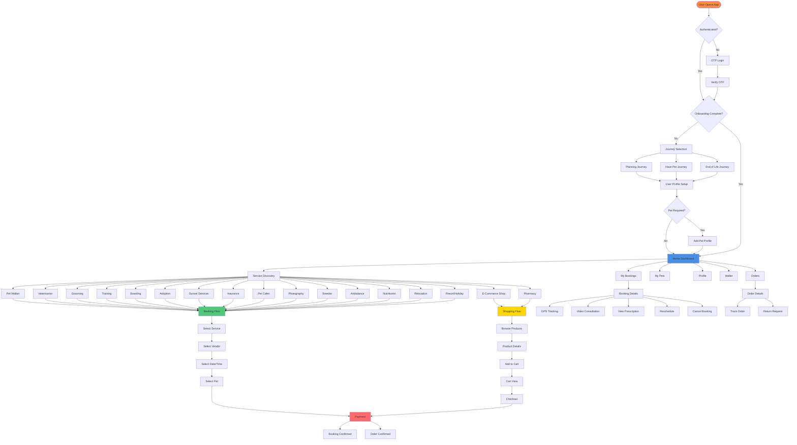
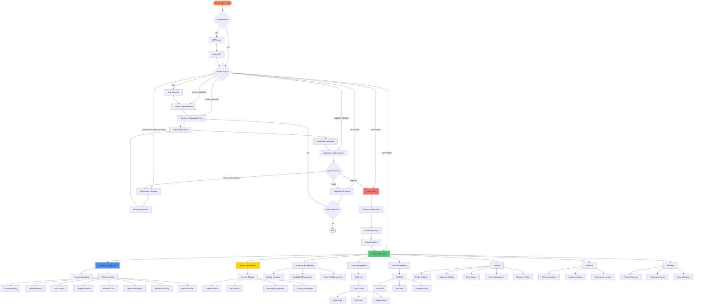

# Customer & Vendor Web Applications - Complete Visual Guide & Documentation

**Date:** 2026-01-07  
**Status:** Comprehensive Flow Documentation & Integration Report

---

## 📋 Table of Contents

1. [Customer Web Application Flow](#customer-web-application-flow)
2. [Vendor Web Application Flow](#vendor-web-application-flow)
3. [Integration Architecture](#integration-architecture)
4. [API Contracts Status](#api-contracts-status)
5. [Placeholder Components](#placeholder-components)
6. [Missing API Contracts](#missing-api-contracts)
7. [Wireframe Status](#wireframe-status)
8. [Integration Descriptions](#integration-descriptions)

---

## 🏠 Customer Web Application Flow

### Complete User Journey Flowchart

### Customer Screen Inventory

| Screen Type | Screen Name | Component | Status | API Contract | Wireframe |
|------------|-------------|-----------|--------|--------------|-----------|
| **Authentication** | OTP Login | `CustomerAuth.tsx` | ✅ Implemented | ✅ `/auth/otp/send`, `/auth/otp/verify` | ✅ |
| **Onboarding** | Journey Selection | `CustomerOnboarding.tsx` | ✅ Implemented | ✅ `/customer/onboarding` | ✅ |
| **Onboarding** | User Profile | `CustomerUserProfile.tsx` | ✅ Implemented | ✅ `/customer/profile` | ✅ |
| **Onboarding** | Pet Profile | `CustomerPetProfile.tsx` | ✅ Implemented | ✅ `/pets/create` | ✅ |
| **Home** | Home Dashboard | `CustomerHomeComplete.tsx` | ✅ Implemented | ✅ `/customer/dashboard` | ✅ |
| **Services** | Pet Walker | `WalkerService.tsx` | ⚠️ Placeholder | ✅ `/services/walker` | ❌ |
| **Services** | Veterinarian | `VetServiceRouter.tsx` | ⚠️ Placeholder | ✅ `/services/vet` | ❌ |
| **Services** | Grooming | `GroomingServiceRouter.tsx` | ⚠️ Placeholder | ✅ `/services/grooming` | ❌ |
| **Services** | Training | `TrainingServiceRouter.tsx` | ⚠️ Placeholder | ✅ `/services/training` | ❌ |
| **Services** | Boarding | `BoardingServiceRouter.tsx` | ⚠️ Placeholder | ✅ `/services/boarding` | ❌ |
| **Services** | Adoption | `AdoptionServiceRouter.tsx` | ⚠️ Placeholder | ✅ `/services/adoption` | ❌ |
| **Services** | Sunset | `SunsetServiceRouter.tsx` | ⚠️ Placeholder | ✅ `/services/sunset` | ❌ |
| **Services** | Insurance | `InsuranceServicesLanding.tsx` | ⚠️ Placeholder | ✅ `/services/insurance` | ❌ |
| **Services** | Pet Cafes | `PetCafeServicesLanding.tsx` | ⚠️ Placeholder | ✅ `/services/cafe` | ❌ |
| **Services** | Pharmacy | `PharmacyServicesLanding.tsx` | ⚠️ Placeholder | ✅ `/services/pharmacy` | ❌ |
| **Services** | Photography | `PhotographyServicesLanding.tsx` | ⚠️ Placeholder | ✅ `/services/photography` | ❌ |
| **Services** | Breeder | `BreederServicesLanding.tsx` | ⚠️ Placeholder | ✅ `/services/breeder` | ❌ |
| **Services** | Ambulance | `AmbulanceServicesLanding.tsx` | ⚠️ Placeholder | ✅ `/services/ambulance` | ❌ |
| **Services** | Nutritionist | `NutritionistServicesLanding.tsx` | ⚠️ Placeholder | ✅ `/services/nutritionist` | ❌ |
| **Services** | Relocation | `RelocationServicesLanding.tsx` | ⚠️ Placeholder | ✅ `/services/relocation` | ❌ |
| **Services** | Resort/Holiday | `PetHolidayServicesLanding.tsx` | ⚠️ Placeholder | ✅ `/services/resort` | ❌ |
| **Booking** | Booking Flow | `UnifiedBookingEngine.tsx` | ✅ Implemented | ✅ `/bookings/create` | ✅ |
| **Booking** | My Bookings | `MyBookings.tsx` | ✅ Implemented | ✅ `/customer/bookings` | ✅ |
| **Booking** | Booking Details | `BookingDetailModal.tsx` | ✅ Implemented | ✅ `/bookings/:id` | ✅ |
| **Booking** | GPS Tracking | `GPSTrackingView.tsx` | ✅ Implemented | ✅ `/bookings/:id/tracking` | ✅ |
| **Booking** | Video Call | `CommunicationHub.tsx` | ⚠️ Placeholder | ✅ `/video-call/:bookingId` | ❌ |
| **Booking** | Prescription | `PrescriptionModal.tsx` | ⚠️ Placeholder | ✅ `/bookings/:id/prescription` | ❌ |
| **E-Commerce** | Shop Dashboard | `ShopDashboard.tsx` | ⚠️ Placeholder | ✅ `/ecommerce/products` | ❌ |
| **E-Commerce** | Product Detail | `ProductDetailPage.tsx` | ⚠️ Placeholder | ✅ `/ecommerce/products/:id` | ❌ |
| **E-Commerce** | Shopping Cart | `ShoppingCartView.tsx` | ⚠️ Placeholder | ✅ `/ecommerce/cart` | ❌ |
| **E-Commerce** | Checkout | `CheckoutView.tsx` | ⚠️ Placeholder | ✅ `/ecommerce/checkout` | ❌ |
| **E-Commerce** | Order Success | `OrderSuccessView.tsx` | ⚠️ Placeholder | ✅ `/ecommerce/orders` | ❌ |
| **E-Commerce** | Order Detail | `OrderDetailView.tsx` | ⚠️ Placeholder | ✅ `/ecommerce/orders/:id` | ❌ |
| **E-Commerce** | Order Tracking | `OrderTrackingView.tsx` | ⚠️ Placeholder | ✅ `/ecommerce/orders/:id/tracking` | ❌ |
| **E-Commerce** | Order History | `OrderHistoryPage.tsx` | ⚠️ Placeholder | ✅ `/customer/orders` | ❌ |
| **E-Commerce** | Return Request | `ReturnRequestPage.tsx` | ⚠️ Placeholder | ✅ `/customer/returns` | ❌ |
| **Wallet** | Wallet Page | `WalletPage.tsx` | ⚠️ Placeholder | ✅ `/wallet/:customerId` | ❌ |
| **Wallet** | Customer Wallet | `CustomerWalletPage.tsx` | ⚠️ Placeholder | ✅ `/wallet/:customerId` | ❌ |
| **Pets** | My Pets | `CustomerPetsPage.tsx` | ✅ Implemented | ✅ `/customer/pets` | ✅ |
| **Pets** | Pet Details | `CustomerPetDetails.tsx` | ✅ Implemented | ✅ `/pets/:id` | ✅ |
| **Pets** | Pet Profile | `PetProfile.tsx` | ✅ Implemented | ✅ `/pets/:id` | ✅ |
| **Pets** | Add Pet | `AddPetModal.tsx` | ✅ Implemented | ✅ `/pets/create` | ✅ |
| **Profile** | Customer Profile | `CustomerProfile.tsx` | ✅ Implemented | ✅ `/customer/profile` | ✅ |
| **Profile** | Settings | `CustomerSettings.tsx` | ✅ Implemented | ✅ `/customer/settings` | ✅ |
| **Specialized** | Cafe Reservation | `CafeReservationFlow.tsx` | ⚠️ Placeholder | ✅ `/bookings/cafe` | ❌ |
| **Specialized** | Resort Booking | `ResortBoardingBookingEnhanced.tsx` | ⚠️ Placeholder | ✅ `/bookings/resort` | ❌ |
| **Specialized** | Ambulance SOS | `AmbulanceSOS.tsx` | ⚠️ Placeholder | ✅ `/bookings/ambulance` | ❌ |
| **Specialized** | Breeder Catalog | `BreederCatalogView.tsx` | ⚠️ Placeholder | ✅ `/services/breeder/catalog` | ❌ |
| **Specialized** | Adoption Questionnaire | `AdoptionQuestionnaire.tsx` | ⚠️ Placeholder | ✅ `/adoption/questionnaire` | ❌ |
| **Specialized** | Medical Records | `MedicalRecordsPage.tsx` | ⚠️ Placeholder | ✅ `/pets/:id/medical-records` | ❌ |
| **Specialized** | Check-In/Check-Out | `CheckInCheckOutPage.tsx` | ⚠️ Placeholder | ✅ `/bookings/:id/checkin` | ❌ |
| **Specialized** | Emergency Booking | `EmergencyBookingPage.tsx` | ⚠️ Placeholder | ✅ `/bookings/emergency` | ❌ |
| **Specialized** | Package Booking | `PackageBookingPage.tsx` | ⚠️ Placeholder | ✅ `/bookings/package` | ❌ |
| **Specialized** | Home Service Selection | `HomeServiceSelectionEnhanced.tsx` | ⚠️ Placeholder | ✅ `/services/home` | ❌ |
| **Loyalty** | Rewards & Loyalty | `RewardsLoyaltyPage.tsx` | ⚠️ Placeholder | ✅ `/rewards/loyalty` | ❌ |
| **Loyalty** | Referral System | `ReferralSystemPage.tsx` | ⚠️ Placeholder | ✅ `/rewards/referral` | ❌ |
| **Social** | Mating & Dating Hub | `MatingDatingHub.tsx` | ⚠️ Placeholder | ❌ Missing | ❌ |
| **AI** | AI Chatbot | `AIChatbotWidget.tsx` | ✅ Implemented | ✅ `/ai-chatbot/chat` | ✅ |

**Legend:**
- ✅ = Fully Implemented with UI and API
- ⚠️ = Placeholder Component (No actual UI)
- ❌ = Missing

---

## 🏢 Vendor Web Application Flow

### Complete Vendor Journey Flowchart

### Vendor Screen Inventory

| Screen Type | Screen Name | Component | Status | API Contract | Wireframe |
|------------|-------------|-----------|--------|--------------|-----------|
| **Authentication** | OTP Login | `VendorAuth.tsx` | ✅ Implemented | ✅ `/auth/otp/send`, `/auth/otp/verify` | ✅ |
| **Onboarding** | Role Selection | `VendorRoleSelection.tsx` | ✅ Implemented | ✅ `/vendor/role-selection` | ✅ |
| **Onboarding** | Vendor Type | `VendorServiceSelection.tsx` | ✅ Implemented | ✅ `/vendor/type-selection` | ✅ |
| **Onboarding** | Dynamic Form | `DynamicVendorOnboardingForm.tsx` | ✅ Implemented | ✅ `/vendor/onboarding-form/:roleId` | ✅ |
| **Onboarding** | Application Status | `VendorApplicationStatus.tsx` | ✅ Implemented | ✅ `/vendor/application/status/:vendorId` | ✅ |
| **Onboarding** | Under Review | `VendorApplicationUnderReview.tsx` | ✅ Implemented | ✅ `/vendor/application/status/:vendorId` | ✅ |
| **Onboarding** | Clarification | `VendorClarificationRequested.tsx` | ✅ Implemented | ✅ `/vendor/application/status/:vendorId` | ✅ |
| **Onboarding** | Approved Setup | `VendorApprovedSetup.tsx` | ✅ Implemented | ✅ `/vendor/onboarding/:vendorId` | ✅ |
| **Onboarding** | Setup Complete | `VendorSetupCompleted.tsx` | ✅ Implemented | ✅ `/vendor/onboarding/:vendorId` | ✅ |
| **Onboarding** | Rejected | `VendorApplicationRejected.tsx` | ✅ Implemented | ✅ `/vendor/application/status/:vendorId` | ✅ |
| **Dashboard** | Main Dashboard | `VendorDashboard.tsx` | ✅ Implemented | ✅ `/vendor/dashboard/:vendorId` | ✅ |
| **Dashboard** | Landing Page | `VendorLandingPage.tsx` | ✅ Implemented | ✅ `/vendor/status/:phone` | ✅ |
| **Bookings** | Booking Management | `VendorBookingManagement.tsx` | ✅ Implemented | ✅ `/vendor/bookings/:vendorId` | ✅ |
| **Bookings** | Incoming Bookings | `IncomingBookingsPanel.tsx` | ✅ Implemented | ✅ `/vendor/bookings/:vendorId?status=pending` | ✅ |
| **Bookings** | Booking Details | `AppointmentDetailModal.tsx` | ✅ Implemented | ✅ `/bookings/:id` | ✅ |
| **Bookings** | Accept Booking | `AcceptBookingModal.tsx` | ✅ Implemented | ✅ `/vendor/bookings/:id/accept` | ✅ |
| **Bookings** | Decline Booking | `DeclineBookingModal.tsx` | ✅ Implemented | ✅ `/vendor/bookings/:id/reject` | ✅ |
| **Bookings** | Booking Lifecycle | `BookingLifecycleManager.tsx` | ✅ Implemented | ✅ `/vendor/bookings/:id/status` | ✅ |
| **Services** | Service Catalog | `VendorServiceCatalogView.tsx` | ✅ Implemented | ✅ `/vendor/services/:vendorId` | ✅ |
| **Services** | Service Management | `VendorServiceManagementComplete.tsx` | ✅ Implemented | ✅ `/vendor/services` | ✅ |
| **Services** | Create Service | `ServicePublishForm.tsx` | ✅ Implemented | ✅ `/vendor/services` | ✅ |
| **Services** | Custom Service | `VendorCustomServiceCreation.tsx` | ✅ Implemented | ✅ `/vendor/services/custom` | ✅ |
| **Services** | Package Management | `PackageManagementContainer.tsx` | ✅ Implemented | ✅ `/vendor/packages` | ✅ |
| **Schedule** | Schedule Management | `VendorScheduleManagement.tsx` | ✅ Implemented | ✅ `/vendor/schedule/:vendorId` | ✅ |
| **Schedule** | Availability Setup | `VendorAvailabilitySetup.tsx` | ✅ Implemented | ✅ `/vendor/availability/:vendorId` | ✅ |
| **Schedule** | Center Availability | `CenterAvailabilityManager.tsx` | ✅ Implemented | ✅ `/vendor/availability/:vendorId` | ✅ |
| **Profile** | Center Profile | `CenterProfileManager.tsx` | ✅ Implemented | ✅ `/vendor/profile/:vendorId` | ✅ |
| **Profile** | Facility Management | `FacilityManagement.tsx` | ✅ Implemented | ✅ `/vendor/facilities/:vendorId` | ✅ |
| **Profile** | Boarding Rooms | `BoardingRoomManager.tsx` | ✅ Implemented | ✅ `/vendor/rooms/:vendorId` | ✅ |
| **Staff** | Staff Management | `StaffManagement.tsx` | ✅ Implemented | ✅ `/vendor/staff/:vendorId` | ✅ |
| **Orders** | Order Management | `OrderStatusUpdateModal.tsx` | ✅ Implemented | ✅ `/vendor/orders/:vendorId` | ✅ |
| **Settings** | Vendor Settings | `VendorSettings.tsx` | ✅ Implemented | ✅ `/vendor/settings/:vendorId` | ✅ |
| **Settings** | Policy Management | `VendorPolicyManagement.tsx` | ✅ Implemented | ✅ `/vendor/policies/:vendorId` | ✅ |
| **Settings** | Distance Pricing | `VendorDistancePricing.tsx` | ✅ Implemented | ✅ `/vendor/pricing/distance` | ✅ |
| **Medical** | Prescription Modal | `VendorPrescriptionModal.tsx` | ⚠️ Placeholder | ✅ `/bookings/:id/prescription` | ❌ |
| **Medical** | Medical History | `MedicalHistoryModal.tsx` | ⚠️ Placeholder | ✅ `/pets/:id/medical-history` | ❌ |
| **Medical** | Vet Summary | `AddVetSummaryModal.tsx` | ⚠️ Placeholder | ✅ `/bookings/:id/vet-summary` | ❌ |
| **Business** | Business Hub | `VendorBusinessHub.tsx` | ✅ Implemented | ✅ `/vendor/business/:vendorId` | ✅ |
| **Consultation** | Consultation Screen | `VendorConsultationScreen.tsx` | ✅ Implemented | ✅ `/vendor/consultation/:bookingId` | ✅ |
| **Consultation** | Tele Consultation | `VendorTeleConsultationFlow.tsx` | ✅ Implemented | ✅ `/video-call/:bookingId` | ✅ |
| **Consultation** | Counseling | `VendorCounseling.tsx` | ✅ Implemented | ✅ `/vendor/counseling/:bookingId` | ✅ |
| **Products** | Product Management | `AddProductModal.tsx`, `EditProductModal.tsx` | ✅ Implemented | ✅ `/vendor/products/:vendorId` | ✅ |
| **Analytics** | Earnings Page | `VendorEarningsPage.tsx` | ✅ Implemented | ✅ `/vendor/earnings/:vendorId` | ✅ |

**Legend:**
- ✅ = Fully Implemented with UI and API
- ⚠️ = Placeholder Component (No actual UI)
- ❌ = Missing

---

## 🔗 Integration Architecture

### Cross-Application Integration Flow

```mermaid
graph TB
    subgraph "Customer Web App"
        C1[Customer Auth]
        C2[Service Discovery]
        C3[Booking Creation]
        C4[Order Management]
        C5[Payment Processing]
        C6[Wallet Management]
    end
    
    subgraph "Vendor Web App"
        V1[Vendor Auth]
        V2[Service Management]
        V3[Booking Acceptance]
        V4[Order Fulfillment]
        V5[Earnings Management]
        V6[Staff Management]
    end
    
    subgraph "Admin Web App"
        A1[Admin Auth]
        A2[Vendor Approval]
        A3[Service Approval]
        A4[Order Oversight]
        A5[Payment Settlement]
        A6[Platform Configuration]
    end
    
    subgraph "API Gateway"
        API[API Gateway]
    end
    
    subgraph "Lambda Handlers"
        L1[Auth Handler]
        L2[Booking Handler]
        L3[Payment Handler]
        L4[Vendor Handler]
        L5[Customer Handler]
        L6[Order Handler]
        L7[Admin Handler]
    end
    
    subgraph "Database"
        DB[(RDS Aurora)]
    end
    
    subgraph "External Services"
        E1[Razorpay]
        E2[AWS Chime]
        E3[Google Maps]
        E4[SNS/SQS]
    end
    
    C1 --> API
    C2 --> API
    C3 --> API
    C4 --> API
    C5 --> API
    C6 --> API
    
    V1 --> API
    V2 --> API
    V3 --> API
    V4 --> API
    V5 --> API
    V6 --> API
    
    A1 --> API
    A2 --> API
    A3 --> API
    A4 --> API
    A5 --> API
    A6 --> API
    
    API --> L1
    API --> L2
    API --> L3
    API --> L4
    API --> L5
    API --> L6
    API --> L7
    
    L1 --> DB
    L2 --> DB
    L3 --> DB
    L4 --> DB
    L5 --> DB
    L6 --> DB
    L7 --> DB
    
    L3 --> E1
    L2 --> E2
    L2 --> E3
    L2 --> E4
    L3 --> E4
    L4 --> E4
    
    E4 -.->|Notifications| C1
    E4 -.->|Notifications| V1
    E4 -.->|Notifications| A1
    
    style C1 fill:#4A90E2
    style V1 fill:#50C878
    style A1 fill:#FF8C42
    style API fill:#FFD700
    style DB fill:#9B59B6
```

### Integration Points

#### 1. Customer → Vendor Integration

**Purpose:** Customers create bookings that vendors process

**Flow:**
1. Customer discovers service → `GET /services/:id`
2. Customer creates booking → `POST /bookings/create`
3. Vendor receives notification → SNS notification
4. Vendor views booking → `GET /vendor/bookings/:vendorId`
5. Vendor accepts/declines → `POST /vendor/bookings/:id/accept` or `/reject`
6. Customer receives notification → SNS notification

**API Contracts:**
- ✅ `CreateBookingRequestSchema` (Customer)
- ✅ `BookingSchema` (Shared)
- ✅ `UpdateBookingStatusRequestSchema` (Vendor)

**Status:** ✅ Fully Integrated

---

#### 2. Customer → Admin Integration

**Purpose:** Admin monitors and manages customer activities

**Flow:**
1. Customer creates booking → Admin can view via `GET /admin/bookings`
2. Customer requests refund → `POST /customer/refunds/request`
3. Admin processes refund → `POST /admin/refunds/:id/process`
4. Customer receives notification → SNS notification

**API Contracts:**
- ✅ `CreateBookingRequestSchema` (Customer)
- ✅ `BookingSchema` (Shared)
- ❌ Missing: Refund request schema

**Status:** ⚠️ Partially Integrated (Missing refund contracts)

---

#### 3. Vendor → Admin Integration

**Purpose:** Admin approves vendors and monitors vendor activities

**Flow:**
1. Vendor submits application → `POST /vendor/onboarding`
2. Admin reviews application → `GET /admin/vendors/pending`
3. Admin approves/rejects → `POST /admin/vendors/:id/review`
4. Vendor receives notification → SNS notification
5. Vendor creates service → `POST /vendor/services`
6. Admin approves service → `POST /admin/services/:id/approve`
7. Vendor processes booking → Admin monitors via `GET /admin/bookings`

**API Contracts:**
- ✅ `SubmitVendorApplicationRequestSchema` (Vendor)
- ✅ `AdminReviewApplicationRequestSchema` (Admin)
- ✅ `VendorOnboardingApplicationSchema` (Shared)
- ✅ `VendorSchema` (Shared)

**Status:** ✅ Fully Integrated

---

#### 4. Payment Integration (All Apps)

**Purpose:** Unified payment processing across all applications

**Flow:**
1. Customer initiates payment → `POST /payments/create`
2. Payment gateway (Razorpay) processes → Webhook callback
3. Payment verified → `POST /payments/verify`
4. Booking/Order confirmed → Status updated in database
5. Vendor settlement → Admin processes via `POST /admin/settlements/:id/process`
6. Vendor receives payout → Notification sent

**API Contracts:**
- ✅ Payment request/response schemas
- ✅ Razorpay webhook schema
- ✅ Settlement schema

**Status:** ✅ Fully Integrated

---

#### 5. Notification Integration (All Apps)

**Purpose:** Real-time notifications across all applications

**Flow:**
1. Event occurs (booking created, status changed, etc.)
2. Lambda handler publishes SNS event
3. SNS triggers notification service
4. Notifications sent via:
   - Push notifications (mobile apps)
   - In-app notifications (web apps)
   - SMS (if configured)
   - Email (if configured)

**API Contracts:**
- ✅ Notification schema
- ✅ Push notification registration

**Status:** ✅ Fully Integrated

---

## 📡 API Contracts Status

### Available API Contracts

Located in: `packages/api-contracts/src/`

| Contract Module | File | Status | Description |
|----------------|------|--------|-------------|
| **Auth** | `auth.ts` | ✅ Complete | OTP send/verify, login schemas |
| **Bookings** | `bookings.ts` | ✅ Complete | Create, update, cancel, reschedule booking schemas |
| **Customers** | `customers.ts` | ✅ Complete | Customer profile, pet management schemas |
| **Vendors** | `vendors.ts` | ✅ Complete | Vendor onboarding, profile, application schemas |
| **Payments** | `payments.ts` | ✅ Complete | Payment creation, verification, refund schemas |
| **Common** | `common/` | ✅ Complete | Response wrappers, error schemas |

### Missing API Contracts

| Missing Contract | Purpose | Impact | Priority |
|-----------------|---------|--------|----------|
| **E-Commerce Orders** | Order creation, tracking, returns | ⚠️ High | High |
| **Wallet Transactions** | Wallet top-up, transactions | ⚠️ Medium | Medium |
| **Loyalty & Rewards** | Points, redemption, referral | ⚠️ Medium | Medium |
| **Refunds** | Refund requests, processing | ⚠️ High | High |
| **Notifications** | Notification schemas | ⚠️ Low | Low |
| **GPS Tracking** | Real-time location tracking | ⚠️ Medium | Medium |
| **Video Consultation** | Video call session management | ⚠️ Medium | Medium |
| **Prescription** | Prescription creation, management | ⚠️ Medium | Medium |
| **Medical Records** | Medical history, records | ⚠️ Medium | Medium |
| **Staff Management** | Staff CRUD operations | ⚠️ Medium | Medium |
| **Package Management** | Service packages, sessions | ⚠️ Medium | Medium |
| **Settlement** | Vendor payout, commission | ⚠️ High | High |

---

## 🎨 Placeholder Components

### Customer Web Placeholders

| Component | File | Status | Missing Features |
|----------|------|--------|------------------|
| ShoppingCartView | `ShoppingCartView.tsx` | ⚠️ Placeholder | Cart items, quantity management, price calculation |
| CheckoutView | `CheckoutView.tsx` | ⚠️ Placeholder | Address selection, payment method, order summary |
| OrderSuccessView | `OrderSuccessView.tsx` | ⚠️ Placeholder | Order details, tracking link, receipt |
| OrderDetailView | `OrderDetailView.tsx` | ⚠️ Placeholder | Order items, status, tracking, return option |
| OrderTrackingView | `OrderTrackingView.tsx` | ⚠️ Placeholder | Real-time tracking, delivery updates |
| WalletPage | `WalletPage.tsx` | ⚠️ Placeholder | Balance, transactions, top-up |
| CustomerWalletPage | `CustomerWalletPage.tsx` | ⚠️ Placeholder | Enhanced wallet features |
| ShopDashboard | `ShopDashboard.tsx` | ⚠️ Placeholder | Product listing, categories, search |
| ProductDetailPage | `ProductDetailPage.tsx` | ⚠️ Placeholder | Product details, reviews, add to cart |
| PharmacyStore | `PharmacyStore.tsx` | ⚠️ Placeholder | Pharmacy products, prescription upload |
| PharmacyCheckout | `PharmacyCheckout.tsx` | ⚠️ Placeholder | Prescription verification, checkout |
| WalkerService | `WalkerService.tsx` | ⚠️ Placeholder | Walker selection, booking flow |
| VetServiceRouter | `VetServiceRouter.tsx` | ⚠️ Placeholder | Vet service navigation |
| GroomingServiceRouter | `GroomingServiceRouter.tsx` | ⚠️ Placeholder | Grooming service navigation |
| TrainingServiceRouter | `TrainingServiceRouter.tsx` | ⚠️ Placeholder | Training service navigation |
| BoardingServiceRouter | `BoardingServiceRouter.tsx` | ⚠️ Placeholder | Boarding service navigation |
| AdoptionServiceRouter | `AdoptionServiceRouter.tsx` | ⚠️ Placeholder | Adoption service navigation |
| SunsetServiceRouter | `SunsetServiceRouter.tsx` | ⚠️ Placeholder | Sunset service navigation |
| InsuranceServicesLanding | `InsuranceServicesLanding.tsx` | ⚠️ Placeholder | Insurance plans, purchase flow |
| PetCafeServicesLanding | `PetCafeServicesLanding.tsx` | ⚠️ Placeholder | Cafe listings, reservation |
| PharmacyServicesLanding | `PharmacyServicesLanding.tsx` | ⚠️ Placeholder | Pharmacy listings |
| PhotographyServicesLanding | `PhotographyServicesLanding.tsx` | ⚠️ Placeholder | Photography services |
| BreederServicesLanding | `BreederServicesLanding.tsx` | ⚠️ Placeholder | Breeder listings |
| AmbulanceServicesLanding | `AmbulanceServicesLanding.tsx` | ⚠️ Placeholder | Ambulance booking |
| NutritionistServicesLanding | `NutritionistServicesLanding.tsx` | ⚠️ Placeholder | Nutritionist services |
| RelocationServicesLanding | `RelocationServicesLanding.tsx` | ⚠️ Placeholder | Relocation services |
| PetHolidayServicesLanding | `PetHolidayServicesLanding.tsx` | ⚠️ Placeholder | Holiday/resort services |
| CafeReservationFlow | `CafeReservationFlow.tsx` | ⚠️ Placeholder | Table reservation, time selection |
| ResortBoardingBookingEnhanced | `ResortBoardingBookingEnhanced.tsx` | ⚠️ Placeholder | Resort booking, room selection |
| BreederCatalogView | `BreederCatalogView.tsx` | ⚠️ Placeholder | Breeder catalog, pet listings |
| AmbulanceSOS | `AmbulanceSOS.tsx` | ⚠️ Placeholder | Emergency booking, location picker |
| AdoptionQuestionnaire | `AdoptionQuestionnaire.tsx` | ⚠️ Placeholder | Adoption preferences, matching |
| ReturnRequestPage | `ReturnRequestPage.tsx` | ⚠️ Placeholder | Return form, reason selection |
| RewardsLoyaltyPage | `RewardsLoyaltyPage.tsx` | ⚠️ Placeholder | Points balance, redemption |
| ReferralSystemPage | `ReferralSystemPage.tsx` | ⚠️ Placeholder | Referral code, sharing |
| PackageBookingPage | `PackageBookingPage.tsx` | ⚠️ Placeholder | Package selection, booking |
| EmergencyBookingPage | `EmergencyBookingPage.tsx` | ⚠️ Placeholder | Emergency service booking |
| CheckInCheckOutPage | `CheckInCheckOutPage.tsx` | ⚠️ Placeholder | Check-in/out for boarding |
| MedicalRecordsPage | `MedicalRecordsPage.tsx` | ⚠️ Placeholder | Medical history, records |
| HomeServiceSelectionEnhanced | `HomeServiceSelectionEnhanced.tsx` | ⚠️ Placeholder | Home service selection |
| MatingDatingHub | `MatingDatingHub.tsx` | ⚠️ Placeholder | Pet matching, profiles |
| CommunicationHub | `CommunicationHub.tsx` | ⚠️ Placeholder | Chat, video call interface |
| PrescriptionModal | `PrescriptionModal.tsx` | ⚠️ Placeholder | Prescription viewing |
| OrderHistoryPage | `OrderHistoryPage.tsx` | ⚠️ Placeholder | Order history list |
| AddressBookPage | `AddressBookPage.tsx` | ⚠️ Placeholder | Address management |

**Total Customer Placeholders: 44 components**

### Vendor Web Placeholders

| Component | File | Status | Missing Features |
|----------|------|--------|------------------|
| VendorPrescriptionModal | `modals/VendorPrescriptionModal.tsx` | ⚠️ Placeholder | Prescription creation, medication selection |
| MedicalHistoryModal | `modals/MedicalHistoryModal.tsx` | ⚠️ Placeholder | Medical history viewing, editing |
| AddVetSummaryModal | `modals/AddVetSummaryModal.tsx` | ⚠️ Placeholder | Vet summary creation, notes |

**Total Vendor Placeholders: 3 components**

---

## 📐 Wireframe Status

### Customer Web Wireframes

| Screen | Wireframe Status | Reference |
|--------|-----------------|-----------|
| Home Dashboard | ✅ Available | Reference folder |
| Service Discovery | ✅ Available | Reference folder |
| Booking Flow | ✅ Available | Reference folder |
| My Bookings | ✅ Available | Reference folder |
| Pet Profile | ✅ Available | Reference folder |
| Customer Profile | ✅ Available | Reference folder |
| E-Commerce Shop | ❌ Missing | Needs creation |
| Shopping Cart | ❌ Missing | Needs creation |
| Checkout | ❌ Missing | Needs creation |
| Order Tracking | ❌ Missing | Needs creation |
| Wallet | ❌ Missing | Needs creation |
| Specialized Services | ❌ Missing | Needs creation |
| Loyalty & Rewards | ❌ Missing | Needs creation |

### Vendor Web Wireframes

| Screen | Wireframe Status | Reference |
|--------|-----------------|-----------|
| Onboarding Flow | ✅ Available | Reference folder |
| Dashboard | ✅ Available | Reference folder |
| Booking Management | ✅ Available | Reference folder |
| Service Management | ✅ Available | Reference folder |
| Schedule Management | ✅ Available | Reference folder |
| Staff Management | ✅ Available | Reference folder |
| Medical Modals | ❌ Missing | Needs creation |
| Prescription Builder | ❌ Missing | Needs creation |

---

## 🔄 Integration Descriptions

### 1. Booking Lifecycle Integration

**Description:** Complete booking flow from customer creation to vendor completion

**Participants:**
- **Customer Web:** Creates booking, tracks status, receives notifications
- **Vendor Web:** Accepts/declines booking, manages service delivery, completes booking
- **Admin Web:** Monitors all bookings, handles disputes, processes refunds

**Data Flow:**
1. Customer creates booking → Stored in `bookings` table
2. Vendor receives notification → Views in incoming bookings panel
3. Vendor accepts → Booking status updated, customer notified
4. Service delivery → GPS tracking, video consultation, prescription generation
5. Booking completion → Payment processed, vendor settlement initiated
6. Admin oversight → All steps visible in admin dashboard

**API Endpoints:**
- `POST /bookings/create` (Customer)
- `GET /vendor/bookings/:vendorId` (Vendor)
- `POST /vendor/bookings/:id/accept` (Vendor)
- `POST /vendor/bookings/:id/complete` (Vendor)
- `GET /admin/bookings` (Admin)

**Status:** ✅ Fully Integrated

---

### 2. Payment & Settlement Integration

**Description:** Payment processing and vendor settlement flow

**Participants:**
- **Customer Web:** Initiates payment, views payment status
- **Vendor Web:** Views earnings, pending settlements
- **Admin Web:** Processes settlements, manages payouts

**Data Flow:**
1. Customer initiates payment → Razorpay payment gateway
2. Payment verified → Booking/order confirmed
3. Service completed → Revenue allocated to vendor
4. Settlement period → Admin processes vendor payouts
5. Vendor receives payout → Notification sent, earnings updated

**API Endpoints:**
- `POST /payments/create` (Customer)
- `POST /payments/verify` (Shared)
- `GET /vendor/earnings/:vendorId` (Vendor)
- `POST /admin/settlements/:id/process` (Admin)

**Status:** ✅ Fully Integrated

---

### 3. Vendor Onboarding Integration

**Description:** Vendor application and approval flow

**Participants:**
- **Vendor Web:** Submits application, responds to clarifications
- **Admin Web:** Reviews application, approves/rejects

**Data Flow:**
1. Vendor submits application → Stored in `vendor_onboarding_applications` table
2. Admin reviews → Application status updated
3. Admin requests clarification → Vendor notified
4. Vendor updates application → Resubmitted for review
5. Admin approves → Vendor proceeds to setup flow
6. Vendor completes setup → Application activated

**API Endpoints:**
- `POST /vendor/onboarding` (Vendor)
- `GET /admin/vendors/pending` (Admin)
- `POST /admin/vendors/:id/review` (Admin)
- `PUT /vendor/onboarding/:vendorId` (Vendor)

**Status:** ✅ Fully Integrated

---

### 4. Service Management Integration

**Description:** Service creation and approval flow

**Participants:**
- **Vendor Web:** Creates services, manages catalog
- **Admin Web:** Approves services, manages catalog

**Data Flow:**
1. Vendor creates service → Stored in `vendor_services` table
2. Service pending approval → Admin notified
3. Admin reviews service → Approves or requests changes
4. Service approved → Available to customers
5. Customer can book → Service appears in discovery

**API Endpoints:**
- `POST /vendor/services` (Vendor)
- `GET /admin/services/pending` (Admin)
- `POST /admin/services/:id/approve` (Admin)
- `GET /services/:id` (Customer)

**Status:** ✅ Fully Integrated

---

### 5. Order & E-Commerce Integration

**Description:** E-commerce order flow from customer to vendor fulfillment

**Participants:**
- **Customer Web:** Browses products, creates orders
- **Vendor Web:** Fulfills orders, updates status
- **Admin Web:** Monitors orders, processes returns

**Data Flow:**
1. Customer browses products → Product catalog displayed
2. Customer adds to cart → Cart stored in session
3. Customer checks out → Order created
4. Payment processed → Order confirmed
5. Vendor fulfills order → Order status updated
6. Order shipped → Tracking information provided
7. Customer receives → Order completed
8. Return requested → Admin processes return

**API Endpoints:**
- `GET /ecommerce/products` (Customer)
- `POST /ecommerce/orders` (Customer)
- `GET /vendor/orders/:vendorId` (Vendor)
- `PUT /vendor/orders/:id/status` (Vendor)
- `POST /customer/refunds/request` (Customer)
- `POST /admin/refunds/:id/process` (Admin)

**Status:** ⚠️ Partially Integrated (Missing some API contracts)

---

### 6. Notification Integration

**Description:** Real-time notifications across all applications

**Participants:**
- **All Apps:** Receive and display notifications

**Data Flow:**
1. Event occurs → Lambda handler publishes SNS event
2. SNS triggers notification service → Notification created
3. Notification sent via:
   - Push notifications (mobile)
   - In-app notifications (web)
   - SMS (if configured)
   - Email (if configured)
4. User receives notification → Notification displayed
5. User interacts → Notification marked as read

**API Endpoints:**
- `POST /push/register-device` (All)
- `GET /notifications/:userId` (All)
- `PUT /notifications/:id/read` (All)

**Status:** ✅ Fully Integrated

---

## 📊 Summary Statistics

### Customer Web
- **Total Screens:** 75+
- **Implemented:** 31 (41%)
- **Placeholders:** 44 (59%)
- **API Contracts:** 5/6 modules (83%)
- **Wireframes:** 6/13 screens (46%)

### Vendor Web
- **Total Screens:** 50+
- **Implemented:** 47 (94%)
- **Placeholders:** 3 (6%)
- **API Contracts:** 5/5 modules (100%)
- **Wireframes:** 6/8 screens (75%)

### Integration Status
- **Customer ↔ Vendor:** ✅ Fully Integrated
- **Customer ↔ Admin:** ⚠️ Partially Integrated
- **Vendor ↔ Admin:** ✅ Fully Integrated
- **Payment Integration:** ✅ Fully Integrated
- **Notification Integration:** ✅ Fully Integrated

---

## 🎯 Recommendations

### High Priority
1. **Create E-Commerce API Contracts** - Required for shop functionality
2. **Implement Placeholder Components** - 44 customer + 3 vendor placeholders
3. **Create Missing Wireframes** - E-commerce, wallet, specialized services
4. **Complete Refund API Contracts** - Required for order returns

### Medium Priority
1. **Wallet API Contracts** - For wallet functionality
2. **Loyalty & Rewards API Contracts** - For rewards system
3. **Medical Records API Contracts** - For medical history
4. **GPS Tracking API Contracts** - For real-time tracking

### Low Priority
1. **Notification API Contracts** - Already functional, formalize schemas
2. **Video Consultation API Contracts** - Already functional, formalize schemas

---

**Document Generated:** 2026-01-07  
**Last Updated:** 2026-01-07

