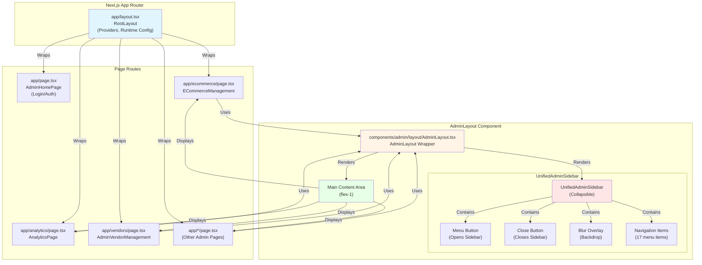
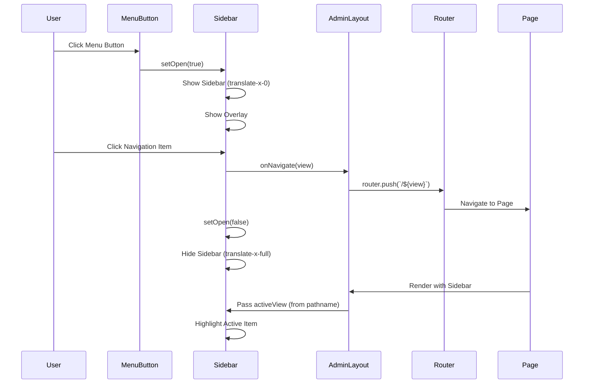
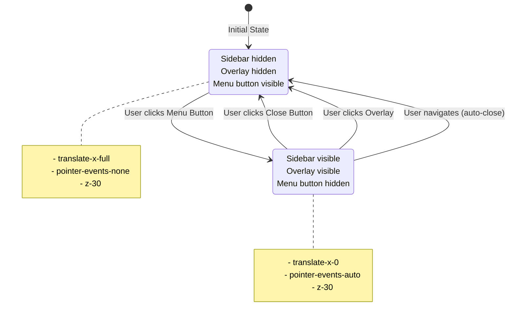
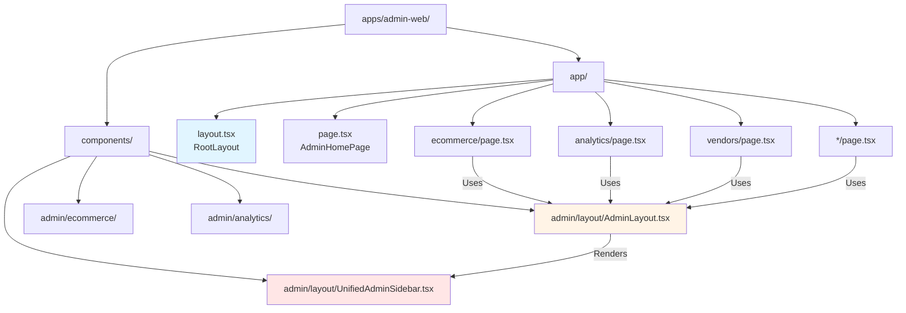

# Admin Layout Architecture

## Component Hierarchy Diagram



## Navigation Flow Diagram



## State Management Flow



## Component Props Flow

```mermaid
graph LR
    subgraph "AdminLayout"
        AL[AdminLayout Component]
        ALPathname[usePathname<br/>Gets current path]
        ALRouter[useRouter<br/>Navigation handler]
        ALActiveView[activeView<br/>= pathname.split('/')[1]]
    end
    
    subgraph "UnifiedAdminSidebar"
        US[UnifiedAdminSidebar]
        USOpen[open state<br/>useState false]
        USActiveView[activeView prop]
        USOnNavigate[onNavigate prop]
    end
    
    subgraph "Page Component"
        Page[Page Component<br/>e.g., ECommerceManagement]
        PageContent[Page Content]
    end
    
    ALPathname -->|Extracts| ALActiveView
    ALActiveView -->|Passes| USActiveView
    ALRouter -->|Passes| USOnNavigate
    
    USActiveView -->|Highlights| US
    USOnNavigate -->|Calls| ALRouter
    
    AL -->|Wraps| Page
    Page -->|Renders| PageContent
    
    style AL fill:#fff4e6
    style US fill:#ffe6e6
    style Page fill:#e6ffe6
```

## File Structure



## Key Features

1. **Collapsible Sidebar**
   - Starts closed (collapsed)
   - Opens via menu button (top-left)
   - Closes via X button, overlay click, or after navigation
   - Smooth slide-in/out animation

2. **Automatic Active View Detection**
   - Uses `usePathname()` to get current route
   - Extracts first segment after root (`/ecommerce` → `ecommerce`)
   - Highlights active menu item automatically

3. **Next.js Router Integration**
   - Uses `router.push()` for navigation
   - No page reloads
   - Client-side routing

4. **Consistent Layout**
   - All pages wrapped with `AdminLayout`
   - Sidebar always available
   - Main content area flex-1 (takes remaining space)

