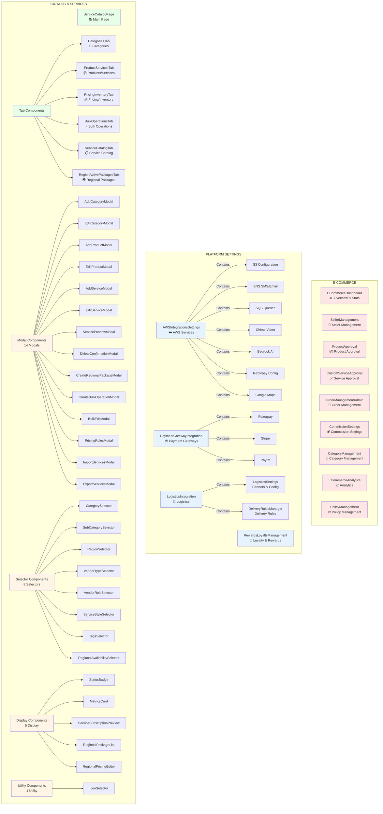

# Component Inventory

## 📊 Visual Component Structure

## Component Inventory

## 📦 E-Commerce Components

### Main Components (9 components)

1. **ECommerceDashboard** (`dashboard/ECommerceDashboard.tsx`)
   - Overview dashboard with stats
   - Quick actions
   - Performance metrics
   - Revenue tracking

2. **SellerManagement** (`sellerManagement/SellerManagement.tsx`)
   - Seller list and management
   - Seller approval/rejection
   - Seller performance tracking
   - Seller settings

3. **ProductApproval** (`productApproval/ProductApproval.tsx`)
   - Product approval workflow
   - Product review and moderation
   - Product status management

4. **CustomServiceApproval** (`customerServiceApproval/CustomServiceApproval.tsx`)
   - Custom service approval
   - Service review process
   - Service moderation

5. **OrderManagementAdmin** (`orderManagementAdmin/OrderManagementAdmin.tsx`)
   - Order management
   - Order tracking
   - Order status updates
   - Order fulfillment

6. **CommissionSettings** (`commissionSettings/CommissionSettings.tsx`)
   - Commission tier management
   - Commission rate configuration
   - Commission rules and policies

7. **CategoryManagement** (`categoryManagement/CategoryManagement.tsx`)
   - Category CRUD operations
   - Category hierarchy
   - Category settings

8. **ECommerceAnalytics** (`analytics/ECommerceAnalytics.tsx`)
   - Revenue analytics
   - Sales analytics
   - Product performance
   - Seller performance metrics

9. **PolicyManagement** (`policyManagement/PolicyManagement.tsx`)
   - E-commerce policies
   - Return/refund policies
   - Shipping policies
   - Terms and conditions

### Tabs in E-Commerce Page
- Dashboard
- Sellers
- Product Approval
- Service Approval
- Orders
- % Commission
- Categories
- Analytics
- Policies

---

## ⚙️ Platform Settings Components

### Main Integration Components (4 tabs)

1. **AWSIntegrationsSettings** (`integrations/awsIntegrationSettings/AWSIntegrationsSettings.tsx`)
   - **AWS Services Tab:**
     - S3 Configuration (bucket, region)
     - SNS Configuration (SMS, Email)
     - SQS Configuration (queue URL, region)
     - Chime Configuration (video calls)
     - Bedrock AI Configuration (model ID, region)
   - **Razorpay Tab:**
     - Payment gateway settings
     - Bank verification
     - API keys
   - **Google Maps Tab:**
     - Maps API key
     - Region settings
   - Password protected (Warmpawz2025)

2. **PaymentGatewayIntegration** (`integrations/paymentGatewayIntegration/PaymentGatewayIntegration.tsx`)
   - Razorpay configuration
   - Stripe configuration
   - Paytm configuration
   - Payment gateway settings
   - Settlement period configuration
   - Bank account verification

3. **LogisticsIntegration** (`integrations/logisticsIntegration/LogisticsIntegration.tsx`)
   - **Partners & Configuration Tab:**
     - LogisticsSettings component
     - Partner management (Shiprocket, Delhivery, BlueDart)
     - Partner configuration
     - API endpoints and keys
     - Region coverage
     - Category mapping
     - Pricing rules
   - **Delivery Rules Tab:**
     - DeliveryRulesManager component
     - Delivery rule configuration
     - Distance-based pricing
     - Time-based rules

4. **RewardsLoyaltyManagement** (`integrations/rewardsLoyaltyManagement/RewardsLoyaltyManagement.tsx`)
   - Loyalty points system
   - Rewards configuration
   - Redemption rules
   - Points calculation

### Sub-Components

- **LogisticsSettings** (`logisticsIntegration/logisticsSettings/LogisticsSettings.tsx`)
  - Partner list and management
  - Add/edit logistics partners
  - Partner enable/disable
  - Region coverage configuration
  - Pricing rules per partner

- **DeliveryRulesManager** (`logisticsIntegration/deliveryRulesManager/DeliveryRulesManager.tsx`)
  - Delivery rules configuration
  - Distance-based rules
  - Time-based rules
  - Cost calculation rules

### Tabs in Platform Settings Page
- Cloud & Maps (AWS, Razorpay, Google Maps)
- Payment Gateway (Razorpay, Stripe, Paytm)
- Logistics Integration (Partners, Delivery Rules)
- Loyalty & Rewards (Points, Rewards, Redemption)

---

## 📚 Catalog & Services Components

### Main Page Component

**ServiceCatalogPage** (`app/catalog/page.tsx`)
- Service catalog management
- Service CRUD operations
- Service filtering and search
- Service status management
- Service ordering/reordering

### Tab Components (6 tabs)

1. **CategoriesTab** (`catalog/CategoriesTab.tsx`)
   - Category management
   - Category hierarchy
   - Add/edit/delete categories
   - Category display order

2. **ProductServicesTab** (`catalog/ProductServicesTab.tsx`)
   - Product and service management
   - Product/service CRUD
   - Product/service listing

3. **PricingInventoryTab** (`catalog/PricingInventoryTab.tsx`)
   - Pricing management
   - Inventory tracking
   - Price rules
   - Stock management

4. **BulkOperationsTab** (`catalog/BulkOperationsTab.tsx`)
   - Bulk edit operations
   - Bulk import/export
   - Bulk status updates
   - Bulk pricing updates

5. **ServiceCatalogTab** (`catalog/ServiceCatalogTab.tsx`)
   - Service catalog listing
   - Service details
   - Service management

6. **RegionActivePackagesTab** (`catalog/RegionActivePackagesTab.tsx`)
   - Regional package management
   - Region-specific packages
   - Package activation by region

### Supporting Components (33 components)

**Modal Components:**
- `AddCategoryModal.tsx` - Add new category
- `EditCategoryModal.tsx` - Edit existing category
- `AddProductModal.tsx` - Add new product
- `EditProductModal.tsx` - Edit existing product
- `AddServiceModal.tsx` - Add new service
- `EditServiceModal.tsx` - Edit existing service
- `ServicePreviewModal.tsx` - Preview service details
- `DeleteConfirmationModal.tsx` - Delete confirmation
- `CreateRegionalPackageModal.tsx` - Create regional package
- `CreateBulkOperationModal.tsx` - Bulk operation creation
- `BulkEditModal.tsx` - Bulk edit interface
- `PricingRulesModal.tsx` - Pricing rules configuration
- `ImportServicesModal.tsx` - Import services
- `ExportServicesModal.tsx` - Export services

**Selector Components:**
- `CategorySelector.tsx` - Category selection
- `SubCategorySelector.tsx` - Sub-category selection
- `RegionSelector.tsx` - Region selection
- `VendorTypeSelector.tsx` - Vendor type selection
- `VendorRoleSelector.tsx` - Vendor role selection
- `ServiceStyleSelector.tsx` - Service style selection (centre/home/tele/ecommerce)
- `TagsSelector.tsx` - Tags selection
- `RegionalAvailabilitySelector.tsx` - Regional availability

**Display Components:**
- `StatusBadge.tsx` - Status badge display
- `MetricsCard.tsx` - Metrics display card
- `ServiceSubscriptionPreview.tsx` - Service subscription preview
- `RegionalPackageList.tsx` - Regional package listing
- `RegionalPricingEditor.tsx` - Regional pricing editor

**Utility Components:**
- `IconSelector.tsx` - Icon selection interface

### Features in Catalog & Services

- **Service Management:**
  - Create, edit, delete services
  - Service status (active/inactive/draft)
  - Publish status (published/unpublished/archived)
  - Service ordering/reordering
  - Service search and filtering

- **Category Management:**
  - Category hierarchy
  - Category CRUD
  - Category display order

- **Regional Management:**
  - Region-specific packages
  - Regional pricing
  - Regional availability

- **Bulk Operations:**
  - Bulk import/export
  - Bulk edit
  - Bulk status updates

---

## 📊 Component Summary

### E-Commerce: 9 Main Components
- Dashboard, Sellers, Products, Services, Orders, Commission, Categories, Analytics, Policies

### Platform Settings: 4 Main Integration Components
- AWS Integrations (S3, SNS, SQS, Chime, Bedrock)
- Payment Gateway (Razorpay, Stripe, Paytm)
- Logistics Integration (Partners, Delivery Rules)
- Loyalty & Rewards (Points, Rewards, Redemption)

### Catalog & Services: 1 Main Page + 6 Tab Components + 33 Supporting Components
- Service Catalog Management
- Categories, Products, Pricing, Bulk Operations, Regional Packages
- Multiple modals, selectors, and utility components

