# Warmpawz Discount Engine V2 — Stack Policy & Priority Architecture

**Phase:** 5 Design (architecture contract — final pre-implementation)  
**Status:** Design only — no implementation  
**Date:** 2026-06-30  
**Version:** 1.1.0  
**Audience:** Principal engineers, product, finance, future Admin UI builders

This document is the **business and architecture contract** for:

- Phase 5 — Priority Engine  
- Phase 6 — Stack Engine  
- Phase 7 — Settlement Engine  
- Phase 8 — Feature flags & cutover  
- Phase 9 — Analytics  
- Phase 10 — Campaign Engine  
- Future Admin configuration UI  

**Out of scope for this document:** code, API changes, database migrations, Rule Engine changes, Benefit Engine changes, Unified Resolver orchestration changes beyond the insertion points defined here.

---

## Glossary

| Term | Meaning |
|------|---------|
| **Candidate** | A normalized `DiscountCandidate` after load + normalize; may be eligible or rejected by Rule Engine |
| **Eligible benefit** | Candidate that passed Rule Engine and received a computed `discountAmount` from Benefit Engine |
| **Applied discount** | Candidate selected by Priority + Stack and included in final `DiscountEngineResult.applied[]` |
| **Auto promotion** | `DiscountTrigger.AUTO` — no user code required |
| **Coupon** | `DiscountSource.PLATFORM_COUPON` or coded vendor row treated as coupon (`VENDOR_COUPON`) |
| **Exclusive** | Promotion flag that terminates all other candidates when applied |
| **Controlled stacking** | Combinations allowed only when policy explicitly permits; never implicit `if` chains |
| **Evaluation phase** | Ordered stage: `AUTO_PROMOTIONS` → `COUPONS` (immutable order) |
| **RuntimePolicyFingerprint** | Deterministic SHA/hash of the **merged** active policy snapshot (Priority + Stack + Funding + Limits) at evaluation time |
| **Policy Validation Engine** | Pre-activation validator for configuration documents — errors, warnings, suggestions; no runtime discount decisions |

---

## Section 1 — Architecture

### 1.1 End-to-end pipeline (post–Phase 4)

Phase 4 delivers **eligibility + benefit computation for all candidates**. Phases 5–7 add **selection, combination, and settlement**. Nothing in Phase 5+ re-runs rules or recalculates benefits except on a **revised running amount** passed into Benefit Engine during sequential stack application (see Section 3).

```mermaid
flowchart TB
  subgraph intake["Intake (unchanged Phase 4)"]
    DC[DiscountContext]
    CP[Candidate Providers]
    CN[Candidate Normalizer]
    RE[Rule Engine]
    BE[Benefit Engine]
  end

  subgraph selection["Selection (Phase 5–6)"]
    PE[Priority Engine]
    SE[Stack Engine]
  end

  subgraph post["Post-selection (Phase 7+)"]
    ST[Settlement Engine]
    AT[Audit Trail]
  end

  DC --> CP --> CN --> RE --> BE
  BE -->|EligibleBenefit[]| PE
  PE -->|Ordered candidate list| SE
  SE -->|DiscountEngineResult| ST
  SE --> AT
  ST --> AT
```

### 1.2 Component responsibilities

| Component | Responsibility | Does NOT |
|-----------|----------------|----------|
| **DiscountContext** | Canonical request: domain, trigger, amount, items, code, metadata | Load DB rows, apply policy |
| **Candidate Providers** | Load raw entities by domain/source | Eligibility, math, stacking |
| **Candidate Normalizer** | Rows → `DiscountCandidate[]` with owner, source, funding, exclusive flags | Business policy |
| **Rule Engine** | Per-candidate eligibility | Rank, stack, settle |
| **Benefit Engine** | Per-eligible-candidate discount amount | Rank, stack, settle |
| **Unified Resolver** | Orchestrate intake; invoke Priority + Stack when enabled; assemble `ResolverResult` | Hardcode stack rules or priority |
| **Priority Engine** | **Rank**, score, and **order** candidates within a phase; apply configurable **selection limits**; emit priority audit | Decide coexistence; re-run eligibility; stack; settle |
| **Stack Engine** | **Final coexistence**; combination evaluation; sequential/parallel application; conflict resolution; funding vetoes; maximum totals; produce `applied[]` | Rank candidates; load DB; hardcode matrix |
| **Settlement Engine** | Map applied discounts + funding to platform/vendor/customer ledger preview | Change which discounts apply |
| **Audit Trail** | Immutable decision log for every candidate | Mutate discount outcomes |
| **Policy Validation Engine** | Validate draft policy configs before publish (conflicts, impossible rules) | Apply discounts or load candidates |

### 1.3 Evaluation order (immutable)

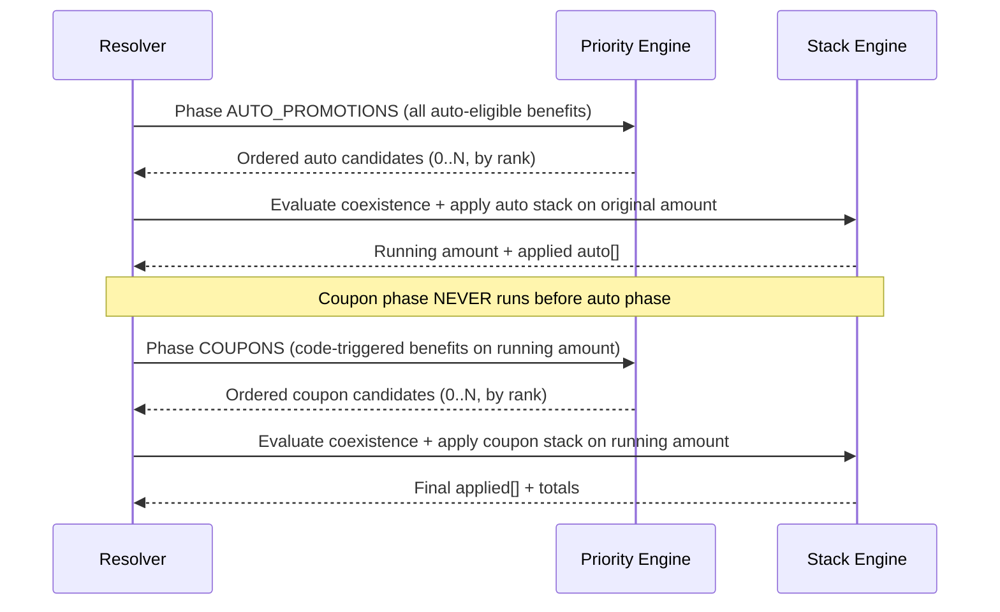

**Business rule (final):** Automatic promotions evaluate first. Coupons evaluate afterwards. **Never reverse this order.**

### 1.4 Exclusive short-circuit

When an **exclusive** candidate appears in the Priority-ordered list:

1. Priority Engine **ranks** the exclusive candidate per strategy (typically first) and includes it in the ordered output — it does **not** decide whether other candidates coexist.  
2. Stack Engine reads `exclusiveTerminatesAll` / `exclusiveSkipsCouponPhase` from policy and applies **only** the exclusive discount when terminal (default).  
3. All other candidates receive audit reason `EXCLUSIVE_OVERRIDE` (Stack or Priority limit stage as appropriate).  
4. Coupon phase is **skipped** if exclusive applied in auto phase and `exclusiveSkipsCouponPhase = true` (default) — enforced by Resolver + Stack, not Priority ranking alone.

### 1.5 Business Policy Ownership Matrix

This matrix is the **single authority** for who owns each class of business rule. No other document or engine may assume ownership outside this table.

| Business rule / concern | Owner | Phase | Notes |
|-------------------------|-------|-------|-------|
| Candidate loading (DB rows → raw entities) | **Unified Resolver** (via Candidate Providers) | 4 ✓ | Providers only load |
| Candidate normalization (`DiscountCandidate`) | **Candidate Normalizer** | 4 ✓ | No policy |
| Eligibility (dates, min order, targeting, usage) | **Rule Engine** | 3 ✓ | Per-candidate |
| Benefit calculation (% / flat / BOGO / bundle / combo) | **Benefit Engine** | 2 ✓ | Per eligible candidate |
| Evaluation phase order (auto → coupon) | **Unified Resolver** | 4 ✓ | Immutable |
| Ranking & scoring | **Priority Engine** | 5 | Order only — not coexistence |
| Per-phase selection limits (`maxCoupons`, etc.) | **Priority Engine** | 5 | Truncates ordered list |
| Combination rules (stack matrix) | **Stack Engine** | 6 | Config-driven |
| Final coexistence & applied set | **Stack Engine** | 6 | Authoritative for `applied[]` |
| Sequential / parallel application | **Stack Engine** | 6 | Includes re-base handoff to Benefit Engine |
| Funding vetoes on stacks | **Stack Engine** | 6 | Reads `FundingConfiguration` |
| Maximum total discount (amount / percent) | **Stack Engine** | 6 | Cumulative caps |
| Funding allocation & ledger preview | **Settlement Engine** | 7 | Never changes `applied[]` |
| Policy configuration (CRUD) | **Admin UI** | Future | Human-authored JSON |
| Policy validation before publish | **Policy Validation Engine** | 5+ | Section 8.8 |
| Merged runtime policy identity | **RuntimePolicyFingerprint** | 5+ | Section 8.7 |
| Audit & reason codes | **Audit Trail** | 5+ | Immutable log |
| Analytics & dashboards | **Analytics Module** | 9 | Reads audit + fingerprint |
| Campaign scheduling & lifecycle | **Campaign Engine** | 10 | Extension via config + providers |
| Feature flags & cutover | **Feature Flag layer** | 8 | Wraps resolver authority |

**Boundary rule:** If a decision answers *“may these two discounts apply together?”* → **Stack Engine**. If it answers *“in what order should we consider candidates?”* → **Priority Engine**.

---

## Section 2 — Priority Engine

### 2.0 Design principle

The Priority Engine answers: **“In what order should we consider eligible candidates, and which fall within selection limits?”**  
It does **not** answer: **“Which of these candidates may coexist?”** — that is exclusively the Stack Engine (Section 3).

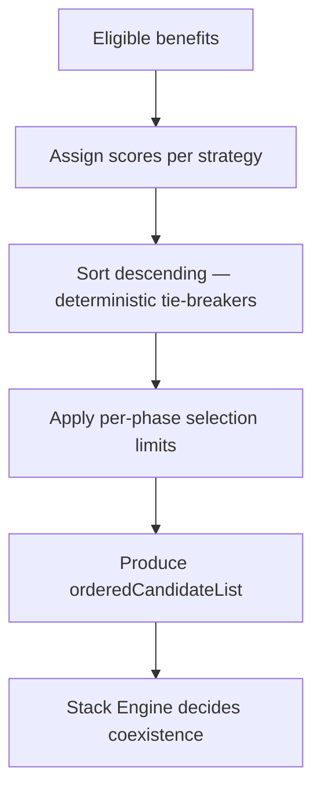

### 2.1 Responsibilities

- Receive eligible benefits from Resolver (grouped by evaluation phase).  
- **Assign scores** to each candidate via **PriorityConfiguration** strategy.  
- **Order** candidates deterministically (sort + tie-breakers).  
- **Apply configurable selection limits** (e.g. `maxSelected`, `maxCoupons`) — truncates the ordered list; does not evaluate stack matrix.  
- Flag **exclusive** candidates in ranked output for Stack Engine terminal handling.  
- Emit **priority audit** (rank, score, limit truncation, not stack rejection).  
- Support **admin override strategies** without code changes.

**Priority Engine never decides whether multiple candidates can coexist.**

### 2.2 Inputs

| Input | Source | Notes |
|-------|--------|-------|
| `context` | `DiscountContext` | Domain, trigger, amount, customer, vendor |
| `eligibleBenefits` | Benefit Engine output | Per-candidate `discountAmount`, metadata (spotlight, priority weight) |
| `phase` | Resolver | `AUTO_PROMOTIONS` \| `COUPONS` |
| `runningAmount` | Stack Engine (coupon phase) | Amount after auto stack; coupons computed on this base |
| `priorityConfig` | Configuration store | Domain override → global default |
| `limitConfig` | Configuration store | Per-phase `maxSelected` caps |
| `policyFingerprint` | Runtime merge layer | Correlation id for audit (Section 8.7) |

### 2.3 Outputs

| Output | Description |
|--------|-------------|
| `orderedCandidateList[]` | Full ranking with scores; may be longer than final applied set |
| `truncatedCandidateList[]` | Top N after selection limits — **input to Stack Engine** |
| `rejectedByLimit[]` | Candidates ranked but truncated by limits, with reason codes |
| `exclusiveCandidates[]` | Exclusive flags for Stack terminal rules |
| `priorityAudit` | Per-candidate rank score breakdown |

**Note:** `truncatedCandidateList` is not `applied[]`. Stack Engine produces `applied[]` after coexistence evaluation.

### 2.4 Configuration

Priority is **fully configurable**. Default strategy: **highest customer savings** (`MAX_CUSTOMER_SAVINGS`).

| Strategy key | Behaviour | Admin override |
|--------------|-----------|----------------|
| `MAX_CUSTOMER_SAVINGS` | Highest `discountAmount` ranks first (ties: tie-breaker chain) | Yes — per domain |
| `LOWEST_PLATFORM_COST` | Minimizes `platformCost` estimate using funding metadata | Yes |
| `VENDOR_SPOTLIGHT_FIRST` | `is_spotlight` candidates rank above non-spotlight, then savings | Yes (service default legacy) |
| `FIXED_PRIORITY_WEIGHT` | Sort by `candidate.priorityWeight` desc, then savings | Yes |
| `ADMIN_MANUAL_ORDER` | Explicit ordered list of promotion ids | Yes — campaign future |

**Tie-breakers (configurable ordered list):**

1. Exclusive flag  
2. Spotlight flag  
3. Higher `priorityWeight`  
4. Earlier `validFrom`  
5. Lexicographic `candidate.id` (deterministic)

### 2.5 Algorithms (design)

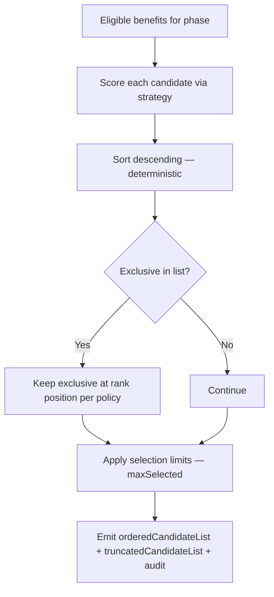

**Per-phase selection limits** are enforced here so audit separates *“lower rank”* (`NOT_HIGHEST_SAVINGS`) from *“ranked but limit exceeded”* (`PROMOTION_LIMIT` / `COUPON_LIMIT`). **Coexistence** is never decided here.

### 2.6 Extension points

| Extension | Hook |
|-----------|------|
| New strategy | Register `PriorityStrategy` in config registry |
| Domain override | `PriorityConfiguration.domains[SERVICE]` |
| Campaign boost | Future: `campaign.priorityBoost` added to score — no Priority Engine code change |
| Membership tier | Future: `context.metadata.membershipTier` → strategy selector |
| A/B experiment | Feature flag selects strategy id |

### 2.7 What Priority Engine must NEVER do

- Re-run Rule Engine or reload candidates from DB  
- Hardcode “platform beats vendor” or “vendor beats platform”  
- **Decide whether multiple candidates can coexist** (Stack Engine)  
- Apply stacking, sequential amount math, or funding vetoes (Stack Engine)  
- Enforce `maxTotalDiscounts` / cumulative amount caps (Stack Engine)  
- Write usage counters or settlement entries  
- Mutate `DiscountContext` beyond read-only  
- Run coupon phase before auto phase  
- Produce final `applied[]` (Stack Engine output)

---

## Section 3 — Stack Engine

### 3.1 Responsibilities

The Stack Engine is the **sole authority** for final discount coexistence and the `applied[]` set.

- Consume **truncated ordered list** from Priority Engine (not raw eligible set).  
- Evaluate **compatibility matrix** (Section 5) for each pair/group.  
- Decide **final coexistence** — which ranked candidates may apply together.  
- Enforce **maximum total** caps (amount, percent, count reconciliation).  
- Apply **funding vetoes** (Section 7).  
- Support **sequential** application (vendor then platform on reduced base — service legacy behaviour).  
- Support **parallel** application only when policy explicitly allows (rare; default off).  
- Resolve **conflicts** when matrix + limits interact.  
- Produce final `DiscountEngineResult`: `originalAmount`, `totalSavings`, `finalAmount`, `applied[]`.  
- Emit **stack audit** and **conflict audit**.

### 3.2 Inputs

| Input | Source |
|-------|--------|
| `context` | `DiscountContext` |
| `phase` | `AUTO_PROMOTIONS` \| `COUPONS` |
| `orderedCandidateList` | Priority Engine (full rank) |
| `truncatedCandidateList` | Priority Engine (post-limit) — **primary stack input** |
| `runningAmount` | Prior phase output (original amount for auto phase) |
| `stackPolicy` | `StackPolicyConfiguration` (+ domain override) |
| `fundingPolicy` | `FundingConfiguration` (may veto stacks — Section 7) |
| `limitPolicy` | `LimitConfiguration` (cumulative caps) |
| `policyFingerprint` | Runtime merge layer (Section 8.7) |

### 3.3 Outputs

| Output | Description |
|--------|-------------|
| `DiscountEngineResult` | Final or intermediate result |
| `runningAmount` | Amount after this phase (input to coupon benefit re-evaluation if sequential) |
| `stackAudit` | Applied order, rejected pairs, matrix rule ids |
| `conflicts[]` | Pairwise conflicts with resolution |

### 3.4 Sequential vs parallel application

| Mode | When | Amount basis |
|------|------|--------------|
| **Sequential** | Default for `PLATFORM + VENDOR` auto on SERVICE | Each step uses current running amount; Benefit Engine may be re-invoked with `amount: runningAmount` for platform leg (preserves legacy `calculateBookingPromotionsStack`) |
| **Parallel** | Only if `stackPolicy.applicationMode = PARALLEL` for that pair | Each benefit computed on same base; total capped by `maxTotalDiscountPercent` |

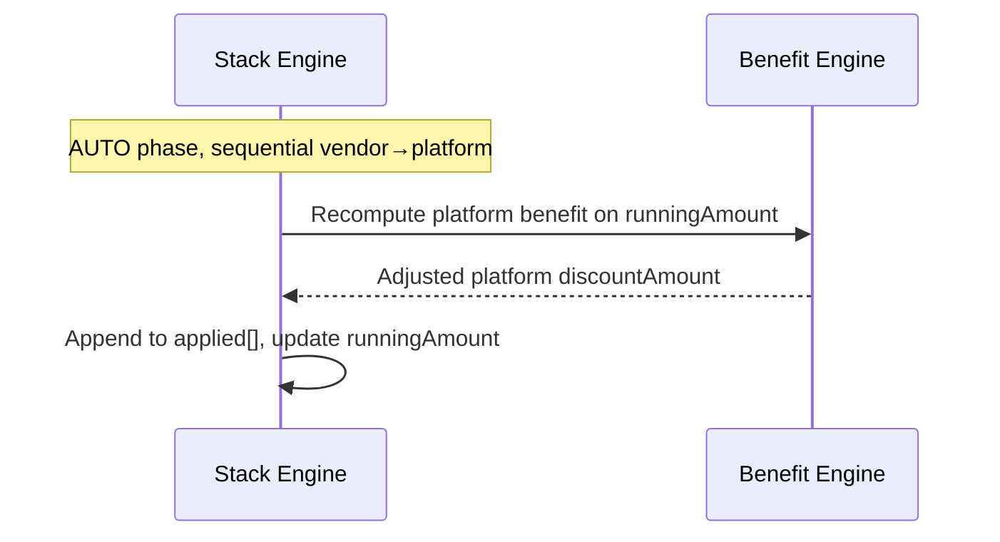

### 3.5 Combination evaluation algorithm

1. Walk `truncatedCandidateList` in **priority order** (highest rank first).  
2. Re-sort walk order by `stackOrder` (config) where sequential mode applies: default `VENDOR → PLATFORM → COUPON`.  
3. If exclusive present and `exclusiveTerminatesAll` → apply exclusive only; audit others as `EXCLUSIVE_OVERRIDE`; stop.  
4. For each candidate:  
   - Check pairwise compatibility with **already-applied** set (Stack Matrix).  
   - Check funding veto (Section 7).  
   - Check running amount ≥ minimum after prior discounts.  
   - Apply benefit (sequential or parallel per policy).  
   - Check cumulative caps (`maxTotalDiscounts`, `maxTotalDiscountAmount`, `maxTotalDiscountPercent`).  
5. If cap exceeded → rollback per `capOverflowStrategy` (`REJECT_LAST` default).  
6. Record stack + conflict audit for each accept/reject.  
7. Candidates ranked by Priority but rejected here → outcome `REJECTED_STACK` or `REJECTED_LIMIT` (not `REJECTED_PRIORITY`).

### 3.6 Conflict resolution

| Conflict type | Default resolution | Configurable |
|---------------|-------------------|--------------|
| Incompatible pair | Reject lower-priority member of pair | Yes — `onConflict: REJECT_LOWER_PRIORITY \| REJECT_HIGHER_PRIORITY \| REJECT_BOTH` |
| Over limit (count) | Reject lowest savings | Yes |
| Over limit (amount) | `REJECT_LAST` | Yes |
| Funding veto | Reject candidate that triggers veto | Yes |
| Duplicate source | Reject duplicate (same `source` + `id`) | No — always reject |

### 3.7 Extension points

| Extension | Mechanism |
|-----------|-----------|
| New source type | Add row to Stack Matrix config + `DiscountSource` enum (future) |
| Domain override | `StackPolicyConfiguration.domains.MEAL` |
| Campaign bundle | Future: `campaign.stackGroupId` — treats set as atomic |
| Wallet / loyalty | Section 13 — new phase or sub-phase |

### 3.8 What Stack Engine must NEVER do

- Load or normalize candidates  
- Evaluate eligibility rules  
- Hardcode combination allow/deny in TypeScript  
- **Rank or score candidates** (Priority Engine)  
- **Apply per-phase selection limits** (`maxCoupons`, `maxAutoPromotions`) — Priority truncates first  
- Persist usage or financial postings  
- Reverse coupon-before-promotion order  

---

## Section 4 — Priority Matrix

**Priority Matrix** documents how candidates are **ranked and limit-truncated** within a phase.  
**Stack Matrix** (Section 5) documents **coexistence** among candidates that survive priority limits.

Priority answers: **“In what order should we consider eligible candidates?”**  
Stack answers: **“Which of those candidates may apply together?”**  
Exclusive terminal behaviour is enforced by **Stack Engine** per policy flags.

### 4.1 Auto promotion phase — platform vs vendor

| Scenario | Default priority behaviour | Configurable | Notes |
|----------|---------------------------|--------------|-------|
| Platform Promotion vs Vendor Promotion (SERVICE) | **Both ranked** — neither truncated if limits allow (`maxAutoPromotions: 2`); Stack decides sequential coexistence | Yes | Priority does not force single winner |
| Platform Promotion vs Vendor Promotion (ECOMMERCE) | **Higher savings ranks first**; limit may truncate to 1 | Yes | Stack may still block second if matrix denies |
| Two Vendor Promotions | **Higher savings ranks first**; `maxVendorPromotions: 1` truncates | Yes | Second never reaches Stack if truncated |
| Two Platform Promotions | **Spotlight ranks higher**, then savings; `maxPlatformPromotions: 1` truncates | Yes | |
| Exclusive vs any auto | **Exclusive ranked first**; Stack applies terminal rule | No | |

### 4.2 Coupon phase

| Scenario | Default behaviour | Configurable |
|----------|-------------------|--------------|
| Platform Coupon vs Vendor Coupon | **Both ranked** if within `maxCoupons`; Stack decides coexistence | Yes |
| Coupon vs already-applied auto promo | Priority ranks coupon independently; Stack evaluates cross-phase matrix | Yes |
| Two Platform Coupons | **Both ranked**; `maxCoupons: 1` truncates second before Stack | Yes |
| Coupon when exclusive auto applied | **Skipped** (coupon phase not run) | Yes — `exclusiveSkipsCouponPhase` |

### 4.3 Cross-phase priority (not reordering)

| Rule | Enforcement |
|------|-------------|
| Auto before coupon | Resolver phase gate — **not configurable** |
| Coupon benefit basis | Running amount after auto stack | Stack Engine |
| Re-priority after auto stack | Priority Engine runs again in coupon phase with new amounts | |

### 4.4 Decision table — who wins when savings equal?

| Condition | Tie-breaker (default order) |
|-----------|----------------------------|
| Same savings | Exclusive > Spotlight > `priorityWeight` > earlier `validFrom` > id |
| Admin manual order configured | Manual list wins over savings |
| Campaign boost (future) | Added to score before sort |

---

## Section 5 — Stack Matrix

Each cell: **Default behaviour** | **Configurable?** | **Future Admin UI?** | **Notes**

Legend: ✅ Allowed · ❌ Blocked · ⚡ Sequential · 🔒 Exclusive overrides

### 5.1 Auto promotion combinations

|  | Vendor Promotion | Platform Promotion | Exclusive Promo |
|--|------------------|--------------------|-----------------|
| **Vendor Promotion** | ❌ One vendor max | ✅ ⚡ Sequential (SERVICE default) | 🔒 Exclusive wins |
| **Platform Promotion** | ✅ ⚡ Sequential | ❌ One platform max | 🔒 Exclusive wins |
| **Exclusive Promo** | 🔒 | 🔒 | ❌ One exclusive |

| Pair | Default | Configurable? | Admin UI? | Notes |
|------|---------|---------------|-----------|-------|
| Platform Promotion + Vendor Promotion | ✅ Sequential | Yes | Stack Rules → Service | Vendor on original; platform on remainder (legacy S1+S2) |
| Platform Promotion + Platform Promotion | ❌ | Yes | Stack Rules | Second rejected: `DUPLICATE_SOURCE_LIMIT` |
| Vendor Promotion + Vendor Promotion | ❌ | Yes | Stack Rules | Best picked in Priority |
| Exclusive + Vendor Promotion | 🔒 Exclusive only | No | — | Audit: `EXCLUSIVE_OVERRIDE` |
| Exclusive + Platform Promotion | 🔒 Exclusive only | No | — | |
| Exclusive + Exclusive | ❌ | Yes | — | Default one exclusive; policy may allow stack group |

### 5.2 Auto promotion + coupon combinations (cross-phase)

|  | Platform Coupon | Vendor Coupon |
|--|-----------------|---------------|
| **Vendor Promotion (auto)** | ✅ Default allow | ✅ Default allow |
| **Platform Promotion (auto)** | ✅ Default allow | ⚠️ Domain-dependent |
| **Exclusive (auto)** | ❌ Coupon phase skipped | ❌ |

| Pair | Default | Configurable? | Admin UI? | Notes |
|------|---------|---------------|-----------|-------|
| Platform Promotion + Platform Coupon | ✅ | Yes | Stack Rules | Coupon on post-auto amount |
| Platform Promotion + Vendor Coupon | ✅ (SERVICE) / ⚠️ (ECOMMERCE) | Yes | Domain Overrides | Ecommerce may restrict |
| Vendor Promotion + Platform Coupon | ✅ | Yes | Stack Rules | |
| Vendor Promotion + Vendor Coupon | ✅ | Yes | Stack Rules | Vendor coupon = coded vendor row |
| Any auto + coupon when `allowCouponWithPromotion: false` | ❌ | Yes | Stack Rules | Global toggle |

### 5.3 Coupon + coupon

| Pair | Default | Configurable? | Admin UI? | Notes |
|------|---------|---------------|-----------|-------|
| Platform Coupon + Platform Coupon | ❌ | Yes | Maximum Discounts | `maxCoupons: 1` |
| Vendor Coupon + Vendor Coupon | ❌ | Yes | Maximum Discounts | |
| Platform Coupon + Vendor Coupon | ✅ | Yes | Stack Rules | If limits allow |
| Coupon + wrong phase | ❌ | No | — | Enforced by phase gate |

### 5.4 Promotion + promotion (same owner, different ids)

| Pair | Default | Configurable? | Admin UI? | Notes |
|------|---------|---------------|-----------|-------|
| Promotion + Promotion (vendor) | ❌ | Yes | Stack Rules | Priority ranks both; limit truncates; Stack rejects pair if both reach |
| Promotion + Promotion (platform) | ❌ | Yes | Stack Rules | Spotlight exception is priority, not stack |
| BOGO + % discount | ❌ | Yes | Stack Rules | Structural promos single winner |

### 5.5 Funding-influenced stack veto (see Section 7)

| Pair | Default if SHARED + PLATFORM stack veto | Configurable? |
|------|----------------------------------------|---------------|
| SHARED vendor promo + PLATFORM coupon | ✅ unless `fundingPolicy.blockSharedWithPlatformCoupon` | Yes |
| PLATFORM-funded + VENDOR-funded | ✅ Sequential | Yes |

### 5.6 Matrix configuration shape (example)

```json
{
  "stackRules": [
    {
      "id": "service-vendor-then-platform",
      "domain": "SERVICE",
      "phase": "AUTO_PROMOTIONS",
      "left": { "source": "VENDOR_PROMOTION" },
      "right": { "source": "PLATFORM_PROMOTION" },
      "allowed": true,
      "applicationMode": "SEQUENTIAL",
      "order": ["VENDOR_PROMOTION", "PLATFORM_PROMOTION"]
    },
    {
      "id": "block-two-platform-coupons",
      "left": { "source": "PLATFORM_COUPON" },
      "right": { "source": "PLATFORM_COUPON" },
      "allowed": false,
      "reasonCode": "COUPON_STACK_LIMIT"
    }
  ]
}
```

---

## Section 6 — Maximum Discount Rules

All limits are **admin-configurable**. Enforcement split:

| Limit type | Enforced by | Stage |
|------------|-------------|-------|
| `maxAutoPromotions`, `maxVendorPromotions`, `maxPlatformPromotions`, `maxCoupons`, per-phase `maxSelected` | **Priority Engine** | Truncates ordered list |
| `maxTotalDiscounts`, `maxTotalDiscountAmount`, `maxTotalDiscountPercent`, `minPayableAmount` | **Stack Engine** | Cumulative after coexistence |

### 6.1 Limit dimensions

| Limit | Default (global) | Enforced by | Domain override | Campaign override (future) |
|-------|------------------|-------------|-----------------|---------------------------|
| `maxAutoPromotions` | 2 (SERVICE: vendor 1 + platform 1) | Priority | Yes | Yes |
| `maxVendorPromotions` | 1 | Priority | Yes | Yes |
| `maxPlatformPromotions` | 1 | Priority | Yes | Yes |
| `maxCoupons` | 1 | Priority | Yes | Yes |
| `maxTotalDiscounts` | 3 | Stack | Yes | Yes |
| `maxTotalDiscountAmount` | null (uncapped) | Stack | Yes | Yes |
| `maxTotalDiscountPercent` | 100 | Stack | Yes | Yes |
| `minPayableAmount` | 1 INR | Stack | Yes | Yes |

### 6.2 Domain override examples (design defaults)

| Domain | maxAutoPromotions | maxCoupons | Notes |
|--------|-------------------|------------|-------|
| SERVICE | 2 | 1 | Legacy stack |
| ECOMMERCE | 1 | 1 | Single vendor promo typical |
| MEAL | 1 | 1 | Reserved — same engine, override when live |
| PACKAGE | 1 | 0 | Coupons often disabled product-wise |

### 6.3 Overflow strategies

| Strategy | Behaviour |
|----------|-----------|
| `REJECT_LAST` | Do not apply discount that exceeded cap |
| `TRIM_TO_CAP` | Reduce last discount amount to fit cap |
| `REJECT_LOWEST_SAVINGS` | Remove lowest-savings applied discount first |

Default: `REJECT_LAST` for amount caps; `REJECT_LOWEST_SAVINGS` for count overage in Stack reconciliation.

### 6.4 Configuration model

See `LimitConfiguration` in Section 8.

---

## Section 7 — Funding Rules

Funding types: **PLATFORM**, **VENDOR**, **SHARED**.  
Funding affects **settlement** (Phase 7) and **may veto or reorder stacks** (Phase 6).

### 7.1 Funding semantics

| Funding | Customer discount funded by | Settlement impact |
|---------|----------------------------|-------------------|
| PLATFORM | Platform | `platformCost` ↑ |
| VENDOR | Vendor | `vendorReceivable` ↓ |
| SHARED | Split per `sharedSplitRatio` | Both parties |

### 7.2 Funding influence on stacking (design)

| Rule | Default | Configurable |
|------|---------|--------------|
| `blockVendorFundedWithPlatformCoupon` | false | Yes |
| `blockSharedWithPlatformCoupon` | false | Yes |
| `requireSameFundingForStack` | false | Yes |
| `sharedSplitMinPlatformPercent` | 0 | Yes — finance guardrail |

**Principle:** Funding vetoes are **configuration**, not hardcoded. Finance can disable risky combinations without code deploy.

### 7.3 Future campaign funding

Campaigns may specify `funding: CAMPAIGN_SPONSOR` (extension) mapped to PLATFORM/VENDOR/SHARED in settlement adapter — **no Stack Engine code change** if config-driven.

### 7.4 Funding + priority interaction

Priority strategy `LOWEST_PLATFORM_COST` uses funding metadata to estimate platform liability — does not change stack matrix unless `fundingPolicy` includes veto rules.

---

## Section 8 — Configuration Model

All policy lives in **versioned configuration documents** loaded at runtime (SSM, DB config table, or JSON blob — storage choice is Phase 5 implementation detail). **Never hardcode in engines.**

### 8.1 `StackPolicyConfiguration`

```json
{
  "version": "1.0.0",
  "global": {
    "allowCouponWithPromotion": true,
    "allowMultipleCoupons": false,
    "allowMultipleVendorPromotions": false,
    "allowPlatformWithVendor": true,
    "applicationModeDefault": "SEQUENTIAL",
    "exclusiveSkipsCouponPhase": true,
    "exclusiveTerminatesAll": true,
    "stackOrder": ["VENDOR_PROMOTION", "PLATFORM_PROMOTION", "VENDOR_COUPON", "PLATFORM_COUPON"],
    "stackRules": []
  },
  "domains": {
    "SERVICE": { "allowPlatformWithVendor": true, "maxSequentialSteps": 2 },
    "ECOMMERCE": { "allowPlatformWithVendor": false, "maxSequentialSteps": 1 }
  }
}
```

| Field | Type | Purpose |
|-------|------|---------|
| `stackRules[]` | Rule list | Matrix cells (Section 5.6) |
| `stackOrder` | Source[] | Sequential application order |
| `applicationModeDefault` | `SEQUENTIAL` \| `PARALLEL` | |
| `exclusiveSkipsCouponPhase` | boolean | |
| Domain map | partial override | Deep merge over global |

### 8.2 `PriorityConfiguration`

```json
{
  "version": "1.0.0",
  "global": {
    "strategy": "MAX_CUSTOMER_SAVINGS",
    "tieBreakers": ["EXCLUSIVE", "SPOTLIGHT", "PRIORITY_WEIGHT", "VALID_FROM", "ID"],
    "phases": {
      "AUTO_PROMOTIONS": { "maxSelected": 2 },
      "COUPONS": { "maxSelected": 1 }
    }
  },
  "domains": {
    "SERVICE": {
      "strategy": "VENDOR_SPOTLIGHT_FIRST",
      "phases": { "AUTO_PROMOTIONS": { "maxSelected": 2 } }
    },
    "ECOMMERCE": {
      "strategy": "MAX_CUSTOMER_SAVINGS",
      "phases": { "AUTO_PROMOTIONS": { "maxSelected": 1 } }
    }
  },
  "overrides": []
}
```

| Field | Purpose |
|-------|---------|
| `strategy` | Registered strategy key |
| `tieBreakers` | Ordered tie resolution |
| `phases` | Per-phase selection caps |
| `overrides` | Time-bound or campaign-specific (future) |

### 8.3 `FundingConfiguration`

```json
{
  "version": "1.0.0",
  "sharedDefaultSplit": { "platformPercent": 50, "vendorPercent": 50 },
  "stackVetoes": [
  ],
  "settlementHints": {
    "roundTo": 2,
    "currency": "INR"
  }
}
```

### 8.4 `LimitConfiguration`

```json
{
  "version": "1.0.0",
  "global": {
    "maxAutoPromotions": 2,
    "maxVendorPromotions": 1,
    "maxPlatformPromotions": 1,
    "maxCoupons": 1,
    "maxTotalDiscounts": 3,
    "maxTotalDiscountPercent": 100,
    "minPayableAmount": 1,
    "capOverflowStrategy": "REJECT_LAST"
  },
  "domains": {},
  "campaigns": {}
}
```

### 8.5 Configuration loading & precedence

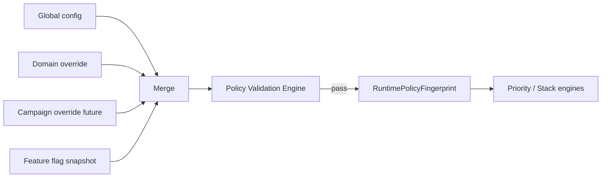

**Precedence (highest wins):** Campaign (future) → Domain → Global → Engine built-in safe defaults.

### 8.6 Configuration versioning (per-document)

Each configuration document maintains its **own semantic version** independent of siblings:

| Document | Example version field |
|----------|----------------------|
| `PriorityConfiguration` | `priorityVersion: "2.0.0"` |
| `StackPolicyConfiguration` | `stackVersion: "5.1.0"` |
| `FundingConfiguration` | `fundingVersion: "1.0.0"` |
| `LimitConfiguration` | `limitsVersion: "3.2.0"` |

Per-document versions support **partial rollback** (e.g. revert stack only) and Admin UI diff. They are **not sufficient alone** for runtime audit correlation — see Section 8.7.

### 8.7 Runtime Policy Fingerprint

#### Purpose

At evaluation time, engines consume a **single merged runtime policy**. Its identity must be captured as one deterministic fingerprint for debugging, rollback correlation, analytics, and support reproduction.

#### Merge pipeline

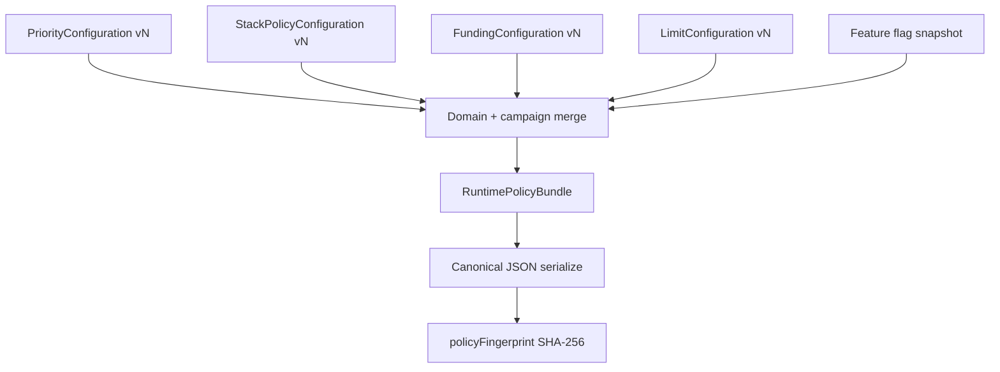

#### `RuntimePolicyFingerprint` (design shape)

| Field | Description |
|-------|-------------|
| `policyFingerprint` | **Primary audit key** — SHA-256 of canonical merged bundle |
| `priorityVersion` | Source document version |
| `stackVersion` | Source document version |
| `fundingVersion` | Source document version |
| `limitsVersion` | Source document version |
| `domain` | Active domain override key (if any) |
| `campaignId` | Future — campaign override id |
| `featureFlagSnapshot` | Hash or id of active discount-engine flags |
| `mergedAt` | ISO timestamp of bundle assembly |
| `publishId` | Admin publish record id (Section 9.10) |

#### Canonical serialization rules (deterministic)

- Sort object keys lexicographically at all levels.  
- Omit null/undefined optional fields.  
- Normalize number precision (e.g. 2 decimal places for limits).  
- Include only **effective** merged policy (post-precedence), not full draft documents.  
- Same logical policy → same `policyFingerprint` across environments.

#### Consumers

| Consumer | Use of `policyFingerprint` |
|----------|---------------------------|
| `DiscountAudit` | **Required field** — replaces lone `policyVersion` |
| Analytics (Phase 9) | Group rejection rates by policy |
| Support | Reproduce exact decision given context + fingerprint |
| Rollback (Phase 8) | Map incidents to publish id |
| Shadow compare | Detect config drift between legacy and V2 |

**Rule:** Every `DiscountAudit` and `DiscountEngineResult.metadata` **must** store `policyFingerprint`. Per-document versions are stored **additionally** for diagnostics.

### 8.8 Policy Validation Engine

#### Purpose

Validate **all runtime configurations before they become active**. Runs at **publish time** (Admin UI) and optionally at **load time** (runtime guard). Does not participate in per-request discount evaluation.

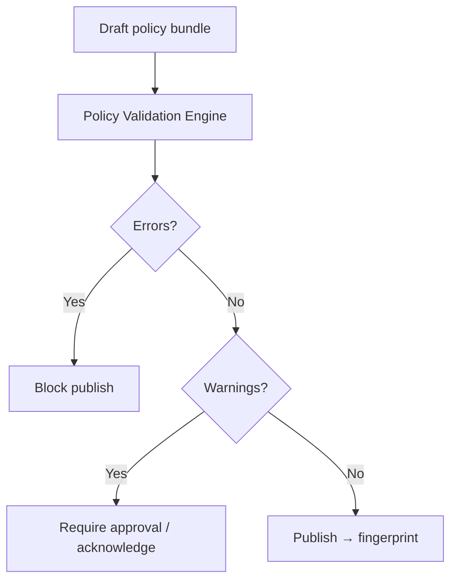

#### Responsibilities

| Responsibility | Description |
|----------------|-------------|
| Schema validation | Required fields, types, enum values |
| Cross-document consistency | Priority + Stack + Limits + Funding agree |
| Conflict detection | Contradictory rules |
| Impossibility detection | Configurations that can never apply |
| Circular dependency detection | e.g. stack order references undefined sources |
| Duplicate detection | Duplicate rule ids, duplicate priorities |
| Feature flag validation | Published bundle compatible with active flags |
| Suggestions | Non-blocking improvements for Admin UI |

#### Severity levels

| Level | Behaviour | Admin UI |
|-------|-----------|----------|
| **Error** | Blocks publish | Red — must fix |
| **Warning** | Publish allowed with finance/marketing acknowledgement | Amber |
| **Suggestion** | Informational | Blue |

#### Validation rule catalog (examples)

| Condition | Severity | Message |
|-----------|----------|---------|
| `maxCoupons = 0` AND `allowCouponWithPromotion = true` | **Error** | Coupons disabled but stack allows coupon+promotion |
| `exclusiveTerminatesAll = true` AND stack rule allows `Exclusive + Exclusive` | **Error** | Exclusive terminal conflicts with multi-exclusive stack rule |
| `allowPlatformWithVendor = false` AND `maxAutoPromotions = 2` | **Warning** | Limit allows two promos but platform+vendor stack disabled — second will never coexist |
| `maxTotalDiscountPercent < 10` AND `maxAutoPromotions > 1` | **Warning** | Aggressive stacking unlikely to apply fully |
| `stackOrder` references unknown `DiscountSource` | **Error** | Invalid stack order entry |
| Duplicate `stackRules[].id` | **Error** | Rule id collision |
| `priority.phases.COUPONS.maxSelected > limits.maxCoupons` | **Warning** | Priority allows more coupons than global limit |
| `funding.stackVetoes` references unknown funding type | **Error** | Invalid funding veto |
| Circular `stackRules` dependency (A requires B, B requires A) | **Error** | Circular stack dependency |
| Published bundle missing domain override for active `MEAL` flag | **Warning** | Feature flag expects domain override |

#### Outputs

| Output | Description |
|--------|-------------|
| `validationReport` | List of `{ severity, ruleId, message, path, suggestion? }` |
| `isPublishable` | `errors.length === 0` |
| `validatedFingerprint` | Preview fingerprint if publish proceeds |

#### Extension points

- New rules register as plugins — **no engine code change** for new business checks.  
- Campaign publish adds campaign-specific rule set (Phase 10).  
- Simulation (Section 9.11) invokes same validator before dry-run.

#### What Policy Validation Engine must NEVER do

- Apply discounts or modify `DiscountContext`  
- Replace Rule Engine eligibility  
- Run in hot path without cache (validate at publish; runtime loads pre-validated bundle)  

---

## Section 9 — Admin Configuration Blueprint

No UI implementation in this phase. Screens define **future admin product surface**.

### 9.1 Screen map

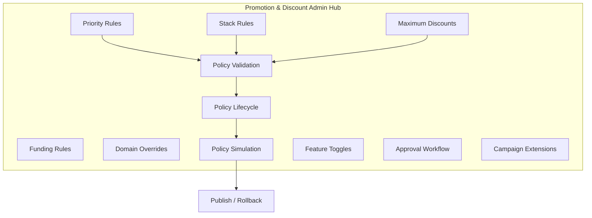

### 9.2 Priority Rules screen

| Element | Function |
|---------|----------|
| Strategy selector | `MAX_CUSTOMER_SAVINGS`, etc. |
| Tie-breaker ordering | Drag-and-drop list |
| Per-phase max selected | Auto / coupon |
| Domain tabs | SERVICE, ECOMMERCE, MEAL, PACKAGE |
| Simulation panel | Paste sample `DiscountContext` → see ranked output |
| Version history | Diff + rollback |

### 9.3 Stack Rules screen

| Element | Function |
|---------|----------|
| Matrix editor | Visual grid (Section 5) |
| Sequential order | Ordered source list |
| Exclusive behaviour | Toggles: skip coupon phase, terminate all |
| Rule list | Advanced: JSON rows with `id`, `reasonCode` |
| Conflict tester | Pick two sources → shows allow/deny + reason |

### 9.4 Funding Rules screen

| Element | Function |
|---------|----------|
| Shared split defaults | Platform / vendor % |
| Stack vetoes | Funding-based block rules |
| Settlement preview link | Jump to finance preview |

### 9.5 Maximum Discounts screen

| Element | Function |
|---------|----------|
| Global caps | Count + amount + percent |
| Domain table | Override grid |
| Overflow strategy | Dropdown |
| Campaign caps (future) | Greyed extension slot |

### 9.6 Domain Overrides screen

| Element | Function |
|---------|----------|
| Domain selector | SERVICE / ECOMMERCE / MEAL / PACKAGE |
| Inherit vs override | Per section (priority, stack, limits) |
| Effective config preview | Merged JSON read-only |

### 9.7 Feature Toggles screen

| Toggle | Purpose |
|--------|---------|
| `discount_engine_v2_priority` | Enable Priority Engine |
| `discount_engine_v2_stack` | Enable Stack Engine |
| `discount_engine_v2_authoritative` | Resolver result replaces legacy |
| `discount_engine_shadow_mode` | Log-only compare |
| Per-domain rollout | % traffic |

### 9.8 Approval Workflow

| Step | Actor |
|------|-------|
| Draft config | Marketing ops |
| Finance review | Required for funding / limit changes |
| Publish | Admin + version bump |
| Auto-rollback trigger | Error rate / support ticket threshold (Phase 9) |

### 9.9 Campaign Extensions (placeholder)

| Element | Function |
|---------|----------|
| Campaign priority boost | Numeric |
| Campaign stack group | Atomic bundle id |
| Campaign limit overrides | Nested `LimitConfiguration` |
| Schedule | Not in Phase 5–7 |

### 9.10 Policy Lifecycle

Admin UI interacts with policy through a **governed lifecycle**. No configuration reaches production without validation and publish metadata.

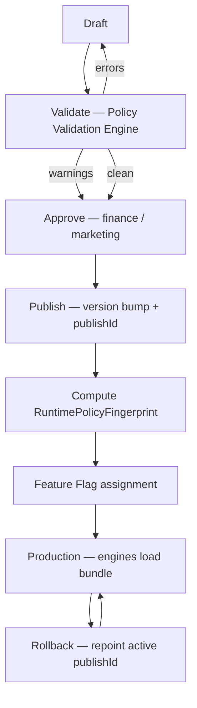

| Stage | Actor | System behaviour |
|-------|-------|------------------|
| **Draft** | Marketing / ops | Edit per-document configs in Admin UI; no runtime effect |
| **Validate** | Automated (Policy Validation Engine) | Errors block; warnings require acknowledgement |
| **Approve** | Finance (funding/limits) + marketing lead | Approval record attached to publish |
| **Publish** | Admin | Atomic publish of merged bundle; assigns `publishId`; bumps per-doc versions |
| **Version** | System | `priorityVersion`, `stackVersion`, etc. + `policyFingerprint` |
| **Feature Flag** | Ops | `% rollout`, per-domain flags reference `publishId` |
| **Production** | Runtime | Engines load **active** bundle by domain + flag snapshot |
| **Rollback** | Admin / auto-trigger | Repoint `activePublishId` to prior bundle; new fingerprint instantly |

**Rollback invariant:** Rollback changes **which bundle is active**, not engine code. Prior `policyFingerprint` values in audit remain valid for historical investigation.

**Feature flag interaction:** Flags select **publishId** (or bundle hash), not individual engine versions. Partial engine enable (priority on, stack off) uses flag matrix documented in Section 9.7.

### 9.11 Policy Simulation (extension — no implementation)

Admin and support tools run **dry-run evaluation** without persisting usage or affecting production carts.

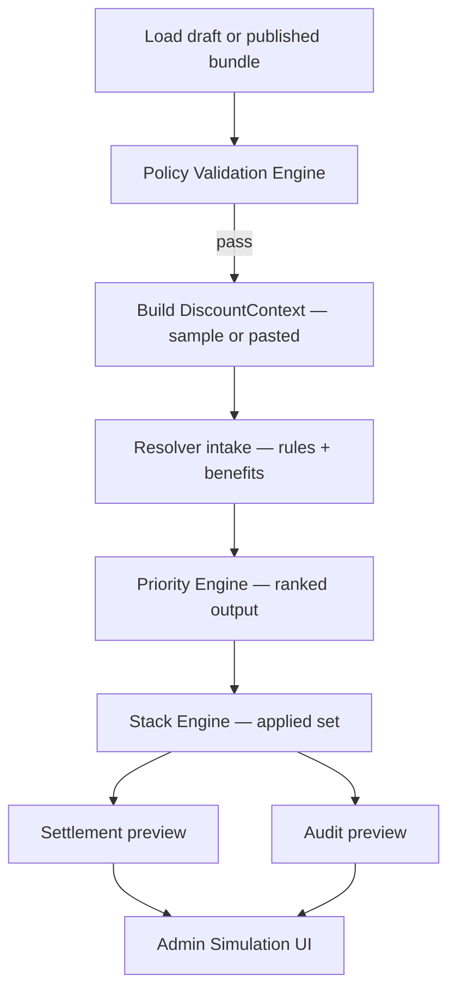

| Simulation output | Description |
|-------------------|-------------|
| Ranked candidates | Full `orderedCandidateList` with scores |
| Truncated list | Post-limit list entering Stack |
| Stack result | Final `applied[]`, `totalSavings`, `finalAmount` |
| Rejected reasons | Per-candidate `DecisionAudit` preview |
| Conflict pairs | `ConflictAudit` preview |
| Settlement preview | `DiscountSettlementPreview` |
| Policy fingerprint | `policyFingerprint` of bundle used |

**Extension points (design only):**

| Hook | Purpose |
|------|---------|
| `SimulationContextBuilder` | Admin pastes booking/cart JSON → `DiscountContext` |
| `SimulationRunner` | Invokes resolver pipeline in `dryRun: true` mode |
| `SimulationComparator` | Diff two fingerprints or draft vs production |
| `RegressionSuite` | Saved scenarios re-run on every publish validation |

**Constraints:** Simulation uses **same engines** as production — no duplicate simulation logic. `dryRun` skips usage writes only.

---

## Section 10 — Audit Model

Every discount decision must be **explainable** for support, developers, and analytics.

### 10.1 Core entities

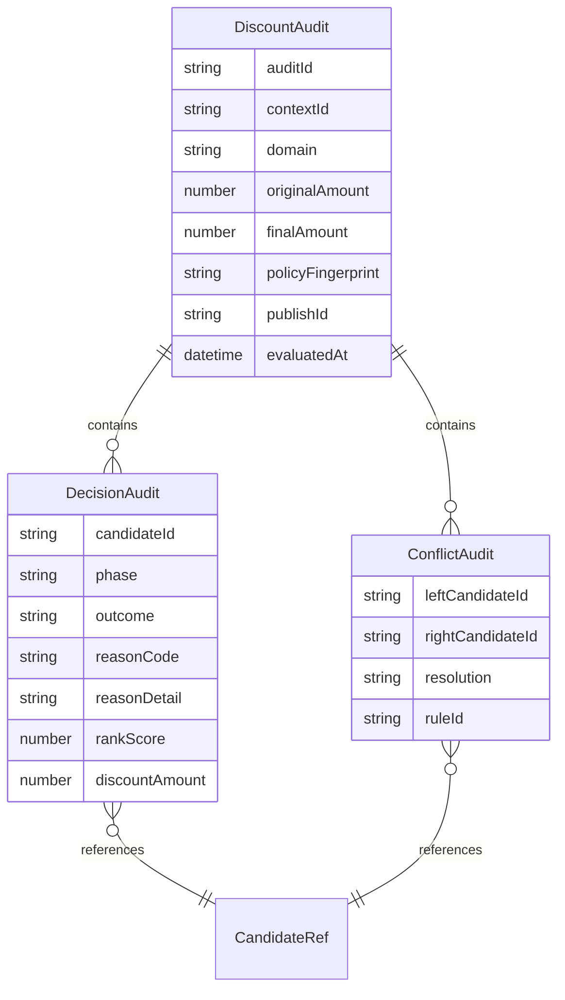

### 10.2 `DiscountAudit` (session-level)

| Field | Description |
|-------|-------------|
| `auditId` | UUID |
| `contextId` | Correlation id (booking id, cart id, quote id) |
| `domain` | `DiscountDomain` |
| `trigger` | AUTO / CODE |
| `originalAmount` | |
| `finalAmount` | |
| `totalSavings` | |
| `policyFingerprint` | **Required** — SHA-256 of merged runtime policy (Section 8.7) |
| `publishId` | Admin publish record for rollback correlation |
| `priorityVersion` | Diagnostic — source doc version |
| `stackVersion` | Diagnostic — source doc version |
| `fundingVersion` | Diagnostic — source doc version |
| `limitsVersion` | Diagnostic — source doc version |
| `engineVersion` | e.g. `phase-6.0` |
| `phases[]` | Nested decision timelines |
| `appliedCandidateIds[]` | Final set |

### 10.3 `DecisionAudit` (per candidate)

| Field | Description |
|-------|-------------|
| `candidateId` | |
| `source` | `DiscountSource` |
| `owner` | PLATFORM / VENDOR |
| `phase` | AUTO_PROMOTIONS / COUPONS |
| `outcome` | `ELIGIBLE` \| `REJECTED_RULE` \| `REJECTED_PRIORITY` \| `REJECTED_STACK` \| `REJECTED_LIMIT` \| `APPLIED` |
| `reasonCode` | Machine-readable (Section 10.5) |
| `reasonDetail` | Human-readable |
| `rankScore` | Priority breakdown (null if not ranked) |
| `rankPosition` | 1-based position in `orderedCandidateList` |
| `discountAmount` | At decision time |

### 10.4 `ConflictAudit` (pairwise)

| Field | Description |
|-------|-------------|
| `leftCandidateId` / `rightCandidateId` | |
| `ruleId` | Stack matrix rule |
| `resolution` | `ALLOWED` \| `REJECTED_LEFT` \| `REJECTED_RIGHT` |
| `fundingVeto` | boolean |

### 10.5 Reason codes (catalog)

| Code | Meaning | Typical phase |
|------|---------|---------------|
| `RULE_INELIGIBLE` | Failed Rule Engine | Resolver |
| `NOT_HIGHEST_SAVINGS` | Lower rank than peers (informational) | Priority |
| `BELOW_SPOTLIGHT` | Ranked below spotlight candidate | Priority |
| `PROMOTION_LIMIT` | Truncated by `maxAutoPromotions` / `maxSelected` | Priority |
| `COUPON_LIMIT` | Truncated by `maxCoupons` / `maxSelected` | Priority |
| `STACK_NOT_ALLOWED` | Matrix deny — coexistence rejected | Stack |
| `FUNDING_VETO` | Funding policy | Stack |
| `TOTAL_CAP_EXCEEDED` | Amount/percent cap | Stack |
| `EXCLUSIVE_OVERRIDE` | Exclusive terminal | Priority / Stack |
| `DUPLICATE_SOURCE` | Same source twice | Stack |
| `PHASE_ORDER` | Coupon before promo attempt | Resolver |
| `MIN_PAYABLE` | Would reduce below minimum | Stack |

### 10.6 Timeline (support view)

```mermaid
gantt
  title Discount decision timeline (example)
  dateFormat X
  axisFormat %s

  section Auto phase
  Candidate A eligible     :a1, 0, 1
  Candidate B eligible     :a2, 0, 1
  Priority rank A,B        :a3, 1, 2
  Stack coexistence apply  :a4, 2, 3

  section Coupon phase
  Candidate C eligible     :c1, 3, 4
  Stack allow C            :c2, 4, 5
```

### 10.7 Consumers

| Consumer | Use |
|----------|-----|
| **Customer support** | Explain why coupon did not stack |
| **Developer tools** | Shadow diff vs legacy |
| **Analytics (Phase 9)** | Funnel: eligible → applied → rejected reasons |
| **Finance** | Settlement dispute evidence |
| **Admin simulation** | Preview before publish |

### 10.8 Retention & PII

- Store candidate ids and reason codes; avoid raw customer PII in audit payload.  
- `contextId` links to booking/order for lookup.  
- Retention policy: TBD by compliance — design assumes append-only log.

---

## Section 11 — Future Settlement Integration

Settlement Engine (**Phase 7**) consumes **final** Priority + Stack output. It does not re-decide discounts.

### 11.1 Inputs to Settlement

| Input | From |
|-------|------|
| `DiscountEngineResult.applied[]` | Stack Engine |
| `FundingConfiguration` | Config store |
| `candidate.funding` + `sharedSplitRatio` | Normalized candidate metadata |
| `context` | Original `DiscountContext` |

### 11.2 Processing steps (design)

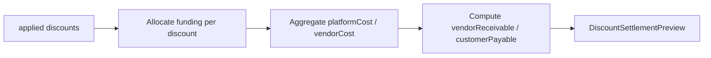

### 11.3 Contract (existing)

`SettlementEngine.compute(context, result) → DiscountSettlementPreview`  
Defined in `contracts/settlement-engine.ts` — implementation deferred to Phase 7.

### 11.4 Invariants

- Sum of party allocations = `totalSavings` (within rounding config).  
- Settlement **never** adds discounts not in `applied[]`.  
- Shared funding uses `FundingConfiguration.sharedDefaultSplit` unless candidate overrides.

---

## Section 12 — Future Campaign Integration

Campaign Engine (**Phase 10**) plugs in **without modifying** Priority, Stack, or Settlement engine code.

### 12.1 Integration pattern

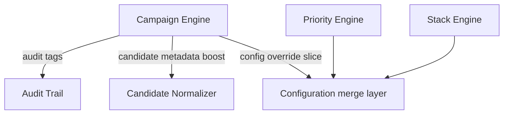

| Integration point | Mechanism |
|-------------------|-----------|
| New candidates | Campaign provider registers alongside existing providers |
| Priority boost | `metadata.campaignPriorityBoost` read by strategy — no engine fork |
| Stack grouping | `stackRules` reference `campaignGroupId` |
| Limits | `LimitConfiguration.campaigns[campaignId]` |
| Settlement | Campaign sponsor funding mapped via `FundingConfiguration` extension |
| Exclusive campaign | `exclusive: true` on candidate — existing short-circuit |

### 12.2 Non-goals for Campaign phase

- No changes to Rule Engine contract  
- No duplicate Priority/Stack implementations per campaign  

---

## Section 13 — Extension Points

Future discount types use **the same pipeline** with new providers and config rows.

| Type | Provider phase | Stack default | Priority default | Settlement |
|------|----------------|---------------|------------------|------------|
| **Membership** | AUTO or COUPON | Configurable | Tier-weighted strategy | PLATFORM or SHARED |
| **Referral** | COUPON-like | Single referral credit | MAX_CUSTOMER_SAVINGS | PLATFORM |
| **Wallet credits** | New phase `WALLET` after coupons? | ❌ with coupons default | Fixed amount | PLATFORM |
| **Gift cards** | `PAYMENT_INSTRUMENT` — **not** discount stack | N/A | N/A | Separate payment rail |
| **Loyalty points** | AUTO | One loyalty per order | Savings equivalent | VENDOR or PLATFORM |
| **Cashback** | Post-settlement — **not** in stack | N/A | N/A | Phase 7+ accrual |
| **Subscriptions** | Domain `SUBSCRIPTION` override | Domain matrix | Domain priority | Recurring settlement |

**Gift cards / cashback:** Design as **adjacent engines** that consume `finalAmount` after discounts — not stacked via Stack Engine unless admin explicitly adds matrix rules.

### 13.1 Adding a new discount type (checklist)

1. Add `DiscountSource` enum value (future phase).  
2. Add candidate provider + normalizer mapping.  
3. Add stack matrix rows (default deny until configured).  
4. Add priority phase assignment (AUTO vs COUPON vs new phase).  
5. Add settlement funding mapping.  
6. Add audit reason codes.  
7. Add Admin UI matrix row — no engine `if/else`.

---

## Section 14 — Anti-Patterns

| Anti-pattern | Why forbidden | Correct approach |
|--------------|---------------|------------------|
| Hardcoded stack rules in TypeScript | Cannot change without deploy; violates controlled stacking | `StackPolicyConfiguration.stackRules` |
| Hardcoded priority (`if platform > vendor`) | Business changes require code | `PriorityConfiguration.strategy` |
| `if/else` chains per domain in engines | Duplicated logic, untestable matrix | Domain override config merge |
| Separate engine per domain | Four products feel like four engines | One engine + domain overrides |
| Coupon-before-promotion | Violates final business decision | Resolver phase gate |
| Priority Engine re-running rules | Double eligibility, drift | Single Rule Engine pass |
| Stack Engine loading DB | Breaks provider boundary | Candidate repository only |
| Settlement changing `applied[]` | Finance cannot invent discounts | Settlement reads Stack output only |
| Duplicated configuration (SSM + code defaults that diverge) | Shadow diff noise | Single config store + `policyFingerprint` |
| Priority Engine deciding coexistence | Blurs ownership; untestable | Stack Engine only (Section 1.5) |
| Publishing without Policy Validation Engine | Impossible configs reach production | Validate before publish (Section 8.8) |
| Storing only per-doc version in audit | Cannot reproduce merged runtime policy | `policyFingerprint` required (Section 8.7) |
| Platform-specific logic in resolver | Resolver stays orchestration-only | Policy in Priority/Stack |
| Skipping audit for “simple” paths | Support cannot explain charges | Always emit `DecisionAudit` |
| Implementing campaigns inside Stack Engine | Couples phases | Campaign config overrides (Section 12) |

---

## Section 15 — Implementation Plan

### Phase 5 — Priority Engine

| Item | Detail |
|------|--------|
| **Objective** | Config-driven **ranking, scoring, ordering**, and selection-limit truncation per phase; exclusive flagging; priority audit |
| **Files** | `priority/priority-engine.ts`, `priority/strategies/*`, `priority/config-loader.ts`, `policy/runtime-policy-fingerprint.ts`, `policy/policy-validation-engine.ts`, `contracts/priority-engine.ts` (extend), tests |
| **Dependencies** | Phase 4 resolver stable; `LimitConfiguration` schema; `RuntimePolicyFingerprint` merge rules |
| **Risks** | Legacy “spotlight” parity; tie-breaker non-determinism |
| **Effort** | M (2–3 weeks) |
| **Testing** | Unit per strategy; golden files per domain; shadow compare vs legacy best-promo |
| **Rollback** | Feature flag `discount_engine_v2_priority=false` → resolver returns all eligible (Phase 4 behaviour) |

### Phase 6 — Stack Engine

| Item | Detail |
|------|--------|
| **Objective** | Config-driven **coexistence**, stacking, conflict resolution; sequential service stack; cross-phase coupon application |
| **Files** | `stack/stack-engine.ts`, `stack/matrix-evaluator.ts`, `stack/sequential-applicator.ts`, `contracts/stack-engine.ts` (extend), tests |
| **Dependencies** | Phase 5 `truncatedCandidateList` output; merged stack config; `policyFingerprint` on audit |
| **Risks** | Sequential re-base parity with `calculateBookingPromotionsStack`; coupon gap closure (S5, E6) |
| **Effort** | L (3–4 weeks) |
| **Testing** | Matrix integration tests for every Section 5 cell; legacy shadow on booking + cart |
| **Rollback** | Flag off → Priority passes full eligible list unordered (Phase 4 behaviour); Stack skipped |

### Phase 7 — Settlement Engine

| Item | Detail |
|------|--------|
| **Objective** | Funding-aware ledger preview; finance-ready breakdown |
| **Files** | `settlement/settlement-engine.ts`, `settlement/funding-allocator.ts`, tests |
| **Dependencies** | Phase 6 final `applied[]`; `FundingConfiguration` |
| **Risks** | Rounding; SHARED split disputes |
| **Effort** | M (2 weeks) |
| **Testing** | Unit allocation; reconciliation tests sum to savings |
| **Rollback** | Omit `settlement` field from result |

### Phase 8 — Feature Flag & Cutover

| Item | Detail |
|------|--------|
| **Objective** | Authoritative resolver; per-domain rollout; config versioning |
| **Files** | `resolver/production-bridge.ts`, `feature-flags/*`, admin toggle API (if needed) |
| **Dependencies** | Phases 5–7 complete; shadow metrics clean |
| **Risks** | Revenue impact; checkout regression |
| **Effort** | M (2 weeks) |
| **Testing** | Canary %; instant rollback pointer |
| **Rollback** | `discount_engine_v2_authoritative=false` |

### Phase 9 — Analytics

| Item | Detail |
|------|--------|
| **Objective** | Reason-code dashboards; rejection funnel; **`policyFingerprint`** correlation |
| **Files** | Audit export, CloudWatch metrics, optional warehouse ETL |
| **Dependencies** | Audit model populated |
| **Risks** | Volume / cost |
| **Effort** | S–M (1–2 weeks) |
| **Testing** | Metric cardinality limits |
| **Rollback** | Sampling toggle |

### Phase 10 — Campaign Engine

| Item | Detail |
|------|--------|
| **Objective** | Campaign candidates + config overrides without forking core engines |
| **Files** | Campaign provider, `LimitConfiguration.campaigns`, admin UI |
| **Dependencies** | Phases 5–8; admin blueprint Section 9.9 |
| **Risks** | Scope creep into stack hardcoding |
| **Effort** | L (4+ weeks) |
| **Testing** | Campaign simulation in admin preview |
| **Rollback** | Disable campaign provider registration |

### Phase roadmap diagram

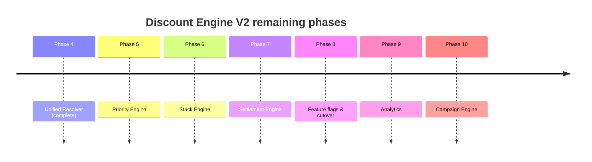

---

## Section 16 — Core Architecture Principles

These principles govern **all remaining phases**. Any implementation proposal that violates a principle must be rejected or escalated to architecture review.

### 16.1 Configuration over code

**Principle:** Business policy lives in versioned configuration documents validated before publish — not in TypeScript `if/else`.

**Why:** Warmpawz requires controlled stacking and admin override without deploy cycles. Marketing, finance, and ops must change behaviour through Admin UI + publish lifecycle (Section 9.10).

**Implications:** Priority strategies, stack matrix cells, limits, and funding vetoes are data. Engines interpret data.

---

### 16.2 One engine

**Principle:** Service, package, meal, and product domains share **one** Priority Engine and **one** Stack Engine.

**Why:** Customers experience one marketplace; duplicate engines diverge silently.

**Implications:** Domain differences are `domains{}` overrides in configuration — not forked code paths.

---

### 16.3 No duplicate logic

**Principle:** Eligibility exists only in Rule Engine; benefit math only in Benefit Engine; ranking only in Priority Engine; coexistence only in Stack Engine.

**Why:** Duplication caused legacy drift between booking and ecommerce paths (documented in `RESOLVER_MATRIX.md`).

**Implications:** Simulation, shadow mode, and production call the **same** pipeline (Section 9.11).

---

### 16.4 No domain-specific engines

**Principle:** Do not create `ServiceStackEngine`, `EcommercePriorityEngine`, etc.

**Why:** Domain-specific engines become permanent forks.

**Implications:** `DiscountDomain` selects configuration slice; engine code is domain-agnostic.

---

### 16.5 No hardcoded priorities

**Principle:** Priority order derives from `PriorityConfiguration` strategy + tie-breakers — never from owner/source `if` chains.

**Why:** “Platform beats vendor” and “vendor beats platform” are business decisions that change by domain and campaign.

**Implications:** `MAX_CUSTOMER_SAVINGS` is the default strategy, not embedded sort logic.

---

### 16.6 No hardcoded stack rules

**Principle:** Combination allow/deny is read from `StackPolicyConfiguration.stackRules` — never from engine conditionals.

**Why:** Controlled stacking requires configurable matrix (Section 5).

**Implications:** Adding a new source type means adding matrix rows + validation rules — not editing Stack Engine core.

---

### 16.7 Deterministic results

**Principle:** Identical `DiscountContext` + identical `policyFingerprint` → identical `applied[]` and amounts.

**Why:** Support reproduction, shadow comparison, and finance audit.

**Implications:** Tie-breakers include stable `candidate.id`; no random or time-dependent sort except `evaluatedAt` from context.

---

### 16.8 Immutable audit

**Principle:** Every candidate receives a `DecisionAudit` outcome; audits are append-only.

**Why:** Customer support must explain charges; analytics must measure rejection funnels.

**Implications:** No “fast path” that skips audit; `policyFingerprint` on every `DiscountAudit`.

---

### 16.9 Feature-flag everything

**Principle:** Priority, Stack, Settlement, and authoritative cutover are independently flag-gated (Phase 8).

**Why:** Revenue-critical path requires gradual rollout and instant rollback.

**Implications:** Flags bind to `publishId` / fingerprint — not ad-hoc engine version strings.

---

### 16.10 Backward compatibility

**Principle:** Phase 5+ must shadow-compare against legacy until metrics prove parity; legacy remains authoritative until Phase 8 cutover.

**Why:** Phase 4 established diagnostic mode; premature cutover risks checkout regression.

**Implications:** `invokeResolverAlongsideLegacy` pattern continues through Phase 6–7; fingerprint logged on both paths.

---

### 16.11 Validate before activate

**Principle:** No configuration reaches production without Policy Validation Engine approval (Section 8.8).

**Why:** Impossible configs (e.g. `maxCoupons=0` + coupon stacking allowed) must not reach runtime.

**Implications:** Admin publish flow is Draft → Validate → Approve → Publish — not direct SSM edit without validation.

---

## Appendix A — Relationship to existing contracts

| Artifact | Location | This document |
|----------|----------|---------------|
| Unified Resolver | `resolver/unified-discount-resolver.ts` | Inserts Priority + Stack after Benefit Engine |
| `PriorityEngine` interface | `contracts/priority-engine.ts` | Section 2 — extend in Phase 5 |
| `StackEngine` interface | `contracts/stack-engine.ts` | Section 3 — replace ad-hoc `StackPolicy` with full config |
| `SettlementEngine` interface | `contracts/settlement-engine.ts` | Section 11 |
| Resolver matrix | `RESOLVER_MATRIX.md` | Rows S1–E6 unchanged; stack/priority cells activate |
| Phase 4 report | `PHASE4_MIGRATION_REPORT.md` | Phase 5+ scope split per this plan |
| Policy fingerprint | Section 8.7 | Required on all audits from Phase 5 onward |
| Policy validation | Section 8.8 | Gate before publish; Admin UI Phase 8+ |

---

## Appendix B — Document control

| Version | Date | Author | Change |
|---------|------|--------|--------|
| 1.0.0 | 2026-06-30 | Architecture design | Initial stack policy & priority contract |
| 1.1.0 | 2026-06-30 | Architecture refinement | RuntimePolicyFingerprint; Policy Validation Engine; Priority/Stack ownership clarification; Ownership Matrix; Policy Lifecycle; Simulation; Core Principles |

**Status:** Final pre–Phase 5 architecture contract. Further changes should be additive (new matrix rows, validation rules) — not ownership redesign.

**Next review:** Product + finance sign-off on Section 5 defaults, Section 6 limits, and Section 8.8 validation catalog before Phase 5 kickoff.

---

*End of STACK_POLICY.md — design only; no implementation authorized by this document alone.*
