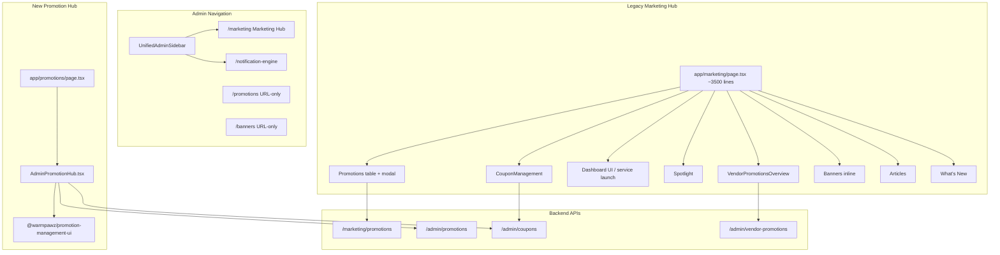

# Admin Marketing & Promotions — Current State

**Phase:** UI/UX Sprint A — Discovery (documentation only)  
**Date:** 2026-07-03  
**Status:** Read-only inventory — no implementation  
**Purpose:** Blueprint for extending the existing Admin Marketing ecosystem without duplication.

---

## Executive Summary

Warmpawz Admin has **two promotion management surfaces** plus a **multi-tab Marketing Hub**:

| Surface | Route | Sidebar | API family | Maturity |
|---------|-------|---------|------------|----------|
| **Marketing Hub** (legacy) | `/marketing` | Yes — “Marketing Hub” | `/marketing/promotions`, `/marketing/spotlights`, `/admin/banners`, … | Production — 9 tabs, monolithic page |
| **Promotion Hub** (new) | `/promotions` | **No** (URL-only) | `/admin/promotions`, `/admin/coupons` | Wizard UX via shared package — partial catalog |
| **Banners** (standalone) | `/banners` | No | `/admin/banners` | Dedicated CRUD with hooks |

**Long-term direction (analysis only — not a decision):** The **`@warmpawz/promotion-management-ui` package** (`PromotionDashboard`, `PromotionWizard`, `PromotionTargetSelector`) is the stronger **UX and architecture** foundation. The **Marketing Hub Promotions tab** retains richer **API persistence** today (`/marketing/promotions`). Sprint A should **extend and converge**, not replace wholesale.

Coupons are **partially unified**: both hubs use `/admin/coupons/*`, but legacy `CouponManagement` lacks delete/toggle and calls a missing bulk-generate endpoint.

---

## Architecture Overview



---

## Task 1 — Marketing Module Inventory

### Pages & routes

| Route | File | Permission | In sidebar |
|-------|------|------------|------------|
| `/marketing` | `apps/admin-web/app/marketing/page.tsx` | `admin.integrations` or `admin.notifications.view` | Yes |
| `/promotions` | `apps/admin-web/app/promotions/page.tsx` | `admin.integrations` | No |
| `/banners` | `apps/admin-web/app/banners/page.tsx` | `admin.integrations` | No |
| `/notification-engine` | `apps/admin-web/app/notification-engine/page.tsx` | `admin.notifications.view` | Yes (Marketing group) |
| `/content` | `apps/admin-web/app/content/page.tsx` | `admin.governance` | Yes (overlaps articles) |

**Nav source:** `packages/shared-types/src/admin-portal-nav.ts`  
**Layout:** `AdminLayout` + `UnifiedAdminSidebar` + `AdminRouteGuard`

### Marketing Hub tabs (`/marketing`)

| Tab ID | Label | Implementation |
|--------|-------|----------------|
| `promotions` | Promotions | Inline table + Create/Edit `Dialog` |
| `vendor-promotions` | Vendor Promotions | `VendorPromotionsOverview` |
| `ui-config` | Dashboard UI | Service launch + dashboard widget config |
| `spotlight` | Spotlight | List + Add modal → `/marketing/spotlights` |
| `coupons` | Coupons | `CouponManagement` |
| `banners` | Banners | Inline grid + modal (full CTA targeting) |
| `articles` | Articles | CMS via `/admin/content/pages` |
| `announcements` | What's New | Platform settings `home_announcements` |

### Components (`apps/admin-web/components/admin/marketing/`)

| Component | Mounted | Role |
|-----------|---------|------|
| `AdminPromotionHub.tsx` | `/promotions` | Data layer → promotion-management-ui |
| `CouponManagement.tsx` | `/marketing` coupons tab | List, create, bulk-generate |
| `VendorPromotionsOverview.tsx` | `/marketing` vendor tab | Admin view + toggle vendor promos |
| `BannerImageField.tsx` | Marketing banners + `/banners` | Image upload/compress |
| `ShopBannerDestinationFields.tsx` | Marketing banners + `/banners` | Shop product picker |
| `AdvancedPromotionsEngine.tsx` | **Orphan** | Rich modal — E2E/tests only |
| `BannerAdmin.tsx` | **Orphan** | Redirect stub |

### Shared package (`packages/promotion-management-ui/`)

| Component | Purpose |
|-----------|---------|
| `PromotionDashboard` | Lifecycle tabs, search, filters, grid |
| `PromotionWizard` | 8-step full-screen create/edit (promo or coupon) |
| `PromotionTargetSelector` | Multi-scope targeting UI |
| `PromotionTypeSelector` | Discount type tiles |
| `PromotionTriggerSelector` | Audience (auto / code / VIP tiles) |
| `PromotionCard` / `CouponCard` | Dashboard cards |
| `PromotionDetailsPanel` | Side drawer |
| `PromotionSummary` / `PromotionPreview` | Review step |
| `PromotionStatusBadge` / `PromotionTimeline` | Status display |
| `ComingSoonSection` | Placeholder for future policy engines |

**Supporting:** `types.ts`, `normalize.ts`, `mappers.ts`, `validation.ts`, `lifecycle.ts`

### Hooks & state

| Area | Pattern |
|------|---------|
| Marketing Hub | Inline `useState` / `useEffect` — no dedicated hooks |
| `/banners` | `useApiData`, `useCrud`, `useFormModal`, `useNotifications` |
| Promotion Hub | `useCallback` load in `AdminPromotionHub` |

**No global stores or React Context** for marketing.

### Dialogs / modals (legacy hub)

| State flag | Purpose |
|------------|---------|
| `showPromoModal` | Create/Edit platform promotion |
| `spotlightModal` | Add vendor spotlight |
| `showBannerModal` | Create/Edit banner |
| `showArticleModal` | Create/Edit article |
| `showAnnouncementModal` | Create/Edit What's New |

---

## Promotion Flow (Legacy Marketing Hub)

```
Admin → /marketing → Promotions tab
  → GET /marketing/promotions
  → Create/Edit Dialog
      → POST/PUT /marketing/promotions
  → Toggle active → PUT /marketing/promotions/:id { isActive }
  → Delete → DELETE /marketing/promotions/:id (soft delete)
```

**Form fields:** name, discount type/value, dates, category (hardcoded select), style (hardcoded), min order, max discount, usage limit, priority, published, spotlight flag.

**Validation:** Client-side required fields; server requires name, discountType, discountValue.

**Business rules (API):** Eligibility uses `applicable_services` JSON, category/style tokens, `published`, date window, min order.

**Limitations:** Search input not wired; category/style hardcoded; no individual service/package/product picker; no lifecycle tabs.

---

## Coupon Flow

### Platform coupons (admin)

| Step | Legacy (`CouponManagement`) | New hub (`PromotionWizard`) |
|------|------------------------------|----------------------------|
| List | `GET /admin/coupons?page&limit&search&status` | Same + dashboard tabs |
| Create | `POST /admin/coupons/create` | `POST /admin/coupons/create` via wizard |
| Bulk | `POST /admin/coupons/bulk-generate` | **Not in wizard** |
| Update | — | `PUT /admin/coupons/:id` |
| Delete | — (placeholder menu) | `DELETE /admin/coupons/:id` |

**Validation:** Code required, uppercased; discount type/value; date window; usage limits in wizard.

**Runtime:** `GET /coupons/validate/:code`, `POST /coupons/apply`; discount-engine shadow eligibility.

### Vendor coupons

Vendor-created promos with codes live in `vendor_promotions` / `vendor_service_promotions` — managed on **vendor portal**, viewed on **Vendor Promotions** admin tab via `GET /admin/vendor-promotions`.

---

## Legacy vs New Promotion Hub Comparison

| Dimension | `/marketing` Promotions tab | `/promotions` AdminPromotionHub |
|-----------|----------------------------|--------------------------------|
| **Navigation** | Sidebar linked | URL-only |
| **UI** | Table + single modal | Dashboard + 8-step wizard + drawer |
| **API** | `/marketing/promotions` | `/admin/promotions` |
| **Delete** | Soft delete | Hard delete |
| **Targeting** | 2 dropdowns → `applicableServices` | `PromotionTargetSelector` (8 scopes) |
| **Catalog** | Hardcoded categories | Vendors loaded; categories/services empty |
| **Coupons** | Separate tab | Unified dashboard tab |
| **Search/filters** | Search not wired | Wired |
| **Lifecycle** | Flat list | Active / Scheduled / Expired / Draft / Recent |
| **Create kind** | Promotion only | Promotion **or** coupon |

### Recommendation (analysis — not implementation decision)

| Action | Candidate |
|--------|-----------|
| **Reuse** | `promotion-management-ui` wizard, dashboard, target selector, cards, validation |
| **Extend** | `AdminPromotionHub` catalog loading; wire sidebar link after parity |
| **Extend** | Legacy modal OR embed target selector for operators who stay on `/marketing` |
| **Retire (eventually)** | Monolithic promotion modal in `marketing/page.tsx`; orphan `AdvancedPromotionsEngine`, `PromotionsManagement` |
| **Keep separate (for now)** | Spotlight, banners, articles, What's New, ui-config, vendor promotions tabs on `/marketing` |

---

## Targeting Analysis

| Target type | Legacy modal | PromotionTargetSelector | Backend persistence | Runtime enforcement |
|-------------|--------------|-------------------------|---------------------|---------------------|
| Entire marketplace | Implicit “all” category | `entire_platform` scope | Partial | Category=all |
| Category | Hardcoded 5 options | `categories` scope (empty catalog) | `applicable_services` tokens | Yes |
| Service style | home_visit/clinic/online | `styles` (3 hardcoded) | `style:*` tokens | Yes (with alias map) |
| Individual services | No | `services` scope (empty) | UUID in `applicable_services` | Yes |
| Packages | No | `packages` scope (empty) | Not wired on `/admin/promotions` | Partial |
| Meal plans | No | `meal_plans` scope (empty) | Not wired | Partial |
| Products | No | `products` scope (empty) | Not wired | E-commerce separate |
| Vendors | No | `vendors` scope (loaded) | Limited | Via vendor promos |
| Multiple categories | Single select only | Multi-scope | Partial | Partial |
| Audience segments | No | VIP tile in wizard | `is_spotlight` mapping only | Partial |
| Customer segments | No | ComingSoon placeholder | No | No |

**Banner targeting (reference):** `GET /admin/banners/destination-options` — **live API-driven** categories, styles, vendors, articles — best pattern for Sprint A catalog wiring.

---

## Category Analysis

| Source | Used by | Dynamic? |
|--------|---------|----------|
| Hardcoded `<SelectItem>` in `marketing/page.tsx` | Legacy promotion modal | **No** — 5 categories |
| Hardcoded checkboxes in `AdvancedPromotionsEngine` | Orphan | **No** — 10 services |
| Hardcoded in `AdminPromotionHub` | Styles only | Partial |
| `GET /admin/catalog/categories` | Available elsewhere in admin | **Yes** — not wired to promos |
| `GET /admin/banners/destination-options` | Banner CTA | **Yes** |
| `GET /config/policy-options` | Fee/policy config | **Yes** |
| `service_categories` DB table | Catalog admin | **Yes** |
| `GET /admin/roles` | Dashboard UI tab on same page | **Yes** — not used for promo categories |

**Missing from legacy dropdown:** pharmacy, nutritionist, walker, shop/e-commerce, cafe, insurance, diagnostics, behaviourist, daycare, etc.

**Duplicate slug risk:** `home_visit` vs `at_home`, `clinic` vs `at_center`, `online` vs `tele` — backend normalizes aliases at eligibility time.

---

## Policy Readiness (Discount Engine V2 future UI)

| Engine / policy | UI placeholder | Status |
|-----------------|----------------|--------|
| Stack rules | `ComingSoonSection` | Placeholder only |
| Priority rules | `ComingSoonSection` | Placeholder only |
| Funding / co-pay | `ComingSoonSection` | Placeholder only |
| Settlement preview | `ComingSoonSection` | Backend Phase 7 done; no admin UI |
| Campaigns | `ComingSoonSection` | Not implemented |
| Analytics | `ComingSoonSection`; `/admin/promotions/analytics` exists | Partial backend |
| Simulator | None | Requires new screen |
| Audit trail | None | Requires new screen |
| Usage limits | Wizard fields | **Implemented** (basic) |
| Approval workflow | `ComingSoonSection` | Not implemented |
| Feature flags | `ComingSoonSection` | Env-only today |

---

## Current APIs (Admin-facing)

### Platform promotions

| Method | Route | Consumer |
|--------|-------|----------|
| GET/POST/PUT/DELETE | `/marketing/promotions` | Legacy marketing tab |
| GET/POST/PUT/DELETE | `/admin/promotions` | Promotion hub, ecommerce orphan |
| GET | `/admin/promotions/stats` | AdvancedPromotionsEngine (orphan) |
| GET | `/admin/promotions/analytics` | Not wired in live UI |

### Coupons

| Method | Route | Consumer |
|--------|-------|----------|
| GET/POST/PUT/DELETE | `/admin/coupons`, `/admin/coupons/create` | Both hubs |
| POST | `/admin/coupons/bulk-generate` | CouponManagement (**404 — missing**) |

### Vendor promotions

| Method | Route | Consumer |
|--------|-------|----------|
| GET | `/admin/vendor-promotions` | VendorPromotionsOverview |
| PUT | `/admin/vendor-promotions/:id/toggle` | VendorPromotionsOverview |

### Marketing adjacent

| Method | Route | Consumer |
|--------|-------|----------|
| GET/POST/DELETE | `/marketing/spotlights` | Spotlight tab |
| GET/POST/PUT/DELETE | `/admin/banners` | Banners tab + `/banners` |
| GET | `/admin/banners/destination-options` | Banner modals |
| GET/PUT | `/admin/content/pages` | Articles tab |
| GET/PUT | `/admin/platform-settings` | What's New |

---

## UX Snapshot

| Area | Good | Needs improvement | Critical |
|------|------|-------------------|----------|
| Navigation | Marketing group in sidebar | `/promotions` hidden | Two hubs confuse operators |
| Wizard | 8-step new hub | Legacy single modal cramped | — |
| Dashboard | Lifecycle tabs on new hub | Legacy flat table | — |
| Filtering | New hub search works | Legacy search unwired | — |
| Target selection | TargetSelector UX | Empty catalogs | Persistence split |
| Validation | Package validation.ts | Legacy inline only | API mismatch loses targets |
| Loading | New hub has loading state | Legacy mixed | — |
| Empty states | Cards handle empty | Legacy tables sparse | — |
| Bulk actions | Coupon bulk UI | Endpoint missing | — |
| Responsiveness | Wizard full-screen | 3500-line page heavy | — |
| Accessibility | shadcn/ui base | Wizard overlay focus | — |

---

## Orphan / Duplicate Components

| Component | Path | Status |
|-----------|------|--------|
| `AdvancedPromotionsEngine` | `marketing/AdvancedPromotionsEngine.tsx` | Not mounted |
| `PromotionsManagement` | `ecommerce/promotions/` | Not on `/ecommerce` |
| `BannerAdmin` | `marketing/BannerAdmin.tsx` | Stub redirect |

---

## Related Documentation

- `docs/ADMIN_PROMOTION_CURRENT_STATE.md` — prior promotion-focused analysis (2026-06-30)
- `docs/ADMIN_PROMOTION_GAP_ANALYSIS.md` — prior gap IDs ADMIN-01–11
- `docs/PROMOTION_SYSTEM_STATUS.md` — engine + discount pipeline inventory
- `docs/SETTLEMENT_CURRENT_STATE.md` — settlement (Phase 7 backend)

---

## Current Limitations (summary)

1. **Dual API** for platform promotions with different persistence semantics (soft vs hard delete).
2. **New hub** not in sidebar; operators may not discover `/promotions`.
3. **Target catalog** mostly empty except vendors + 3 styles.
4. **Legacy categories** hardcoded and incomplete.
5. **Coupon bulk-generate** UI calls missing backend route.
6. **Monolithic** `marketing/page.tsx` — high maintenance cost.
7. **Policy engines** (stack/priority/funding) have backend work but **no admin configuration UI**.
