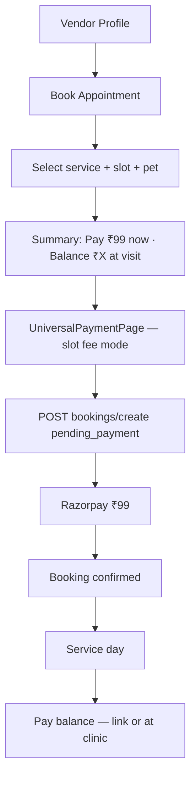

# Warmpawz Pay & Book Appointment — Product Planning Document

**Author:** Product Analysis  
**Date:** 27 July 2026  
**Branch analysed:** `feature/warmpawzpay`  
**Status:** Planning — requires product sign-off before implementation  
**Related docs:** `WARMPAWZ_PAY_TECHNICAL_ARCHITECTURE_FINAL.md`, `WARMPAWZ_PAY_SPRINT_PLAN.md`

---

## 1. Executive summary

Warmpawz has **two related payment products** that share infrastructure but serve different user intents:

| Product | User intent | Status on `feature/warmpawzpay` |
|---------|-------------|----------------------------------|
| **Pay Bill (Scan to Pay)** | Customer at vendor pays a **walk-in bill** — enters amount, gets admin discount, pays via Razorpay | **Largely implemented** — customer UI, APIs, admin catalogue, pricing, migrations |
| **Book Appointment + slot fee** | Customer **books a slot** and pays a **fixed admin-configured deposit** (e.g. ₹99); pays service balance later | **Not implemented** — Commerce Switch declares intent; booking still uses full upfront marketplace payment |

**Recommendation:** Complete Pay Bill post-payment pipeline (settlements, notifications) on the current branch, then build **Book Appointment + slot fee** as a **Phase 2 extension** that reuses Warmpawz Pay payment rails but links to `bookings` and uses **admin-configured fixed fees** instead of customer-entered bill amounts.

---

## 2. Existing Pay Bill model — as built

### 2.1 Product definition

Warmpawz Pay (Phase 1) is a **standalone walk-in payment product**:

- Customer discovers **published** vendors from a catalogue
- Enters **bill amount** (not set by vendor or admin)
- Receives **admin-configured discount %** on that bill
- Pays **discounted amount** via Razorpay Standard Checkout
- Views history under Warmpawz Pay

Architecture explicitly **excludes booking coupling** in MVP: `payments.booking_id = NULL`, `payment_source = 'warmpawz_pay'`.

### 2.2 Customer journey (implemented)

```mermaid
flowchart TB
  A[Bottom nav SCAN TO PAY] --> B[/warmpawz-pay]
  B --> C[Vendor list + category filters]
  C --> D[/warmpawz-pay/vendors/:vendorId]
  D --> E[Enter bill amount]
  E --> F[Get Discount preview]
  F --> G[Proceed to Pay]
  G --> H[POST /customer/warmpawz-pay/initiate]
  H --> I[Razorpay checkout]
  I --> J[POST /customer/warmpawz-pay/verify]
  J --> K[/warmpawz-pay/success]
  K --> L[/warmpawz-pay/history + Profile section]
```

| Step | Screen / route | Behaviour |
|------|----------------|-----------|
| Entry | Center tab **SCAN TO PAY** | Shown when `isWarmpawzPayEnabled()` — default on unless `NEXT_PUBLIC_WARMPAWZ_PAY_ENABLED=false` |
| Discover | `/warmpawz-pay` | Paginated vendor feed, search, category filters |
| Pay | `/warmpawz-pay/vendors/[vendorId]` | Vendor hero, rating, offer badge; amount input + quick picks (₹500–₹2000) |
| Quote | Client-side preview | Discount from vendor's active pricing row; server recomputes on initiate |
| Pay | Razorpay | `runWpayRazorpayCheckout()` orchestrates initiate → checkout → verify |
| Success | `/warmpawz-pay/success` | Shows amount saved |
| History | `/warmpawz-pay/history` + profile `ProfileWpayHistorySection` | Paginated transactions by phone |

### 2.3 Amount model — who sets what

| Field | Set by | Source |
|-------|--------|--------|
| **Original bill amount** | **Customer** | Free-text input in `WarmpawzPayVendorClient.tsx` → `originalAmount` in initiate POST |
| **Discount %** | **Admin** | `warmpawz_pay_merchant_pricing.discount_value` (0–100), active + within effective dates |
| **Max discount cap** | Admin (UI-ready) | `maxDiscountAmount` in customer UI; backend always passes `null` today — **not persisted in schema** |
| **Payable amount** | **Server** | `computeWpayDiscountQuote()`: `payable = max(0.01, original − discount)` |

```typescript
// backend/lambda/src/endpoints/customer/warmpawz-pay/shared/wpay-discount.ts
discountAmount = min(original × discountPercent / 100, maxDiscount ?? ∞)
payableAmount    = max(0.01, original − discountAmount)
```

**Important:** Admin configures **discount percentage**, not bill amount. The customer always enters the bill total.

### 2.4 Admin journey (implemented)

| Screen | Route | Purpose |
|--------|-------|---------|
| Dashboard | Admin → Warmpawz Pay | Published merchant count, avg discount %, payments table |
| Catalogue | Admin → Warmpawz Pay → Catalogue | Add vendors, set discount %, draft/publish |
| Pricing API | `/admin/warmpawz-pay/pricing` | CRUD per merchant commercial terms |

**Catalogue workflow:**

1. Admin adds vendor candidate to catalogue
2. Sets **discount %** (via pricing create/update on publish)
3. Publishes vendor → appears in customer list when eligibility met

**Vendor eligibility for customer visibility:**

- `warmpawz_pay_vendor_catalog.publish_status = 'published'`
- `vendors.status = active` (approved)
- `vendors.bank_verified = true`

Note: migration `1084_drop_vendors_pay_bill_enabled.sql` removed `vendors.pay_bill_enabled` — **catalogue publish status is the switch**.

### 2.5 API surface (implemented)

#### Customer

| Method | Path | Purpose |
|--------|------|---------|
| GET | `/customer/warmpawz-pay/vendors` | Paginated published merchant list |
| GET | `/customer/warmpawz-pay/vendors/:vendorId` | Pay screen vendor detail + discount |
| POST | `/customer/warmpawz-pay/initiate` | `{ vendorId, originalAmount, phone }` → Razorpay order + pending payment |
| POST | `/customer/warmpawz-pay/verify` | Signature verify → `payment_status = completed` |
| GET | `/customer/warmpawz-pay/transactions` | History by phone |

#### Admin

| Method | Path | Purpose |
|--------|------|---------|
| GET | `/admin/warmpawz-pay/dashboard` | Metrics |
| GET | `/admin/warmpawz-pay/payments` | Paginated payment orders |
| GET/POST/PUT/DELETE | `/admin/warmpawz-pay/pricing[...]` | Merchant discount config |
| GET/POST/... | `/admin/warmpawz-pay/catalogue[...]` | Catalogue CRUD + publish |

**Feature flags (Lambda env):** `WARMPAWZ_PAY_ENABLED`, `WARMPAWZ_PAY_ADMIN_ENABLED`

### 2.6 Data model (committed migrations)

| Migration | Purpose |
|-----------|---------|
| `1080_warmpawz_pay_phase1_schema.sql` | `payment_source`, `original_amount`, `metadata` on `payments`; `warmpawz_pay_vendor_catalog`; indexes |
| `1081_warmpawz_pay_admin_rbac.sql` | Catalogue RBAC permissions |
| `1082_warmpawz_pay_merchant_pricing.sql` | Admin discount pricing table |
| `1083_warmpawz_pay_pricing_rbac.sql` | Pricing + dashboard RBAC |
| `1084_drop_vendors_pay_bill_enabled.sql` | Removes redundant vendor flag |

**Core tables:**

```
warmpawz_pay_vendor_catalog
  vendor_id (unique), publish_status (draft|published), published_at

warmpawz_pay_merchant_pricing
  vendor_id, catalogue_id, discount_type ('percentage' only),
  discount_value (0–100), status (active|disabled),
  effective_from, effective_until

payments (Warmpawz Pay rows)
  payment_source = 'warmpawz_pay'
  booking_id = NULL
  amount = payable (post-discount)
  original_amount, discount_amount
  metadata: { quotedOriginalAmount, quotedDiscountAmount, quotedDiscountPercent }
  razorpay_order_id, razorpay_payment_id
```

### 2.7 Razorpay integration

**File:** `backend/lambda/src/utils/wpay-razorpay-order.ts`

| Step | Behaviour |
|------|-------------|
| Create order | Amount in paise; receipt prefix `wpay_*`; notes `{ type: 'warmpawz_pay', customerId, vendorId }` |
| Payment row | Insert pending with quote snapshot in metadata |
| Verify | HMAC-SHA256; update to `completed`, set `original_amount` / `discount_amount` |

**Client:** `apps/customer-web/lib/warmpawz-pay/wpay-razorpay-checkout.ts`

### 2.8 Key implementation files

| Layer | Path |
|-------|------|
| Customer pay screen | `apps/customer-web/app/warmpawz-pay/vendors/[vendorId]/WarmpawzPayVendorClient.tsx` |
| Customer API client | `apps/customer-web/lib/warmpawz-pay/wpay-api.ts` |
| Bottom nav entry | `apps/customer-web/components/customer/bottomNavigation/BottomNavigation.tsx` |
| Initiate service | `backend/lambda/src/endpoints/customer/warmpawz-pay/services/customer_warmpawz_pay_initiate_post.service.ts` |
| Verify service | `backend/lambda/src/endpoints/customer/warmpawz-pay/services/customer_warmpawz_pay_verify_post.service.ts` |
| Admin catalogue | `apps/admin-web/components/admin/warmpawz-pay/catalogue/CatalogueDashboardPage.tsx` |
| Admin dashboard | `apps/admin-web/components/admin/warmpawz-pay/dashboard/DashboardPage.tsx` |

### 2.9 Pay Bill — gaps / remaining work

Per architecture doc and branch inspection:

| Gap | Impact |
|-----|--------|
| Post-payment async processor | No settlement insert, promo usage commit, vendor notification after verify |
| Signed quote token API | Initiate trusts client `originalAmount`; no dedicated `/quote` endpoint |
| `maxDiscountAmount` | UI supports cap; schema + API do not persist it |
| Webhooks for wpay | Verify-only path; no webhook reconciliation |
| Idempotency key | Index exists; not set in initiate code |
| Vendor-side Pay Bill history | Customer history exists; vendor portal view TBD |

---

## 3. Book Appointment — current production model

### 3.1 Journey (marketplace — unchanged on this branch)

```
Vendor profile → [Book Appointment]
  → Booking wizard (VetBookingRouter / UniversalBookingRouter)
      Service → Details (slot, pet) → Address (if at_home) → Summary → Payment → Confirmation
  → My Bookings
```

**Entry example:** `ClinicProfileView.tsx` → `handleBookAppointment()` → shell screen `appointment` / `vet-booking`.

### 3.2 Payment today

| Aspect | Behaviour |
|--------|-------------|
| Commerce model | `marketplace` — full upfront payment |
| Amount | `vendor_services.price` + GST + platform/convenience fees |
| Payment UI | `UniversalPaymentPage.tsx` |
| Booking hold | `pending_payment` status until Razorpay succeeds |
| Admin fees | Global `admin_settings` — convenience fee booking default **₹9** (not ₹99 slot fee) |

### 3.3 Admin payment policies (exists but not wired to booking)

`Finance → Payment Policies` supports `reservationType: flat | percentage | full` with `flatAmount` and `minimumAdvancePayment`.

Backend resolver: `backend/lambda/src/utils/payment-policy.ts` → `resolvePaymentPolicy()`.

**Used in:** packages, pet-holidays, follow-up reschedule, OTP flows — **not** in main `POST /bookings/create` or `UniversalPaymentPage`.

---

## 4. Book Appointment + ₹99 slot fee — product requirement

### 4.1 User story

> As a customer, I want to **book an appointment** at any eligible vendor by paying a **small fixed fee** (e.g. ₹99, configurable by Admin), so I secure my slot without paying the full service price upfront. I pay the remaining balance after the service.

### 4.2 How it differs from Pay Bill

| Dimension | Pay Bill (built) | Book Appointment + slot fee (needed) |
|-----------|------------------|--------------------------------------|
| Entry | SCAN TO PAY tab | Vendor profile → Book Appointment |
| Slot | Not required | Required — date/time/pet |
| Amount source | Customer enters bill | **Admin configures fixed slot fee** |
| Service price | N/A (bill is the amount) | Full service price; only deposit charged now |
| `booking_id` | Always NULL | **Must link to booking** |
| `payment_source` | `warmpawz_pay` | `warmpawz_pay` with `payment_phase = slot_fee` (proposed) |
| Admin config | Discount % on bill | **Fixed slot fee** (₹99 default) per vendor/role/style |
| Commerce model | Standalone product | Commerce Switch `warmpawz_pay` (`slot_fee` + `final_balance`) |

### 4.3 Relationship to Commerce Switch

```typescript
// backend/lambda/src/commerce-switch/registry/bootstrap-models.ts
marketplace   → ['service_booking', 'upfront_payment']     // ACTIVE
warmpawz_pay  → ['service_booking', 'slot_fee', 'final_balance']  // EXPERIMENTAL
```

When `warmpawz_pay` is active:

- Booking routers should charge **slot fee only** at payment step
- `bookings.commerce_mode = 'warmpawz_pay'` frozen at create
- Balance collected post-service

**Today:** `warmpawzPayRouteAdapter` is a stub; `applyMarketplaceNavigationFallback()` always forces marketplace because `warmpawz_pay_navigation_not_implemented`. Booking payment flow is **unchanged**.

---

## 5. Proposed Book Appointment + slot fee design

### 5.1 Customer journey (target)



### 5.2 Admin configuration model

Extend existing Warmpawz Pay admin with **appointment slot fee** settings alongside discount %:

| Level | Config | Example |
|-------|--------|---------|
| Platform default | Global slot fee | ₹99 |
| Vendor role | Per role + service style | Vet at_center = ₹99; Groomer = ₹49 |
| Individual vendor | Override in merchant pricing | Vendor X = ₹149 |
| Enablement | Same catalogue OR separate appointment flag | Published + appointment_enabled |

**Recommended precedence:**

```
merchant_pricing.slot_fee (vendor + style)
  → payment_policy.flatAmount (role + location)
  → platform default (₹99)
  → min(slot_fee, service_price)
```

### 5.3 Schema extensions (proposed — new migration)

Extend `warmpawz_pay_merchant_pricing` or add sibling table:

```sql
-- Option A: extend existing pricing table
ALTER TABLE warmpawz_pay_merchant_pricing
  ADD COLUMN IF NOT EXISTS slot_fee_amount NUMERIC(10,2),
  ADD COLUMN IF NOT EXISTS service_style TEXT;  -- at_center | at_home | tele | NULL = all

-- Platform default
-- platform_settings key: warmpawz_pay:default_slot_fee_amount = 99
```

Extend `bookings`:

```sql
ALTER TABLE bookings ADD COLUMN IF NOT EXISTS deposit_amount NUMERIC(10,2);
ALTER TABLE bookings ADD COLUMN IF NOT EXISTS balance_due NUMERIC(10,2);
ALTER TABLE bookings ADD COLUMN IF NOT EXISTS balance_paid_at TIMESTAMPTZ;
-- commerce_mode already exists (1081_add_bookings_commerce_mode.sql on develop)
```

Extend `payments`:

```sql
ALTER TABLE payments ADD COLUMN IF NOT EXISTS payment_phase TEXT;
-- 'slot_fee' | 'final_balance' | 'full' | NULL (legacy)
```

For slot-fee bookings: `payment_source = 'warmpawz_pay'`, `booking_id NOT NULL`, `payment_phase = 'slot_fee'`.

### 5.4 API extensions (proposed)

| Method | Path | Purpose |
|--------|------|---------|
| GET | `/config/warmpawz-pay/slot-fee` | `{ vendorId, serviceStyle, serviceId }` → slot fee quote |
| POST | `/customer/pricing/quote` | Extend response: `slotFee`, `balanceDue`, `requiredUpfront`, `commerceMode` |
| POST | `/bookings/create` | When commerce_mode=warmpawz_pay: charge deposit only |
| POST | `/razorpay/create-order` | Type `booking_slot_fee`; amount = server-resolved slot fee |
| POST | `/bookings/:id/pay-balance` | Razorpay for remaining balance |
| POST | `/bookings/:id/mark-balance-received` | Vendor offline confirmation |

### 5.5 Booking wizard UI changes

| Step | Change |
|------|--------|
| Summary | Show **"Appointment deposit: ₹99"** + **"Balance at visit: ₹Y"** |
| Payment | `UniversalPaymentPage` receives `commerceMode: 'warmpawz_pay'` — Razorpay for slot fee only |
| Confirmation | Display balance due + payment instructions |

**No change** to slot selection, pet picker, or address steps.

### 5.6 Final balance collection (Phase 2b)

| Option | Description | MVP recommendation |
|--------|-------------|-------------------|
| M1 — Offline at clinic | Vendor marks paid in app | **Yes — v1** |
| M2 — Customer payment link | Push/deep link → Razorpay balance | **Yes — v1** |
| M3 — Gate OTP on full payment | Service start blocked until paid | Policy-dependent |

---

## 6. Gap analysis — Pay Bill vs Book Appointment slot fee

| Capability | Pay Bill | Slot fee booking |
|------------|----------|------------------|
| Customer UI | ✅ `/warmpawz-pay/*` | ❌ Needs booking wizard + payment step changes |
| Admin pricing UI | ✅ Discount % | ❌ Needs slot fee fields |
| Payment initiate/verify | ✅ Walk-in | ❌ Needs booking-linked variant |
| `warmpawz_pay_merchant_pricing` | ✅ Discount only | ❌ Needs slot_fee column or new table |
| Commerce Switch routing | N/A (standalone) | ❌ Adapter stub; marketplace fallback |
| `bookings.commerce_mode` | N/A | ⚠️ Column on develop; verify on branch |
| Post-verify settlement | ❌ Both need this | ❌ Both need this |
| Vendor notifications | ❌ | ❌ |

---

## 7. Phased implementation plan

### Phase A — Complete Pay Bill MVP (current branch)

**Goal:** Production-ready walk-in Pay Bill.

| # | Task |
|---|------|
| A.1 | PostPaymentProcessor: settlement insert (`order_type = warmpawz_pay`) |
| A.2 | Promo/coupon usage async commit |
| A.3 | Vendor + customer notifications |
| A.4 | Optional: signed quote API; persist `maxDiscountAmount` |
| A.5 | Dev smoke: SCAN TO PAY → pay → history; admin dashboard shows order |

**Exit:** Pay Bill E2E with settlement row within 5 min SLA.

### Phase B — Slot fee foundation (2 sprints)

| # | Task |
|---|------|
| B.1 | Migration: `slot_fee_amount`, `bookings.deposit_amount`, `payments.payment_phase` |
| B.2 | Admin UI: slot fee config in Warmpawz Pay pricing / new tab |
| B.3 | `GET /config/warmpawz-pay/slot-fee` resolver with precedence rules |
| B.4 | Extend `POST /customer/pricing/quote` for slot fee fields |
| B.5 | Platform default ₹99 in `platform_settings` |

**Exit:** Admin sets ₹99 for vets; API returns correct slot fee per vendor.

### Phase C — Booking integration (2–3 sprints)

| # | Task |
|---|------|
| C.1 | Wire Commerce Switch into booking routers (`resolveServiceBookingCommerceRoute`) |
| C.2 | Remove marketplace fallback when feature flags + APIs ready |
| C.3 | `UniversalPaymentPage` slot-fee mode |
| C.4 | `bookings/create` + Razorpay `booking_slot_fee` type |
| C.5 | Link `payments.booking_id`; update booking status on verify |
| C.6 | Summary step copy in `VetBookingRouter`, `UniversalBookingRouter` |
| C.7 | E2E: book → pay ₹99 → confirmed → balance shown |

**Exit:** Pilot vendor appointment completes with ₹99 deposit.

### Phase D — Final balance (1–2 sprints)

| # | Task |
|---|------|
| D.1 | `POST /bookings/:id/pay-balance` |
| D.2 | Vendor "Request payment" + customer deep link |
| D.3 | Vendor mark offline paid + audit |
| D.4 | Settlement split reporting (deposit vs balance) |

### Phase E — Pay Bill on vendor profile (optional)

Add **Pay Bill** CTA on vendor profile (in addition to SCAN TO PAY tab) — links to existing `/warmpawz-pay/vendors/:id`. Low effort once Phase A is complete.

---

## 8. Comparison matrix

| Dimension | Pay Bill (built) | Book Appointment + slot fee (planned) | Marketplace booking (today) |
|-----------|------------------|--------------------------------------|----------------------------|
| Trigger | SCAN TO PAY | Book Appointment on profile | Book Appointment |
| Slot | No | Yes | Yes |
| Pay now | Customer bill − discount | Admin slot fee (₹99) | Full service price |
| Pay later | — | Service balance | — |
| Amount config | Admin: discount % | Admin: fixed slot fee | Vendor: service price |
| Booking link | None | Required | Required |
| Status | **~80% built** | **Not started** | **Production** |

---

## 9. Admin configuration reference (today vs planned)

### Today (Pay Bill)

| Admin action | Where | Effect |
|--------------|-------|--------|
| Publish vendor | Catalogue | Vendor appears in SCAN TO PAY list |
| Set discount % | Catalogue / Pricing API | Customer saves X% on entered bill |
| View payments | Dashboard | Filter `payment_source = warmpawz_pay` |

### Planned (Book Appointment slot fee)

| Admin action | Where | Effect |
|--------------|-------|--------|
| Set default slot fee | Warmpawz Pay settings | Platform default ₹99 |
| Override per vendor | Merchant pricing | Vendor X pays ₹149 to book |
| Override per role/style | Merchant pricing or Payment Policies | Vet tele = ₹49 |
| Enable appointment Pay mode | Commerce Switch + catalogue | Vendor uses slot fee booking |
| View deposit vs balance | Dashboard / Finance | Split settlement reporting |

---

## 10. Risks & open questions

### Risks

| Risk | Mitigation |
|------|------------|
| Conflating Pay Bill with slot fee | Separate `payment_phase`; document in Admin UI |
| Client tampering slot fee amount | Server-only amount resolution (like `booking-charge-enforcement`) |
| Commerce Switch fallback hides Pay mode | Do not enable flag until Phase C complete |
| Slot fee > service price | `min(slotFee, servicePrice)` server-side |
| Two config systems (Payment Policies vs merchant pricing) | Single resolver with documented precedence |

### Open questions (product sign-off)

1. Is **₹99** the platform default for all vendor roles, or vet-only pilot?
2. Can vendors opt out of slot-fee booking while staying in Pay Bill catalogue?
3. Is offline balance mark sufficient for v1, or mandatory in-app Razorpay balance?
4. Platform fee on ₹99 deposit — same 2% as full booking, or reduced?
5. Do active **packages** bypass slot fee (existing package booking path)?
6. Is slot fee **refundable** on cancellation within grace period?
7. Should Pay Bill discount % and appointment slot fee share one Admin pricing row or separate?

---

## 11. Test plan

### Pay Bill (Phase A validation)

- [ ] SCAN TO PAY tab visible with feature flag
- [ ] Published vendor appears in list; draft vendor hidden
- [ ] Enter ₹1000 bill, 10% discount → pay ₹900
- [ ] Razorpay success → history shows transaction
- [ ] Admin dashboard lists payment
- [ ] Settlement row created (after Phase A)

### Book Appointment + slot fee (Phase C validation)

- [ ] Admin sets slot fee ₹99 for pilot vendor
- [ ] Book Appointment summary shows ₹99 now + balance
- [ ] Razorpay charges ₹99 only
- [ ] Booking confirmed; vendor sees deposit + balance due
- [ ] Package holder → unchanged package flow
- [ ] Commerce marketplace fallback when slot fee API unavailable

---

## 12. Key file reference

### Pay Bill (implemented)

| Area | Path |
|------|------|
| Pay screen | `apps/customer-web/app/warmpawz-pay/vendors/[vendorId]/WarmpawzPayVendorClient.tsx` |
| API client | `apps/customer-web/lib/warmpawz-pay/wpay-api.ts` |
| Razorpay checkout | `apps/customer-web/lib/warmpawz-pay/wpay-razorpay-checkout.ts` |
| Initiate / verify | `backend/lambda/src/endpoints/customer/warmpawz-pay/services/` |
| Discount logic | `backend/lambda/src/endpoints/customer/warmpawz-pay/shared/wpay-discount.ts` |
| Razorpay util | `backend/lambda/src/utils/wpay-razorpay-order.ts` |
| Admin catalogue | `apps/admin-web/components/admin/warmpawz-pay/catalogue/CatalogueDashboardPage.tsx` |
| Migrations | `db/migrations/1080_*` through `1084_*` |

### Book Appointment (existing — to extend)

| Area | Path |
|------|------|
| Booking wizards | `VetBookingRouter.tsx`, `UniversalBookingRouter.tsx` |
| Payment page | `UniversalPaymentPage.tsx` |
| Booking create | `backend/lambda/src/endpoints/booking/endpoints/bookings-enhanced.booking.ts` |
| Commerce routing | `apps/customer-web/lib/commerce-switch-routing/` |
| Payment policies | `backend/lambda/src/utils/payment-policy.ts` |
| Pricing quote | `backend/lambda/src/endpoints/customer/discovery/services/pricing-quote.service.ts` |

---

## 13. Summary recommendation

1. **Pay Bill is largely built** on `feature/warmpawzpay` — customer SCAN TO PAY flow, admin catalogue/pricing, APIs, and schema exist. Finish post-payment async (settlements, notifications) before prod.

2. **Book Appointment + ₹99 slot fee is a separate product extension** — reuse Warmpawz Pay payment rail (`payment_source`, Razorpay util) but add booking linkage, admin **fixed fee** config, Commerce Switch wiring, and two-phase payment UX.

3. **Do not use Pay Bill discount % for appointment deposits** — discount applies to customer-entered bills; slot fee is admin-set and server-enforced at booking time.

4. **Implement in order:** Complete Pay Bill (Phase A) → Slot fee schema + Admin (Phase B) → Booking integration (Phase C) → Balance collection (Phase D).

5. **Update stale docs:** `WARMPAWZ_PAY_SPRINT_PLAN.md` §1 says "nothing shipped yet" — outdated; customer Pay Bill and admin surfaces exist on this branch.

---

*Planning document only. Implementation requires product approval, migration review, and feature branch PRs per team development bible.*
