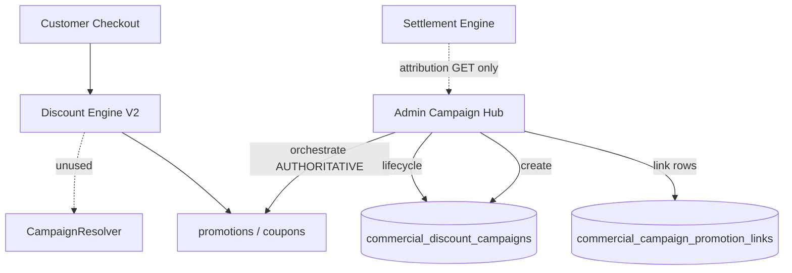

# Campaign Runtime Analysis

**Status:** Analysis only  
**Date:** 2026-07-08  

---

## Investigation 10 — Runtime

### How campaigns are activated

1. Operator creates draft (builder).  
2. Optional **orchestrate**: if AUTHORITATIVE, inserts promotions/coupons and writes `commercial_campaign_promotion_links`.  
3. Lifecycle transitions set `status` on `commercial_discount_campaigns`.  
4. **`running` does not call Discount Engine.** Offers must themselves be active/published.

### How campaigns are loaded

- Admin: `GET /admin/commercial-campaigns` (enabled modes only).  
- Customer checkout: **does not load campaigns**. Loads promotions/coupons as usual (`/promotions/active`, calculate-booking, calculate-cart).

### How they affect the resolver

| Path | Effect |
|------|--------|
| Discount resolve SERVICE / ECOMMERCE | Uses promotions/coupons/vendors — **unaware of campaign status** |
| `CampaignResolver` | Exists in package — **no call sites** in resolve pipeline |
| Policy Center | Not read by campaign engine at resolve time |

**Implication:** Pausing a campaign without deactivating linked offers leaves discounts live.

### How they affect Settlement

`buildSettlementAttribution` returns `{ campaignId, fundingPayload, note }` for admin GET. Settlement Engine **does not** compute campaign spend or adjust commissions from that payload today.

### How they affect Notifications

- `skip` — no-op  
- `link` — store/use existing notification campaign id  
- `create` — stub; Notification Engine not invoked  

### Runtime flow (current)



### Desired runtime (recommended — not implemented)

```
Campaign RUNNING
  → ensure linked offers active & within schedule/budget
Campaign PAUSED / EXPIRED
  → deactivate linked offers OR mark links inactive
Resolve time (optional)
  → attribute winning offer to campaignId for analytics/settlement
Settlement
  → apply fundingPayload per attributed usage
```

### Policy & domain at runtime

- SERVICE book path → SERVICE policy + SERVICE offers.  
- Shop path → ECOMMERCE policy + ECOMMERCE offers.  
- Campaigns should only orchestrate offers within their domain — enforce on create/list (domain column / API filter).
