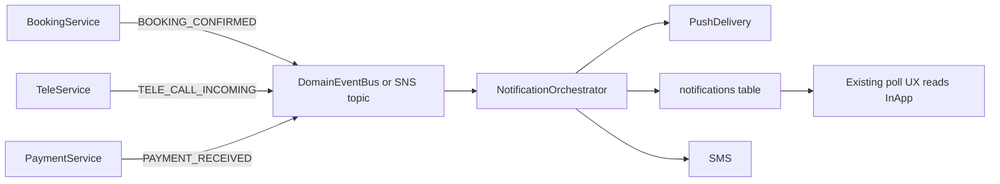
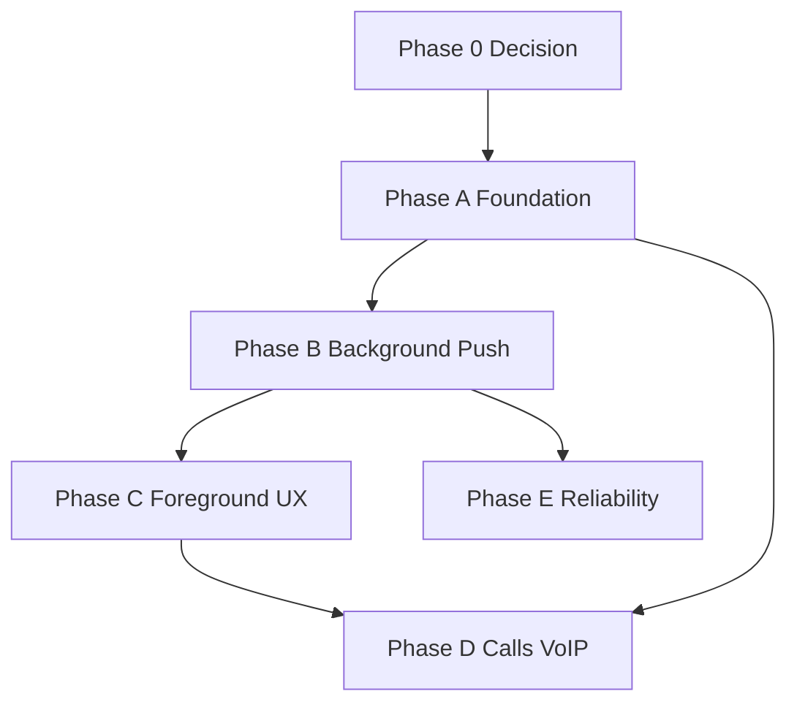

# Capacitor Push Notifications — Phase-wise Implementation Roadmap

Companion to the audit plan: [`capacitor_push_audit`](../../.cursor/plans/capacitor_push_audit_39569831.plan.md).

**Goal:** Hybrid architecture — keep 5s polling for foreground UX; add native push for background/killed; scale via event-driven delivery and deduplication.

**Scope:** Production Capacitor apps (`customer-web`, `vendor-web`). RN Expo apps are a separate track.

---

## How to use this doc

- Work **top to bottom** within each phase; do not skip Phase 0.
- Each subtask has an ID (`P0-1`, `PA-3`, etc.) for tracking in PRs/issues.
- **Gate:** Do not start the next phase until the current phase exit criteria pass.
- **Scalability principle:** One canonical send path, one token table, dedup by `notificationId`, feature flags for rollout.

---

## Core architecture (read before Phase 0)

These sections are **blocking design constraints**. Cursor / implementers must not bypass them.

### Notification event ownership model

**Rule:** Domain services **emit events**; they do **not** send push directly.



| Anti-pattern (forbidden) | Correct pattern |
|--------------------------|-----------------|
| `bookings-enhanced.ts` calls FCM directly | Booking handler publishes `BOOKING_CONFIRMED` → orchestrator |
| Tele endpoint calls `pushNotificationService.sendEventNotification` inline forever | Tele emits `TELE_CALL_INCOMING`; orchestrator chooses channel + payload class |
| Multiple templates scattered per endpoint | Single template registry keyed by `eventType` |

**Migration:** Existing direct callers (`aws-sns-notification-service.sendEventNotification`) are **wrappers** until migrated to orchestrator (Phase E). No new direct-send call sites.

**Subtasks:** P0-7, PE-2, PE-3 (orchestrator owns all outbound channels).

---

### App state coordination layer

Foreground vs background vs killed drives dedup, banner suppression, and poll backoff.

**New module (both apps):** `lib/app-state-coordinator.ts`

```ts
// Tracked state (Capacitor App plugin)
isForeground: boolean
isBackground: boolean
lastActiveAt: number
lastBackgroundAt: number

// Consumers
push-bootstrap.ts      → suppress OS banner when isForeground
useNotificationService → optional poll backoff when isBackground && pushRegistered
notification-dedup.ts → coordinate with push receive
analytics (optional)   → session foreground time
```

| App state | Polling | Push display | Dedup |
|-----------|---------|--------------|-------|
| Foreground | 5s (unchanged) | In-app toast / TeleCallNotification only | push + poll share `notificationId` |
| Background | 60s or paused (Phase E) | OS notification | N/A |
| Killed | stopped | OS notification | N/A |

**Subtasks:** PA-32 (create module), PC-4/PC-6 (wire to push-bootstrap), PE-14 (poll backoff).

Implementation uses `@capacitor/app` → `App.addListener('appStateChange', ...)`.

---

### Silent vs alert payload classification

Not every push should show `title` / `body`. Define per event type **before** Phase B send.

| Event class | FCM/APNs `notification` block | `data` block | Use case |
|-------------|------------------------------|--------------|----------|
| **Alert** | yes (title, body) | yes (`notificationId`, `type`, …) | booking confirmed, vendor accepted |
| **Data-only** | no | yes only | call orchestration, cache invalidation, silent sync |
| **VoIP** | no (PushKit) | yes (CallKit fields) | incoming tele call — Phase D only |

**iOS note:** Data-only messages require `content-available: 1` for background processing; do not rely on alert for call flows.

**Subtasks:** P0-8 (payload class enum in contract), PB-3 (builder respects class), PD-2/PD-4 (data-only for calls).

Example booking (alert):

```json
{
  "notification": { "title": "Booking confirmed", "body": "…" },
  "data": {
    "notificationId": "uuid",
    "eventId": "uuid",
    "type": "booking_confirmed",
    "bookingId": "…",
    "payloadClass": "alert"
  }
}
```

Example call pre-CallKit (data-only, Phase B interim — poll still primary):

```json
{
  "data": {
    "notificationId": "uuid",
    "type": "tele_call_incoming",
    "bookingId": "…",
    "payloadClass": "data"
  }
}
```

---

### Backend idempotency (required before scale)

Frontend dedup is insufficient. Every outbound notification must be idempotent at the server.

**Required identifiers on every event:**

| Field | Purpose |
|-------|---------|
| `notificationId` | UUID for inbox row + client dedup |
| `eventId` | Unique per domain emission (e.g. `booking:{id}:confirmed`) |
| `sourceEntityId` | bookingId, orderId, meetingId |
| `eventType` | template + channel routing |

**Before send:**

1. Check `notification_delivery_log` (or `notification_logs`) for `(eventId, channel)` — if `SENT` or `DELIVERED`, skip.
2. Insert row status `QUEUED` → send → update `SENT` / `FAILED`.
3. Lambda retries, SQS redrives, and SNS retries must not double-send.

**Subtasks:** P0-9, PB-1a (idempotency check in PushDeliveryService), PE-10 (state transitions).

---

### Notification state machine

Persist delivery lifecycle for debugging, analytics, and safe retries.

```text
CREATED → QUEUED → SENT → DELIVERED → OPENED
                ↘ FAILED → (retry?) → EXPIRED
```

| State | Meaning |
|-------|---------|
| CREATED | In-app row inserted |
| QUEUED | Accepted by push worker |
| SENT | Provider accepted (FCM messageId) |
| DELIVERED | Provider confirmed delivery (if available) |
| OPENED | Client `POST /push/opened` |
| FAILED | Provider error; token may invalidate |
| EXPIRED | TTL exceeded (e.g. call ring timeout) |

**Subtasks:** P0-10 (schema), PE-10, PE-11.

---

### Long-term queue architecture (document now, implement Phase E)

Lambda fanout with “10 parallel FCM requests” is acceptable for pilot. At booking/tele/reminder scale, move to:

```text
Domain Event
    ↓
SNS topic (existing) or direct SQS enqueue
    ↓
notification-delivery-queue
    ↓
Notification Processor Worker(s)  ← notification-processor.ts
    ↓
FCM / APNs (batched, rate-limited)
```

Benefits: burst isolation, retry with backoff, idempotency at worker, horizontal scale independent of API Lambda.

**Subtasks:** P0-11 (document target arch), PE-4, PE-17 (rate limiter config).

Do **not** block Phase A–C on full queue migration; **do** block Phase E exit on processor implementation.

---

### Feature flags (expanded)

Global flags (Lambda env / SSM):

| Flag | Phase | Purpose |
|------|-------|---------|
| `PUSH_REGISTER_ENABLED` | A | Allow token upsert |
| `PUSH_SEND_ENABLED` | B | Master send kill switch |
| `PUSH_FOREGROUND_ENABLED` | C | Route foreground push to in-app UI |
| `PUSH_CALLS_ENABLED` | D | VoIP / CallKit / full-screen path |

Per-event flags (SSM JSON or env prefix):

| Flag | Example |
|------|---------|
| `PUSH_EVENT_BOOKING_CONFIRMED` | booking alerts |
| `PUSH_EVENT_VENDOR_ACCEPTED` | vendor accepted |
| `PUSH_EVENT_TELE_CALL_INCOMING` | standard alert/data (not VoIP) |
| `PUSH_EVENT_TELE_VOIP` | Phase D only |

Allows partial rollout, event isolation, fast rollback without redeploy.

**Subtasks:** P0-6 (extend), PB-5 (wire first event flag).

---

### User notification preferences (extensibility)

Not required for Phase A–C. Leave schema hook:

- Existing: `customer_notification_settings` ([`056_customer_enhancement_tables.sql`](../db/migrations/056_customer_enhancement_tables.sql))
- Orchestrator checks preferences **before** send: `{ booking: true, promotions: false, calls: true }`
- Default: all transactional `true`; marketing opt-in separate

**Subtask:** P0-12 (document preference gate in orchestrator interface).

---

### Platform compliance notes

**iOS PushKit:** Use **only** for real-time voice/video calls. Apple rejects VoIP pushes used for booking alerts, reminders, or marketing. Phase D sender must be separate from standard push; audit App Store privacy questionnaire.

**Android 13+:** `POST_NOTIFICATIONS` can be revoked at runtime. Re-check on app resume and before register; if denied, polling remains sole channel.

**Subtasks:** PA-33 (permission revalidation), PD-16 (PushKit compliance doc).

---

## Phase 0 — Architecture decision (blocking)

**Parent todo:** `decide-push-transport`  
**Effort:** 1–2 days | **Native rebuild:** No

| ID | Subtask | Owner | Output |
|----|---------|-------|--------|
| P0-1 | Document comparison: Firebase Admin (`/push/*` + `device_tokens`) vs SNS mobile (`CreatePlatformEndpoint` + platform apps) | Tech lead | ADR in this doc or `docs/adr/push-transport.md` |
| P0-2 | Confirm Firebase project exists (Android + iOS apps in Firebase console) or create them | DevOps | Firebase project IDs documented |
| P0-3 | **Decision:** Pick **one** primary send path for Phase A–C (recommended: **Firebase Admin**) | Tech lead | Signed ADR |
| P0-4 | Mark SNS mobile push as Phase E enhancement (not parallel send in prod) | Tech lead | Deprecation note on `aws-sns-notification-service` dual-send |
| P0-5 | Define push payload contract v1: `{ notificationId, eventId, sourceEntityId, type, title?, body?, payloadClass, bookingId?, deepLink? }` | Backend + Frontend | JSON schema in `packages/shared-types` or backend doc |
| P0-6 | Define global + per-event feature flags (see Feature flags section) | Backend | SSM / Terraform vars |
| P0-7 | Document **Notification Event Ownership Model** — domains emit events, orchestrator sends | Tech lead | ADR § ownership |
| P0-8 | Define `payloadClass`: `alert` \| `data` \| `voip` per event type matrix | Backend | Table in this doc |
| P0-9 | Define **backend idempotency** key: `(eventId, channel)` before send | Backend | ADR + schema |
| P0-10 | Define **notification state machine** states + `notification_delivery_log` columns | Backend | migration draft |
| P0-11 | Document **target queue architecture** (SQS worker); pilot may use inline Lambda send | Architect | Diagram in this doc |
| P0-12 | Document preference gate in orchestrator (read `customer_notification_settings`) | Backend | Interface stub |

**Exit criteria:** ADR approved; payload contract + payloadClass frozen; flags named; ownership model signed off; idempotency key defined.

---

## Phase A — Foundation (device registration, no user-visible change)

**Parent todos:** `phase-a-capacitor-push`, `phase-a-infra`  
**Effort:** 1–2 weeks | **Native rebuild:** Yes (APK/IPA)  
**Scalability:** Registration is O(devices), not O(events); idempotent upsert on `(user_id, device_id)`.

### A1 — Native Capacitor (customer + vendor)

| ID | Subtask | Files / commands |
|----|---------|------------------|
| PA-1 | Add `@capacitor/push-notifications` to `apps/customer-web/package.json` and `apps/vendor-web/package.json` | `package.json` |
| PA-2 | Run `npm install` in both apps | |
| PA-3 | Add Firebase `google-services.json` to `apps/customer-web/android/app/` and `apps/vendor-web/android/app/` (gitignored; document copy path from keystore/secrets repo) | `ANDROID_BUILD.md` update |
| PA-4 | Add `POST_NOTIFICATIONS` to customer `AndroidManifest.xml` (vendor already has it) | `apps/customer-web/android/.../AndroidManifest.xml` |
| PA-5 | Configure Capacitor push in `capacitor.config.json` (presentation options, icon if needed) | both `capacitor.config.json` |
| PA-6 | Run `npx cap sync android` for both apps; verify plugin in `capacitor.settings.gradle` | |
| PA-7 | **iOS customer:** `npx cap add ios`; enable Push Notifications capability in Xcode; upload APNs key to Firebase | new `apps/customer-web/ios/` |
| PA-8 | **iOS vendor:** same as PA-7 if vendor ships iOS | optional |
| PA-9 | Build debug APK/IPA; verify `PushNotifications.register()` returns token on physical device | internal QA |

### A2 — Web bootstrap module (deployed via prod URL — logic in repo)

| ID | Subtask | Files |
|----|---------|-------|
| PA-10 | Create `apps/customer-web/lib/push-bootstrap.ts` | new file |
| PA-11 | Create `apps/vendor-web/lib/push-bootstrap.ts` (mirror customer) | new file |
| PA-12 | Implement `initPushNotifications({ userId, userType, platform })` | |
| PA-13 | Implement `requestPermissions()` with graceful fallback (polling continues) | |
| PA-14 | Implement `registerDeviceToken(token)` → `POST /push/register-device` with body matching [`push-notifications.ts`](../backend/lambda/src/endpoints/push-notifications.ts) | |
| PA-15 | Implement `unregisterDeviceToken()` → `DELETE /push/unregister-device` on logout | |
| PA-16 | Handle `registration` and `registrationError` listeners; log `[Push] Registered` / `[Push] Failed` only | |
| PA-17 | Wire bootstrap after auth in customer shell | `CustomerHomeWrapper.tsx` or `CustomerHomeComplete.tsx` |
| PA-18 | Wire bootstrap after auth in vendor shell | `VendorLandingPage.tsx` or app layout |
| PA-19 | Remove simulated FCM token from `CustomerSettings.tsx`; replace with real registration status read-only | |
| PA-20 | Deploy customer-web + vendor-web to prod (web only) — bootstrap runs in Capacitor after APK with plugin installed | |

### A3 — Backend registration hardening

| ID | Subtask | Files |
|----|---------|-------|
| PA-21 | Audit `POST /push/register-device` upsert logic (user_id, device_id, fcm_token, platform, user_type) | `push-notifications.ts` |
| PA-22 | Add validation: reject empty tokens; normalize platform `android` \| `ios` | |
| PA-23 | Return 200 on duplicate register (idempotent) | |
| PA-24 | Add index if missing: `(user_id, user_type, is_active)` on `device_tokens` | migration if needed |
| PA-25 | Log registration metrics (count per day, no PII in logs) | |

### A4 — Infrastructure (prod)

| ID | Subtask | Files |
|----|---------|-------|
| PA-26 | Set `enable_push_notifications = true` in prod Terraform (if using SNS path later) | `infra/envs/prod/main.tf` |
| PA-27 | Store `FIREBASE_*` credentials in SSM/Secrets Manager; inject into Lambda env | `infra/modules/lambda/main.tf` |
| PA-28 | If Firebase Admin: remove exclude from bundle OR use HTTP v1 with service account from env | `backend/lambda/esbuild.config.js` |
| PA-29 | Add Lambda IAM for secrets read (if not present) | |
| PA-30 | Deploy Lambda with `PUSH_REGISTER_ENABLED=true`, `PUSH_SEND_ENABLED=false` (register only) | |
| PA-31 | Verify tokens appear in `device_tokens` from test devices | SQL / admin query |
| PA-32 | Add `lib/app-state-coordinator.ts` using `@capacitor/app` (`isForeground`, `lastActiveAt`) | both apps |
| PA-33 | On app resume: re-check `POST_NOTIFICATIONS` (Android 13+); re-register if granted | `push-bootstrap.ts` |
| PA-34 | If permission denied: log once, continue polling-only (no crash) | |

**Phase A exit criteria:**
- [ ] Debug APK receives FCM/APNs token
- [ ] Token stored in `device_tokens` for test users
- [ ] Polling still works unchanged
- [ ] No push sent to prod users yet (`PUSH_SEND_ENABLED=false`)

---

## Phase B — Background native delivery

**Parent todo:** `phase-b-dedup`  
**Effort:** ~1 week | **Deploy:** Web + enable `PUSH_SEND_ENABLED` for pilot cohort  
**Scalability:** Push is O(events); no per-user poll when app killed.

### B1 — Backend send path

| ID | Subtask | Files |
|----|---------|-------|
| PB-1 | Create `NotificationOrchestrator` — **only** module allowed to call push/SMS after domain emits event | `services/notification-orchestrator.ts` |
| PB-1a | `PushDeliveryService.send()` checks idempotency `(eventId, channel)` before FCM | push-delivery.ts |
| PB-2 | Load active tokens: `SELECT * FROM device_tokens WHERE user_id = $1 AND user_type = $2 AND is_active = true` | |
| PB-3 | Payload builder respects `payloadClass`: alert vs data-only (see classification table) | |
| PB-4 | Pilot: inline Lambda send with concurrency limit (10); document migration to SQS worker in PE-4 | |
| PB-5 | Enable `PUSH_EVENT_BOOKING_CONFIRMED` only (first per-event flag) | feature flag |
| PB-6 | Add missing templates: `tele_instant_incoming`, `tele_call_connecting` if needed later | template registry |
| PB-7 | Set `PUSH_SEND_ENABLED=true` for internal test allowlist only | |
| PB-8 | Wire orchestrator preference gate (read settings; default allow transactional) | optional stub |

### B2 — Client listeners + dedup

| ID | Subtask | Files |
|----|---------|-------|
| PB-9 | Add `pushNotificationReceived` listener in `push-bootstrap.ts` | |
| PB-10 | Add `pushNotificationActionPerformed` listener (tap → navigate) | |
| PB-11 | Create `notification-dedup.ts`: seen `notificationId` set | both apps |
| PB-12 | Export `markNotificationSeen(id)`; integrate with `app-state-coordinator` | |
| PB-13 | Call `markNotificationSeen` from push listener on receive | |
| PB-14 | Update `useNotificationService.tsx`: skip toast if already seen | customer |
| PB-15 | Update `useVendorNotificationService.tsx` same | vendor |
| PB-16 | Implement `lib/push-navigation.ts` deep link router | |
| PB-17 | On tap: `POST /push/opened` + mark read + navigate | |
| PB-18 | If `payloadClass=data` and foreground: trigger handler without OS banner | |

### B3 — Pilot rollout

| ID | Subtask | Action |
|----|---------|--------|
| PB-19 | Internal test: app backgrounded → receive OS notification | QA matrix |
| PB-20 | Internal test: app killed → receive OS notification | |
| PB-21 | Internal test: foreground → no duplicate toast (dedup) | |
| PB-22 | Verify backend idempotency: duplicate `eventId` does not double-send | API test |
| PB-23 | Expand allowlist to 5% vendors, then 5% customers | staged rollout |
| PB-24 | Monitor send success rate + idempotency skip count | CloudWatch |

**Phase B exit criteria:**
- [ ] Background/killed delivery works for pilot event type
- [ ] No duplicate toast when foreground + poll active
- [ ] Tap opens correct screen

---

## Phase C — Foreground banner unification

**Parent todo:** `phase-c-foreground`  
**Effort:** 2–3 days | **Deploy:** Web only  
**Scalability:** Reduces user annoyance; no extra API load.

| ID | Subtask | Files |
|----|---------|-------|
| PC-1 | Configure Capacitor `presentationOptions: []` or plugin option to suppress system banner when app is foreground | `capacitor.config.json` |
| PC-2 | Route foreground push to existing UI by `data.type`: | `push-bootstrap.ts` |
| PC-2a | `tele_call_incoming` → trigger existing `TeleCallNotification` state (do not duplicate poll path) | `CustomerHomeComplete`, `VendorLandingPage` |
| PC-2b | booking types → sonner toast (same as poll) | |
| PC-3 | Reuse `playNotificationSound` / vendor `audio-alerts.ts` for foreground push | |
| PC-4 | Wire `app-state-coordinator`: suppress OS banner when `isForeground && PUSH_FOREGROUND_ENABLED` | `push-bootstrap.ts` |
| PC-5 | Re-register token on resume if `lastBackgroundAt` > 24h | |
| PC-6 | QA: foreground booking push shows in-app only, not status bar + in-app | |

**Phase C exit criteria:**
- [ ] Foreground: in-app banner only
- [ ] Background: OS notification only
- [ ] Call type still uses `TeleCallNotification` when app open (poll + push deduped)

---

## Phase D — Incoming call infrastructure (VoIP-grade)

**Parent todo:** `phase-d-calls`  
**Effort:** 3–5 weeks | **Native rebuild:** Yes + custom native code  
**Scalability:** Isolated high-priority channel; do not mix with marketing pushes.

> **Constraint:** Do not implement call notifications as normal FCM alert pushes. Android needs full-screen intent; iOS needs PushKit + CallKit.

> **Apple compliance:** PushKit is **only** for real-time voice/video calls. Never route booking alerts, reminders, or marketing through VoIP pushes — App Store rejection risk.

### D1 — Backend

| ID | Subtask | Files |
|----|---------|-------|
| PD-1 | New event type `tele_call_incoming_voip` separate from `tele_call_incoming` | tele endpoints |
| PD-2 | Android: FCM **data-only** high-priority message + `channel_id: calls` | push payload builder |
| PD-3 | iOS: VoIP push certificate/key in Firebase; separate sender from standard push | |
| PD-4 | Payload: `{ bookingId, meetingId, callerName, type: 'voip_incoming' }` | |
| PD-5 | Keep DB `notifications` insert + existing poll path until D verified | |

### D2 — Android native

| ID | Subtask | Files |
|----|---------|-------|
| PD-6 | Create notification channel `calls` — `IMPORTANCE_HIGH`, sound, vibration | native or Capacitor local notifications |
| PD-7 | Full-screen intent activity for incoming call UI | new Activity or plugin |
| PD-8 | `USE_FULL_SCREEN_INTENT` permission (Android 14+ user grant flow) | `AndroidManifest.xml` |
| PD-9 | Accept/Decline actions → deep link `/video/:bookingId` or API reject | |
| PD-10 | Custom Capacitor plugin OR `@capacitor/local-notifications` + native extension for full-screen | evaluate |

### D3 — iOS native

| ID | Subtask | Files |
|----|---------|-------|
| PD-11 | Enable Background Mode: Voice over IP | Xcode |
| PD-12 | Implement PushKit (`PKPushRegistry`) for VoIP token | native Swift |
| PD-13 | Register VoIP token with backend (new column or separate table) | migration |
| PD-14 | Implement CallKit `CXProvider` — report incoming call | native Swift |
| PD-15 | Capacitor bridge: JS receives accept/decline events | plugin |
| PD-16 | App Store review notes + internal doc: PushKit used exclusively for tele calls | compliance |
| PD-16a | Enable `PUSH_CALLS_ENABLED` + `PUSH_EVENT_TELE_VOIP` flags only for beta cohort | |

### D4 — Integration + QA

| ID | Subtask | Action |
|----|---------|--------|
| PD-17 | E2E: vendor calls customer, customer phone locked → full-screen / CallKit | device test |
| PD-18 | E2E: decline from native UI | |
| PD-19 | Keep 5s poll as fallback for 2 releases | |
| PD-20 | Beta cohort before full rollout | |

**Phase D exit criteria:**
- [ ] Incoming call when killed/locked on Android (full-screen) and iOS (CallKit)
- [ ] Accept joins Chime flow
- [ ] Poll fallback still works if push fails

---

## Phase E — Reliability, scale, and ops

**Parent todo:** `phase-e-reliability`  
**Effort:** 1–2 weeks | **Mostly backend/infra**

### E1 — Unify async delivery

| ID | Subtask | Files |
|----|---------|-------|
| PE-1 | Implement real push send in `notification-processor.ts` (remove TODO) | use `device_tokens` not `user_devices` |
| PE-2 | Implement `NotificationOrchestrator` as **sole outbound owner** (see Event Ownership Model) | `services/notification-orchestrator.ts` |
| PE-3 | Migrate bookings, tele, pharmacy handlers to emit events → orchestrator (no direct push) | incremental |
| PE-4 | Wire `notification-processor.ts` to SQS; idempotent worker; rate-limited FCM fanout | replaces inline PB-4 at scale |
| PE-17 | Document max concurrency + DLQ for notification queue | runbook |
| PE-18 | Add `notification_delivery_log` table with state machine columns | migration |

### E2 — Token lifecycle at scale

| ID | Subtask | Files |
|----|---------|-------|
| PE-5 | Migration: add `sns_endpoint_arn`, `push_provider`, `invalidated_at` to `device_tokens` (nullable) | migration SQL |
| PE-6 | On FCM `NotRegistered` / invalid token → set `is_active = false` | push-delivery.ts |
| PE-7 | Nightly job: purge tokens inactive > 90 days | scheduled Lambda |
| PE-8 | If SNS path enabled: persist `endpointArn` on register; reuse on send (stop per-send CreatePlatformEndpoint) | scalability fix |
| PE-9 | Wire `SNS_PLATFORM_APP_*_ARN` to Lambda + IAM `sns:CreatePlatformEndpoint`, `sns:Publish` | Terraform |

### E3 — Observability

| ID | Subtask | Files |
|----|---------|-------|
| PE-10 | Write delivery log with state transitions: CREATED→QUEUED→SENT→DELIVERED→OPENED / FAILED | |
| PE-11 | Client: `POST /push/opened` with `notificationId` → state OPENED | |
| PE-12 | CloudWatch dashboard: registrations/day, send success rate, invalid token rate | |
| PE-13 | Alert if send failure rate > 5% over 15 min | |

### E4 — Reduce poll load (optional, post-push stable)

| ID | Subtask | Notes |
|----|---------|-------|
| PE-14 | When push registered + `isBackground`: increase poll interval to 60s or pause (via app-state-coordinator) | |
| PE-15 | Keep 5s poll when app foreground (live UX) | |
| PE-16 | Document MAU × poll QPS before/after in runbook | |

**Phase E exit criteria:**
- [ ] Processor sends push reliably
- [ ] Invalid tokens deactivated automatically
- [ ] Dashboards live
- [ ] No duplicate send paths in prod

---

## Cross-phase dependencies



---

## Master checklist (copy to GitHub Project)

### Phase 0
- [ ] P0-1 … P0-12

### Phase A
- [ ] PA-1 … PA-34

### Phase B
- [ ] PB-1 … PB-24

### Phase C
- [ ] PC-1 … PC-6

### Phase D
- [ ] PD-1 … PD-20, PD-16a

### Phase E
- [ ] PE-1 … PE-18

---

## Production rollout order (scalability-safe)

1. **Register only** (Phase A, send disabled) — validate token volume
2. **Send one event type** to allowlist (Phase B)
3. **Dedup + foreground UX** (Phase C)
4. **All booking/order events** (Phase B expand)
5. **Reliability + token cleanup** (Phase E)
6. **VoIP calls** (Phase D) — separate release train

## Rollback per phase

| Phase | Rollback |
|-------|----------|
| A | `PUSH_REGISTER_ENABLED=false`; apps ignore register errors |
| B | `PUSH_SEND_ENABLED=false`; polling unchanged |
| C | Revert web deploy only |
| D | Disable VoIP sender; poll + modal fallback |
| E | Revert processor; direct send from handlers still works |

---

## Related docs

- Audit plan: `.cursor/plans/capacitor_push_audit_39569831.plan.md`
- Android UPI (Capacitor pattern reference): `apps/customer-web/ANDROID_UPI_FIX.md`
- iOS Capacitor scaffold: `apps/customer-web/IOS_RAZORPAY_UPI_FIX.md`
- Backend push API: `backend/lambda/src/endpoints/push-notifications.ts`
- Device schema: `db/migrations/041_device_tokens_table.sql`
