# CPO & UX Expert: Pet Care Service Booking Ecosystem — Forensic Analysis

**Role:** Chief Product Officer & Experience Designer  
**Scope:** Holistic code-level tracing of customer web, vendor web, admin web, backend — service booking experience, problem grid, “What’s your pet’s need?”, recommendations, upsell/cross-sell, sponsored items  
**Date:** January 2025  
**Status:** Analysis & recommended target state only — no implementation

---

## Executive Summary

This document is a **forensic, no-skip code trace** of the pet care platform’s service booking ecosystem. It delivers:

1. **Current vs target state** for service booking, discovery, problem-first entry, recommendations, and monetization (sponsored, upsell/cross-sell).
2. **Gaps** that block the target state.
3. **How the target state improves customer experience** on customer web.
4. **Persona-based experience** and AI-research-backed recommendations.
5. **Implementation safety & scope (Part 7):** Will target-state changes break the implementation? Does it change customer web home UI? UI only or integrations? Confidence that flows won’t break; **how vendor and admin fulfill the gaps**; **who does what** (product architecture).

**Bottom line (revised after platform verification):** The platform already has: problem-first entry, discovery, payments, **vendor advanced availability** (multi-slot, multi-location, breaks, holidays), **vendor 10-photo upload** and **Google-powered address**, **admin Active Vendors tab** (to be enhanced with discovery health indicator), and **sponsored/featured delivery** via **Spotlight**, **Highlights**, and **Banners** (Marketing & Promotions in admin → customer home and service dashboards). It still lacks: **service-level recommendation engine** (customers who booked X also booked Y), **“For you”** section on home (previous + recommended services + spotlight/deals), **booking-flow upsell/cross-sell**, and some **customer-web surfacing** (gallery on listing from existing facility_photos, style-selection provider count/earliest slot, “Best for [problem]”). **Admin:** enhance Active Vendors with a **discovery health indicator** per vendor. Implementation should be additive and backward-compatible.

---

## Part 1 — Holistic Code Trace (Ecosystem Map)

### 1.1 Customer Web — Entry & Discovery

| Layer | Component / API | Purpose | Data Used |
|-------|-----------------|---------|-----------|
| **Home** | `CustomerHomeComplete` | Main customer home | `phone`, `quickServiceTiles`, `dashboardConfig`, `hotDeals`, `groomingServices`, `vetServicesData`, `dynamicBanners`, `filteredQuickServices` |
| **Search** | `EnhancedSearchBar` | Universal search | Search API; navigates to service/category |
| **Trending** | `TrendingProblems` | “Trending Now” (e.g. top 3) | `GET /customer/problems/trending` |
| **Problem grid** | `ProblemGridNavigation` | “What’s Your Pet’s Need?” grid + category tabs | `GET /public/problem-grid` (fallback: `ProblemGridSection` local data) |
| **Navigation** | `onNavigate('services_by_problem' \| 'problem_grid' \| 'problem_selected', data)` | From home / dashboard to problem or style | `problemId`, `problemTitle`, `roleId` |
| **Wrapper** | `CustomerHomeWrapper` | Screen router | Maps `problem_selected` → `problem_grid_flow`; `problem_grid` → category-specific grid; `services_by_problem` → `problem_grid_flow` |

**Flow (current):**  
Home → Search / Trending / “What’s Your Pet’s Need?” grid → problem select → `problem_grid_flow` (ProblemGridFlowRouter) → style (at_home / at_center / tele) → provider list → profile → booking steps.

### 1.2 Customer Web — Provider List & Sponsored

| Component | API / Source | Purpose |
|-----------|--------------|---------|
| `UniversalServiceProviderList` | `discover-services`, `GET /ads/sponsored-providers?category=X&limit=2` | Main list + **2 sponsored slots** (impression/click via `SponsoredProviderCard`) |
| `VendorDiscoveryByProblem` | `GET /customer/vendors/by-problem?problemGridId=X&roleId=Y` | Problem-filtered vendors/specialists |
| `HomeServiceProviderListView` | `GET /customer/discover-services?category=X&serviceStyle=at_home` + location | Home service list; sort by relevance/distance/rating/next_slot |
| `UniversalVendorCard` | — | Card: rating, price, nextAvailability, distanceText, photoUrl, promotions |

**Clarification (revised):** Sponsored/featured is already delivered via **Spotlight** (admin Marketing → Spotlight; `GET /marketing/spotlights`), **Banners** (admin Marketing → Banners; customer home `GET /customer/banners?position=home_top`), and **PromotionBanner** with spotlight promotions on service dashboards. Provider list also has `GET /ads/sponsored-providers` (2 slots). Remaining opportunity: surface spotlight/featured in a unified “For you” section on home and optionally on style-selection screen.

### 1.3 Customer Web — Booking Steps (Per Flow)

| Flow | Steps (current) | Key components |
|------|------------------|----------------|
| **Center (e.g. Vet)** | service → [staff] → details (date/time/pet) → payment → confirmation | `UniversalBookingRouter`, `VetBookingRouter`, `StaffSelectionStep` |
| **Tele (Vet)** | mode (instant/scheduled) → provider list → profile → [instant-queue OR details] → payment → confirmation | `TeleConsultationRouter`, `InstantTeleQueue` |
| **Home (universal)** | landing → provider_list → profile → service → pet → time → address → payment → confirmation | `UniversalHomeServiceRouter`, `HomeServiceProviderListView`, `HomeServiceProviderProfile` |
| **Groomer** | dashboard → list → profile → service → datetime → pet → [address] → payment → confirmation | `GroomingBookingRouter`; “Book again” uses `previousGroomer` from `GET /customer/:phone/previous-providers?serviceType=grooming` |
| **Walker / Trainer / Boarding** | Same pattern: dashboard → list → profile → … → payment → confirmation | Respective routers; boarding has check-in/out + optional room |

**No upsell/cross-sell** in any booking flow (e.g. “Add grooming after this vet visit?” or “Customers who booked this also booked…”).

### 1.4 Backend — Discovery & Problem Grid

| Endpoint | File | Purpose |
|----------|------|---------|
| `GET /customer/discover-services` | `service-discovery.ts` | Main discovery; by category/roleId/serviceStyle; enriches with distance, nextAvailableSlot, rating, price, photoUrl, specializations, amenities |
| `GET /customer/vendors/by-problem` | problem-grid / service-discovery | Vendors/specialists for a problem (problemGridId, roleId) |
| `GET /public/problem-grid` | `problem-grid.ts` | All problems for grid (e.g. from `specialization_master` or problem_grid_mappings) |
| `GET /public/problem-grid/:roleId` | `problem-grid.ts` | Problems by role (dashboard grids) |
| `GET /customer/problems/trending` | `problem-grid.ts` | Trending problems (searchCount, trend) |

### 1.5 Backend — Recommendations & Sponsored

| Endpoint | File | Purpose |
|----------|------|---------|
| `GET /products/:id/also-bought` | `recommendations.ts` | **Products only:** co-purchased products |
| `GET /products/:id/bought-together` | `recommendations.ts` | **Products only:** frequently bought together |
| `POST /customer/:id/viewed/:productId` | `recommendations.ts` | Product view tracking |
| `GET /customer/:id/recently-viewed` | `recommendations.ts` | Recently viewed products |
| `GET /products/trending` | `recommendations.ts` | Trending products (sales + views) |
| `GET /customer/:customerId/recommendations` | `recommendations.ts` | **Products only:** personalized by order history categories |
| `GET /ads/sponsored-providers` | `ads-recommendations.ts` | Sponsored vendors (advertising_campaigns); used in provider list |
| `POST /ads/impressions`, `POST /ads/clicks` | `ads-recommendations.ts` | Ad impression/click tracking |
| `GET /providers/top` | `ads-recommendations.ts` | Top providers by score (rating, reviews, verified, experience) |
| `GET /services/similar` | `ads-recommendations.ts` | Similar services by category (no customer context) |

**Gap:** No “customers who booked service X also booked Y” (service affinity). No “recommended services for you” by booking history or pet profile.

### 1.6 Backend — Previous Providers & Booking History

| Endpoint | File | Purpose |
|----------|------|---------|
| `GET /customer/:customerId/previous-providers` | `package-booking.ts` | Previous providers from `customer_provider_history`; optional `serviceType`; used for “Book again” (e.g. GroomingServiceRouter) |
| `GET /customer/:customerId/bookings` | `customer-booking-history.ts` | Full booking history (vendor, service, status, etc.) |

**Usage today:** Previous providers only drive “Book again with [name]” in grooming (and similar patterns where implemented). Not used for a unified “For you” or cross-sell.

### 1.7 Backend — Promotions

| Endpoint / Layer | File | Purpose |
|------------------|------|---------|
| Vendor promotions in discovery | `service-discovery.ts` | Fetches `vendor_promotions`; returns `topPromotion`, `hasActivePromotions` for cards |
| Cart / checkout promotions | `promotions-engine.ts` (customer-web), backend payments | BOGO, bundle, category discount; applied at cart/checkout |
| `PromotionBanner` | Customer web | Banner in some service dashboards |

**Gap:** No promotion surfaces in booking flow (e.g. “Use code X for 10% off next grooming”).

### 1.8 Vendor Web & Admin Web (Relevant to CX)

| Area | Purpose |
|------|---------|
| **Vendor:** Service catalog, availability, profile, promotions | Data quality and availability of slots/photos/price drive discovery and booking success on customer web |
| **Admin:** Catalog, problem grid (specialization_master), promotions, banners, service launch config | Controls what appears on home (tiles, problems, geography) and which promotions/sponsored campaigns exist |

**Gap:** No “discovery health” or “recommendation readiness” view for admins.

---

## Part 2 — Current vs Target State

### 2.1 Service Booking Steps

| Dimension | Current | Target |
|-----------|--------|--------|
| **Problem-first** | Problem → style → list → profile → 5–7 booking steps | Same entry; **merge steps** (e.g. profile + datetime; default pet/address) → **4–5 steps** to pay |
| **Center** | 5–6 steps (service, staff, details, payment, confirmation) | 4 steps (e.g. service+staff when single staff; one “details” step) |
| **Home** | 9 steps (landing → list → profile → service → pet → time → address → payment → confirmation) | 5–6 (e.g. list+profile combined; default address; optional “Book again” 2-step) |
| **Tele** | 5–7 (mode → list → profile → …) | 4 (e.g. instant: problem → pet → queue → pay; scheduled: list with “Next slot” → profile → pay) |

### 2.2 Data Enrichment on Listing & Profile

| Dimension | Current | Target |
|-----------|--------|--------|
| **Photos** | Single photo per vendor/card | **Gallery** (3–5) on card and profile |
| **Distance** | Shown when lat/lng present (at_home/tele; at_center partial) | **Always** when location available; “Get directions” for center/home |
| **Next availability** | nextAvailableSlot from availability tables | **Real-time** next slot (or “Available today”) where possible |
| **Price** | Min price / “From ₹X” | **Range** “₹X – ₹Y” when multiple services; **package** badge when applicable |
| **Trust** | Rating, review count, isVerified | Add **“Used before”**, **response time**, **pet-type** (Dog/Cat) |
| **Problem match** | Filtered list by problem | **“Best for [problem]”** badge; sort by **relevance to problem** |

### 2.3 “What’s Your Pet’s Need?” & Problem Grid

| Dimension | Current | Target |
|-----------|--------|--------|
| **Placement** | Below search; “What’s Your Pet’s Need?” + ProblemGridNavigation (compact) | Same; optional **headline** “What’s your pet’s need?” and sticky tabs on scroll |
| **Trending** | TrendingProblems (top 3); links to services_by_problem | Same; ensure **one path** to style selection with problem context (no dead ends) |
| **Style selection** | 3 cards (at_home, at_center, tele) | **Provider count** and **earliest slot** per style (“8 providers • Earliest today 2 PM”) |
| **After problem** | List filtered by problem | **“Best for [problem]”** on cards; **default sort = relevance to problem** |

### 2.4 Recommendations & Personalization

| Dimension | Current | Target |
|-----------|--------|--------|
| **Products** | Also-bought, bought-together, recently-viewed, trending, personalized by order categories | Keep; add **“Because you booked X”** (service → product) on product pages |
| **Services** | **None** (no service-level recommendation engine) | **“Customers who booked X also booked Y”**; **“Recommended for you”** by pet + booking history |
| **Home** | Hot Deals (products), featured grooming/vet (static), quick tiles | **“For you”** section: previous providers + **recommended services** + sponsored + hot deals |
| **Booking flow** | No upsell/cross-sell | **Post-service or pre-payment:** “Add grooming package?” / “Book a walk next?” with one tap |

### 2.5 Sponsored & Monetization

| Dimension | Current | Target |
|-----------|--------|--------|
| **Sponsored** | 2 slots in **provider list only** (UniversalServiceProviderList); impression/click tracked | **Home:** “Featured” strip (sponsored + top-rated); **Style selection:** 1 sponsored card per style; **List:** keep 2 slots; **Profile:** optional “Similar sponsored” |
| **Upsell** | None in booking | **Post-booking:** “Book a follow-up?” / “Add a package?”; **Pre-payment:** “Customers often add X” |
| **Cross-sell** | None | **By persona:** e.g. after vet → “Book grooming” / “Book walker”; by pet type and history |

---

## Part 3 — Gaps to Fulfil Target State

**See Part 8 for corrected current state (what already exists), revised gaps, and a better approach.** The subsections below list gaps; Part 8 corrects vendor/admin items that are already implemented (10 photos, Google address, advanced availability, Active Vendors tab, Spotlight/Banners) and narrows the real gaps.

### 3.1 Data & Backend

| Gap | Detail | Owner |
|-----|--------|--------|
| **Service recommendation engine** | No API “customers who booked A also booked B” or “recommended services for customer/pet”; need booking affinity model and/or rules (e.g. vet → grooming, dog → walker) | Backend |
| **Persona/segment** | No explicit segment (e.g. dog_owner, first_time, frequent_grooming) or “For you” API combining previous providers + recommended services + sponsored | Backend + customer web |
| **Real-time next slot** | nextAvailableSlot is from static availability; no “next free slot today” from live slots minus bookings | Backend |
| **Gallery** | No vendor gallery endpoint; only single photo in discovery | Backend + vendor upload |
| **Booking history for recommendations** | `customer_provider_history` and bookings exist but are not consumed by any recommendation API | Backend |

### 3.2 Customer Web

| Gap | Detail |
|-----|--------|
| **“For you” section** | Home has no single section that combines previous providers, recommended services, sponsored, and hot deals with clear labels (“Book again”, “Recommended for you”, “Featured”, “Deals”) |
| **Sponsored on home** | No sponsored/featured strip on home or on style-selection screen |
| **Upsell in flow** | No post-service or pre-payment upsell/cross-sell in any booking router |
| **Problem → style** | Style selection does not show provider count or earliest slot (APIs exist in some paths but not consistently used) |
| **“Best for [problem]”** | Listing after problem selection does not show badge or relevance sort |

### 3.3 Vendor & Admin

| Gap | Detail |
|-----|--------|
| **Gallery upload** | Vendors cannot upload multiple photos; limits enrichment on cards/profile |
| **Discovery readiness** | No admin view of “discovery health” (e.g. missing photo, address, availability) per vendor |
| **Sponsored campaigns** | advertising_campaigns exist and are used in list; no placement on home or style selection without front-end changes |

---

## Part 4 — How Target State Delivers Better Customer Experience

### 4.1 Fewer Steps, Less Friction

- **Merged steps** (e.g. profile + datetime, default pet/address) and **“Book again”** (e.g. 2 steps) reduce taps and cognitive load.
- **Style selection** with “Earliest today 2 PM” and provider count sets expectations and reduces back-and-forth.
- **Real-time next slot** and “Available today” reduce “no slots” disappointment.

### 4.2 Richer, Trust-Building Data

- **Gallery, distance, “Used before”, response time, pet-type** improve perceived relevance and trust.
- **“Best for [problem]”** and relevance sort make it clear the list is tailored to the need.
- **Price range and package badge** help decision-making without opening every profile.

### 4.3 Personalization & Relevance

- **“For you”** on home (previous + recommended + sponsored + deals) makes the app feel tailored.
- **Recommended services** (by booking history and pet) and **“Customers who booked X also booked Y”** reduce search and support discovery of adjacent services (e.g. vet → grooming).
- **Persona-based** entry (e.g. “Dog owner” vs “First-time pet parent”) can drive different defaults and prompts later.

### 4.4 Clear Monetization Without Hurting CX

- **Sponsored** in “Featured” and style selection is clearly labeled; relevance (category/style) keeps it useful.
- **Upsell/cross-sell** after booking or before payment (“Add grooming?”) is contextual and one-tap, not intrusive.

---

## Part 5 — Persona-Based Experience (AI Research–Aligned)

### 5.1 Personas (Examples)

| Persona | Traits | Current experience | Target experience |
|---------|--------|--------------------|-------------------|
| **New pet parent** | First dog/cat; unsure what to book | Generic grid and list; may not know “vaccination” vs “checkup” | **Onboarding:** “What’s your pet?” → suggested first services (vet checkup, vaccination reminder); **Problem grid** with short hints; **“First visit?”** checklist |
| **Dog owner (active)** | Regular walker, occasional grooming, vet when needed | Discovers each service separately; no link between them | **“For you”:** “Book again” walker + “Recommended” grooming; **After vet:** “Book a grooming?”; **Packages:** walk + groom bundle |
| **Cat owner** | Vet-focused; grooming less frequent | Same as generic | **Home:** vet and health prominent; **After vet:** “Lab test?” / “Pharmacy?”; fewer walker prompts |
| **Multi-pet** | 2+ pets; frequent booker | Repeats pet selection every time | **Default last-used pet;** “Same for all” when multiple pets; **“Book for [Pet 2]”** shortcut after first booking |
| **Budget-conscious** | Looks for deals, packages | Hot Deals (products); some vendor promotions on cards | **“Deals for you”** (services + products); **Package badge** on list; **Promo at checkout** (“Use X for 10% off”) |
| **Returning (same provider)** | Prefers same groomer/vet | “Book again” only in grooming (previous-providers) | **All categories:** “Book again with [name]” on dashboard and in list; **One-tap rebook** (date/time + pay) |

### 5.2 Research-Backed Principles Applied

- **Progressive disclosure:** Problem → style → list → profile → book; avoid long forms; optional steps (notes, special requests) collapsed.
- **Defaults and shortcuts:** Last pet, last address, last provider, “Book again” to cut steps.
- **Social proof:** “X booked this week”, “Best for [problem]”, “Used before” to build trust.
- **Recognition over recall:** “For you”, “Recommended for you”, “Trending” so the app feels aware of context.
- **Clear value:** Price range, next slot, distance so users can compare without opening every card.

---

## Part 6 — Summary: Current vs Target vs Gaps

### 6.1 Current State (One Paragraph)

Customer home has universal search, “What’s Your Pet’s Need?” problem grid, and TrendingProblems; service dashboards have specialization grids that back-link to the same problem → style → list → booking flow. Discovery is rich (distance, next slot, rating, price, promotions on cards) but at_center distanceText and gallery are partial or missing. Booking is 5–11 steps depending on style; home services are 9 steps. Sponsored providers appear only in one list view (2 slots); recommendations and personalization are **product-only** (also-bought, bought-together, trending, personalized by order categories). Previous providers power “Book again” in grooming only. There is no service-level recommendation engine, no “For you” on home, no upsell/cross-sell in booking flow, and no sponsored placement on home or style selection.

### 6.2 Target State (One Paragraph)

**Steps:** Problem-first and service-first both lead to **4–5 steps** to payment where possible (merged steps, default pet/address, “Book again” shortcut). **Data:** Gallery, distance, real-time next slot, “Best for [problem]”, “Used before”, price range, package badge on list and profile. **Home:** A **“For you”** section combines previous providers (“Book again”), **recommended services** (from booking affinity + pet), **sponsored/featured**, and hot deals. **Style selection** shows provider count and earliest slot per style. **Recommendations:** **Service-level** “customers who booked X also booked Y” and “Recommended for you” by booking history and pet; product recommendations stay; optional “Because you booked X” on product pages. **Monetization:** Sponsored on home and style selection (clearly labeled); **upsell/cross-sell** after booking or before payment (“Add grooming?” / “Book a walk?”) with one tap. **Personas:** New pet parent, dog owner, cat owner, multi-pet, budget-conscious, returning—each gets tailored defaults and prompts.

### 6.3 Gaps (Prioritised)

1. **Service recommendation engine** (booking affinity + “recommended for you” API).
2. **“For you” section** on home (previous + recommended services + sponsored + deals).
3. **Sponsored** on home and style selection.
4. **Upsell/cross-sell** in booking flow (post-booking or pre-payment).
5. **Style selection** enrichment (provider count, earliest slot).
6. **Listing enrichment** (“Best for [problem]”, relevance sort, gallery).
7. **Step reduction** (merge steps, default pet/address, real-time slot).
8. **Gallery** and **real-time next slot** (backend + vendor data).
9. **Admin discovery health** and **persona/segment** support (optional).

---

## Part 7 — Implementation Safety, Scope & Who-Does-What

*This section answers: Will target-state changes break the implementation? Does it change customer web home UI? Is it only UI or also integrations? How confident are we that flows won’t break? How do vendor and admin fulfill the gaps? Who does what in the product architecture?*

### 7.1 Important Clarification

**This document is analysis and recommendations only.** No code has been changed. “These changes” below means **if you implement** the target state. Whether implementation breaks anything depends **entirely on how** you implement (additive vs replacing contracts).

### 7.2 Will Implementing Target State Break the Implementation?

| Approach | Will it break? |
|----------|----------------|
| **Additive** (new APIs, new UI sections, new optional fields; existing APIs and screens unchanged) | **No.** Current flows keep working. New “For you” API is optional; if it fails, home can fall back to current behaviour. New sections on home are additions; existing search, problem grid, banners, quick tiles, grooming/vet/hot deals stay. |
| **Replacing** (changing existing API response shapes, removing steps from booking routers, changing navigation contracts) | **Yes, risk.** Changing `/customer/discover-services` response shape can break existing provider lists. Removing a step from a booking router without defaulting data can break completion. |

**Recommendation:** Implement in an **additive, backward-compatible** way: new endpoints (e.g. `GET /customer/for-you`), new optional fields on existing responses (e.g. `recommendedServices: []` when unavailable), and new UI sections that degrade gracefully when APIs fail or return empty.

### 7.3 Does It Change the Customer Web Home Page UI?

**Yes.** Target state explicitly adds and adjusts:

| Current home sections (unchanged in structure) | Target-state changes on home |
|-----------------------------------------------|-----------------------------|
| Header, search bar, trending, “What’s Your Pet’s Need?” grid, banners, quick service tiles, grooming/vet strips, hot deals, etc. | **New:** “For you” section (Book again + Recommended for you + Featured/sponsored + Deals). **Optional:** “Featured” strip (sponsored + top-rated). No removal of existing sections. |

So: **existing home sections stay**; target state **adds** the “For you” block (and optionally a featured strip). Layout may shift (e.g. “For you” above or below banners/tiles) but current components are not replaced—they are extended.

### 7.4 Is It Only UI, or Does It Change Integrations Too?

**Both.**

| Layer | What changes |
|-------|----------------|
| **UI (customer web)** | Home: new “For you” section, optional sponsored strip. Style selection: provider count + earliest slot. List: “Best for [problem]” badge, relevance sort. Booking flows: optional upsell/cross-sell step (post-service or pre-payment). |
| **Integrations (APIs / backend)** | **New:** “For you” API (or equivalent) combining previous providers + recommended services + sponsored + deals. **New:** Service recommendation APIs (e.g. “customers who booked X also booked Y”, “recommended for you”). **New or extended:** Real-time next slot, vendor gallery. **Existing:** `discover-services`, `problem-grid`, `ads/sponsored-providers`, `previous-providers`, product recommendations—remain; new fields or new endpoints are additive so current callers keep working. |

So: **UI and integrations both change**. Integrations are new or additive; existing API contracts are not assumed to be broken if you follow the additive approach above.

### 7.5 How Confident Are We That Working Flows Won’t Break?

| Condition | Confidence |
|-----------|------------|
| New APIs are **additive** (new routes, optional response fields) | **High.** Existing flows do not call them; they only benefit new UI. |
| New UI is **additive** (new sections, optional steps) with fallbacks | **High.** If “For you” fails or is empty, show current behaviour (e.g. hide section or show static tiles). |
| **No** change to existing API response shapes for current consumers | **High.** Discovery, problem grid, booking creation, payments stay as-is. |
| Step reduction in booking (merge steps, defaults) | **Medium.** Must preserve all data currently collected (pet, address, time, etc.) and only merge screens or pre-fill; otherwise risk broken bookings. |
| Changing existing endpoints’ contracts or removing steps without defaults | **Low.** Would require coordinated backend + all clients; regression risk. |

**Bottom line:** With **additive backend and additive UI with fallbacks**, existing flows can stay intact and the target state can be layered on. Confidence is **high** for “won’t break” **if** implementation follows that strategy.

### 7.6 How Are the Gaps Fulfilled in Terms of Vendor and Admin?

The following table spells out **who does what** to fulfill each gap—customer web, backend, **vendor web**, and **admin web**.

| Gap | Backend | Customer web | Vendor web | Admin web |
|-----|---------|--------------|------------|-----------|
| **Service recommendation engine** | New APIs: booking affinity, “recommended for you” (by customer/pet + history). | Call new APIs; show “Recommended for you”, “Customers who booked X also booked Y”. | No change. | No change (optional: config for recommendation rules). |
| **“For you” section** | New “For you” API (or compose from existing: previous-providers, recommendations, sponsored, deals). | New home section: Book again, Recommended, Featured, Deals. | No change. | No change. |
| **Sponsored on home / style** | Existing `ads/sponsored-providers`; optional new placement params. | New placements: home “Featured” strip, style-selection sponsored card. | No change. | Configure campaigns (existing); optional placement targeting. |
| **Upsell in booking flow** | Optional: “suggested add-ons” API by booking context. | New step or modal: “Add grooming?” / “Book a walk?” with one-tap. | No change. | No change. |
| **Style selection: provider count + earliest slot** | Discovery or new lightweight endpoint returning counts and next slot per style. | Style selection screen: show “8 providers • Earliest today 2 PM” per card. | No change. | No change. |
| **“Best for [problem]” + relevance sort** | Discovery (or problem-grid) returns `bestForProblemIds` and relevance score; support sort=relevance. | List: badge “Best for [problem]”; sort dropdown includes “Relevance to need”. | No change. | No change. |
| **Gallery** | New vendor gallery endpoint (list of photo URLs); discovery includes `galleryUrls[]` or link. | Cards and profile: show 3–5 photos (gallery). | **Gallery upload:** Multi-photo upload in profile/facility; stored and exposed via backend. | No change (optional: moderate gallery). |
| **Real-time next slot** | Compute next free slot from availability − bookings (per vendor/service). | Show “Available today 2 PM” or “Next: tomorrow 10 AM”. | No change (availability already managed). | No change. |
| **Discovery readiness** | Optional: endpoint “discovery health” (missing photo, address, slots per vendor). | No change. | No change. | **Discovery health view:** List vendors with missing photo, address, or availability; nudge completeness. |
| **Sponsored campaigns** | Already exist; optional placement/segment params. | Use in new placements (home, style). | No change. | Configure campaigns and targeting (existing + placement). |

So: **vendor** is primarily responsible for **gallery upload** (and profile/facility data quality). **Admin** is responsible for **discovery health** (and optionally recommendation/sponsored config). Customer web and backend do the rest.

### 7.7 Product Architecture: Who Does What (Vendor vs Admin)

| Actor | Scope | Responsibilities relevant to service booking & target state |
|-------|--------|----------------------------------------------------------------|
| **Customer web** | End customer (pet parent). | Search, problem grid, discovery list, provider profile, booking flows, cart, payments, “Book again”, orders. **Target:** “For you”, sponsored strip, style enrichment, listing enrichment, upsell in flow. |
| **Vendor web** | Service providers (vet, groomer, walker, etc.). | Onboarding, profile, staff, **service catalog**, **availability/slots**, bookings, earnings, promotions. **Target:** **Gallery upload** (multi-photo) so customer web can show galleries; rest unchanged. |
| **Admin web** | Platform operator. | Vendor onboarding review, catalog/config, **problem grid** (e.g. specializations), **banners**, **service launch config** (geo), **promotions**, **sponsored campaigns**, analytics, governance. **Target:** **Discovery health** view; optional recommendation/sponsored placement config. |
| **Backend (Lambda + RDS)** | APIs, data, rules. | Auth, customer/vendor/profile, discovery, problem grid, bookings, payments, recommendations (products today; **services** in target), ads/sponsored, previous-providers. **Target:** New “For you” and service-recommendation APIs; optional real-time slot and gallery. |

So: **Vendors** own catalog, availability, and profile (including gallery). **Admin** owns platform config, problem grid, banners, launch config, and sponsored campaigns. **Customer web** consumes all of that and adds the target-state UX; **backend** adds the new APIs and data needed for that UX.

### 7.8 Do I Feel the Same After This?

**Yes.** The analysis and target state still stand:

- **Current vs target** and **gaps** are accurate.
- **Implementation should be additive and phased** so existing flows do not break.
- **Customer web home** will gain a “For you” section and optionally a featured strip; existing sections remain.
- **Both UI and integrations** change; integrations are new or additive.
- **Vendor** fulfills gaps mainly via **gallery upload**; **admin** via **discovery health** (and optional config). The rest is backend + customer web.

Confidence that **working flows won’t break** is **high** provided you: (1) add new APIs and optional fields only, (2) add new UI with fallbacks, and (3) avoid changing or removing existing API contracts and booking steps without defaults.

---

## Part 8 — Corrected Current State, Where We Stand & Better Approach

*Incorporates platform verification: vendor advanced availability (multi-slot, multi-location, breaks, holidays), vendor 10-photo upload and Google address, admin Active Vendors tab, and Spotlight/Highlights/Banners under Marketing & Promotions already delivering on customer web. Revises gaps and proposes a better, phased approach.*

### 8.1 What Already Exists (Verified in Code)

| Area | What exists | Where (code/config) |
|------|-------------|---------------------|
| **Vendor advanced availability** | Multi-slot, multi-location, breaks, holidays | `AdvancedAvailabilityManager.tsx`; `AdvancedScheduleManager.tsx`; `/vendor/:id/breaks`, `/vendor/:id/holidays` |
| **Vendor profile: 10 photos** | Up to 10 photos per facility | `FacilityManagement.tsx` — `MAX_PHOTOS = 10`; `/vendor/facility/:vendorId/upload-photos`; backend `facility_photos` in metadata; profile endpoint returns presigned URLs |
| **Vendor address: Google-powered** | No lat/lng issues; Places autocomplete | `EnhancedAddressAutocomplete.tsx`; used in CenterProfileManager, AdvancedAvailabilityManager; Google Places API |
| **Admin Active Vendors** | List of active vendors with filters (category, tier, performance, city, vendor type) | `ActiveVendorsTab.tsx`; `GET /admin/vendors/active`. **Enhancement:** Add discovery health indicator per vendor (photo count, address set, availability set; green/amber/red or score). |
| **Admin Spotlight + Banners** | Spotlight (featured vendors), Banners (home/dashboards), Promotions | Marketing & Promotions page: Spotlight (`/marketing/spotlights`), Banners (`/admin/banners`). Customer web: `/customer/banners?position=home_top` on home; `PromotionBanner.tsx` (spotlight) on service dashboards. |

So: **vendor** already has advanced schedule, 10 photos, and Google address. **Admin** already has Active Vendors and Spotlight/Banners/Promotions that deliver on customer web. The earlier analysis overstated gaps in these areas.

### 8.2 Revised Gaps (Net-New or Enhancement Only)

| Gap | Type | Owner |
|-----|------|-------|
| **Service recommendation engine** | Net-new | Backend: "customers who booked X also booked Y", "recommended for you" by booking history/pet |
| **"For you" section on home** | Net-new (UI) + compose existing APIs | Customer web: section combining previous providers ("Book again"), spotlight/featured (existing Spotlight/Banners), hot deals (existing). Backend: optional single "For you" API or customer web composes existing APIs. |
| **Discovery health indicator in Active Vendors** | Enhancement | Admin web: add column or badge per vendor in Active Vendors list (photo count, address set, availability set; green/amber/red). Backend: optional health flags in active-vendors response. |
| **Gallery on customer listing/profile** | Enhancement (surfacing) | Backend: discovery/profile return `photos[]` (facility_photos) where available; customer web: show 3–5 photos on card and profile. |
| **Style selection: provider count + earliest slot** | Enhancement | Backend: discovery or lightweight endpoint returns counts and next slot per style; customer web: show "8 providers • Earliest today 2 PM" on style cards. |
| **"Best for [problem]" + relevance sort** | Enhancement | Backend: return bestForProblemIds/relevance; customer web: badge and sort option. |
| **Upsell/cross-sell in booking flow** | Net-new | Backend: optional "suggested add-ons" API; customer web: post-service or pre-payment step/modal "Add grooming?" / "Book a walk?" with one-tap. |
| **Real-time next slot** | Optional | Backend: compute next free slot from availability − bookings; customer web: show "Available today 2 PM". |

**Removed from gaps (already exist):** Vendor gallery upload (10 photos), vendor address (Google), vendor advanced availability, admin discovery-health view (Active Vendors tab exists; only add health indicator per vendor), sponsored/featured placement (Spotlight + Banners already deliver on home and dashboards).

### 8.3 Where We Stand

| Dimension | Current state | Target state | Action |
|-----------|----------------|--------------|--------|
| **Vendor availability** | Advanced (multi-slot, multi-location, breaks, holidays) | Same | None |
| **Vendor photos** | 10 photos (facility); backend returns in profile | Gallery on customer list/profile | Return `photos[]` in discovery where available; customer web shows 3–5 on card/profile |
| **Vendor address** | Google-powered; no lat/lng issues | Same | None |
| **Admin Active Vendors** | List with filters | Same + discovery health indicator per vendor | Add health column/badge (photo, address, availability) |
| **Admin Spotlight/Banners** | Configured; delivered on customer home and service dashboards | Same; optionally unified in "For you" | Use existing data in "For you" section |
| **Service recommendations** | None (product-only today) | "Customers who booked X also booked Y"; "Recommended for you" | New backend APIs; customer web surfaces |
| **Home "For you"** | No single section | Book again + Recommended + Featured/spotlight + Deals | New section; compose previous-providers + spotlights + deals (+ recommended when API exists) |
| **Upsell in booking** | None | Post-booking or pre-payment add-on | New step/modal; optional backend |

### 8.4 Implementation Phases (Aligned to Original UI/UX Goals — Safe to Implement)

*Phases are ordered to deliver the original goals: **cut down steps**, **consolidate**, **enrichment** (photos, km, next availability), plus recommendations and upsell — all additive and backward-compatible so existing flows won’t break.*

---

**Phase 1 — Step Reduction & Consolidation (Customer Web; No Backend Changes)**

*Goal: Fewer taps to complete a booking by merging screens and using defaults.*

| Improvement | Current | Target | How (safe) |
|-------------|---------|--------|------------|
| **Merge steps** | Separate screens for profile, datetime, pet, address | Single “Details” step: pet + date/time + address (when needed) in one screen | Combine existing step components into one step; same data collected; no API change |
| **Default pet** | User selects pet every time | Pre-select last-used pet; allow change | Use existing pet list + last booking’s pet; optional `lastUsedPetId` in session |
| **Default address** | User enters address every time (home services) | Pre-fill last-used address; allow change | Use existing address from profile/last booking; optional `defaultAddressId` |
| **“Book again” shortcut** | Only in grooming | **All categories** (vet, groomer, walker, trainer, boarding): “Book again with [name]” on dashboard and in list | Extend `previous-providers` usage to all service routers; no new API |
| **Center: service+staff** | Service → Staff → Details | When single staff: combine service + staff into one step | Conditionally skip staff step when only one staff; same data collected |
| **Home: list+profile** | Landing → list → profile → service → … | Optionally: list with inline “View & Book” that opens profile + service in one flow | UX change only; same APIs; reduce navigation depth |

*Safety:* All changes are UI-only: merge screens, pre-fill fields, skip optional steps. Same data is collected and sent to existing booking APIs. No backend contract changes.

---

**Phase 2 — Data Enrichment on Listing & Profile (Customer Web; Optional Backend Extensions)**

*Goal: Richer discovery with photos, distance, next availability, price range, “Best for [problem]”.*

| Improvement | Current | Target | How (safe) |
|-------------|---------|--------|------------|
| **Gallery on card/profile** | Single photo per vendor | 3–5 photos on card and profile | Discovery/profile already return `facility_photos` for profile; extend discovery list response with optional `photos[]`; customer web renders gallery when present; fallback to single photo |
| **Distance** | Shown when lat/lng present (partial for center) | Always when location available; “Get directions” for center/home | Use existing distance logic; ensure center address has lat/lng (Google address) |
| **Next availability** | nextAvailableSlot from availability | “Earliest today 2 PM” or “Available tomorrow” | Use existing `nextAvailableSlot`; optional backend: real-time next slot from availability − bookings |
| **Price range** | “From ₹X” | “₹X – ₹Y” when multiple services; package badge | Backend: return `priceMin`, `priceMax`; customer web: show range + badge |
| **“Best for [problem]”** | Filtered list by problem | Badge on card; default sort = relevance to problem | Backend: return `bestForProblemIds` or relevance score when problem context; customer web: badge + sort option |
| **Style selection** | 3 cards (at_home, at_center, tele) | “8 providers • Earliest today 2 PM” per style | Backend: lightweight endpoint or extend discovery with counts + next slot per style; customer web: show on style cards |

*Safety:* Backend changes are additive (new optional fields, new optional endpoints). Customer web uses new fields when present and falls back to current behaviour when absent. No removal of existing fields.

---

**Phase 3 — Home “For You” & Upsell (Customer Web; Compose Existing APIs)**

*Goal: Personalized home section and contextual upsell without new backend.*

| Improvement | Current | Target | How (safe) |
|-------------|---------|--------|------------|
| **“For you” section** | No unified section | Book again + Featured (Spotlight/Banners) + Deals | Customer web composes existing: `previous-providers`, `/customer/banners`, Spotlight, `products?featured`; new UI section only |
| **Upsell in booking** | None | Post-booking or pre-payment: “Add grooming?” / “Book a walk?” with one-tap | New modal or step **after** payment confirmation (or before payment as optional step); uses existing navigation to other service; no new API |
| **Admin: discovery health** | Active Vendors list only | Health indicator per vendor (photo count, address set, availability set; green/amber/red) | Extend `GET /admin/vendors/active` response with optional health flags; admin web: add column/badge |

*Safety:* “For you” uses only existing APIs. Upsell is an extra modal/step that navigates to existing flows. Admin health is additive response fields. No breaking changes.

---

**Phase 4 — Recommendations & Upsell Backend (Optional; New APIs)**

*Goal: Service-level recommendations and smarter upsell.*

| Improvement | Current | Target | How (safe) |
|-------------|---------|--------|------------|
| **Service recommendation** | None (product-only) | “Customers who booked X also booked Y”; “Recommended for you” | New backend APIs: booking affinity, “recommended for you” by pet + history; customer web: “Recommended for you” in “For you” section |
| **Suggested add-ons** | None | “Customers often add X” based on booking context | New optional backend: “suggested add-ons” API by service/category; customer web: use in upsell modal |

*Safety:* New APIs only; existing flows unchanged. Customer web calls new APIs when available and hides “Recommended for you” when empty or on failure.

---

**Summary — Phases Aligned to Original Goals**

| Original goal | Phase | What’s delivered |
|---------------|-------|------------------|
| **Cut down steps** | 1 | Merge steps, default pet/address, “Book again” all categories, skip staff when single |
| **Consolidate** | 1 | Single “Details” step; list+profile combined where sensible |
| **Enrichment (photos, km, next availability)** | 2 | Gallery, distance, next slot, price range, “Best for [problem]”, style enrichment |
| **Ecosystem play** | 3, 4 | “For you” section, upsell/cross-sell, service recommendations |
| **Safe to implement** | 1–4 | Additive only; no removal of steps or API contracts; fallbacks for new UI |

---

### 8.5 REVISED Phase 1 — Step Reduction + Package Summary (Your Insight: 50% Goal)

*Incorporates your insight: "Advising packages at booking summary page" to cut steps by 50% overall. Summary BEFORE payment converts users to packages → repeat bookings become 2 steps (date/time only; zero-payment when subscription/unlimited active).*

**Vendor packages (already implemented):** Session packages, combo packages, subscriptions, memberships, unlimited plans (VendorCustomServiceCreationEnhanced; PackageTrackingDashboard; PackageAwareBookingFlow).

**Phase 1 — Revised:**

| Improvement | Current | Target | How (safe) |
|-------------|---------|--------|------------|
| **Merge Details** | Separate: service, staff, pet, date, time, address | Single "Details" step: pet (default) + date + time + address (default) | Combine into one screen; same data; no API change |
| **Default pet/address** | Select every time | Pre-select last-used pet; pre-fill address | Use existing pet list + last booking; session storage |
| **Summary with package advice** | No summary; direct to payment | **New Summary screen** BEFORE payment: show booking + recommended package with savings; "Switch to Package" or "Continue" | New screen; calls `/vendor/:vendorId/packages?category=X`; if switch: replace booking with package purchase (same pet, date, time for first session) |
| **"Book again" all categories** | Only grooming | All (vet, groomer, walker, trainer, boarding) | Extend previous-providers usage |
| **Skip staff when single** | Always show staff step | Skip when one staff | Conditional; no API change |
| **Repeat bookings (with package)** | 5–9 steps every time | **2 steps:** date/time → done (zero-payment when subscription/unlimited active) | PackageAwareBookingFlow checks active subscription; pre-fills pet/address |

**Step count:**  
- **First booking:** 5 for center (service, details, summary, payment, confirmation); 7 for home  
- **Repeat (with package):** **2** (date/time → done)  
- **Overall (50% users buy packages, 4 repeat bookings per package):** (7 first + 2 × 4 repeats) / 5 = **3 steps average** = **67% reduction** from 9 steps

**Why Summary BEFORE payment (your insight) is better:**  
- **Timing:** Customer has decided to book; commitment is high; ROI is clear ("₹250/session vs ₹499 today").  
- **One-tap switch:** Replace single booking with package; same pet, date, time for first session; no re-entry.  
- **Post-payment upsell:** Too late; commitment gone; feels like "another thing"; lower conversion.

**Safety:** Summary is additive; customer can skip ("Continue with single"). If they switch, same data is reused. No backend contract changes; uses existing package APIs.

**Result:** This approach achieves your **50% step-reduction goal** for returning users and converts more first-time bookers to packages.

---

## Appendix — Related Documents & Key File Reference

**Target State UI & Screen Specification:** See `docs/TARGET_STATE_UI_SCREEN_SPECIFICATION.md` for step-by-step target state, UI theme, service booking steps (what's in each step), navigation post Phase 4, and information on each screen.

**Post Phase 1 flow diagrams (Mermaid):** See **Section 10** of `docs/TARGET_STATE_UI_SCREEN_SPECIFICATION.md` for step-by-step Mermaid diagrams for **Home**, **Center**, **Tele**, and **Problem-based discovery** — each flow starting from customer login and navigating to confirmation (and repeat-with-package path). **Entry point:** **Normal flows** (Home service, Center, Tele) start from the **service dashboard**; **only problem-based discovery** starts from the **home landing page**. Below is the combined overview.

```mermaid
flowchart LR
    subgraph start
        Login[Customer Login]
        Login --> Home[Home - Problem-based only]
        Login --> Dash[Service Dashboard - Normal flows]
    end
    subgraph problem_path["Problem-based discovery"]
        Home --> Problem[Problem / Search / Trending]
        Problem --> Style[Style: Home / Center / Tele]
        Style --> List[Provider List]
    end
    subgraph normal_path["Normal flow - from dashboard"]
        Dash --> List2[Provider List]
    end
    subgraph booking
        List --> Profile[Profile]
        List2 --> Profile
        Profile --> Service[Service]
        Service --> Details[Details - merged]
        Details --> Summary[Summary + Package Advice]
        Summary --> Pay[Payment]
        Pay --> Confirm[Confirmation]
    end
    subgraph repeat
        Confirm -.->|Next time with package| BookAgain[Book Again]
        BookAgain --> DateTime[Date / Time]
        DateTime --> Done[Done]
    end
```

---

### Key File Reference

| Area | Path |
|------|------|
| Customer home | `apps/customer-web/components/customer/CustomerHomeComplete.tsx` |
| Problem grid | `apps/customer-web/components/customer/ProblemGridNavigation.tsx` |
| Trending | `apps/customer-web/components/customer/TrendingProblems.tsx` |
| Problem flow | `apps/customer-web/components/customer/ProblemGridFlowRouter.tsx`, `shared/ProblemBasedFlowRouter.tsx` |
| Discovery by problem | `apps/customer-web/components/customer/VendorDiscoveryByProblem.tsx` |
| Provider list + sponsored | `apps/customer-web/components/customer/shared/UniversalServiceProviderList.tsx` |
| Sponsored card | `apps/customer-web/components/customer/shared/SponsoredProviderCard.tsx` |
| Booking routers | `UniversalBookingRouter`, `VetBookingRouter`, `GroomingBookingRouter`, `UniversalHomeServiceRouter`, etc. |
| Discover API | `backend/lambda/src/endpoints/service-discovery.ts` |
| Problem grid API | `backend/lambda/src/endpoints/problem-grid.ts` |
| Recommendations | `backend/lambda/src/endpoints/recommendations.ts` |
| Ads / sponsored | `backend/lambda/src/endpoints/ads-recommendations.ts` |
| Previous providers | `backend/lambda/src/endpoints/package-booking.ts` |
| Promotions engine | `apps/customer-web/lib/promotions-engine.ts` |
| Vendor advanced availability | `apps/vendor-web/components/vendor/AdvancedAvailabilityManager.tsx`, `AdvancedScheduleManager.tsx` |
| Vendor facility photos (10) | `apps/vendor-web/components/vendor/FacilityManagement.tsx` (MAX_PHOTOS=10), `CenterProfileManager.tsx` |
| Vendor address (Google) | `apps/vendor-web/components/shared/EnhancedAddressAutocomplete.tsx` |
| Admin Active Vendors | `apps/admin-web/components/admin/ActiveVendorsTab.tsx` |
| Admin Spotlight / Banners | `apps/admin-web/app/marketing/page.tsx` (Spotlight, Banners tabs); backend `promotions.ts` (`/marketing/spotlights`), `customer-content.ts` (`/customer/banners`) |

---

*End of document. No implementation changes were made.*
