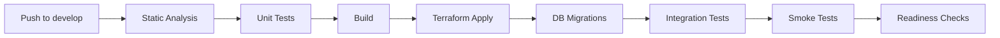
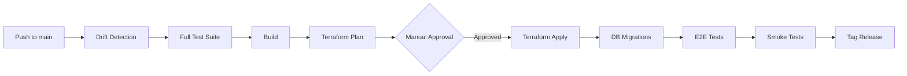
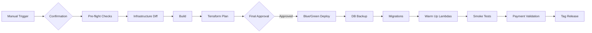

# 🚀 AWS CI/CD Infrastructure Deployment Guide

Complete guide for deploying Warmpawz infrastructure across Dev → Stage → Prod environments.

## Table of Contents

1. [Prerequisites](#prerequisites)
2. [Initial Setup](#initial-setup)
3. [Environment Strategy](#environment-strategy)
4. [First-Time Deployment](#first-time-deployment)
5. [CI/CD Pipeline](#cicd-pipeline)
6. [Testing Strategy](#testing-strategy)
7. [Troubleshooting](#troubleshooting)
8. [Rollback Procedures](#rollback-procedures)

---

## Prerequisites

### Required Tools
- **Terraform** >= 1.6.0
- **AWS CLI** >= 2.13.0
- **Node.js** >= 20.0.0
- **Git** >= 2.40.0
- **jq** (for JSON processing)

### AWS Account Setup
1. AWS account with appropriate permissions
2. IAM user with programmatic access
3. MFA enabled on root account

### Required AWS Permissions
```json
{
  "Version": "2012-10-17",
  "Statement": [
    {
      "Effect": "Allow",
      "Action": [
        "ec2:*",
        "rds:*",
        "lambda:*",
        "apigateway:*",
        "cognito-idp:*",
        "s3:*",
        "dynamodb:*",
        "sns:*",
        "sqs:*",
        "es:*",
        "secretsmanager:*",
        "cloudwatch:*",
        "logs:*",
        "iam:*"
      ],
      "Resource": "*"
    }
  ]
}
```

---

## Initial Setup

### 1. Clone Repository
```bash
git clone https://github.com/yourusername/warmpawzecodev.git
cd warmpawzecodev
```

### 2. Install Dependencies
```bash
npm install
```

### 3. Configure AWS Credentials
```bash
aws configure
# Enter your AWS Access Key ID
# Enter your AWS Secret Access Key
# Enter your default region (us-east-1)
# Enter your default output format (json)
```

### 4. Create Terraform State Backend

**IMPORTANT:** Run this once per AWS account before any environment deployment.

```bash
cd infra/bootstrap

# Update backend.tf with your AWS account ID
sed -i 's/YOUR_ACCOUNT_ID/123456789012/g' backend.tf

# Initialize and apply
terraform init
terraform apply -var="create_state_backend=true" -var="aws_account_id=123456789012"
```

This creates:
- S3 bucket for Terraform state
- DynamoDB table for state locking

### 5. Set Up GitHub Secrets

See [`.github/SECRETS.md`](.github/SECRETS.md) for complete list.

Required secrets:
```
AWS_ACCESS_KEY_ID
AWS_SECRET_ACCESS_KEY
AWS_REGION
AWS_ACCOUNT_ID
RAZORPAY_KEY_ID
RAZORPAY_KEY_SECRET
STRIPE_SECRET_KEY
SHIPROCKET_EMAIL
SHIPROCKET_PASSWORD
GOOGLE_MAPS_API_KEY
SLACK_WEBHOOK_URL
```

### 6. Set Up GitHub Environments

Create three environments with protection rules:

#### Dev
- No approval required
- Auto-deploy from `develop` branch

#### Stage
- 1 required reviewer
- Deploy from `main` branch

#### Production
- 2 required reviewers
- Manual workflow dispatch only
- Deployment branch: `main`

---

## Environment Strategy

### Infrastructure Comparison

| Resource | Dev | Stage | Prod |
|----------|-----|-------|------|
| VPC NAT | Single | Multi-AZ | Multi-AZ |
| RDS Capacity | 0.5-1 ACU | 1-4 ACU | 2-16 ACU |
| RDS Instances | 1 | 2 | 3 |
| Lambda Memory | 512 MB | 1024 MB | 2048 MB |
| OpenSearch | Optional | 2 nodes | 3 nodes |
| Backups | 3 days | 7 days | 30 days |
| Monitoring | Basic | Enhanced | Full |
| Cost | ~$50/mo | ~$200/mo | ~$500/mo |

### Network Isolation

```
Dev:   10.0.0.0/16
Stage: 10.1.0.0/16
Prod:  10.2.0.0/16
```

Each environment has:
- Separate VPC
- Separate RDS cluster
- Separate Cognito pools
- Separate S3 buckets
- Separate IAM roles

---

## First-Time Deployment

### Deploy Dev Environment

```bash
cd infra/envs/dev

# Update terraform.tfvars with your values
nano terraform.tfvars

# Update backend config
sed -i 's/YOUR_ACCOUNT_ID/123456789012/g' backend.hcl

# Initialize Terraform
terraform init -backend-config=backend.hcl

# Review plan
terraform plan

# Apply infrastructure
terraform apply

# Save outputs
terraform output -json > outputs.json
```

### Deploy Lambda Functions

```bash
# Build Lambda functions
cd ../../../backend/lambda
npm run build
npm run package

# Deploy using Terraform
cd ../../infra/envs/dev
terraform apply -target=module.lambda
```

### Run Database Migrations

```bash
cd ../../../db
npm ci

# Set environment
export ENVIRONMENT=dev

# Run migrations
npm run migrate:up

# Verify
npm run migrate:status
```

### Seed Initial Data

```bash
npm run seed:dev
```

### Run Readiness Checks

```bash
cd ../scripts
chmod +x readiness-checks.sh
./readiness-checks.sh dev
```

---

## CI/CD Pipeline

### Dev Pipeline (Automatic)

Triggers on push to `develop` branch:



### Stage Pipeline (Manual Approval)

Triggers on push to `main` or manual dispatch:



### Prod Pipeline (Strict Approval)

Manual workflow dispatch only:



### Manual Deployment Commands

#### Deploy to Stage
```bash
# From GitHub UI:
# 1. Go to Actions tab
# 2. Select "Deploy to Stage" workflow
# 3. Click "Run workflow"
# 4. Select branch: main
# 5. Approve when prompted
```

#### Deploy to Production
```bash
# From GitHub UI:
# 1. Go to Actions tab
# 2. Select "Deploy to Production" workflow
# 3. Click "Run workflow"
# 4. Type: DEPLOY_TO_PRODUCTION
# 5. Wait for pre-flight checks
# 6. Approve when prompted (2 reviewers required)
```

---

## Testing Strategy

### Test Levels

1. **Static Analysis**
   - Linting (ESLint)
   - Type checking (TypeScript)
   - Terraform validation

2. **Unit Tests**
   - Business logic
   - Service rules
   - Utility functions
   - Target: 80%+ coverage

3. **Integration Tests**
   - Lambda ↔ RDS
   - Lambda ↔ SQS
   - Auth flows
   - Payment sandbox

4. **E2E Tests**
   - Customer journey
   - Vendor onboarding
   - Booking lifecycle
   - Admin workflows

5. **Smoke Tests**
   - API health
   - DB connectivity
   - Auth validation
   - Critical endpoints

### Running Tests Locally

```bash
# Unit tests
npm run test:unit

# Integration tests
export ENVIRONMENT=dev
npm run test:integration

# E2E tests
npm run test:e2e

# Smoke tests
npm run test:smoke

# All tests
npm test
```

### Test Coverage Requirements

- Dev: No enforcement
- Stage: 90%+ required
- Prod: 100% required

---

## Troubleshooting

### Common Issues

#### Terraform State Lock
```bash
# If state is locked
cd infra/envs/dev
terraform force-unlock <LOCK_ID>
```

#### Lambda Cold Starts
```bash
# Warm up functions
./scripts/warmup-lambdas.sh dev
```

#### Database Connection Issues
```bash
# Check security groups
aws ec2 describe-security-groups \
  --group-ids sg-xxxxx \
  --query 'SecurityGroups[0].IpPermissions'

# Test from Lambda
aws lambda invoke \
  --function-name warmpawz-dev-api-handler \
  --payload '{"action":"db-test"}' \
  response.json
```

#### API Gateway 504 Timeout
```bash
# Check Lambda timeout
aws lambda get-function-configuration \
  --function-name warmpawz-dev-api-handler \
  --query 'Timeout'

# Increase if needed
terraform apply -var="lambda_timeout=60"
```

### Debugging

#### View CloudWatch Logs
```bash
# Lambda logs
aws logs tail /aws/lambda/warmpawz-dev-api-handler --follow

# API Gateway logs
aws logs tail /aws/apigateway/warmpawz-dev --follow
```

#### Check Resource Status
```bash
# RDS
aws rds describe-db-clusters \
  --db-cluster-identifier warmpawz-dev-cluster

# OpenSearch
aws opensearch describe-domain \
  --domain-name warmpawz-dev

# Lambda
aws lambda list-functions \
  --query 'Functions[?contains(FunctionName, `warmpawz-dev`)]'
```

---

## Rollback Procedures

### Rollback Lambda Functions
```bash
cd infra/envs/prod

# Get previous version
PREV_VERSION=$(git describe --abbrev=0 --tags HEAD~1)

# Checkout previous version
git checkout $PREV_VERSION

# Redeploy
terraform apply -target=module.lambda
```

### Rollback Database Migrations
```bash
cd db
npm run migrate:down
```

### Rollback Infrastructure
```bash
cd infra/envs/prod

# Get previous state
terraform state pull > current-state.json

# Apply previous configuration
git checkout $PREV_VERSION
terraform apply
```

### Emergency Rollback
```bash
# Complete rollback to previous release
git checkout tags/v2024.01.15.1
terraform init -backend-config=backend.hcl
terraform apply -auto-approve
```

---

## Monitoring & Alerts

### CloudWatch Dashboards
- Lambda performance metrics
- API Gateway latency
- RDS connections
- DynamoDB throttles
- SQS queue depth

### Alarms
- RDS CPU > 80%
- Lambda errors > 5/5min
- API Gateway 5XX > 10/5min
- DynamoDB throttles
- SQS message age > 10min

### Notification Channels
- SNS → Email
- SNS → Slack
- SNS → PagerDuty (prod only)

---

## Cost Optimization

### Dev Environment
- Use single NAT gateway
- Disable OpenSearch
- Minimal RDS capacity
- Short backup retention

### Auto-Scaling
- Lambda concurrency limits
- RDS Aurora Serverless v2
- DynamoDB on-demand billing

### Reserved Instances (Prod)
Consider reserved capacity for:
- RDS instances (1-year term)
- OpenSearch instances
- NAT Gateways

---

## Security Checklist

- [ ] MFA enabled on AWS root
- [ ] IAM roles with least privilege
- [ ] Secrets in AWS Secrets Manager
- [ ] Encryption at rest (RDS, S3, DynamoDB)
- [ ] Encryption in transit (TLS 1.2+)
- [ ] VPC endpoints for AWS services
- [ ] CloudTrail enabled
- [ ] GuardDuty enabled
- [ ] Security Hub enabled
- [ ] Regular security audits

---

## Support & Resources

- **Documentation**: [docs/](../docs/)
- **Issues**: [GitHub Issues](https://github.com/yourusername/warmpawzecodev/issues)
- **Slack**: #warmpawz-devops
- **Email**: devops@warmpawz.com

---

## Changelog

See [CHANGELOG.md](../CHANGELOG.md) for version history.

---

## License

Proprietary - All Rights Reserved

