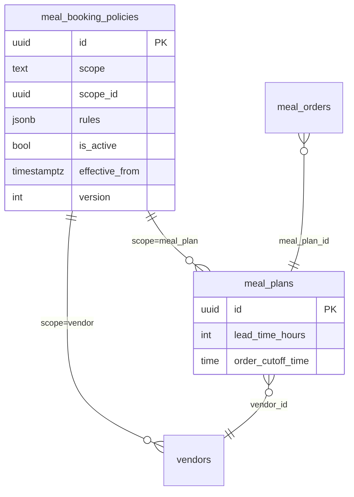

# Meal booking policy model

Configurable lead time, same-day delivery, and daily cutoff for meal plan orders — **Admin (platform law) → Vendor (optional) → Meal plan (SKU)**.

Aligns with existing columns: `meal_plans.lead_time_hours`, `meal_plans.order_cutoff_time`.

---

## 1. Domain overview



| Entity | Role |
|--------|------|
| `meal_booking_policies` | Versioned JSON rules per platform / vendor / meal plan |
| `meal_plans` | Per-SKU overrides (existing columns + optional link to plan-scoped policy row) |
| `meal_booking_policy_eval_log` | Optional audit: order id, input, result, policy version ids |

---

## 2. Policy layers and precedence

**Merge order** (each step clamps to platform bounds):

1. Load **platform** active policy (`scope = platform`, `scope_id IS NULL`).
2. Merge **vendor** policy if `scope = vendor` and `scope_id = vendorId`.
3. Merge **meal_plan** policy row OR map `meal_plans.lead_time_hours` / `order_cutoff_time` into L3.
4. Apply **purchase type** slice (`ONE_OFF` vs `WEEKLY_PLAN` vs `MONTHLY_PLAN`).

**Precedence for a single field:**

```
effective = clamp(
  meal_plan value ?? vendor value ?? platform default,
  platform.minHours,
  platform.maxHours
)
```

**Same-day:**

- Allowed only if `platform.sameDay.enabled` AND (`vendor.sameDay.enabled` ?? true) AND plan `lead_time_hours <= platform.sameDay.minLeadTimeHours` threshold OR plan explicit `sameDay.enabled`.
- **Same-day** does not bypass lead time — it uses a **low** `leadTimeHours` (e.g. 0–4), not 24.

---

## 3. Database schema

### 3.1 `meal_booking_policies`

```sql
CREATE TABLE meal_booking_policies (
  id UUID PRIMARY KEY DEFAULT gen_random_uuid(),
  scope TEXT NOT NULL CHECK (scope IN ('platform', 'vendor', 'meal_plan')),
  scope_id UUID NULL,
  rules JSONB NOT NULL,
  is_active BOOLEAN NOT NULL DEFAULT true,
  effective_from TIMESTAMPTZ NOT NULL DEFAULT now(),
  version INTEGER NOT NULL DEFAULT 1,
  created_by UUID NULL,
  created_at TIMESTAMPTZ NOT NULL DEFAULT now(),
  updated_at TIMESTAMPTZ NOT NULL DEFAULT now(),
  CONSTRAINT meal_booking_policies_scope_id_check CHECK (
    (scope = 'platform' AND scope_id IS NULL) OR
    (scope IN ('vendor', 'meal_plan') AND scope_id IS NOT NULL)
  )
);

-- One active row per scope target
CREATE UNIQUE INDEX uq_meal_booking_policies_active_platform
  ON meal_booking_policies (scope)
  WHERE scope = 'platform' AND is_active = true;

CREATE UNIQUE INDEX uq_meal_booking_policies_active_vendor
  ON meal_booking_policies (scope_id)
  WHERE scope = 'vendor' AND is_active = true;

CREATE UNIQUE INDEX uq_meal_booking_policies_active_meal_plan
  ON meal_booking_policies (scope_id)
  WHERE scope = 'meal_plan' AND is_active = true;
```

### 3.2 Existing `meal_plans` (L3 shortcut)

Keep for vendor UX and backward compatibility:

| Column | Maps to |
|--------|---------|
| `lead_time_hours` | `rules.leadTime` override for this plan |
| `order_cutoff_time` | `rules.orderCutoff.time` |

Optional later: `meal_plans.booking_policy_id UUID REFERENCES meal_booking_policies(id)` for full JSON per plan.

### 3.3 Optional vendor flag

```sql
ALTER TABLE vendors ADD COLUMN IF NOT EXISTS meal_same_day_enabled BOOLEAN DEFAULT false;
```

Or store only in vendor-scoped `meal_booking_policies.rules`.

---

## 4. Rules JSON (`MealBookingPolicyRulesV1`)

TypeScript: `packages/shared-types/src/meal-booking-policy.ts`.

### 4.1 Platform example (default 24h, same-day allowed with floor)

```json
{
  "schemaVersion": 1,
  "timezone": "Asia/Kolkata",
  "leadTime": { "defaultHours": 24, "minHours": 0, "maxHours": 72 },
  "orderCutoff": { "time": "18:00", "timezone": "Asia/Kolkata", "appliesToSameDayDelivery": false },
  "sameDay": {
    "enabled": true,
    "minLeadTimeHours": 2,
    "cutoff": { "time": "11:00", "timezone": "Asia/Kolkata", "appliesToSameDayDelivery": true },
    "maxOrdersPerDay": 100
  },
  "deliverySlot": { "mode": "calendar_day", "excludeWeekends": false },
  "byPurchaseType": [
    { "purchaseType": "ONE_OFF", "leadTimeHours": 24, "sameDay": { "enabled": true, "minLeadTimeHours": 2 } },
    { "purchaseType": "WEEKLY_PLAN", "leadTimeHours": 24, "rescheduleMinHoursBefore": 12 },
    { "purchaseType": "MONTHLY_PLAN", "leadTimeHours": 24, "rescheduleMinHoursBefore": 12 }
  ],
  "messages": {
    "customerBlockTemplate": "Place your order at least {{hours}} hours before delivery.",
    "vendorHintTemplate": "Customers must order {{hours}}h ahead (cutoff {{cutoff}})."
  },
  "devBypassLeadTime": false
}
```

### 4.2 Vendor example (same-day centre)

```json
{
  "schemaVersion": 1,
  "timezone": "Asia/Kolkata",
  "leadTime": { "defaultHours": 24, "minHours": 2, "maxHours": 48 },
  "orderCutoff": { "time": "17:00", "timezone": "Asia/Kolkata" },
  "sameDay": { "enabled": true, "minLeadTimeHours": 3, "cutoff": { "time": "10:30", "timezone": "Asia/Kolkata" } }
}
```

### 4.3 Meal plan example (SKU: same-day lunch)

Plan row: `lead_time_hours = 3`, `order_cutoff_time = '10:30'`.

---

## 5. Resolver algorithm

**Service:** `evaluateMealBookingPolicy(input: MealBookingPolicyEvaluateInput): MealBookingPolicyEvaluateResult`

```
now := input.now ?? UTC now
tz := merged.timezone
deliveryLocal := toZoned(input.requestedDeliveryAt, tz)
nowLocal := toZoned(now, tz)

leadHours := merged.effectiveLeadTimeHours
earliest := nowLocal + leadHours

IF deliveryLocal < earliest → block LEAD_TIME_TOO_SHORT

IF calendarDay(deliveryLocal) == calendarDay(nowLocal) THEN
  IF NOT merged.sameDayAllowed → block SAME_DAY_NOT_ALLOWED
  IF nowLocal > sameDayCutoffLocal → block SAME_DAY_CUTOFF_PASSED
  IF vendorSameDayCount(today) >= maxOrdersPerDay → block VENDOR_SAME_DAY_CAP

IF merged.excludeWeekends AND isWeekend(deliveryLocal) → block WEEKEND_BLOCKED

IF mode == fixed_slots AND time(deliveryLocal) NOT IN slots → block SLOT_NOT_ALLOWED

RETURN { allowed: true, earliestDeliveryAt: earliest.toISO() }
```

**Production:** `devBypassLeadTime` is ignored.

---

## 6. API surface

| Method | Path | Consumer |
|--------|------|----------|
| GET | `/admin/meal-booking-policies/active?scope=platform` | Admin |
| PUT | `/admin/meal-booking-policies` | Admin (creates version, deactivates prior) |
| POST | `/admin/meal-booking-policies/preview` | Admin simulator |
| GET | `/vendor/meal-booking-policy` | Vendor (merged platform + vendor + bounds) |
| GET | `/meal-plans/:id/order-preview` | Customer (includes `policy: MealBookingPolicyEvaluateResult` slice) |
| POST | `/meal/orders/create` | Customer (resolver must pass) |
| POST | `/meal-subscriptions/.../reschedule` | Customer (uses `rescheduleMinHoursBefore`) |

---

## 7. UI binding

### Admin

- Form sections map 1:1 to `MealBookingPolicyRulesV1`: bounds, default lead, same-day toggle + min hours + same-day cutoff, subscription reschedule hours, message templates.
- Preview panel calls `POST .../preview` with `requestedDeliveryAt`.

### Customer

- Date/time picker: `min = earliestDeliveryAt` from preview.
- Copy: interpolate `messages.customerBlockTemplate`.
- No hardcoded `24`.

### Vendor

- `MealPlanCreator`: lead time slider min/max from `GET /vendor/meal-booking-policy.bounds`.
- Toggle “Same-day delivery” sets `lead_time_hours` to `sameDayMinLeadTimeHours` and shows cutoff field.
- Dashboard: no code fork — schedule shows orders; create path blocked by same resolver on customer side.

---

## 8. Migration from today

| Today | Target |
|-------|--------|
| Hardcoded / env `BYPASS_24H_MEAL_VALIDATION` | `rules.devBypassLeadTime` on platform policy (non-prod) |
| `meal_plans.lead_time_hours` default 24 | Seed platform policy; plan column = L3 override |
| `MealOrderCheckout` `?? 24` | Read `effectiveLeadTimeHours` from preview |
| `meal-plans.ts` inline lead check | Call `evaluateMealBookingPolicy` |

**Seed platform row** on deploy: `defaultHours: 24`, `minHours: 0`, `maxHours: 72`, `sameDay.enabled: true`, `sameDay.minLeadTimeHours: 2`.

---

## 9. Decision table (same-day)

| Platform sameDay | Plan lead hours | Same-day cutoff | Result |
|------------------|-----------------|-----------------|--------|
| off | any | — | Earliest = now + max(lead, default), usually tomorrow+ |
| on | 24 | — | Same calendar day only if delivery ≥ now+24h |
| on | 2 | 11:00 | Today allowed if delivery ≥ now+2h and now < 11:00 (for today batch) |
| on | 0 | 11:00 | Today allowed if delivery > now and now < 11:00 (still enforce cutoff) |

---

## 10. Files to implement (reference)

| Layer | Path |
|-------|------|
| Types | `packages/shared-types/src/meal-booking-policy.ts` |
| DB | `db/migrations/7xx_meal_booking_policies.sql` |
| Resolver | `backend/lambda/src/services/meal-booking-policy-resolver.ts` |
| Admin API | `backend/lambda/src/endpoints/admin/meal-booking-policies.ts` |
| Admin UI | `apps/admin-web/components/admin/finance/MealBookingPolicyManager.tsx` |
| Wire create | `backend/lambda/src/endpoints/meal-plans.ts` |
