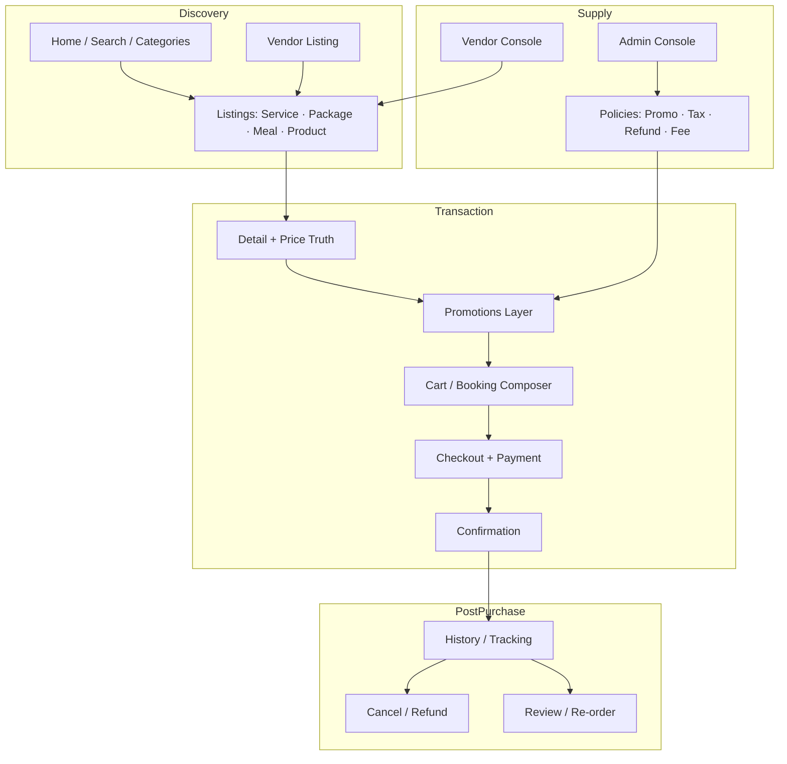
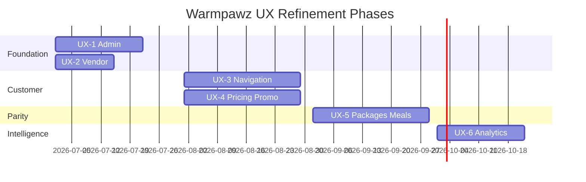
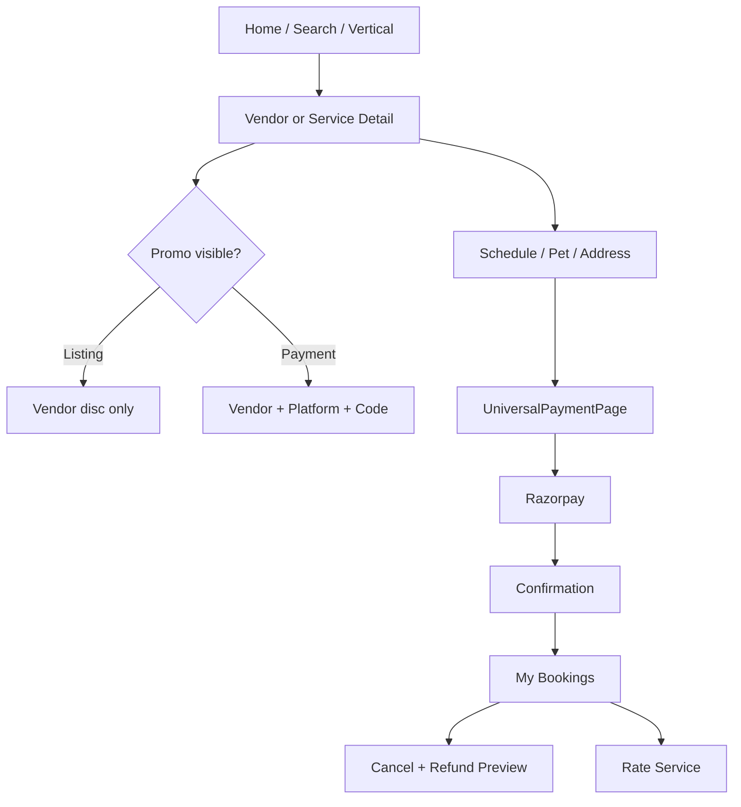

# Warmpawz Product UX Audit & Refinement Plan

**Scope:** Service Booking · Service Packages · Meal Plans · Ecommerce Products  
**Personas:** Customer · Vendor · Platform Admin  
**Date:** 2026-07-01  
**Type:** Product / UX audit — **no code changes in this document**

---

## Executive summary

Warmpawz has strong vertical depth (grooming, vet, nutrition, shop) but behaves like **four separate products** stitched together: service booking, packages, meal commerce, and ecommerce. Navigation, pricing, promotions, and post-purchase flows are **inconsistent across domains**. The discount engine (Phases 1–4) is architecturally ahead of the product UX — customers and admins still experience **three discount worlds** (service auto-stack, shop vendor codes, platform coupons) that do not unify at checkout.

**Top risks for marketplace trust:**
1. Quote/pay mismatch (coupon shown but not charged; platform promos listed but not applied in shop).
2. Dual navigation stacks (shell on `/` vs URL routes) causing lost context and unpredictable back behavior.
3. Admin promotion fragmentation (four UIs, weak targeting, no preview).
4. Vendor persona split (service vs seller) with orphan routes and mock data fallbacks.
5. Packages and meals are **promotion-free** while marketing implies marketplace-wide discounts.

---

## 1. Overall Product Architecture

### Marketplace model (target mental model)



### Current architecture (as-built)

| Layer | Customer | Vendor | Admin |
|-------|----------|--------|-------|
| **Shell** | `CustomerHomeWrapper` on `/` — vertical routers, embedded commerce | `VendorLandingPage` — role dashboards | Next.js app routes |
| **URL app** | `/shop`, `/checkout`, `/bookings`, `/orders/meal-plans`, `/my-packages` | `/seller`, `/bookings`, `/packages`, `/nutrition/dashboard` | `/marketing`, `/catalog`, `/ecommerce` |
| **Pricing** | `UniversalPaymentPage` (services/meals/packages) vs `CheckoutFlow` (shop) | List prices in catalog; promos in separate managers | Multiple promotion APIs |
| **Promotions** | Banners, applicable lists, cart codes — **three implementations** | Service vs product promo UIs | Marketing hub + orphan routes |

### Domain lifecycle map (end-to-end)

Each domain should share the same **lifecycle skeleton**. Current maturity:

| Stage | Service Booking | Service Package | Meal Plan | Product |
|-------|-----------------|-----------------|-----------|---------|
| Discovery | ●●●○ | ●●○○ | ●●○○ | ●○○○ (prod off) |
| Details | ●●●○ | ●●○○ | ●●○○ | ●●○○ |
| Promo visibility | ●●○○ | ●○○○ | ●○○○ | ●●○○ (PDP read-only) |
| Cart / booking | ●●●○ | ●●●○ | ●●○○ | ●●○○ |
| Checkout | ●●●○ | ●●○○ | ●●●○ | ●●○○ |
| Payment | ●●●○ | ●●●○ | ●●●○ | ●●○○ |
| Confirmation | ●●●○ | ●●○○ | ●●○○ | ●●○○ |
| History | ●●●○ | ●●○○ | ●●●○ | ●●○○ |
| Cancel / refund | ●●●○ | ●●○○ | ●○○○ | ●●○○ |
| Review | ●●●○ | ●○○○ | ●○○○ | ●●○○ |

Legend: ● = implemented · ○ = weak / missing / inconsistent

---

## 2. Customer UX Audit

### 2.1 Navigation & information architecture

**Strengths**
- Mobile-first column layout, safe areas, bottom tabs for core hubs.
- Rich vertical entry (grooming, vet, nutrition, walker) from home.
- Unified `/search` for vendors, services, products.

**Weaknesses**
- **Dual navigation:** Shell on `/` vs URL routes (`/shop`, `/bookings`). Same feature reachable two ways with different back stacks.
- Shop tab always pushes `/shop` but shell still supports embedded `cart` / `checkout` — parallel ecommerce stacks.
- Search uses raw `router.push` instead of navigation service — inconsistent with team nav rules.
- Package session actions live on `/my-packages`, not obvious from booking history (OTP hidden on parent rows).

**Confusing elements**
- Shell screen id `shop` registered but not rendered.
- Product detail `max-w-7xl` vs shop `max-w-customer` — desktop visual break.
- “Diet” / nutrition paths split between shell and URL meal routes.

### 2.2 Discovery journeys

| Surface | Route / screen | State |
|---------|----------------|-------|
| Home | `/` shell | Strong |
| Search | `/search` | Strong |
| Categories | Problem grid, vertical hubs | Strong |
| Vendor listing | Style-based lists, search | Strong |
| Product listing | `/shop` | **Coming soon in production** |
| Meal plans | `nutrition-meal-plans` shell | Flag-gated |
| Packages | Via vendor vertical → `purchase-package` | No dedicated browse hub |

### 2.3 Detail pages

| Element | Service | Package | Meal | Product |
|---------|---------|---------|------|---------|
| Price display | `ServicePricingDisplay` | Total + sessions | Subtotal + fees in checkout | MRP + % OFF |
| Platform discount | Hidden until payment | N/A | In `UniversalPaymentPage` | N/A at PDP |
| Vendor discount | On listing | On package card | N/A | PDP promos **read-only** |
| Availability | Schedule slots | Session picker | Delivery slots / kitchen closed | Stock / region |
| Primary CTA | Book now | Buy package | Subscribe / one-time | Add to cart |

### 2.4 Booking / checkout flows

**Service:** Vertical router → datetime → pet → address → `UniversalPaymentPage` → confirmation.  
**Package:** `PackageBookingPage` → pets → multi-session schedule → Razorpay (not always `UniversalPaymentPage`).  
**Meal:** `MealOrderCheckout` → `/meal-plans/checkout-pay` or subscription pay.  
**Product:** `/cart` → `/checkout` (2-step: payment + review).

**Gaps**
- `CreateBookingPage` lacks promo richness of category routers.
- Dead `CouponSection.tsx` — unfinished unification.
- Meal checkout session can expire with weak recovery copy.

### 2.5 History, cancel, refund, review

| Domain | History | Cancel / refund | Review |
|--------|---------|-----------------|--------|
| Service | `/bookings` — filters, cancel modal, refund preview | Tier-based policy API | Rate modal, `?reviewBookingId=` |
| Package | `/my-packages`, `/packages/[id]` | Via package decline (vendor-led) | Weak |
| Meal | `/orders/meal-plans`, `/track/[id]` | Admin case for logistics; subscription cancel | Weak |
| Product | `/orders`, `/returns` | Return eligibility flow | Product reviews on PDP |

### 2.6 Empty / loading / error states

- **Good:** Search empty, shop retry, `MyBookingsEmptyState`, meal order skeletons.
- **Weak:** Generic spinners; `ui/states` primitives not adopted consistently.
- **Risk:** Feature-disabled “Coming soon” for shop in production — entire ecommerce domain invisible.

### 2.7 Mobile vs desktop

- Mobile-first throughout; checkout sticky summary on `lg+`.
- Desktop PDP width inconsistency vs catalog.

---

## 3. Vendor UX Audit

### 3.1 Dashboard & navigation

**Service vendor:** `VendorDashboard` — bookings, services, promotions overlay, earnings.  
**Seller:** `SellerHub` at `/seller` — products, orders, promos, analytics.  
**Nutritionist:** Dashboard + `/nutrition/dashboard` for kitchen ops.

**Critical IA issues**
- Package management **detached** from dashboard (500-error history); capability route `/services/packages` **does not exist**.
- **Three URLs** for same settlement UI: `/earnings`, `/settlements`, `/finance/settlements`.
- **Two analytics routes:** `/analytics` vs `/operations/analytics` — different components.
- Reporting footer tab **disabled** (`SHOW_VENDOR_FOOTER_REPORTING_TAB = false`).
- Orphan `/products` and `/orders` with **mock API client**.

### 3.2 Domain management maturity

| Domain | Entry | Maturity | Notes |
|--------|-------|----------|-------|
| Bookings | `/bookings`, dashboard | High | OTP, chat, earnings tab |
| Service promos | Dashboard overlay | High | No dedicated route |
| Product promos | Seller Hub | High | Isolated from service vendors |
| Packages | `/packages` only | Medium | Mock enrollments on API fail |
| Meal plans | `/nutrition/plans` = Coming Soon | Low | `MealPlanCreator` unused |
| Products | Seller Hub | High | Orphan `/products` unsafe |
| Orders | Seller Hub + orphan `/orders` | Split | `alert()` for errors |

### 3.3 Revenue & settlement visibility

- Strong: `VendorEarningsSettlementDashboard` — tier, commission, payout request.
- Seller: `CommissionCalculator` separate mental model.
- **Gap:** Promo impact on booking revenue not visible in booking cards; no unified cross-channel revenue.

### 3.4 Promotion analytics

- Fields exist (views, conversions) but **limited visualization**.
- No ROI dashboard; silent KPI fallbacks on API failure.

---

## 4. Admin UX Audit

### 4.1 Navigation

**Canonical hub:** `/marketing` (sidebar) — Promotions, Coupons, Banners, Spotlight, Vendor promos overview.  
**Orphans:** `/promotions`, `/banners` (duplicate functionality).  
**Broken:** `/reports` in nav — **no page**.

### 4.2 Creation flows

| Flow | Location | Validation | Targeting |
|------|----------|------------|-----------|
| Platform promo | `/marketing` modal | Minimal | Category + style only |
| Platform promo (alt) | `/promotions` page | Code + name | `applicable_to` bucket, no pickers |
| Advanced engine | **Unused component** | Name + description | Richest schema, not shipped |
| Coupons | `CouponManagement` | API-only | Platform-wide |
| Vendor promos | Read-only toggle | N/A | N/A |
| Banners | Marketing + `/banners` | Partial | Geo, category, vendor CTA |

### 4.3 Catalog admin

| Entity | Admin path | Gap |
|--------|------------|-----|
| Services | `/catalog` | “Add Product” opens **service** modal |
| Products | `/ecommerce` approval | No meal catalog |
| Packages | `/regions` regional modal | **Cannot attach services in UI** |
| Meals | — | **No admin module** |

### 4.4 Reports & analytics

- `/analytics` — platform KPIs, **no promo metrics**.
- No redemption/leakage/ROI reporting.
- Vendor promo views/conversions not shown in admin table.

---

## 5. Promotion UX Audit

### 5.1 Current creation flow

```mermaid
flowchart LR
  subgraph Admin
    M[/marketing]
    P[/promotions orphan]
    A[AdvancedEngine unused]
    C[Coupons tab]
  end

  subgraph Vendor
    SP[ServicePromotionsManagement]
    PP[Seller PromotionsManagement]
  end

  subgraph Customer
    UP[UniversalPaymentPage]
    CS[CartPromotionSelect]
    PDP[SellerProductPromotions read-only]
  end

  M --> API1[/marketing/promotions]
  P --> API2[/admin/promotions]
  SP --> API3[/vendor/.../service-promotions]
  PP --> API4[/vendor/.../promotions]
  API1 -.-> UP
  API3 -.-> UP
  API4 -.-> CS
  C --> API5[/admin/coupons]
  API5 -.x UP
```

### 5.2 Strengths

- Vendor promo types are rich (BOGO, bundle, combo, loyalty, first booking/order).
- Service auto-stack (vendor → platform) is sophisticated backend behavior.
- Banner preview exists (admin + customer URL).
- Notification campaign preview exists.

### 5.3 Weaknesses

| Issue | Impact |
|-------|--------|
| Four admin promotion UIs | Wrong API, duplicate configs |
| No customer preview for promos/coupons | Misconfigured campaigns ship blind |
| `validate-code` simplified math vs auto engine | Code campaigns may quote wrong discount |
| Platform coupons not in booking/shop checkout | Customer trust failure |
| PDP promos informational only | Friction — copy code manually |
| Packages & meals excluded | Marketing cannot run meal/package campaigns |
| No stacking policy UI | Engineering-only knowledge |

### 5.4 Missing fields (admin)

- Target: specific services, packages, meal plans, SKUs, vendors, segments, geo (except banners).
- Stack rules, priority, funding split, approval workflow.
- Per-user limits on marketing promos.
- Promotion simulator / test customer context.
- `maxDiscountAmount` on coupon create UI (in state, not shown).

---

## 6. Pricing Experience Audit

### 6.1 Price breakdown components

| Line item | Service pay | Package | Meal | Shop checkout |
|-----------|-------------|---------|------|---------------|
| Base / subtotal | ✓ | ✓ | ✓ | ✓ |
| Vendor discount | ✓ | Partial | — | ✓ |
| Platform discount | ✓ (pay stage) | — | Partial | Listed not applied (auto) |
| Coupon | ✓ (validate) | — | — | ✓ (vendor code) |
| Tax (GST) | ✓ | ✓ | ✓ | ✓ |
| Platform fee | ✓ | ✓ | ✓ | — |
| Convenience fee | ✓ | ✓ | ✓ | Varies |
| Delivery fee | Home visit | — | ✓ | ✓ |
| **Savings summary** | Partial | Weak | Partial | ✓ |
| **Final amount truth** | Quote vs pay risk | Quote only | Preview good | Cart good |

### 6.2 Consistency scorecard

| Principle | Status |
|-----------|--------|
| Same discount shown on listing and checkout | **Fail** (platform hidden on service list) |
| Same code works on quote and charge | **Fail** (coupon on quote unused) |
| Strikethrough + savings everywhere | Partial |
| Fee labels consistent (platform vs convenience) | Partial |
| Refund preview matches cancel outcome | Good (service) |

### 6.3 Competitive patterns (interaction only)

| Pattern | Amazon | Swiggy/Zomato | Urban Company | Warmpawz today |
|---------|--------|---------------|---------------|----------------|
| Single cart/checkout metaphor | ✓ | ✓ | ✓ | **4 metaphors** |
| Promo auto-applied with savings line | ✓ | ✓ | ✓ | Partial |
| Coupon field on checkout | ✓ | ✓ | ✓ | Split implementations |
| Order tracking unified | ✓ | ✓ | ✓ | Split: bookings / meals / shop |
| Refund status in order detail | ✓ | ✓ | ✓ | Good service; weak meal |
| Re-order / book again | ✓ | ✓ | ✓ | Partial |

---

## 7. Consistency Matrix

| Dimension | Service | Package | Meal Plan | Product |
|-----------|---------|---------|-----------|---------|
| **Discovery hub** | Vertical + search | Vendor flow only | Nutrition shell | `/shop` |
| **Detail pricing** | MRP + vendor disc | Package total | Preview API | MRP + % OFF |
| **Promo auto-apply** | Yes (vendor+platform) | No | No | Yes (vendor only) |
| **Platform coupon** | Not applied | No | No | Not applied |
| **Checkout surface** | UniversalPaymentPage | PackageBookingPage | MealOrderCheckout + UPP | CheckoutFlow |
| **Tax display** | GST calculate | Package quote | GST in preview | Checkout breakdown |
| **Confirmation** | Booking confirm | Package purchase | Tracking redirect | Order success |
| **History screen** | MyBookings | MyPackages | MealPlanOrders | Shop orders |
| **Tracking** | GPS / tele links | Session OTP | `/track/[id]` | Shiprocket |
| **Cancel** | Self-serve + preview | Vendor-led | Subscription / admin case | Returns |
| **Review** | RateServiceModal | Missing | Missing | PDP reviews |
| **Promo in history** | Weak | No | Refund banner | Order expand |

---

## 8. Gap Analysis

### Critical

| # | Gap | Persona | Domain |
|---|-----|---------|--------|
| C1 | Platform coupon not applied at service booking charge | Customer | Service |
| C2 | Shop checkout ignores `coupons` table; vendor code only | Customer | Product |
| C3 | Quote API ignores `couponCode` — pay mismatch risk | Customer | Service |
| C4 | Ecommerce disabled in production (“Coming soon”) | Customer | Product |
| C5 | Four admin promotion UIs / APIs — config drift | Admin | All |
| C6 | Dual customer navigation stacks | Customer | All |
| C7 | Mock data fallbacks on vendor packages/products/orders | Vendor | Package, Product |

### High

| # | Gap | Persona |
|---|-----|---------|
| H1 | No promotion targeting: packages, meals, SKUs, vendors | Admin |
| H2 | validate-code math ≠ auto engine (combo/loyalty) | Customer |
| H3 | Platform auto promos listed for shop but not deducted | Customer |
| H4 | Package dashboard entry removed — fragmented access | Vendor |
| H5 | Three settlement URLs, two analytics URLs | Vendor |
| H6 | No customer preview for promos/coupons | Admin |
| H7 | Packages & meals excluded from promotion engine | All |
| H8 | `/reports` nav item broken | Admin |
| H9 | Service vs seller promo UIs — no persona labeling | Vendor |

### Medium

| # | Gap |
|---|-----|
| M1 | PDP promos read-only — no apply path |
| M2 | `CouponSection` dead code — unfinished unification |
| M3 | Meal plans admin = Coming Soon while ops dashboard live |
| M4 | Regional package create cannot attach services |
| M5 | No promo performance analytics |
| M6 | Package sessions hidden from My Bookings UX |
| M7 | `CreateBookingPage` promo-poor vs vertical routers |
| M8 | Desktop PDP vs shop width inconsistency |
| M9 | Vendor promo revenue impact not on booking cards |

### Low

| # | Gap |
|---|-----|
| L1 | Generic loading copy |
| L2 | All Services “coming soon” toasts |
| L3 | Legacy payment pages may still exist |
| L4 | `displayType` dead field in admin |
| L5 | Promotions search not wired in marketing hub |
| L6 | `alert()` / `prompt()` on vendor orders |

---

## 9. Dynamic Configuration Review (recommendations only)

These business rules should become **admin-configurable** (not hardcoded):

| Rule | Today | Recommend |
|------|-------|-----------|
| Promo stack order (vendor → platform) | Hardcoded | Admin policy per domain |
| Best promo selection (max discount) | Hardcoded | Priority engine + spotlight weights (Phase 5) |
| Coupon + promo exclusivity | Undefined | Admin: exclusive / stack / best-of |
| Auto-apply gate (`code` null) | Hardcoded | Configurable per campaign |
| Platform fee / convenience defaults | Code fallbacks | Finance settings (partial exists) |
| Refund tier defaults | Hardcoded 24/12/6/2h | Admin template library |
| Service style aliases | Code normalization | Admin taxonomy |
| validate-code vs engine parity | Split paths | Single resolver authority |
| Ecommerce platform promo application | Off | Feature flag per env |
| Meal delivery fee signals | API policy | Admin calendar overrides |
| Promotion date timezone | IST vs UTC split | Unified policy display |
| Usage limits | Per-entity columns | Central usage tracker |
| Approval before publish | None | Workflow for platform promos |
| Visibility rules | Partial | Segment, geo, app surface toggles |

---

## 10. Implementation Roadmap

### Phase UX-1 — Admin experience & promotion truth

**Objective:** One promotion hub, truthful targeting fields, preview before publish.

| Item | Detail |
|------|--------|
| **UI changes** | Consolidate `/marketing`; redirect `/promotions`, `/banners`; mount or delete `AdvancedPromotionsEngine`; fix `/reports` or remove; coupon `maxDiscount` field; client validation |
| **Backend impact** | Unify on `/admin/promotions` or `/marketing/promotions`; align `flat`/`fixed` enums |
| **Dependencies** | Discount engine Phase 5 cutover plan |
| **Priority** | P0 |
| **Effort** | 2–3 weeks |
| **Risk** | API migration breaks existing campaigns |

**Files affected (indicative):** `apps/admin-web/app/marketing/page.tsx`, `app/promotions/page.tsx`, `components/admin/marketing/*`, `packages/shared-types/src/admin-portal-nav.ts`

---

### Phase UX-2 — Vendor experience unification

**Objective:** Clear service vs store personas; remove mock fallbacks; restore package entry.

| Item | Detail |
|------|--------|
| **UI changes** | Single analytics + settlement route; re-enable package tile or `/packages` nav; wire `MealPlanCreator` or hide capability; replace `alert()` modals; persona switcher copy |
| **Backend impact** | Fix package enrollment API reliability; remove mock clients from `/products`, `/orders` |
| **Dependencies** | Package API stability |
| **Priority** | P0–P1 |
| **Effort** | 2 weeks |
| **Risk** | Re-attaching broken package flows |

**Files affected:** `VendorDashboard.tsx`, `VendorLandingPage.tsx`, `app/packages/page.tsx`, `lib/capability-routes.ts`, `SellerHub.tsx`

---

### Phase UX-3 — Customer navigation & lifecycle coherence

**Objective:** Predictable journeys; unified history metaphor; lifecycle parity across domains.

| Item | Detail |
|------|--------|
| **UI changes** | Document and reduce dual stacks; package CTA from My Bookings; meal order entry consolidation; search via `useCustomerNavigation`; enable ecommerce flag plan for prod |
| **Backend impact** | Minimal |
| **Dependencies** | `customer-navigation.mdc` compliance pass |
| **Priority** | P1 |
| **Effort** | 3–4 weeks |
| **Risk** | Back-button regressions |

**Files affected:** `CustomerHomeWrapper.tsx`, `lib/navigation/*`, `MyBookings.tsx`, `app/search/page.tsx`

---

### Phase UX-4 — Pricing & promotions (customer-facing)

**Objective:** One pricing truth from discovery → confirmation; wire coupons; unify promo UI.

| Item | Detail |
|------|--------|
| **UI changes** | Merge `CouponSection` + `CartPromotionSelect` + UPP promo blocks; savings summary component; listing/checkout price parity; PDP “apply in cart” or auto-apply |
| **Backend impact** | Phase 5 resolver authority; wire `couponCode` on quote; S5/E6 gaps |
| **Dependencies** | Discount engine Phase 5 priority/stack |
| **Priority** | P0 |
| **Effort** | 3–4 weeks |
| **Risk** | Revenue impact if discounts double-apply |

**Files affected:** `UniversalPaymentPage.tsx`, `CheckoutFlow.tsx`, `ServicePricingDisplay.tsx`, `booking-promotion-service.ts`, `ecommerce/orders`

---

### Phase UX-5 — Domain parity (packages & meals)

**Objective:** Packages and meals participate in marketplace promo policy (or explicit “excluded” UX).

| Item | Detail |
|------|--------|
| **UI changes** | Package promo messaging; meal checkout savings line; admin meal catalog; package browse hub |
| **Backend impact** | Extend resolver domain support or hard-exclude with copy |
| **Dependencies** | Product decision on meal/package promos |
| **Priority** | P1 |
| **Effort** | 4+ weeks |
| **Risk** | Nutrition margin complexity |

---

### Phase UX-6 — Analytics & diagnostics

**Objective:** Marketplace-grade visibility for admin and vendor.

| Item | Detail |
|------|--------|
| **UI changes** | Promo ROI dashboard; vendor promo funnel; discount debugger (internal); promotion simulator in admin |
| **Backend impact** | Usage tracker (Phase 6); event instrumentation |
| **Dependencies** | Settlement / usage phase |
| **Priority** | P2 |
| **Effort** | 3 weeks |
| **Risk** | Data quality |

---

### Roadmap timeline (suggested)



---

## 11. Quick Wins (< 1 day each)

| # | Win | Persona | Effort |
|---|-----|---------|--------|
| Q1 | Remove or redirect orphan `/promotions` and `/banners` to `/marketing` | Admin | 2h |
| Q2 | Remove `/reports` from nav or add stub page | Admin | 1h |
| Q3 | Show `maxDiscountAmount` on coupon create form | Admin | 2h |
| Q4 | Add validation toasts on marketing promo save | Admin | 2h |
| Q5 | Label dashboard tiles “Store Promotions” vs “Service Promotions” | Vendor | 2h |
| Q6 | Link My Bookings package rows → `/my-packages` with explicit CTA | Customer | 3h |
| Q7 | Fix “Add Product” button label on catalog (→ service) | Admin | 1h |
| Q8 | Replace vendor `/orders` `alert()` with toast + modal | Vendor | 4h |
| Q9 | Hide mock enrollment fallback behind dev flag | Vendor | 2h |
| Q10 | Copy-to-cart hint on PDP when seller promo exists | Customer | 3h |
| Q11 | Wire promotions search filter on marketing hub | Admin | 2h |
| Q12 | Document customer-facing promo rules in admin help tooltip | Admin | 4h |

---

## 12. Enterprise Recommendations

To reach maturity comparable to **Urban Company + Swiggy + Amazon** interaction patterns (not branding):

1. **Single order graph** — Every transaction (service, package, meal, product) becomes an `Order` with unified status, tracking, refund, and review. Customer sees one “Orders” hub with filters.

2. **Price contract** — `PricingQuote` ID carried from detail → checkout → payment. Any change invalidates quote client-side. Eliminates coupon/quote drift (C1, C3).

3. **Promotion CMS** — Admin configures campaigns with: surface (listing, detail, checkout), targeting dimensions, stack policy, funding, schedule, preview on real customer fixtures, approval workflow.

4. **Vendor business cockpit** — One earnings + promo + catalog view regardless of service/seller/nutrition roles; capabilities hide sections, not duplicate apps.

5. **Configurable policy engine exposure** — Refund tiers, fees, stack rules, and visibility edited in admin; versioned snapshots at purchase (packages already snapshot — extend pattern).

6. **Trust surfaces** — Savings breakdown, fee explainer tooltips, refund preview before pay, explicit “promo applied” on confirmation + email + history.

7. **Operational excellence** — Meal refund cases visible to customer with SLA; package session reminders; shop delivery parity with meal tracking UX.

8. **Accessibility & resilience** — Adopt shared `LoadingState` / `ErrorState`; focus management on checkout; screen reader labels on price changes when promos apply.

9. **Promotion simulator (internal)** — Admin enters customer context (vendor, cart, segment) and sees resolver output before publish — pairs with Discount Engine Phase 5+.

10. **Feature-flagged domain rollout** — Ecommerce prod enablement with smoke checklist; meal plans flag documented per environment.

---

## Appendix A — Customer lifecycle diagrams

### Service booking



### Service package

```mermaid
flowchart TD
  A[Vendor Flow] --> B[PackageBookingPage]
  B --> C[Select Package]
  C --> D[Pets + Schedule Sessions]
  D --> E[Pay Razorpay]
  E --> F[/my-packages]
  F --> G[/packages/id Sessions]
  G --> H[Book Session OTP]
  H --> I[My Bookings parent row]
```

### Meal plan

```mermaid
flowchart TD
  A[Nutrition Hub] --> B[MealPlansList]
  B --> C[MealOrderCheckout]
  C --> D{One-time or Sub?}
  D -->|Once| E[/meal-plans/checkout-pay]
  D -->|Sub| F[/subscriptions/meal-pay]
  E --> G[UniversalPaymentPage]
  G --> H[Confirm]
  H --> I[/track/id or shell tracking]
  I --> J[/orders/meal-plans]
  J --> K[Refund review banner if case]
```

### Product (ecommerce)

```mermaid
flowchart TD
  A[/shop] --> B[ProductDetailClient]
  B --> C[Cart]
  C --> D[/checkout]
  D --> E[Coupon + Review steps]
  E --> F[Razorpay]
  F --> G[/checkout/success]
  G --> H[/orders]
  H --> I[/returns]
```

---

## Appendix B — Key file index (for implementers)

| Area | Path |
|------|------|
| Customer nav audit | `apps/customer-web/CUSTOMER_NAV_AUDIT.md` |
| Customer shell | `apps/customer-web/components/customer/wrappers/CustomerHomeWrapper.tsx` |
| Service payment | `apps/customer-web/components/customer/payment/UniversalPaymentPage.tsx` |
| Shop checkout | `apps/customer-web/components/ecommerce/CheckoutFlow.tsx` |
| Packages | `apps/customer-web/components/customer/PackageBookingPage.tsx` |
| Meals | `apps/customer-web/components/customer/nutrition/*` |
| Vendor dashboard | `apps/vendor-web/components/vendor/dashboard/BussinesProvider/VendorDashboard.tsx` |
| Seller hub | `apps/vendor-web/components/vendor/seller/SellerHub.tsx` |
| Admin marketing | `apps/admin-web/app/marketing/page.tsx` |
| Discount resolver matrix | `backend/lambda/src/discount-engine/RESOLVER_MATRIX.md` |
| Phase 4 report | `backend/lambda/src/discount-engine/PHASE4_MIGRATION_REPORT.md` |

---

## Document history

| Date | Author | Change |
|------|--------|--------|
| 2026-07-01 | Product audit (Cursor) | Initial comprehensive UX refinement plan |

**Next step:** Review Critical gaps (C1–C7) in product standup; assign Phase UX-1 and UX-4 owners; decide ecommerce prod enablement date and meal/package promo policy.
