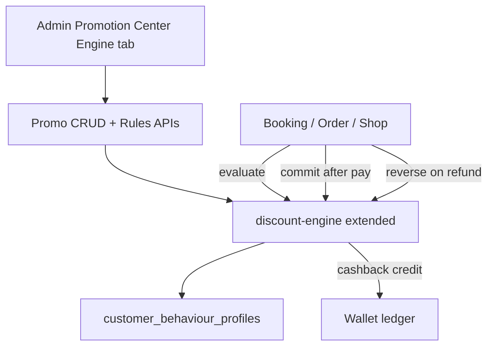

# Warmpawz Promotion, Discount & Cashback Engine — Master Execution Plan

**Status:** Phase 3 (Bindu) landed — Abhi **Phase 4** must cover **all earnable checkouts** (§17). See §14–§17.  
**Environment for migrations & first deploy:** **dev only**  
**Loyalty & Rewards:** remains independent — do not merge into this engine  
**Wallet:** remains the cashback ledger/store  
**UI constraint:** reuse existing Admin Promotion Center patterns/styling; Figma is UX/flow reference only — **no new design system / no greenfield component library**

**Source of truth (product / contracts / DSL / examples):** [`docs/PROMOTION_ENGINE_HLD.md`](./PROMOTION_ENGINE_HLD.md)  
**Figma:** [Promotion Engine wireframes](https://www.figma.com/proto/bdLIYhcbseibOrjzFIBDVH/Warmpawz-Promotion-Engine-%E2%80%94-UI-UX-Wireframes?node-id=2-370&p=f&t=ObcZOMlHR9Re9TyR-1&scaling=min-zoom&content-scaling=fixed&page-id=0%3A1)

Related seating map: prior chat plan *Promo Engine UI Seats*. Existing surfaces: [`PromotionCenterHub.tsx`](apps/admin-web/components/admin/marketing/PromotionCenterHub.tsx), [`discount-engine/`](backend/lambda/src/discount-engine/), commercial campaigns (`1046` / `1071`), booking quote via [`booking-promotion-service`](backend/lambda/src/lib/services/booking-promotion-service.ts).

> Agents: read **HLD** for *what* to build; read **this master plan** for *how / who / when* on `feature/promo-engine-v1`.

---

## 0. Non-negotiables

1. **Never credit cashback on evaluate** — only on **commit** after payment/booking confirmation.
2. **No hard-coded visit/winback if-else** in booking or order services — all logic in the engine via condition DSL.
3. **Idempotent commit** — key = `promotion_id + transaction_id + benefit_id` (or evaluation_id + benefit_id).
4. **Additive, idempotent migrations only** — numbered **1111–1114** on this branch (see §4); apply with `ENVIRONMENT=dev node scripts/run-migration-rds-node.js <file>.sql` only when the owning phase says so.
5. **Sequential handoff:** Bindu → Abhi → Bindu → majority complete → **dev deploy** → Praveen continuous/periodic gates throughout.
6. **Do not** put journey/rule builder under `/loyalty`.
7. **Do not** invent a second admin skin — match Policy Center / Campaign Builder form density, tabs, orange accent already used in Promotion Center.

---

## 1. What we are building (product contract)

A configurable engine that answers: who / what service / which visit / behaviour / discount / cashback / redeem scope / expiry / stacking / funding / usage limits.

**Canonical mental model**

```
Transaction (what) + Behaviour (who) + Rules (qualify)
  → Benefits (discount + cashback)
  → Stacking / priority
  → Evaluate result (no wallet write)
  → Payment OK → Commit → usage + wallet cashback credit
  → Cancel/refund → Reverse
```

**v1 benefit types:** `DISCOUNT`, `CASHBACK` only (`FREE_*` / `VOUCHER` / `UPGRADE` deferred).

**v1 first-class rule category:** Customer Journey / Visit Number (service-specific visit counts), plus generic field/operator/value conditions.

---

## 2. Architecture decision (extend, don’t fork)

| Layer | Decision |
|-------|----------|
| Runtime engine | **Extend** [`backend/lambda/src/discount-engine/`](backend/lambda/src/discount-engine/) — add DSL conditions, cashback benefit strategy, evaluate/commit/reverse orchestration. Do **not** create a parallel Lambda service. |
| Campaign shell | Keep [`commercial_discount_campaigns`](db/migrations/1046_commercial_discount_campaigns.sql) for orchestration/funding/schedule; engine promotions **link** to campaigns where needed. |
| Legacy coupons / platform promos | Remain candidates in the unified resolver; new engine promos are an additional candidate source. |
| Behaviour | **New** profile store + event updates — not queried live from all bookings on every evaluate. |
| Wallet | Extend `wallet_transactions` for promo cashback metadata; reuse existing credit/debit endpoints or thin promo-aware wrappers. |
| Admin UI | New **Engine** tab (or Campaigns sub-mode) inside Promotion Center — 5-step wizard matching Figma flow, **styled like current admin**. |
| Customer UI | Extend checkout price summary + wallet apply/ledger — no new customer design system. |



---

## 3. Team roles and sequence

| Person | Owns | Does not own |
|--------|------|--------------|
| **Bindu** | All new migrations **1111–1114** (author + run on **dev**); Admin UI shell + list + wizard steps she owns (Basics, Audience/rules journey templates, Review); wire status lifecycle controls | Core evaluate/commit/reverse runtime; customer checkout wire (unless Abhi hands a stub) |
| **Abhi** | Backend contracts & engine modules; behaviour service; wallet cashback credit/redeem/expiry fields; evaluate/commit/reverse; booking+ecom integration; customer checkout earn-preview + redeem-scope; remaining Admin UI (Benefits, Limits, Simulator) | Running migrations on RDS (Bindu); inventing new visual language |
| **Praveen** | Periodic / gate tests: migration smoke, API contract checks, winback/visit scenarios, checkout parity, no double-credit, reverse | Feature implementation |

### Sequence (mandatory)

```
Phase 0  Praveen baseline checklist locked
   ↓
Phase 1  BINDU — migrations 1111–1114 on dev RDS + Admin Engine tab shell + Promotions list
   ↓
Phase 2  ABHI — engine DSL + behaviour + evaluate/commit/reverse + wallet ledger wiring
   ↓
Phase 3  BINDU — finish Audience/Journey UI + Review + Activate; polish list filters
   ↓
Phase 4  ABHI — Benefits/Limits/Simulator UI + customer checkout/wallet surfaces
   ↓
Phase 5  Majority done → deploy Lambda + admin-web (+ customer-web if checkout landed) to DEV
   ↓
Phase 6  PRAVEEN — full scenario matrix on dev; file defects; loop Abhi/Bindu as needed
```

Praveen may run **smoke after each phase**, not only at the end.

---

## 4. Migrations (Bindu) — numbered, dev-only for now

**Current tip on `feature-guest-user` / `feature/promo-engine-v1`:** `1110_vet_comprehensive_catalogue_descriptions.sql` (also `1109_products_lead_time_days.sql`).  
**Next free block for this engine:** `1111`–`1114` (if taken on your branch, bump to next free; never reuse applied numbers).

| File | Purpose |
|------|---------|
| `1111_promotion_engine_core.sql` | Core engine tables (below) |
| `1112_customer_behaviour_profiles.sql` | Behaviour profile + optional event cursor |
| `1113_wallet_promo_cashback_ledger.sql` | Wallet txn columns for promo cashback |
| `1114_promotion_engine_eval_audit.sql` | Evaluation snapshots + audit + idempotency |

### 4.1 `1111_promotion_engine_core.sql` (shape)

Idempotent `CREATE TABLE IF NOT EXISTS` / `ADD COLUMN IF NOT EXISTS`:

**`promo_engine_promotions`** (HLD promotion object; name avoids clash with legacy `promotions`)

- `id` UUID PK  
- `code` TEXT unique nullable (e.g. PROMO-GRM-001)  
- `name` TEXT NOT NULL  
- `status` TEXT NOT NULL DEFAULT `'DRAFT'` — `DRAFT|SCHEDULED|ACTIVE|PAUSED|EXPIRED|ARCHIVED`  
- `priority` INT NOT NULL DEFAULT 50  
- `start_at` / `end_at` TIMESTAMPTZ  
- `stacking_policy` TEXT — `NONE|ORDER_LEVEL|SERVICE_LEVEL|CATEGORY_LEVEL|DISCOUNT_WITH_CASHBACK|FULL_STACKING`  
- `funding_type` TEXT — `WARMPAWZ|VENDOR|SHARED`  
- `funding_split` JSONB  
- `budget_limit` NUMERIC, `budget_consumed` NUMERIC DEFAULT 0  
- `commercial_campaign_id` UUID NULLABLE → `commercial_discount_campaigns(id)`  
- `metadata` JSONB DEFAULT `{}`  
- `created_at` / `updated_at`

**`promo_engine_rules`**

- `id`, `promotion_id` FK, `priority` INT  
- `condition_json` JSONB NOT NULL — condition group `{ operator, conditions[] }`  
- `benefit_json` JSONB NOT NULL — array of benefits  
- `rule_type` TEXT DEFAULT `'GENERIC'` — `GENERIC|CUSTOMER_JOURNEY`  
- `is_active` BOOLEAN DEFAULT true

**`promo_engine_limits`**

- `promotion_id` PK/FK  
- `per_user`, `per_transaction`, `daily_limit`, `campaign_limit` INT nullable  
- `budget_limit` NUMERIC nullable (mirror or override)

**`promo_engine_usage`**

- `id`, `promotion_id`, `user_id`, `transaction_id`, `transaction_type` (`BOOKING|ORDER|…`)  
- `evaluation_id`, `discount_amount`, `cashback_amount`  
- `idempotency_key` TEXT UNIQUE  
- `created_at`

**Indexes for candidate filter:** status+start/end; GIN or expression on service_category extracted into `service_categories TEXT[]` column on promotion or rule for filter performance (populate from conditions on write).

### 4.2 `1112_customer_behaviour_profiles.sql`

**`customer_behaviour_profiles`**

- `user_id` PK (customer UUID/text consistent with bookings)  
- `overall` JSONB — completed_orders, total_spend, aov, …  
- `services` JSONB — per key `grooming|vet|training|boarding|walking|ecommerce`: `{ completed_count, last_completed_at, total_spend }`  
- `updated_at`

Optional: `customer_behaviour_events` for replay/debug (append-only) — can be phase-2 if timeboxed.

### 4.3 `1113_wallet_promo_cashback_ledger.sql`

`ALTER TABLE wallet_transactions ADD COLUMN IF NOT EXISTS`:

- `promotion_id` UUID NULL  
- `source` TEXT NULL — e.g. `PROMOTION`  
- `remaining_amount` NUMERIC NULL  
- `earned_at` TIMESTAMPTZ NULL  
- `expires_at` TIMESTAMPTZ NULL  
- `cashback_status` TEXT NULL — `AVAILABLE|PARTIALLY_USED|USED|EXPIRED|REVERSED`  
- `redeem_scope` JSONB NULL — `{ "services": ["VET",…] }`

Indexes: `(customer_id, cashback_status, expires_at)` WHERE promotion cashback.

### 4.4 `1114_promotion_engine_eval_audit.sql`

**`promo_engine_evaluations`**

- `id` (evaluation_id), `user_id`, `request_json`, `result_json`, `explain_json`, `created_at`, `expires_at` (short TTL for commit window)

**`promo_engine_audit_log`**

- `id`, `promotion_id`, `evaluation_id`, `event_type` (`EVALUATED|ELIGIBLE|REJECTED|COMMITTED|REVERSED|…`), `payload` JSONB, `created_at`

### 4.5 Bindu runbook (dev)

```bash
ENVIRONMENT=dev node scripts/run-migration-rds-node.js 1111_promotion_engine_core.sql
ENVIRONMENT=dev node scripts/run-migration-rds-node.js 1112_customer_behaviour_profiles.sql
ENVIRONMENT=dev node scripts/run-migration-rds-node.js 1113_wallet_promo_cashback_ledger.sql
ENVIRONMENT=dev node scripts/run-migration-rds-node.js 1114_promotion_engine_eval_audit.sql
```

Commit migration files on the feature branch **before** applying. Do **not** run on prod in this plan.

---

## 5. Backend modules (Abhi) — map to HLD §40

Place under `backend/lambda/src/discount-engine/` (preferred) or `…/promotion-engine/` that **imports** discount-engine primitives — single registration path.

| Module | Responsibility |
|--------|----------------|
| `promotion-crud` | Admin CRUD for `promo_engine_*` |
| `rule-manager` | Rule JSON validate/normalize; journey template → condition_json |
| `eligibility-engine` | Evaluate condition groups AND/OR against context |
| `benefit-engine` | DISCOUNT %/fixed + max; CASHBACK fixed/% + max + expiry_days + redeem_scope |
| `stacking-engine` | Apply stacking_policy + priority per service line |
| `usage-limit-engine` | per_user / daily / campaign / budget |
| `budget-engine` | Increment `budget_consumed` on commit |
| `evaluation-service` | `POST …/evaluate` orchestration |
| `promotion-commit-service` | usage + cashback credit + audit |
| `promotion-reverse-service` | reverse usage + wallet reverse |
| `behaviour-service` | read/update profile; consume booking/order completion events |
| `promotion-audit-service` | persist explainability |

### 5.1 Condition DSL (v1 fields)

Support operators: `=`, `!=`, `>`, `>=`, `<`, `<=`, `IN`, `NOT_IN`, `BETWEEN`, `%` (modulo for every Nth visit).

**Groups:** `user.*`, `behaviour.*` / `user.<service>_visit_count`, `user.days_since_last_<service>`, `transaction.*`, `visit.*`, `wallet.*` (read-only from wallet service at evaluate).

**Journey templates** compile to DSL (examples):

| Template | Conditions |
|----------|------------|
| First visit (grooming) | `transaction.service_category=GROOMING` AND `user.grooming_visit_count=0` |
| Second visit | category + `visit_count=1` |
| Visits >= N | `>= N` |
| Between N–M | `BETWEEN` |
| Every Nth | `(visit_count+1) % N = 0` or document count-at-booking convention |
| Winback 30d | `visit_count>=1` AND `days_since_last_grooming>=30` |

**Visit count convention:** at evaluate time, count = **completed** visits; first visit ⇒ `= 0` before completion (HLD §10).

### 5.2 APIs (register in handler; admin under `/admin/promo-engine/…` or `/admin/promotions/engine/…`)

**Admin CRUD**

- `POST/GET /admin/promo-engine/promotions`  
- `GET/PUT /admin/promo-engine/promotions/:id`  
- `PATCH /admin/promo-engine/promotions/:id/status`  
- `DELETE` soft → `ARCHIVED`  
- `POST/PUT/DELETE …/rules`

**Runtime (critical)**

- `POST /promo-engine/evaluate` (also callable internally from booking-promotion-service)  
- `POST /promo-engine/commit`  
- `POST /promo-engine/reverse`

**Usage**

- `GET /admin/promo-engine/promotions/:id/usage`  
- `GET /admin/promo-engine/promotions/:id/budget`  
- `GET /admin/promo-engine/users/:id/promotions`

**Wallet**

- Prefer internal service call: credit with `source=PROMOTION`, `promotion_id`, `expires_at`, `remaining_amount`, `redeem_scope`  
- Redeem path: filter available cashback by redeem_scope ∩ current transaction category; FIFO by `expires_at`

### 5.3 Integration points (Abhi)

1. **Booking quote:** extend [`booking-promotion-service`](backend/lambda/src/lib/services/booking-promotion-service.ts) / `resolveWithProductionMode` to include engine candidates; return discount + **pending cashback** in quote (cashback not credited).  
2. **Payment success / booking confirmed:** call `commit` with `evaluation_id`.  
3. **Refund/cancel:** call `reverse`.  
4. **Ecom cart:** same evaluate/commit pattern via existing calculate-cart path.  
5. **Behaviour:** on `SERVICE_COMPLETED` / `ORDER_COMPLETED` (existing EventBridge or in-process hooks — match current Warmpawz event style; do not invent a second bus if one exists), upsert `customer_behaviour_profiles`.  
6. **Backfill script (dev):** one-off Node script to seed behaviour for test users from recent bookings — Praveen uses for scenarios.

### 5.4 Explainability payload (store on evaluate)

```json
{
  "eligible": false,
  "failures": [
    {
      "field": "user.days_since_last_grooming",
      "operator": ">=",
      "required": 30,
      "actual": 18,
      "reason": "DAYS_SINCE_LAST_GROOMING_LT_REQUIRED"
    }
  ]
}
```

---

## 6. Admin UI (Bindu → Abhi) — Figma flow, current styling

**Seat:** [`PromotionCenterHub.tsx`](apps/admin-web/components/admin/marketing/PromotionCenterHub.tsx) — add tab:

- `id: 'engine'`, label: `Promotion Engine`  
- Components under `apps/admin-web/components/admin/marketing/promotionEngine/`

Reuse: existing Card/Table/Button/input classes from Policy Center & Commercial Campaign builder; orange selected tab style already in hub; no new icon set required beyond lucide already used.

### 6.1 Screens ↔ Figma ↔ owner

| Figma screen | Admin seat | Owner | Phase |
|--------------|------------|-------|-------|
| Promotions list (search, status, service, type, usage) | `PromotionEngineList.tsx` | Bindu | 1 |
| Wizard step 1 Basics | name, dates, priority, funding, campaign link | Bindu | 1 |
| Wizard step 2 Audience & rules | service, package, behaviour rows, AND/OR, plain-language preview, journey templates | Bindu | 3 (shell in 1) |
| Live “Promotion model” IF/THEN rail | right column | Bindu | 3 |
| Wizard step 3 Benefits & cashback | discount + cashback + redeem chips + expiry + funding | Abhi | 4 |
| Customer view preview card | right column | Abhi | 4 |
| Wizard step 4 Limits | per user, budget, stacking toggles | Abhi | 4 |
| Wizard step 5 Review + Activate | WHEN/THEN/REDEEM/STACK/LIMITS + engine model strip | Bindu | 3 |
| Rule evaluation simulator | customer context → PASS/FAIL + payable | Abhi | 4 |

**Journey templates UI (Bindu, required):** First / Second / Third / Nth / First 3 / Every / Every Nth / >= N / Between N–M — compile to DSL via shared helper (can live in `packages/` or admin `lib/promo-engine/`).

**Out of Figma sidebar:** do **not** create a separate “warmpawz PROMOTION ENGINE” app chrome. Map Figma nav items onto Promotion Center tabs:

| Figma nav | Existing / new seat |
|-----------|---------------------|
| Overview | optional later — skip v1 |
| Promotions | Engine tab list |
| Rule Library | deferred v1.1 (templates only in wizard) |
| Customers | simulator customer picker only |
| Wallet / Cashback | link to existing finance/wallet admin if any; else skip |
| Analytics | existing Analytics tab — add engine metrics later |
| Services & Categories / Vendors | use existing catalog pickers |

---

## 7. Customer & vendor UI (Abhi, after evaluate works)

| Surface | Change |
|---------|--------|
| Booking checkout | Show discount line + **cashback earn preview** (“₹150 CB after completion · use on Vet/Training… · 30 days”) |
| Shop checkout | Same pattern via cart calculate |
| Wallet page | Show promo cashback lines: amount, remaining, expires, redeem scope |
| Wallet apply at pay | Respect redeem_scope + max usable |
| Vendor | No journey builder; vendor-funded share stays on existing commercial campaign / vendor promo hubs |

Loyalty `/rewards` unchanged.

---

## 8. Acceptance scenarios (Praveen)

Use UAT OTP / known test customers on **dev**.

| ID | Scenario | Expect |
|----|----------|--------|
| P1 | First grooming (`visit_count=0`) | ₹200 CB pending on evaluate; credited only after commit |
| P2 | Second grooming (`=1`) | 15% discount; no double first-visit CB |
| P3 | Third+ (`>=2`) | ₹100 CB rule |
| P4 | Winback: visits≥1, days≥30 | 20% max ₹300 + ₹150 CB; payable math correct |
| P5 | Cross-sell: grooming≥2, vet=0, txn=VET | ₹200 CB |
| P6 | Stack: one discount + one CB allowed; two discounts → priority wins |
| P7 | Commit twice same idempotency key | single CB credit |
| P8 | Reverse after commit | CB reversed or wallet policy applied if spent |
| P9 | Redeem CB on allowed category only | blocked on grooming if scope excludes it |
| P10 | Behaviour profile updates on SERVICE_COMPLETED | visit counts increment |
| P11 | Inactive/PAUSED promo | not in candidates |
| P12 | Budget exhausted | evaluate rejects or skips with explain |

**Gate command examples**

```bash
# After Bindu migrations
ENVIRONMENT=dev node scripts/run-migration-rds-node.js 1111_...  # already applied; status check only

# After Abhi API
# hit evaluate/commit with curl/scripts against https://z0b3obweb6.execute-api.ap-south-1.amazonaws.com

# After UI
# manual: Admin → Promotion Center → Promotion Engine → create winback → simulator Rahul case
```

Praveen files a short checklist result per phase in the PR or a `scripts/_promo-engine-gate-*.json` artifact (optional).

---

## 9. Dev deploy gate (after Phase 4 majority)

**Only when Abhi + Bindu confirm majority paths work locally/against migrated dev DB:**

```bash
# Git Bash / WSL
./scripts/deploy-lambda-direct.sh
./scripts/deploy-admin-web.sh
# If customer checkout surfaces shipped:
./scripts/deploy-customer-web.sh
```

No prod deploy / no prod migrations in this plan.

---

## 10. Explicit non-goals (v1)

- FREE_SERVICE / VOUCHER / UPGRADE benefits  
- Standalone Rule Library product  
- Merging Loyalty points with cashback  
- Hard-coded booking if/else promotions  
- New admin visual language / Figma-exact purple chrome  
- Redis cache (optional after correctness; HLD §42 deferred)  
- Prod RDS  

---

## 11. Cursor agent instructions (per teammate)

### Bindu agent prompt seed

> Read `docs/PROMOTION_ENGINE_HLD.md` (SoT) and `docs/PROMOTION_ENGINE_MASTER_PLAN.md`. Work only on `feature/promo-engine-v1` (branched from `feature-guest-user`). Phase 1: author migrations 1111–1114 (idempotent), apply on **dev** only after commit to feature branch. Add Promotion Center tab `engine` with list + Basics wizard shell using **existing** admin styles. Do not implement evaluate/commit. Hand off to Abhi when migrations applied and list loads empty state.

### Abhi agent prompt seed

> Read `docs/PROMOTION_ENGINE_HLD.md` (SoT) and `docs/PROMOTION_ENGINE_MASTER_PLAN.md`. Work only on `feature/promo-engine-v1`. After Bindu Phase 1: implement promo-engine CRUD + DSL eligibility + cashback benefit + evaluate/commit/reverse + behaviour profile updates + wallet ledger columns usage. Wire booking-promotion-service. Then Phase 4 UI: Benefits, Limits, Simulator + customer earn-preview. Reuse admin components; no new design system. Never credit wallet on evaluate.

### Praveen agent prompt seed

> Read `docs/PROMOTION_ENGINE_HLD.md` §10–15, §26–28 and `docs/PROMOTION_ENGINE_MASTER_PLAN.md` §8. After each phase, run the relevant acceptance rows P1–P12 against **dev**. Report pass/fail with evaluation_id / booking ids. Block Phase 5 deploy if P7 (idempotency) or P1 (no credit on evaluate) fail.

---

## 12. Definition of done (dev)

- [x] Migrations 1111–1114 on feature branch and applied on **dev** RDS (Data API, 2026-09-17)
- [x] Admin: create winback promo via wizard → ACTIVE (UI + `PATCH /status`; needs deployed Phase 2 Lambda)  
- [ ] Simulator: Rahul-style context → ELIGIBLE with explain PASS lines  
- [ ] Booking evaluate → discount + pending CB; wallet unchanged  
- [ ] Commit → usage row + wallet CB with expiry + redeem_scope  
- [ ] Reverse path verified  
- [ ] Customer checkout shows earn preview; redeem respects scope  
- [ ] Loyalty untouched  
- [ ] Dev Lambda + admin-web deployed  
- [ ] Praveen matrix ≥ P1–P9 green  

---

## 13. Suggested feature branch

```text
feature/promo-engine-v1
```

**Base:** `feature-guest-user` (synced). All promo-engine work lands only on this branch until merge. Do not open parallel promo branches off `develop` for this effort.

---

---

## 14. Phase 1 complete — Bindu handover to Abhi (2026-09-17)

**Branch:** `feature/promo-engine-v1` (there is no `feature/promotion-ui`; all engine work stays here).  
**Owner just finished:** Bindu (Phase 1).  
**Phase 2 (Abhi) — landed 2026-09-17** — see §15.

### What Bindu shipped

| Item | Status | Where |
|------|--------|-------|
| `1111_promotion_engine_core.sql` | Authored (idempotent) | `db/migrations/1111_promotion_engine_core.sql` |
| `1112_customer_behaviour_profiles.sql` | Authored (+ thin `customer_behaviour_events`) | `db/migrations/1112_customer_behaviour_profiles.sql` |
| `1113_wallet_promo_cashback_ledger.sql` | Authored (additive wallet columns) | `db/migrations/1113_wallet_promo_cashback_ledger.sql` |
| `1114_promotion_engine_eval_audit.sql` | Authored | `db/migrations/1114_promotion_engine_eval_audit.sql` |
| Promotion Center tab `engine` | Live | `PromotionCenterHub.tsx` → `?tab=engine` |
| Promotions list (search / status / service / type / empty state) | Live | `promotionEngine/PromotionEngineList.tsx` |
| Wizard step 1 Basics | Live | name, code, dates, priority, funding, stacking, campaign UUID, service chips |
| Wizard steps 2–5 | Shells only | Audience (Phase 3), Benefits/Limits (Phase 4), Review (Phase 3) |
| Journey template → DSL compiler | Live + unit tests | `apps/admin-web/lib/promo-engine/journey-templates.ts` |
| Status lifecycle buttons | Local-only | Pause / Activate / Archive via `lib/promo-engine/status.ts` |
| Evaluate / commit / reverse | **Not started** (Abhi) | Do not implement from this UI |

**Persistence:** list + drafts use `localStorage` key `warmpawz.promo-engine.drafts.v1` so the tab loads an **empty state** on a clean browser. Replace this with `/admin/promo-engine` CRUD.

**Tests:** `cd apps/admin-web && npx jest lib/__tests__/promo-engine-draft.test.ts lib/__tests__/promo-engine-journey-templates.test.ts`

### Dev RDS — applied 2026-09-17 via Data API

```bash
$env:ENVIRONMENT='dev'; node scripts/run-migration-1111-1114-rds-data-api-dev.js
```

Verified on `warmpawz-dev-cluster`: 8 engine/behaviour tables + 7 `wallet_transactions` cashback columns.  
**Index note:** `1113` uses `(wallet_id, cashback_status, expires_at)` — live `wallet_transactions` has no `customer_id`. Do **not** apply on prod.

### Abhi Phase 2 — status

**Done (2026-09-17).** See §15. Bindu may start Phase 3 against live CRUD.

### Bindu — Phase 3 (CRUD is callable)

Completed — see §16.

### Praveen

Phase 2 smoke: `POST /promo-engine/evaluate` (no wallet write) → `POST /promo-engine/commit` (credits CB once) → second commit idempotent. Admin list via `/admin/promo-engine/promotions`. Full P1–P12 after deploy.

---

## 15. Phase 2 complete — Abhi (2026-09-17)

| Item | Where |
|------|--------|
| DSL eligibility + explain | `discount-engine/promo-engine/dsl/` |
| Benefits + stacking | `benefits/`, `stacking/` |
| CRUD / evaluate / commit / reverse / behaviour | `services/` + `repos/` |
| HTTP | `endpoints/promo-engine.endpoints.ts` (registered in `handler/index.ts`) |
| Admin API client + Hub | `apps/admin-web/lib/promo-engine/api-client.ts`, `PromotionEngineHub.tsx` |
| Booking quote pending CB | `booking-promotion-service` → `unified.promoEngine` (evaluate only) |
| Unit tests | `promo-engine/**/__tests__` (DSL + benefits/stack) |

**Still deferred after Phase 2:** see §17 for Phase 4 checkout matrix (C1–C8). Redis cache remains non-goal.

**Next:** Abhi Phase 4 (§17 slices 4a–4f) → Phase 5 deploy.

---

## 16. Phase 3 complete — Bindu handover to Abhi (2026-09-17)

**Branch:** `feature/promo-engine-v1`  
**Owner just finished:** Bindu (Phase 3).  
**Next owner:** **Abhi (Phase 4)**.

### What Bindu shipped

| Item | Status | Where |
|------|--------|-------|
| Audience & journey builder | Live | service, package, template chips, N/M, AND/OR extras |
| Journey templates → DSL | Live | still `compileJourneyTemplate` + `lib/promo-engine/audience.ts` |
| Plain-language preview | Live | `lib/promo-engine/plain-language.ts` |
| IF/THEN rail | Live | right column on Audience step |
| Review WHEN/THEN/REDEEM/STACK/LIMITS + engine strip | Live | `steps/ReviewStep.tsx` |
| Activate | Live | Review footer → save CRUD then `PATCH …/status` `ACTIVE` |
| List filters | Polished | search/status/service hit `/admin/promo-engine/promotions`; type stays client-side |
| Benefits / Limits / Simulator | **Not started** (Abhi Phase 4) | shells unchanged |

**Tests:**  
`cd apps/admin-web && npx jest lib/__tests__/promo-engine-draft.test.ts lib/__tests__/promo-engine-journey-templates.test.ts lib/__tests__/promo-engine-plain-language.test.ts lib/__tests__/promo-engine-audience.test.ts`

### Abhi — pick up next (Phase 4)

See **§17** for the full earnable-checkout DoD (not just booking).

1. Wizard **Benefits** step: discount %/₹ + max, cashback %/₹, redeem-scope chips, expiry days, customer preview card. Persist via existing `benefitJson` on create/update.
2. Wizard **Limits** step: per user / daily / campaign / budget + stacking toggles → `promo_engine_limits`.
3. **Simulator** (admin): customer context → `POST /promo-engine/evaluate` → PASS/FAIL + payable. Never credit wallet.
4. **Customer earn-preview + redeem** on every earnable checkout in §17.
5. **Commit on pay success / reverse on refund** for each §17 row (not evaluate-only).

**Do not:** new design system, credit on evaluate, loyalty merge.

### Praveen

After **dev Lambda + admin-web + customer-web deploy** (Phase 5): Admin winback Activate, then §17 matrix P-rows on **dev**.

---

## 17. Phase 4 DoD — all earnable checkouts (testable)

**Product ask:** By end of Phase 4 (+ Phase 5 deploy), Praveen can test earn (and redeem where scoped) on **every** customer pay surface that should participate in the Promotion Engine — not only classic service booking.

### 17.1 Checkout matrix

| ID | Surface | Customer UI entry | Quote / pay today | Engine `transaction.type` | Phase 2 evaluate? | Phase 4 must ship |
|----|---------|-------------------|-------------------|---------------------------|-------------------|-------------------|
| C1 | Service booking (groom/vet/train/board/walk, at-home/center) | `UniversalBookingRouter` / `VetBookingRouter` → `UniversalPaymentPage` | `POST /promotions/calculate-booking` → create booking + Razorpay | `BOOKING` | Yes (`promoEngine` on quote) | Earn-preview UI; **commit** on pay confirm; **reverse** on refund |
| C2 | Tele / video consult | `TeleConsultationRouter` → same payment page | Same calculate-booking when quote path used | `BOOKING` | Yes if quote hits calculate-booking | Prove tele uses C1 path end-to-end; same commit/reverse |
| C3 | Warmpawz Appointments (wappt) | wappt discovery → booking routers → `UniversalPaymentPage` | Same as C1 | `BOOKING` | Yes (shared) | Same as C1; category from appointment vertical |
| C4 | Shop / ecommerce | `EcommerceCartScreen` → `/checkout` | `POST /promotions/calculate-cart` → ecommerce order + Razorpay | `ORDER` / `ECOMMERCE` | **No** | Evaluate on calculate-cart; earn-preview; commit on order paid; reverse on shop refund; redeem-scope on wallet when ecom wallet on |
| C5 | Warmpawz Pay (bill pay) | `app/warmpawz-pay/**` | `POST /customer/warmpawz-pay/initiate` + `/verify` (catalogue % + fees — separate today) | `WPAY` | **No** | Evaluate on initiate/quote; earn-preview on pay sheet; commit on verify; reverse on wpay refund; **stacking policy vs catalogue discount** documented |
| C6 | Package purchase | `PackageBookingPage` | `/packages/quote`, purchase endpoints | `BOOKING` or `PACKAGE` | Partial / none | Evaluate on quote; commit on purchase success |
| C7 | Meal plan order | UniversalPayment meal branches | `/meal/orders/*` | `ORDER` / `MEAL` | **No** | Same pattern as C4 or defer to Phase 4.1 with explicit note |
| C8 | Wallet redeem (spend CB) | `CustomerWalletApply` on UniversalPayment; wallet page | Wallet debit APIs | n/a (redeem) | Credit only on commit (not wired to pay) | After commit, filter usable CB by `redeem_scope` ∩ current category |

**Fees (delivery / convenience / platform / WPay fees):** not separate earn checkouts. Engine **order_value / amount** = service or merchandise subtotal **before** non-discountable fees unless product later opts in. Document in simulator copy.

### 17.2 Testable definition (per row)

For each of C1–C6 (C7 if in scope):

1. Admin can Activate a promo whose conditions match that surface.  
2. Quote/initiate returns `evaluation_id` + discount and/or **pending** cashback (**no** wallet write).  
3. Customer UI shows earn-preview (amount + redeem scope + expiry).  
4. Successful payment calls **commit** once (idempotent).  
5. Refund/cancel calls **reverse**.  
6. Praveen records pass/fail on **dev** after Phase 5 deploy.

### 17.3 Phase 4 work slices (Abhi)

| Slice | Deliverable |
|-------|-------------|
| **4a Admin** | Benefits + Limits wizard steps + Simulator panel |
| **4b Booking family** | C1+C2+C3 earn-preview UI + commit on verify + reverse on refund |
| **4c Ecom** | C4 evaluate on calculate-cart + UI + commit/reverse |
| **4d WPay** | C5 evaluate/commit/reverse + UI (decide stack vs catalogue %) |
| **4e Package (± meal)** | C6 (and C7 if time) |
| **4f Redeem** | C8 redeem-scope on wallet apply |

**Phase 5 deploy** only when **4a + 4b + 4c** are green minimum; **4d WPay** is required for the “all earnable checkouts” product ask before calling Phase 4 **done**. C7 may ship in a fast follow if meal is low traffic.

### 17.4 Explicit non-goals still

- Redis cache, Rule Library product, loyalty merge, FREE_*/VOUCHER benefits, prod migrate/deploy.

---

*Document owner: engineering (Abhi/Bindu/Praveen). Update this file only when phase scope or migration numbers change.*
