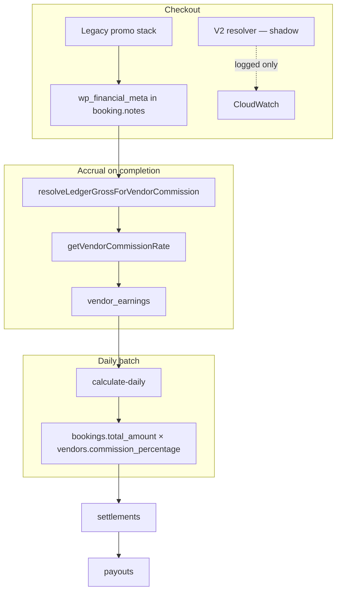
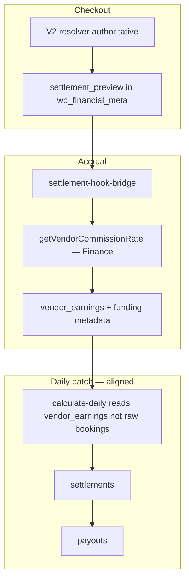

# Settlement Architecture Analysis

**Phase:** S1 (Analysis Only)  
**Date:** 2026-07-06  
**Purpose:** Define module ownership for commission, funding, settlement, and payouts — and recommend target architecture before modifying Discount Engine settlement logic.

---

## Recommended Architecture

```
Finance Module                          Discount Engine V2
├── Vendor Tier (vendor_tiers)          ├── Promotion Resolution
├── Commission % (tier + e-com config)  ├── Coupon Resolution
├── Subscription (vendor_tier_subs)     ├── Funding Attribution (PLATFORM/VENDOR/SHARED)
├── Settlement Schedule                 ├── Winning Discount (Policy Center)
├── Payout Rules (min, auto)            └── Settlement Preview (Phase 7 — pure math)
├── Platform Fees / GST
├── Cancellation Penalties
├── Payout Execution (Razorpay)
└── Finance Reports

                    Settlement Engine (integration layer — target state)
                    ├── Reads Finance: commission %, tier hold, payout rules
                    ├── Reads Discount Engine: funding attribution, applied discounts
                    ├── Calculates final vendor net / platform liability
                    └── Writes vendor_earnings / delivery_settlements / settlement metadata
```

**Principle:** Finance owns **platform economics configuration and money movement**. Discount Engine owns **discount resolution and funding attribution**. Settlement Engine (integrated) owns **combining both into ledger rows** — not duplicating commission tier logic or promotion math.

---

## Ownership Matrix

| Calculation / Rule | Owner Module | Source of Truth | Consumed By |
|--------------------|--------------|-----------------|-------------|
| Commission % (services) | **Finance** | `vendor_tiers.commission_rate` (+ active subscription override) | Accrual, batch (denormalized copy) |
| Commission % (e-commerce) | **Finance** | `vendor_commission_config`, category/ownership tables | Order create, seller settlement |
| Vendor tier assignment | **Finance** | `vendors.tier`, `vendor_tier_subscriptions` | Commission lookup, hold period, auto-payout eligibility |
| Subscription pricing | **Finance** | `vendor_tiers.monthly_cost`, upgrade flows | Tier upgrade payments |
| Settlement hold period | **Finance** | `vendor_tiers.payout_period_days` | `calculate-daily` eligibility |
| Min payout / auto payout | **Finance** | `platform_settings` (`admin:settings:payout_rules`, schedule) | Batch, payout request |
| Settlement schedule (cron) | **Finance** | `platform_settings` + EventBridge | Daily batch trigger |
| Platform/convenience/delivery fees | **Finance** | `admin_settings` / fee config | Checkout; Phase 7 reads from context metadata |
| GST / tax | **Finance** | GST config + booking financial meta | Checkout; **not** commission base for services |
| Cancellation penalties | **Finance** | `cancellation_policies` | Daily batch |
| Payout execution | **Finance** | `settlements.ts`, Razorpay | Production payouts |
| Promotion resolution | **Discount Engine** | Unified resolver + legacy booking-promotion-service | Checkout |
| Coupon resolution | **Discount Engine** | Same | Checkout |
| Stack / priority (which discounts apply) | **Discount Engine** | Policy Center → stack/priority config | Resolver |
| Funding attribution | **Discount Engine** | Candidate normalizer + `FundingConfiguration` + campaign `funding_type` | Settlement preview |
| Campaign funding split | **Discount Engine** | `commercial_discount_campaigns.funding_split` | Campaign bridge (metadata) |
| Settlement preview | **Discount Engine** | `DefaultSettlementEngine` (Phase 7) | Hooks (when AUTHORITATIVE) |
| **Final settlement / vendor earnings row** | **Finance (today)** / **Integrated (target)** | `vendor_earnings`, `delivery_settlements` | Reports, batch, payouts |
| Finance reports | **Finance** | SQL on ledger tables + accrual materializations | Admin UI |

**Answer to architecture review questions:**

| Question | Recommendation |
|----------|----------------|
| Should Finance remain owner of commission %, tier, subscription, schedule, payout rules? | **Yes** |
| Should Discount Engine remain owner of promotion, coupon, funding, winning discount? | **Yes** |
| Should Settlement Engine only consume both outputs? | **Yes** — Phase 7 preview is the right shape; production ledger writes should consume Finance config + Discount funding, not re-derive either |

---

## Current vs Target Flow

### Today (production default: settlement mode SHADOW/OFF)



### Target (settlement mode AUTHORITATIVE + persistence wired)



---

## Two Settlement Tracks (Existing)

| Track | Ledger | Commission source | Batch input |
|-------|--------|-------------------|-------------|
| **Service / package** | `vendor_earnings` | Tier at completion | **Also** recalculated from `bookings` in batch (duplicate) |
| **Meal / pharmacy** | `delivery_settlements` | Tier on vendor subtotal | Merged into batch via `fetchEligibleDeliverySettlementsForBatchPayout` |
| **E-commerce** | `order_item_commission` + seller settlements | Category/ownership resolver | Separate admin/vendor dashboards |

Discount Engine Phase 7 hooks exist for service, package, meal, pharmacy; e-commerce seller hook is partial.

---

## Phase 7 Settlement Engine (Discount Engine)

**Location:** `backend/lambda/src/discount-engine/settlement/`

| Component | Role |
|-----------|------|
| `FundingAllocator` | Split each applied discount by PLATFORM / VENDOR / SHARED |
| `SettlementCalculator` | Vendor receivable, platform cost, fees from context metadata |
| `DefaultSettlementEngine` | Orchestrates preview + audit |
| `settlement-hook-bridge` | Reduces commissionable gross when AUTHORITATIVE |

**Reads:** Applied discounts, `FundingConfiguration`, context fees metadata, optional commission hint.  
**Writes:** In-memory preview only — **no** `vendor_earnings` / `settlements` / Razorpay.

**Feature flag:** `DISCOUNT_ENGINE_V2_SETTLEMENT_MODE` — OFF | SHADOW (default) | AUTHORITATIVE.

---

## Finance Settlement (Production)

**Location:** `backend/lambda/src/endpoints/settlement&payouts/endpoints/settlements.ts`

**Reads:** Eligible bookings (tier hold), `vendors.commission_percentage`, delivery_settlements, payout_rules, cancellation policies.  
**Writes:** `settlements`, triggers `payouts`, marks bookings settled.

**Does not read:** Discount Engine settlement preview, `settlement_rules` dynamic matcher, Policy Center funding config.

---

## Integration Gap (Critical)

| Step | Status |
|------|--------|
| Resolver computes funding split | Implemented (Phase 7) |
| Preview persisted at checkout | **Not wired** (`financial-meta-bridge.ts` unused) |
| Accrual uses preview | Hook exists; falls back to legacy gross without stored preview |
| Batch uses accrual ledger | **No** — batch recalculates from `bookings.total_amount` |
| Ledger stores funding breakup | **No** — `buildSettlementMetadataForLedger()` not called in production |
| Dynamic settlement rules | CRUD only — no runtime matcher |

---

## Source of Truth Summary

| Financial value | Authoritative source (target) |
|-----------------|-------------------------------|
| List / service price | Booking `base_price` + service snapshot |
| Customer paid | Payment record + `wp_financial_meta.finalPaid` |
| Discount amounts | Discount Engine resolver (target) / legacy stack (today) |
| Who funded each discount | Discount Engine `appliedFunding[]` |
| Commission rate | Finance `vendor_tiers` (+ subscription) |
| Commission base | Finance gross **minus vendor-funded discount shares** (when authoritative) |
| Vendor net per booking | `vendor_earnings.amount` (should align with preview) |
| Payout batch total | Sum of eligible `vendor_earnings` + `delivery_settlements` (target) |
| Money in bank | Finance `payouts` + Razorpay |

---

## What Should NOT Move to Discount Engine

- Tier definitions and commission percentages  
- Payout schedules and Razorpay integration  
- GST configuration and tax reporting  
- Cancellation penalty policies  
- Admin accrual reports and CSV exports  
- E-commerce category commission model  

## What Should NOT Stay Duplicated in Finance

- Promotion stacking logic (already in Discount Engine)  
- Funding split math (Phase 7 Settlement Engine)  
- Hardcoded default commission in batch vs accrual paths  

---

## Related Documents

- `docs/FINANCE_CURRENT_STATE.md` — inventory  
- `docs/COMMISSION_POLICY_ANALYSIS.md` — commission base details  
- `docs/FINANCE_REUSE_PLAN.md` — reuse matrix  
- `docs/SETTLEMENT_MIGRATION_PLAN.md` — phased integration plan  
- `docs/FINANCE_GAP_ANALYSIS.md` — known problems  
