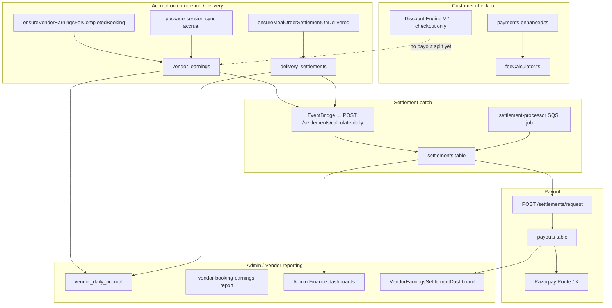

# Warmpawz Settlement System — Current State Analysis

**Phase:** 7 Discovery (documentation only)  
**Date:** 2026-07-03  
**Status:** Read-only inventory — no code changes  
**Purpose:** Map what exists today so Phase 7 extends the ecosystem instead of duplicating it.

---

## Executive Summary

Warmpawz already has a **multi-track settlement system** that is live in production for service bookings, package sessions, meal/pharmacy delivery, and e-commerce sellers. Settlement is **not greenfield**.

| Domain | Settlement track | Primary ledger table | Payout path |
|--------|------------------|----------------------|-------------|
| **Service bookings** | Booking completion → tier commission → daily batch | `vendor_earnings` | `settlements` → `payouts` → Razorpay |
| **Package bookings** | Per-session accrual on child booking completion | `vendor_earnings` (same pipeline) | Same as service |
| **Meal plan orders** | Order delivered → tier commission on vendor subtotal | `delivery_settlements` | Fed into daily batch + accrual |
| **Pharmacy orders** | Order delivered → tier commission | `delivery_settlements` | Same as meals |
| **E-commerce orders** | Seller commission on order totals | `settlements` (aggregated) + `ecommerce_commission_settings` | Admin/vendor seller dashboards |

**Admin finance** is centralized under `/finance` with settlement dashboards, payout management, accrual reports, tier rules, and GST configuration. **Vendor finance** uses `VendorEarningsSettlementDashboard` for service vendors and `SellerHub` for e-commerce sellers — separate UIs, partially shared backend tables.

**Discount Engine V2 Settlement Engine** (`discount-engine/contracts/settlement-engine.ts`) is a **contract stub only**. Promotions affect checkout and refunds but **do not yet split funding** (PLATFORM / VENDOR / SHARED) at payout time. Phase 7 should **wire into** existing `vendor_earnings` / `delivery_settlements` math, not replace payout infrastructure.

---

## Current Architecture

### High-level system map



### Layer model (typical service booking flow)

```
Customer UI (UniversalPaymentPage)
  ↓ GET /config/fees, POST /payments/create
payments-enhanced.ts + feeCalculator.ts
  ↓ payments row (amount, platform_fee, GST columns)
Booking completion (vendor/staff/GPS complete)
  ↓ ensureVendorEarningsForCompletedBooking()
vendor-earnings-on-completion.ts
  ↓ INSERT vendor_earnings
EventBridge cron (daily)
  ↓ POST /settlements/calculate-daily
settlements.ts
  ↓ INSERT settlements, link earnings, penalties, delivery_settlements
Vendor request OR admin process
  ↓ POST /settlements/request | POST /payouts/process
payouts + Razorpay
  ↓ vendor_earnings.status = paid_out
Admin / Vendor dashboards read settlements + earnings
```

---

## Existing Settlement Flows

### 1. Service Bookings

| Stage | Component | Path |
|-------|-----------|------|
| Fee quote | `feeCalculator.ts` | `GET /config/fees` |
| Payment capture | `payments-enhanced.ts` | `POST /payments/create`, `/payments/verify` |
| Completion hook | `vendor-earnings-on-completion.ts` | Called from `vendor-booking-actions.ts`, `staff.ts`, `vendor.gpstracking.ts`, `tele-completion-service.ts` |
| Commission base | `resolveLedgerGrossForVendorCommission()` | Vendor **list/service price** when known; falls back to booking `total_amount` / payments |
| Commission rate | `vendor-commission-rate.ts` | From `vendor_tiers.commission_rate` (default ~15%) |
| Ledger row | `vendor_earnings` | `amount` (net), `commission_amount`, `total_amount` (gross), `status=pending` |
| Daily settlement | `settlements.ts` | Eligible when `bookings.settled_at IS NULL`, past tier hold (`payout_period_days`) |
| Vendor view | `vendor-dashboard-enhanced.ts` | `GET /vendor/:id/earnings`, `/vendor/:id/settlements` |
| Admin reports | `admin-vendor-booking-earnings.ts`, `admin-vendor-daily-accrual.ts` | CSV exports, IST accrual |

**Settlement calculation:** Yes — on completion + daily batch.  
**Dashboard:** Yes — vendor + admin.  
**Reports:** Yes — booking earnings waterfall, daily/monthly accrual.  
**Vendor payout:** Yes — request + Razorpay.  
**Platform revenue:** Yes — commission on gross; platform/convenience/delivery fees on payment row.  
**Transaction history:** Yes — `payments`, `vendor_earnings`, `payouts`.

### 2. Package Bookings

Package purchases create a **parent booking**; each **child session booking** accrues earnings separately.

| Stage | Component | Notes |
|-------|-----------|-------|
| Session completion | `package-session-sync.ts` → `accrueVendorEarningsForPackageSessionChild()` | Splits parent `total_amount` ÷ N sessions; last session absorbs remainder |
| Ledger | `vendor_earnings` | One row per child `booking_id` (idempotent) |
| Commission | `getVendorCommissionRate()` | Same tier rate as service bookings |
| Settlement batch | Same as service | `vendor_earnings` → `calculate-daily` |

**No separate package settlement module.** Reuses service booking pipeline entirely.

### 3. Meal Plan Orders

| Stage | Component | Path |
|-------|-----------|------|
| Checkout fees | `meal-checkout-platform-fees.ts`, `meal-subscription-checkout-fees.ts` | Platform/convenience/delivery on order |
| Delivery trigger | `delivery-tracking.ts`, `logistics-webhooks.ts` | On `delivered` status |
| Settlement create | `meal-order-settlement.ts` → `ensureMealOrderSettlementOnDelivered()` | Writes `delivery_settlements` |
| Commission base | `resolveVendorMealListingAmount()` | Vendor **subtotal only** — customer fees/GST excluded from vendor net |
| Subscription parent | Per-session food amount | `subtotal / totalSessions` for vendor booking role `parent` |
| Refunds | `meal-refund-cases.ts`, `meal-refund-case-execution.ts` | Separate meal refund workflow |
| Admin accrual | `vendor-accrual-fee-breakdown.ts` | Includes delivery_settlements by `order_delivered_at` IST |

**Settlement calculation:** Yes — on deliver.  
**Dashboard:** Vendor earnings dashboard (shared); no meal-specific settlement page.  
**Reports:** Included in vendor daily accrual.  
**Vendor payout:** Via `delivery_settlements` → daily batch.  
**Platform revenue:** Platform/convenience/delivery fees on order; commission on vendor subtotal.

### 4. E-commerce Orders

| Stage | Component | Path |
|-------|-----------|------|
| Order create | `ecommerce.ts` | `POST /ecommerce/orders`, generic `POST /orders` |
| Seller commission | `seller-commission-rate.ts` | Priority: `commission_tiers` → `ecommerce_commission_settings.seller_rates` → vendor tier → default |
| Admin config | `ecommerce.ts` | `GET/PUT /admin/ecommerce/commission/settings` |
| Settlement stats | `ecommerce.ts` dashboard | Reads `settlements` table aggregates (pending count/amount) |
| Seller UI | `SellerHub` | Revenue KPIs, commission calculator, GSTR/platform tax invoices |
| Pharmacy overlap | `pharmacy-orders.ts` | Uses `delivery_settlements` (delivery track, not classic ecommerce) |

**Settlement calculation:** Partial — commission settings exist; seller settlement aggregation uses generic `settlements` table. Less mature than service booking ledger.  
**Dashboard:** Admin `/ecommerce` (KPIs only); vendor `/seller` hub.  
**Reports:** `ECommerceAnalytics`, seller invoices.  
**Vendor payout:** Shared payout infrastructure; seller-specific breakup less detailed than service.

---

## Existing Dashboards

### Admin Web

| Route | Component | Purpose |
|-------|-----------|---------|
| `/finance` | Tabbed hub | Primary finance operations |
| `/finance?tab=settlements` | `SettlementDashboard` | Settlement list, KPIs, pie chart, CSV export |
| `/finance?tab=payouts` | `PayoutManagement` | Payout queue, process/reject |
| `/finance?tab=vendor-daily-accrual` | `VendorDailyAccrualReport` | IST daily accrual compute + CSV |
| `/finance?tab=vendor-monthly-accrual` | `VendorMonthlyAccrualReport` | Monthly rollup |
| `/finance?tab=vendor-booking-earnings` | `VendorBookingEarningsReport` | Per-booking waterfall |
| `/finance?tab=tiers` | `TierManagement` | Commission tiers, hold periods |
| `/finance?tab=settlement-rules` | `DynamicSettlementRulesManager` | Configurable settlement rules |
| `/finance?tab=schedule-settings` | `SettlementScheduleSettings` | EventBridge cron config |
| `/finance?tab=fee-config` | `FeeConfigurationManager` | Platform/convenience/delivery fees |
| `/finance?tab=gst-config` | `GSTConfigurationManagement` | GST rules |
| `/settlements` | Standalone ops page | Bulk process, retry, detail modal |
| `/ecommerce` | `ECommerceDashboard` | Seller stats, pending settlement KPIs (settlement tab not wired) |
| `/analytics` | Platform revenue charts | Not settlement-specific |

**Service vs E-commerce:** Separate admin routes. Service settlement ops live under `/finance`. E-commerce has commission settings and analytics under `/ecommerce`; dedicated ecommerce `SettlementsDashboard` component exists but is **orphan (not mounted)**.

### Vendor Web

| Route | Component | Audience |
|-------|-----------|----------|
| `/finance/settlements`, `/earnings`, `/settlements` | `VendorEarningsSettlementDashboard` | Service vendors |
| `/finance/wallet` | `VendorWalletDashboard` | Loyalty/wallet (not settlement) |
| `/finance/bank`, `/bank-details` | Bank/UPI verification | All vendors |
| `/seller` | `SellerHub` | E-commerce sellers |

**Service dashboard tabs:** overview, earnings, settlements, tier — KPI cards, period filter, payout request, breakup modal, statement download.

**Seller dashboard tabs:** dashboard, commission, analytics, invoices — revenue/net earnings/commission KPIs, GSTR export, platform tax PDFs.

### Customer Web

No settlement dashboards. `/wallet` only — customer spendable balance.

---

## Existing APIs

### Core settlement & payout

| Method | Route | File | Purpose |
|--------|-------|------|---------|
| GET | `/settlements` | `settlements.ts` | List settlements |
| GET | `/settlements/summary` | `settlements.ts` | Aggregated stats |
| GET | `/settlements/:id` | `settlements.ts` | Detail |
| POST | `/settlements/calculate-daily` | `settlements.ts` | **Daily batch job** |
| GET | `/settlements/vendor/:vendorId` | `settlements.ts` | Vendor history |
| POST | `/settlements/request` | `settlements.ts` | Vendor payout request (min ₹5000) |
| POST | `/settlements/process-payouts` | `settlements.ts` | Batch payout |
| GET | `/payouts/vendor/:vendorId` | `settlements.ts` | Payout history |
| POST | `/payouts/process` | `settlements.ts` | Process single payout |
| POST | `/payouts/sync-status` | `settlements.ts` | Razorpay status sync |

### Admin finance

| Method | Route | Purpose |
|--------|-------|---------|
| GET | `/admin/finance/settlements` | Admin settlement list |
| GET | `/admin/settlements/stats` | Dashboard KPIs |
| POST | `/admin/payments/settlements/:id/process` | Process settlement |
| GET/POST/PUT/DELETE | `/admin/finance/settlement-rules` | Dynamic rules |
| GET/POST | `/admin/finance/settlement-schedule` | Cron schedule |
| GET/POST | `/admin/finance/vendor-daily-accrual` | Accrual compute |
| GET | `/admin/finance/vendor-daily-accrual/export.csv` | CSV export |
| GET | `/admin/finance/vendor-booking-earnings` | Booking waterfall |
| GET/PUT | `/admin/ecommerce/commission/settings` | Seller commission |
| GET | `/admin/payouts`, `/admin/payouts/stats` | Payout management |

### Vendor finance

| Method | Route | Purpose |
|--------|-------|---------|
| GET | `/vendor/:id/earnings?period=` | Earnings summary |
| GET | `/vendor/:id/settlements` | Settlement history + breakup |
| GET | `/vendor/:id/settlements/:id/breakup` | Line-item breakup |
| POST | `/settlements/request` | Request payout |
| GET | `/vendor/:id/commission-analytics` | Seller commission (e-commerce) |
| GET | `/vendor/:id/analytics/sales` | Seller sales analytics |

### Payment & refund (settlement-adjacent)

| Method | Route | Purpose |
|--------|-------|---------|
| POST | `/payments/create`, `/payments/verify` | Capture with fees |
| GET | `/config/fees` | Checkout fee parity |
| POST | `/refunds/create` | Refund initiation |
| POST | `/refund-policy/calculate` | Tier-based refund calc |

### Razorpay settlement

| Method | Route | File |
|--------|-------|------|
| POST | `/razorpay/linked-account/create` | `razorpay-settlements.ts` |
| POST | `/settlements/auto-process` | Auto payout |
| POST | `/admin/payments/settlements/:id/process` | Admin process |

---

## Existing Database

### Core settlement tables

| Table | Migration(s) | Purpose |
|-------|--------------|---------|
| `vendor_earnings` | 028, 535 | Per-booking ledger (service + package sessions) |
| `settlements` | 001, 020 | Settlement batches |
| `settlement_booking_mappings` | 008 | Booking ↔ settlement links |
| `settlement_rules` | 550, 719 | Admin dynamic rules |
| `settlement_schedules` | 001 | Per-vendor schedule |
| `payouts` | 001, 028, 729, 730 | Payout records + Razorpay IDs |
| `pending_payouts` | 001 | Queued payouts |
| `payout_policies` | 028, 010 | Hold period, min amount |
| `payout_rules` | 001 | Platform payout config |
| `payout_locks` | 011 | Concurrency |
| `delivery_settlements` | 200, 750 | Meal/pharmacy vendor lines |
| `vendor_daily_accrual` | 732, 753 | IST daily snapshot |
| `vendor_settlements` | 057 | Legacy/alternate tracking |
| `vendor_bank_accounts` | 200 | Verified bank for Razorpay |
| `ecommerce_commission_settings` | 029 | Seller commission config |
| `commission_tiers` | 100, 101 | E-commerce tiers |
| `platform_revenue` / `platform_revenue_monthly` | 001, 008, 011 | Platform revenue aggregates |
| `tier_upgrade_deductions` | 029 | Deducted in settlement-processor |

### Ledger / wallet / tax

| Table | Purpose |
|-------|---------|
| `chart_of_accounts`, `general_ledger` | Double-entry ledger (007, 045) |
| `customer_wallets`, `wallet_transactions` | Customer wallet |
| `vendor_wallets`, `vendor_wallet_transactions` | Vendor loyalty wallet (623) |
| `payments` (+ GST columns 510) | Payment captures with fees |
| `bookings.settled_at` | Settlement tracking (016) |
| `platform_tax_documents` | Platform tax docs (1046) |

### Key `vendor_earnings` columns

- `amount` — vendor net after commission  
- `commission_amount`, `commission_rate`, `total_amount` — gross and tier rate  
- `status` — `pending` → `settled` → `paid_out` | `cancelled`  
- `settlement_id`, `payout_id`, `realized_at`

### RPC functions (`009_financial_rpc_functions.sql`)

- `update_vendor_earnings`, `reverse_vendor_earnings`, `reverse_platform_commission`

---

## Existing Calculations

### Vendor earnings (service / package)

```
gross = resolveLedgerGrossForVendorCommission(booking)  // vendor list price preferred
commission = gross × tier_commission_rate
vendor_net = gross - commission
→ INSERT vendor_earnings
```

**Location:** `vendor-earnings-on-completion.ts`, `package-session-sync.ts`

### Meal / pharmacy vendor net

```
vendorMealAmount = order.subtotal (or subtotal/sessions for subscription parent)
commission = vendorMealAmount × tier_rate
netPayout = vendorMealAmount - commission
// delivery_fee, platform_fee, convenience_fee, GST → customer-paid, not deducted from vendor net
→ INSERT delivery_settlements
```

**Location:** `meal-order-settlement.ts`, `pharmacy-orders.ts`

### Platform / customer fees (checkout)

```
platformFee = % or flat from admin_settings (feeCalculator.ts)
convenienceFee, deliveryFee, packagingFee
→ stored on payments / order rows
```

**Location:** `feeCalculator.ts`, `payments-enhanced.ts`

### E-commerce seller commission

```
rate = commission_tiers → ecommerce_commission_settings → vendor_tier → default
commission = order_total × rate
```

**Location:** `seller-commission-rate.ts`

### Refunds

```
refundableBase = SUM(payment.amount - platform_fee)  // platform fee non-refundable
fallback: total_amount - discount_amount
```

**Location:** `refundable-base.ts`, `refunds.ts`, meal refund cases

### GST / tax

- Catalog/service tax fields (040, 041)  
- GST configurations (018, 512, 600, 701, 1013)  
- Accrual breakdown: `vendor-accrual-fee-breakdown.ts`  
- Platform tax issuance: `platform-tax-issue.service.ts`

### Promotions / coupons / funding (today)

| Concern | Current behaviour |
|---------|-------------------|
| Checkout discount | Discount Engine V2 reduces customer `finalAmount` |
| Commission base (bookings) | Uses vendor list price — **not** reduced by vendor-funded promo at earnings time |
| Refunds | `discount_amount` subtracted from refundable base when no payment rows |
| Funding split (PLATFORM/VENDOR/SHARED) | **Metadata only** in discount-engine; **not applied** to `vendor_earnings` or `delivery_settlements` |
| Settlement preview | `DiscountSettlementPreview` shape defined; **never populated** |

---

## Existing Reports & Jobs

| Report / Job | Trigger | Output |
|--------------|---------|--------|
| Daily settlement batch | EventBridge → `POST /settlements/calculate-daily` | `settlements` rows |
| SQS settlement-processor | Per-booking messages | Links earnings, Razorpay Route |
| Vendor daily accrual | Admin compute | `vendor_daily_accrual` table + CSV |
| Vendor booking earnings | Admin export | Per-booking waterfall CSV |
| Vendor monthly accrual | Admin compute | Monthly CSV |
| Payout status sync | `PayoutStatusSyncService` | UTR/status on `payouts` |
| Platform analytics | `/admin/analytics/revenue` | Charts (not settlement ledger) |
| E2E test | `tests/e2e/vendor-earnings-settlement.test.ts` | Full flow validation |

**Scripts:** `seed-finance-settlements-demo.js`, `check-settlement-eligibility.js`, `validate-payout-flow-forensic.js`, `eventbridge-settlement-calculate-daily.ps1`

---

## Existing Business Rules (observed)

| Rule | Value / behaviour | Source |
|------|-------------------|--------|
| Min vendor payout request | ₹5000 | `vendor-payout.ts` constant |
| Tier hold period | `vendor_tiers.payout_period_days` (default 7) | settlements batch eligibility |
| Default booking commission | ~15% from tier; reference tiers 8–15% | `vendor-commission-rate.ts`, `commission.ts` |
| Gold+ auto Razorpay payout | `tier_level >= 3` | settlement-processor |
| Platform fee | Non-refundable on refund | `refundable-base.ts` |
| Exclusive promos | Affect checkout only today | discount-engine |
| Cancellation penalties | Included in daily batch | `538_bookings_cancelled_by_penalty_processed.sql` |
| Meal subscription | Per-session vendor amount from upfront subtotal | `meal-order-settlement.ts` |

---

## Reuse Opportunities (summary)

See `docs/SETTLEMENT_REUSE_MAP.md` for full component matrix.

**Reuse as-is:**
- `vendor_earnings` / `delivery_settlements` ledger tables  
- `settlements.ts` batch + payout flow  
- Admin `/finance` dashboards and accrual reports  
- `VendorEarningsSettlementDashboard`  
- `feeCalculator.ts`, `refundable-base.ts`  
- Razorpay payout integration  

**Needs extension (Phase 7):**
- Discount Engine `SettlementEngine` implementation  
- Funding split at earnings insert time  
- `DiscountSettlementPreview` population in resolver  
- E-commerce seller settlement detail parity with service  

**Legacy / duplicate (do not rebuild):**
- `vendor_settlements` (057) — alternate/legacy  
- Orphan admin `SettlementsDashboard` (ecommerce)  
- `FinanceManagement.tsx`, `AdminSettlementsPage.tsx` — superseded by `/finance`  

---

## Functional Gaps

1. **No promotion funding split at payout** — PLATFORM/VENDOR/SHARED not reflected in `vendor_earnings` / `delivery_settlements`.  
2. **Discount Engine settlement stub** — contract exists; no implementation.  
3. **E-commerce settlement detail** — less granular than service booking waterfall.  
4. **Meal promo impact on subtotal** — depends on whether subtotal was reduced at order creation; not centrally documented.  
5. **Package parent booking** — parent row may not get earnings; only child sessions accrue (by design, but easy to misread).  
6. **Admin ecommerce settlement UI** — KPI on dashboard; dedicated settlement tab not wired.

---

## Architecture Gaps

1. **Two accrual tracks** — `vendor_earnings` vs `delivery_settlements` merged only at batch/accrual layer; no unified ledger abstraction.  
2. **Commission base inconsistency** — bookings use list price; meals use subtotal; e-commerce uses order total; package uses sliced parent total.  
3. **Discount engine disconnected** — resolver produces `applied[]` with funding metadata; payout path never reads it.  
4. **CDK settlement-processor vs deploy scripts** — SQS processor defined in CDK; primary cron uses HTTP `calculate-daily`.  
5. **Double-entry ledger** — tables exist (`general_ledger`); not clearly wired to daily settlement batch in all paths.

---

## Product Gaps (future, not bugs)

- Admin UI to configure promotion funding impact on settlement  
- Unified vendor statement across service + meal + ecommerce  
- Real-time settlement preview at checkout (Discount Engine Phase 7)  
- Campaign-level settlement grouping (Discount Engine Phase 10)

---

## Deferred Work (already planned)

| Item | Phase | Notes |
|------|-------|-------|
| Settlement Engine implementation | Discount Engine Phase 7 | `contracts/settlement-engine.ts` |
| Funding allocation & ledger preview | Phase 7 | STACK_POLICY.md Section 7 |
| Feature flag cutover | Phase 8 | Resolver authoritative |
| Analytics on settlement audit | Phase 9 | Reads fingerprint + audit |
| Campaign stack groups | Phase 10 | Atomic bundles |

---

## Recommended Phase 7 Extension Strategy

### Principle: extend, do not replace

Phase 7 **Settlement Engine** inside Discount Engine V2 should:

1. **Implement** `SettlementEngine.compute(context, DiscountEngineResult)` returning populated `DiscountSettlementPreview`.  
2. **Call from unified resolver** after Stack Engine (when flag enabled) — shadow mode first.  
3. **Emit funding split entries** per applied discount (`PLATFORM`, `VENDOR`, `SHARED` + split %).  
4. **Adapter layer** to existing payout math:
   - Service/package → adjust or annotate `vendor_earnings` commission base / metadata (not replace insert hook).  
   - Meals → extend `delivery_settlements` breakup JSON with promo funding lines.  
   - E-commerce → pass split to seller commission calculation.  
5. **Preserve** all existing APIs, dashboards, and Razorpay flows — add columns/metadata/audit, don't rewrite `settlements.ts`.  
6. **Reuse** `vendor-accrual-fee-breakdown.ts` patterns for GST/fee reporting extensions.  
7. **Shadow compare** resolver settlement preview vs legacy earnings rows before authoritative cutover (mirror Phase 5–6 pattern).

### Suggested implementation order

```
1. Implement SettlementEngine pure function (funding split from applied[] + RuntimePolicy)
2. Populate DiscountSettlementPreview in resolver (SHADOW mode)
3. Add settlement_audit / metadata columns on vendor_earnings + delivery_settlements (migration)
4. Extend ensureVendorEarningsForCompletedBooking to read settlement preview when AUTHORITATIVE
5. Extend meal-order-settlement similarly
6. Admin accrual reports: optional promo funding columns
7. Phase 8 flag cutover
```

### Do NOT in Phase 7

- Replace `settlements.ts` or Razorpay payout pipeline  
- Build new admin settlement dashboard from scratch  
- Duplicate fee calculation in discount-engine  
- Change production checkout endpoints until Phase 8

---

## Related documentation

- `backend/lambda/src/discount-engine/STACK_POLICY.md` — Settlement Engine contract (Section 7)  
- `backend/lambda/src/discount-engine/PHASE6_MIGRATION_REPORT.md` — Stack Engine (feeds Settlement input)  
- `docs/PROMOTION_SYSTEM_STATUS.md` — Promotion inventory (if present locally)  
- `docs/SETTLEMENT_REUSE_MAP.md` — Component reuse matrix
