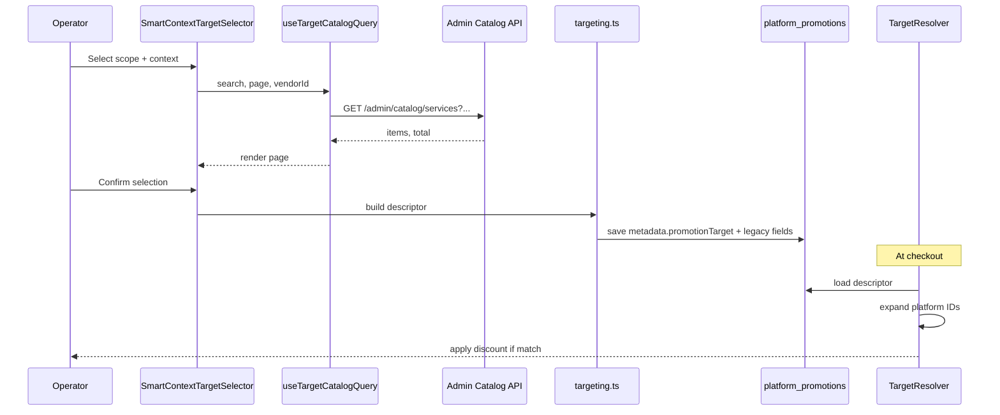

# Target Selection — Technical Architecture

**Date:** 2026-07-06  
**Status:** Recommended architecture (analysis only)  
**Companion:** `TARGET_SELECTION_UX_RECOMMENDATION.md`, `TARGET_SELECTION_REUSE_PLAN.md`

---

## 1. Current Architecture

### 1.1 Layer diagram

```
┌──────────────────────────────────────────────────────────────────┐
│ Presentation Layer                                                │
│  AdminPromotionHub │ ServicePromotionsHub │ SellerPromotionsHub  │
│  CampaignOrchestrationPanel │ PromotionWizard                     │
│  PromotionTargetSelector (shared)                                 │
└────────────────────────────┬─────────────────────────────────────┘
                             │
┌────────────────────────────▼─────────────────────────────────────┐
│ Client Catalog Layer                                              │
│  promotion-catalog-loader.ts (admin — eager, 8 APIs)             │
│  inline load() in vendor hubs (eager, 2–4 APIs)                  │
│  catalogForSurface() — client slice                              │
└────────────────────────────┬─────────────────────────────────────┘
                             │
┌────────────────────────────▼─────────────────────────────────────┐
│ Form / Persistence Layer                                          │
│  targeting.ts — token build/parse                                 │
│  mappers.ts — actor payloads                                      │
└────────────────────────────┬─────────────────────────────────────┘
                             │
┌────────────────────────────▼─────────────────────────────────────┐
│ API Layer (existing)                                              │
│  /admin/catalog/* │ /admin/vendors │ /meal-plans/search          │
│  /vendor/{id}/services/enabled │ /packages │ /products           │
│  /admin/promotions │ /admin/coupons │ /vendor/.../promotions     │
└────────────────────────────┬─────────────────────────────────────┘
                             │
┌────────────────────────────▼─────────────────────────────────────┐
│ Storage Layer                                                     │
│  platform_promotions │ vendor_service_promotions │ product promos │
│  applicable_services (mixed) │ applicable_products │ vendor_ids  │
│  metadata.promotionTarget (optional round-trip)                   │
└────────────────────────────┬─────────────────────────────────────┘
                             │
┌────────────────────────────▼─────────────────────────────────────┐
│ Discount Engine V2 + Legacy                                       │
│  candidate-normalizer │ providers │ production-bridge             │
│  booking-promotion-service │ vendor-promotion-engine               │
└──────────────────────────────────────────────────────────────────┘
```

### 1.2 Current ID flow

```
Admin UI selects service_id (platform)
        │
        ▼
applicable_services: ["grooming", "style:at_home", "<service_uuid>"]
        │
        ▼
Platform promotion row
        │
        ▼
Engine match at checkout ──?──► vendor_services row (different UUID)
```

**Gap:** Mapping from `service_catalog.service_id` → `vendor_services` rows is engine responsibility, not UI.

### 1.3 Current catalog flow

**Eager load on mount:**

1. Hub opens
2. All catalog APIs fire in parallel
3. Full catalog in React state for wizard lifetime
4. Selector filters client-side

---

## 2. Recommended Architecture

### 2.1 Design principles

1. **Canonical target descriptor** — store structured targets, not only mixed tokens.
2. **Platform vs inventory ID namespaces** — explicit in schema (`id_type` or separate columns).
3. **Lazy catalog with search** — paginated APIs consumed by selector hooks.
4. **Engine normalization layer** — resolves platform IDs to checkout line items.
5. **Domain extension registry** — register new scopes without forked UI.

### 2.2 Recommended layer diagram

```
┌──────────────────────────────────────────────────────────────────┐
│ SmartContextTargetSelector (extends PromotionTargetSelector)      │
│  + TargetContextBar (platform | vendor | seller)                  │
│  + useTargetCatalogQuery(scope, context, search, page)            │
└────────────────────────────┬─────────────────────────────────────┘
                             │
┌────────────────────────────▼─────────────────────────────────────┐
│ Catalog Query Hook (new — client)                                   │
│  wraps existing APIs initially; optional unified endpoint later   │
└────────────────────────────┬─────────────────────────────────────┘
                             │
┌────────────────────────────▼─────────────────────────────────────┐
│ Target Descriptor Builder (extends targeting.ts)                  │
│  PromotionTargetDescriptor { scopes, targets, idNamespaces }      │
└────────────────────────────┬─────────────────────────────────────┘
                             │
┌────────────────────────────▼─────────────────────────────────────┐
│ API Layer                                                         │
│  Phase 1: extend existing endpoints with ?search=&page=&vendorId= │
│  Phase 2: GET /admin/promotion-targets/catalog (optional unify)    │
└────────────────────────────┬─────────────────────────────────────┘
                             │
┌────────────────────────────▼─────────────────────────────────────┐
│ Storage — structured + backward compatible                        │
│  metadata.promotionTarget (canonical)                             │
│  applicable_* columns (legacy compat)                             │
│  target_snapshot at publish time (analytics immutability)         │
└────────────────────────────┬─────────────────────────────────────┘
                             │
┌────────────────────────────▼─────────────────────────────────────┐
│ Target Resolution Service (engine adapter — new module)             │
│  resolvePlatformServiceToVendorRows(service_id)                   │
│  matchCartLineItem(lineItem, descriptor)                          │
└──────────────────────────────────────────────────────────────────┘
```

---

## 3. ID Architecture — Analysis & Recommendation

### 3.1 Current ID tables

| Table / entity | Primary key used in promos | Semantics |
|----------------|---------------------------|-----------|
| `service_catalog` | `service_id` | Platform-wide service definition |
| `vendor_services` | `id` | Vendor-specific listing / pricing |
| `products` | `id` | Seller SKU |
| `packages` | `id` | Platform or vendor package row |
| `meal_plans` | `id` | Vendor or searchable meal plan |

### 3.2 Questions answered

| Question | Recommendation |
|----------|----------------|
| Should Admin save platform IDs? | **Yes** for platform-wide service definitions (`service_catalog.service_id`) |
| Should Admin save vendor IDs? | **Yes** when intent is vendor-specific (`vendor_services.id`, vendor UUID) |
| Should Engine normalize? | **Yes** — central `TargetResolutionService` in discount-engine |
| Should IDs be unified? | **No** — namespaces must remain distinct; unify via resolution not single UUID |
| Should mapping remain? | **Yes** — catalog→vendor mapping is domain truth |
| Best scaling architecture? | **Structured descriptor + namespace + engine resolver** |

### 3.3 Recommended target descriptor schema

```typescript
// Conceptual — not implemented in this phase
interface PromotionTargetDescriptor {
  version: 1;
  scopes: TargetScopeId[];
  targets: {
    platform_service_ids?: string[];
    vendor_service_ids?: string[];
    vendor_ids?: string[];
    category_slugs?: string[];
    styles?: string[];
    package_ids?: string[];
    meal_plan_ids?: string[];
    product_ids?: string[];
    collection_ids?: string[];  // future
  };
  id_namespaces: Record<string, 'platform' | 'vendor' | 'seller'>;
  snapshot_at?: string; // ISO — for analytics
}
```

**Persistence strategy:**

- Write full descriptor to `metadata.promotionTarget` (already partially supported).
- Continue populating legacy columns via `buildApplicableServicesFromForm()` for backward compatibility during migration.
- Engine reads descriptor first; falls back to legacy token parsing.

### 3.4 ID flow (recommended)

```
┌─────────────┐     ┌─────────────────────┐     ┌──────────────────┐
│ Admin picks │     │ Descriptor stored   │     │ Checkout cart    │
│ platform    │────►│ platform_service_ids│────►│ Resolver expands │
│ service_id  │     │ + metadata          │     │ to vendor rows   │
└─────────────┘     └─────────────────────┘     └────────┬─────────┘
                                                          │
┌─────────────┐     ┌─────────────────────┐              │
│ Vendor picks│     │ vendor_service_ids  │──────────────┤
│ own service │────►│ in descriptor       │              │
└─────────────┘     └─────────────────────┘              ▼
                                                  ┌──────────────────┐
                                                  │ Eligibility match │
                                                  └──────────────────┘
```

---

## 4. Catalog Loading — Recommended

### 4.1 Phase 1 (minimal backend — query params on existing routes)

| Scope | API pattern |
|-------|-------------|
| Platform services | `GET /admin/catalog/services?search=&page=&limit=50&category=` |
| Vendors | `GET /admin/vendors?search=&page=&limit=50` |
| Vendor services | `GET /vendor/{id}/services/enabled?search=&page=` |
| Products | `GET /admin/catalog/products?search=&page=` or vendor products |
| Categories | `GET /admin/catalog/categories` (cache 5m client-side) |

Remove or raise SQL `LIMIT 100` on admin services for paginated mode.

### 4.2 Phase 2 (optional unified endpoint)

```
GET /admin/promotion-targets/catalog
  ?surface=marketing
  &scope=services
  &context=vendor
  &vendorId=...
  &search=groom
  &page=1
  &limit=50
```

Returns:

```json
{
  "items": [{ "id": "...", "label": "...", "idType": "platform_service", "meta": {} }],
  "total": 2431,
  "page": 1,
  "hasMore": true
}
```

**Benefit:** Single contract for Smart Context selector.  
**Cost:** New handler + auth — defer until Phase 1 params prove insufficient.

### 4.3 Caching strategy

| Data | Cache |
|------|-------|
| Categories, styles | Client session 5–15 min |
| Vendor typeahead | No cache / 60s stale-while-revalidate |
| Vendor inventory | Invalidate on wizard open only |
| Platform search | No full-catalog cache |

---

## 5. Filtering Strategy

| Layer | Responsibility |
|-------|----------------|
| **Server** | search text, pagination, vendorId, category, publish_status, domain |
| **Client** | scope chip state, selected IDs, debounce, merge pages for "select all on page" |
| **Engine** | eligibility at checkout — category slug normalize, style aliases, ID expansion |

**Select all behaviour change:** "Select all" should mean **all matching current filter on server** (with confirmation) — not only visible page — for admin only.

---

## 6. Performance Model

### 6.1 Estimates

| Scenario | Current | Recommended |
|----------|---------|-------------|
| Admin hub open | 8 API calls, ~500KB | 2 calls (categories + styles); rest lazy |
| Pick vendor + services | N/A (preloaded 100 max) | 1 + 1 paginated calls |
| 500 vendors typeahead | 200 loaded static | 50 per search request |
| 100k services search | 100 visible | 50 per page, server search |
| Vendor hub | 3 calls | 3 calls (unchanged — bounded) |

### 6.2 Techniques

| Technique | Apply where |
|-----------|-------------|
| Lazy loading | Admin services/products/vendors |
| Server filtering | Admin all granular scopes |
| Pagination | Admin + seller large catalogs |
| Virtualization | Admin list when page size > 50 |
| Client filtering | Vendor hub only (<500 items) |
| Caching | Categories/styles |
| Debounced search | All admin granular scopes |

---

## 7. Engine Integration

### 7.1 Target resolution service (new — discount-engine module)

```
backend/lambda/src/discount-engine/targets/
  target-descriptor.ts       — parse/store canonical shape
  target-resolver.ts         — platform→vendor expansion
  target-matcher.ts          — cart/booking line match
```

Integrate with:

- `candidate-normalizer.ts` — attach resolved targets to candidate metadata
- `production-bridge.ts` — read descriptor in authoritative mode
- `booking-promotion-service.ts` — booking line service IDs
- `vendor-promotion-engine.ts` — cart product IDs

### 7.2 Matching rules (prescriptive)

| Target type | Matches |
|-------------|---------|
| `entire_platform` | All lines in domain |
| `category_slugs` | Line category ∈ set (case-insensitive) |
| `platform_service_ids` | Line's catalog service_id ∈ set OR vendor row linked to catalog id |
| `vendor_service_ids` | Line vendor_service id ∈ set |
| `product_ids` | Product id ∈ set |
| `styles` | Booking style normalized ∈ set |
| `vendor_ids` | Line vendor ∈ set |

---

## 8. Analytics Integration

### 8.1 Recommended approach

Store **`target_snapshot`** on promotion publish:

```json
{
  "scopes": ["services"],
  "labels": ["Full groom - Acme Vet"],
  "ids": { "platform_service_ids": ["..."], "vendor_ids": ["..."] }
}
```

**Filter dimensions:**

| Dimension | Use |
|-----------|-----|
| Campaign ID | Campaign performance |
| Promotion ID | Promo performance |
| Category slug | Rollups (existing `byCategory`) |
| Platform service ID | Service vertical reports |
| Vendor ID | Vendor-funded promo reports |
| Domain | marketing vs ecommerce |

**Do not** rely on live catalog joins for historical reports — IDs may drift.

---

## 9. Future Domain Extensibility

### 9.1 Domain registry (conceptual)

```typescript
interface TargetDomainDefinition {
  id: 'service' | 'product' | 'meal' | 'package' | 'pharmacy' | 'insurance' | 'event' | 'pet';
  scopes: TargetScopeId[];
  catalogLoader: (ctx: CatalogContext) => Promise<PaginatedTargetOptions>;
  idNamespace: string;
  engineMatcher: MatcherFn;
}
```

Register in `packages/promotion-management-ui/src/domains/registry.ts` (future).

### 9.2 Franchise / enterprise

- Add `vendor_group_id` scope — engine expands to member vendor IDs.
- Admin context bar: Franchise → Location → Inventory.

### 9.3 International / white-label

- Descriptor includes `tenant_id` / `locale` — out of scope Phase 1 but schema leaves room in metadata.

---

## 10. Migration Strategy

### Phase A — No backend (client only)

- Smart Context UI with existing APIs + client vendor filter where possible
- Fix vendor service status filters
- Persist full `metadata.promotionTarget` on all save paths

### Phase B — Minimal backend

- Add pagination/search query params to admin catalog routes
- Raise/remove LIMIT 100
- Engine reads metadata descriptor with legacy fallback

### Phase C — Resolver

- `TargetResolutionService` for platform→vendor mapping
- target_snapshot on publish

### Phase D — Unified catalog API (optional)

- Single promotion-targets endpoint
- Virtualized selector

**Backward compatibility:** All phases keep `applicable_services` token array populated.

---

## 11. Component / Data Flow (Recommended)



---

## 12. Security & Authorization

| Actor | Constraint |
|-------|------------|
| Admin | All platform catalog queries |
| Vendor | Only `/vendor/{self}/...` inventory |
| Seller | Only own products |
| Campaign orchestration | Same as admin surface |

Server must enforce vendorId in admin "vendor inventory" mode — admin role only.

---

*End of technical architecture.*
