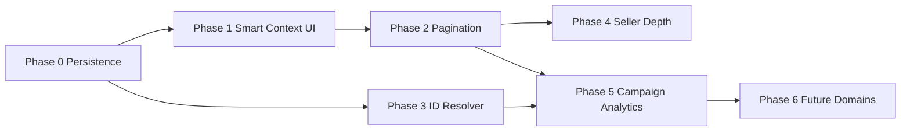

# Target Selection — Implementation Roadmap

**Date:** 2026-07-06  
**Status:** Planned phases — **not authorized for implementation** until separate approval  
**Companion:** All `TARGET_SELECTION_*.md` docs

---

## 1. Roadmap Principles

Priority order (from product brief):

1. Best user experience  
2. Scalable information architecture  
3. Reuse existing components  
4. Minimal backend changes  
5. Long-term maintainability  

Each phase is **shippable independently** with validation gates.

---

## 2. Phase Overview

| Phase | Name | Duration est. | Backend | UI | Risk |
|-------|------|---------------|---------|-----|------|
| **0** | Foundation & persistence fix | 1 sprint | Small | Small | Low |
| **1** | Smart Context UI (admin) | 1–2 sprints | Small | Medium | Medium |
| **2** | Catalog scale (pagination/search) | 1 sprint | Medium | Small | Medium |
| **3** | ID descriptor + engine resolver | 1–2 sprints | Medium | Small | High |
| **4** | Seller depth + coupon targets | 1 sprint | Medium | Medium | Medium |
| **5** | Campaign integration + analytics snapshot | 1 sprint | Small | Small | Low |
| **6** | Future domains registry | Ongoing | Per domain | Per domain | Low |

---

## 3. Phase 0 — Foundation & Persistence Fix

**Goal:** Ensure wizard targeting survives save/load; align vendor filters.

### Scope

- Fix `/admin/promotions` handler to persist `target_scopes`, `selected_targets`, `metadata.promotionTarget` (ADMIN-03).
- Extend `wizardToAdminCouponPayload()` with target fields (parity with promotions).
- Apply `isActiveLike` + `isApprovedOrUnversioned` to **services** in `ServicePromotionsHub` (match packages/meals).
- Document ID semantics in wizard summary labels (UI copy only).

### Deliverables

- [ ] Admin edit round-trip preserves all selected targets
- [ ] Admin coupon can target categories/products (minimum)
- [ ] Vendor services list excludes disabled/archived

### Dependencies

- None

### Validation

- Manual: create admin promo with category + service + style → save → edit → selections restored
- Manual: vendor sees only bookable services
- Unit: extend `targeting.test.ts` for round-trip with descriptor

### Risk: **Low**

---

## 4. Phase 1 — Smart Context UI (Admin)

**Goal:** Model D UX for admin without new unified API.

### Scope

- Add `TargetContextBar` component (platform catalog vs vendor inventory).
- Extend `PromotionTargetSelector` with optional context slot + selection summary.
- Admin marketing: when `services` scope active, require context before list.
- Wire vendor filter client-side using loaded vendor list (interim) or vendor-scoped API if available.
- Feature flag: `NEXT_PUBLIC_PROMO_TARGET_SMART_CONTEXT`.

### Deliverables

- [ ] Admin hierarchical vendor → services flow (UX)
- [ ] Platform catalog path labeled distinctly
- [ ] Entire platform / categories unchanged (low clicks)

### Dependencies

- Phase 0 persistence

### Validation

- UX walkthrough with marketing operator persona
- Click count: broad promo ≤ 3 clicks; surgical vendor promo ≤ 5 clicks
- No regression on vendor/seller hubs (flag admin-only)

### Risk: **Medium** (UX complexity)

---

## 5. Phase 2 — Catalog Scale (Pagination & Search)

**Goal:** Remove LIMIT 100/200 bottlenecks.

### Scope

**Backend:**

- `GET /admin/catalog/services` — add `search`, `page`, `limit`; raise max limit to 50 per page.
- `GET /admin/vendors` — add `search`, `page`, `limit`.
- `GET /admin/catalog/products` — add `search`, `page`, `limit`.

**Frontend:**

- Implement `useTargetCatalogQuery` hook.
- Wire `PromotionTargetSelector` paginated mode for admin granular scopes.
- Debounced search (300ms).
- Truncation banner when `total > pageSize`.

### Deliverables

- [ ] Admin can find any service/vendor via search (not limited to first 100/200)
- [ ] Hub mount does not fetch full service/product lists

### Dependencies

- Phase 1 selector extensions

### Validation

- Load test: search response < 500ms p95 on dev with seeded data
- Manual: find service beyond row 100 via search
- Memory: hub open network tab shows ≤ 3 catalog calls initially

### Risk: **Medium** (API + UI coordination)

---

## 6. Phase 3 — ID Descriptor & Engine Resolver

**Goal:** Reliable platform vs vendor ID matching at checkout.

### Scope

**Package (`targeting.ts`):**

- `buildPromotionTargetDescriptor()` with explicit namespaces.
- `parsePromotionTargetDescriptor()` with legacy fallback.

**Backend:**

- New module `discount-engine/targets/target-resolver.ts`.
- Platform `service_id` → `vendor_services` expansion query.
- Integrate with `production-bridge` when `DISCOUNT_ENGINE_V2_RESOLVER_MODE=AUTHORITATIVE`.
- Write `target_snapshot` on promotion publish.

**Mappers:**

- All save paths write descriptor + legacy tokens.

### Deliverables

- [ ] Admin platform service promo applies to all vendors offering that catalog service
- [ ] Admin vendor-specific promo applies only to that vendor's listing ID
- [ ] Booking/cart tests cover both ID types

### Dependencies

- Phase 0 persistence
- Phase 8B resolver mode infrastructure (already present)

### Validation

- Integration test: platform service_id promo + vendor booking line → discount applies
- Integration test: vendor_service_id promo + different vendor → no discount
- Shadow mode comparison logs before authoritative cutover

### Risk: **High** (checkout correctness)

### Rollback

- Resolver reads legacy tokens only; descriptor ignored if flag off.

---

## 7. Phase 4 — Seller Depth & Coupon Targets

**Goal:** E-commerce targeting matches seller mental model.

### Scope

- Seller: category grouping in selector (use existing `group` field).
- Admin ecommerce: product search with seller context filter.
- Collections scope (if `GET /vendor/{id}/collections` or equivalent exists — else stub API).
- Admin + vendor coupon full target parity in mappers and API handlers.

### Deliverables

- [ ] Seller can target category-wide product promos easily
- [ ] Admin ecommerce coupon targets specific products
- [ ] Collections scope designed (implement if API exists)

### Dependencies

- Phase 2 search infrastructure

### Validation

- Seller creates category discount → only matching products discounted at cart
- Admin ecommerce coupon code applies to targeted SKU only

### Risk: **Medium**

---

## 8. Phase 5 — Campaign Integration & Analytics

**Goal:** Consistent targeting across campaign orchestration and reporting.

### Scope

- `CampaignBuilderDialog` — link/copy to orchestration wizard for inventory targets.
- `target_snapshot` displayed read-only on campaign detail when promotion linked.
- Analytics filters: promotion ID, campaign ID, category, platform service ID.
- Immutable snapshot prevents historical drift.

### Deliverables

- [ ] Single operator path to set inventory targets for campaigns
- [ ] Analytics dashboard filters by target dimension

### Dependencies

- Phase 3 snapshot

### Validation

- Campaign with linked promo shows frozen target labels after catalog rename
- Analytics export includes target dimensions

### Risk: **Low**

---

## 9. Phase 6 — Future Domains (Incremental)

Each domain is a **plugin** to the registry — not a redesign.

| Domain | Scopes to add | Catalog source | Engine matcher |
|--------|---------------|----------------|------------------|
| Pharmacy | `pharmacy_skus`, `categories` | pharmacy catalog API | product-like |
| Insurance | `policies`, `providers` | insurance module | line item type |
| Events | `events`, `venues` | events module | ticket SKU |
| Pet marketplace | `pets`, `listings` | pet market module | listing id |

### Per-domain checklist

- [ ] Register in target domain registry
- [ ] Add scope to surface config
- [ ] Catalog loader slice
- [ ] Candidate provider
- [ ] Matcher unit tests

### Risk: **Low** per domain if registry exists

---

## 10. Legacy Retirement Milestone

| Milestone | Criteria |
|-----------|----------|
| Hide legacy modal link | Phase 1 complete + 2 weeks admin UAT |
| Remove legacy modal code | Phase 3 authoritative + 30 days no incidents |
| Remove mixed-token-only parsing | Phase 3 + all promos backfilled with descriptor |

**Backfill strategy:** Lazy migration on edit; optional batch job for active promos.

---

## 11. Dependency Graph

**Parallelizable:** Phase 1 UI can start with Phase 0; Phase 3 engine work can proceed in parallel with Phase 2 after Phase 0.

---

## 12. Validation Strategy (Cross-Phase)

### Automated

| Area | Tests |
|------|-------|
| targeting.ts | parse/build/descriptor round-trip |
| target-resolver | platform→vendor expansion |
| promotion-catalog-loader | pagination params, error handling |
| resolver-mode | existing Phase 8B tests extended |

### Manual smoke (dev)

1. Admin marketing — entire platform promo
2. Admin marketing — category + style promo
3. Admin marketing — platform service search select
4. Admin marketing — vendor → service drill-down
5. Admin ecommerce — product-targeted coupon
6. Vendor — service + package promo
7. Seller — product category promo
8. Customer checkout — correct discount application
9. Campaign orchestration — create linked promo with targets

### Performance benchmarks

| Metric | Target |
|--------|--------|
| Admin target search p95 | < 500ms |
| Selector render (50 items) | < 100ms |
| Hub initial catalog calls | ≤ 3 |
| Vendor hub load | unchanged |

---

## 13. Risk Register (Implementation)

| ID | Risk | Mitigation | Phase |
|----|------|------------|-------|
| R-01 | Wrong discount at checkout after ID resolver | SHADOW mode first; integration tests | 3 |
| R-02 | Admin API pagination breaks existing consumers | Default limit = current behaviour | 2 |
| R-03 | Operator confusion platform vs vendor ID | Clear labels + summary step | 1, 3 |
| R-04 | Legacy promos without descriptor | Fallback parser | 3 |
| R-05 | Coupon handler ignores new fields | Phase 0 API audit | 0 |
| R-06 | Scope creep into campaign audience | Keep editors separate | 5 |

---

## 14. Effort Summary

| Phase | Eng days (est.) | Notes |
|-------|-----------------|-------|
| 0 | 3–5 | API handler fix critical |
| 1 | 5–8 | UI/UX focus |
| 2 | 5–7 | Backend query params |
| 3 | 8–12 | Engine — highest care |
| 4 | 5–8 | Depends on collections API |
| 5 | 3–5 | Mostly wiring |
| 6 | 3–5 per domain | Incremental |

**Total core (Phases 0–5):** ~30–45 eng days

---

## 15. Success Criteria (from brief)

| Criterion | Phase |
|-----------|-------|
| Current target selection fully documented | ✅ Analysis docs |
| UX evaluated | ✅ UX recommendation |
| Admin experience redesigned conceptually | ✅ Model D |
| Vendor experience validated | ✅ Phase 0 filters + doc |
| Seller experience validated | ✅ Phase 4 plan |
| ID architecture analyzed | ✅ Architecture doc |
| Performance analyzed | ✅ Architecture §6 |
| Scalability analyzed | ✅ Gap analysis §6 |
| Future domains considered | ✅ Phase 6 registry |
| Reuse strategy documented | ✅ Reuse plan |
| Clear implementation roadmap | ✅ This doc |

---

## 16. Recommended Start Order

1. **Phase 0** — unblocks everything; fixes production data loss risk (ADMIN-03).  
2. **Phase 1 + 2** — can overlap; delivers visible admin UX win.  
3. **Phase 3** — coordinate with Discount Engine V2 authoritative cutover (Phase 8B).  
4. **Phase 4–5** — after admin scale path proven.  
5. **Phase 6** — as domains launch.

---

*End of implementation roadmap.*
