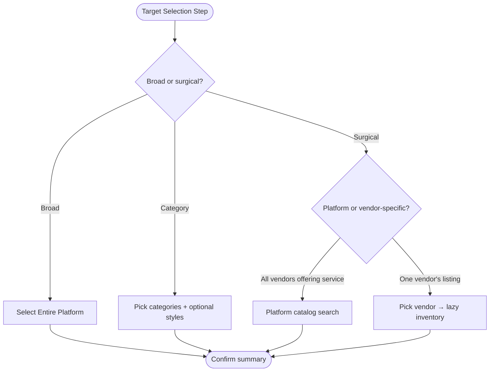

# Target Selection — UX Recommendation

**Date:** 2026-07-06  
**Status:** Analysis / design recommendation — no implementation  
**Companion:** `TARGET_SELECTION_GAP_ANALYSIS.md`, `TARGET_SELECTION_ARCHITECTURE.md`

---

## 1. Recommendation Summary

**Adopt Model D (Smart Context) as the primary UX pattern**, implemented as a **hybrid of Models B and D**:

| Actor | Primary model | Rationale |
|-------|---------------|-----------|
| **Admin (platform)** | Model D — domain/surface first, then contextual drill-down | Operator intent varies; flat catalog does not scale |
| **Vendor (service)** | Model B-lite — inventory scopes without vendor picker | Single-vendor context is implicit |
| **Seller (e-commerce)** | Model D — seller inventory with product taxonomy helpers | Aligns with SKU/collection mental model |
| **Campaign Builder** | Reuse same selector via orchestration; audience separate | Avoid duplicate inventory UX |

**Do not** retain Model A (flat platform catalog) as the default admin experience. Keep flat search as **power-user escape hatch** within a scope after contextual narrowing.

---

## 2. UX Model Comparison

### Model A — Flat Selection

```
[All Services] → Search → Multi-select checkboxes
```

| Dimension | Assessment |
|-----------|------------|
| **Pros** | Simple mental model; minimal clicks for small catalogs; already built |
| **Cons** | Breaks at 100+ items; no vendor context; truncated admin API |
| **Scalability** | ❌ Poor beyond ~500 items per scope |
| **Complexity** | Low implementation, high operational error rate at scale |
| **Performance** | Front-loads entire catalog; client filter O(n) |

**Verdict:** Retain only as **secondary panel** after filters applied, not as default admin entry.

---

### Model B — Hierarchical

```
Target Type → Vendor → Published Services → Select
```

| Dimension | Assessment |
|-----------|------------|
| **Pros** | Matches admin mental model for surgical promos; natural pagination boundary; reduces wrong selections |
| **Cons** | Extra clicks for broad promos; requires lazy-load APIs |
| **Scalability** | ✅ Good — each level paginated |
| **Complexity** | Medium — breadcrumb state, back navigation |
| **Performance** | ✅ Loads only active branch |

**Verdict:** **Required for Admin** when scope is services/packages/meals tied to vendors.

---

### Model C — Domain First

```
Marketing → Veterinary → Vendor → Services
```

| Dimension | Assessment |
|-----------|------------|
| **Pros** | Clean IA for multi-vertical platform; supports future domains |
| **Cons** | Redundant if admin already split marketing/ecommerce surfaces |
| **Scalability** | ✅ Excellent for new domains |
| **Complexity** | Medium-high — domain registry |
| **Performance** | Good with lazy catalog |

**Verdict:** **Partially adopt** — domain split already exists via `AdminPromoSurface`. Extend with **sub-domain category tree** instead of full navigation stack.

---

### Model D — Smart Context (Recommended)

```
Context (Platform | Category | Vendor | Seller)
    ↓
Adaptive picker (no unnecessary steps)
```

| Dimension | Assessment |
|-----------|------------|
| **Pros** | Min clicks for simple cases; drill-down only when needed; actor-aware |
| **Cons** | Requires clear context indicator; more design/spec work upfront |
| **Scalability** | ✅ Best long-term |
| **Complexity** | Medium — context state machine |
| **Performance** | ✅ Optimal — fetch on context |

**Verdict:** **Recommended default.**

---

## 3. Comparison Matrix

| Criterion | Model A Flat | Model B Hierarchy | Model C Domain | Model D Smart |
|-----------|--------------|-------------------|----------------|---------------|
| Clicks (broad promo) | ⭐⭐⭐ 2–3 | ⭐⭐ 4–5 | ⭐⭐ 4–6 | ⭐⭐⭐ 2–3 |
| Clicks (surgical promo) | ⭐ 5+ scroll/search | ⭐⭐⭐ 4–5 guided | ⭐⭐⭐ 4–5 | ⭐⭐⭐ 3–4 |
| 100k services scale | ❌ | ✅ | ✅ | ✅ |
| Admin productivity | ⭐ | ⭐⭐⭐ | ⭐⭐ | ⭐⭐⭐ |
| Vendor simplicity | ⭐⭐⭐ | ⭐⭐ | ⭐ | ⭐⭐⭐ |
| Seller SKU promos | ⭐ | ⭐⭐ | ⭐⭐ | ⭐⭐⭐ |
| Reuse existing UI | ⭐⭐⭐ | ⭐⭐ extend | ⭐⭐ extend | ⭐⭐⭐ extend |
| Backend change | Low | Medium | Medium | Medium |
| New domain extensibility | ❌ | ⭐⭐ | ⭐⭐⭐ | ⭐⭐⭐ |

---

## 4. Recommended User Journeys

### 4.1 Admin — Entire platform (2 clicks)

```
Promotion Wizard → Targets
  → [✓ Entire platform] chip selected
  → Summary shows "Applies platform-wide"
  → Done
```

No inventory picker shown.

---

### 4.2 Admin — Category-wide (3–4 clicks)

```
Promotion Wizard → Targets
  → Select scope: Categories
  → Category list (searchable, from API, dynamic — not hardcoded 5)
  → Optional: Service styles sub-filter
  → Done
```

No vendor drill-down required.

---

### 4.3 Admin — Vendor surgical (Smart Context path)

```
Promotion Wizard → Targets
  → Select scope: Services (or Packages / Meal plans)
  → Context bar: [All vendors ▼] → pick vendor OR search vendor
  → Lazy-loaded published inventory for that vendor
  → Multi-select + search within vendor list
  → Optional: "Add another vendor" repeats branch
  → Done
```

**Alternative path — platform catalog service:**

```
  → Context: [Platform catalog ▼]
  → Search service_catalog by name/category
  → Select service_id(s)
  → Engine maps to all vendor listings (documented behaviour)
```

Admin must understand **two ID semantics** — UI labels them clearly:

- **"Platform service (all vendors offering this)"**
- **"Specific vendor listing"**

---

### 4.4 Admin — E-Commerce product promo

```
E-Commerce surface → Targets
  → Entire marketplace | Categories | Products | Sellers
  → Products: search with server typeahead
  → Optional seller filter first
  → Done
```

---

### 4.5 Vendor — Service promo (minimal friction)

```
Vendor Hub → Create → Targets
  → Scopes: My services | My packages | Meal plans | Styles
  → Default list = enabled + published inventory only
  → Search within my catalog (client OK — bounded size)
  → Done
```

**Inventory rule recommendation:**

| State | Show in picker? |
|-------|-----------------|
| Published + enabled | ✅ Yes |
| Draft / unpublished | ❌ No |
| Disabled | ❌ No |
| Archived | ❌ No (separate "Include archived" toggle off by default) |
| Pending approval | ❌ No |

Apply **same filter to services** as already applied to packages/meals.

---

### 4.6 Seller — Product promo

```
Seller Hub → Targets
  → All products | Categories | Collections (future) | Specific SKUs
  → Group by category in list (use `group` field already in TargetOption)
  → Variant picker (future phase) via product expand row
  → Done
```

Seller UX **differs from service vendor**:

- No service styles
- Categories are seller taxonomy, not platform verticals
- Collections/brands are first-class scopes (future)
- Stock status badge optional on each row

---

### 4.7 Campaign Builder integration

```
Campaign Builder Step: Offers
  → Link existing promotion OR Create via embedded PromotionWizard
  → Inventory targets live on promotion, not campaign audience

Campaign Builder Step: Audience
  → CampaignAudienceEditor (segments only) — unchanged
```

Do **not** merge audience and inventory into one step — different concerns.

---

## 5. Decision Tree (Admin Targets)



---

## 6. Wireflow — Smart Context Selector (Conceptual)

```
┌─────────────────────────────────────────────────────────────┐
│  Target selection                                            │
│  ┌─────────┐ ┌──────────┐ ┌─────────┐ ┌──────────┐          │
│  │ Entire  │ │Categories│ │ Services│ │ Vendors  │  ...     │
│  │platform │ │          │ │         │ │          │          │
│  └────┬────┘ └────┬─────┘ └────┬────┘ └────┬─────┘          │
│       │           │            │           │                 │
│  (no list)    [category    ┌─── Context ───┐                │
│                checklist]  │ View: Platform catalog ▼       │
│                            │ Filter: Grooming ▼             │
│                            └───────────────┬────────────────┘
│                                            ▼
│                            🔍 Search services…              │
│                            ┌──────────────────────────────┐ │
│                            │ ☐ Full groom (Acme Vet)      │ │
│                            │ ☐ Bath & brush (Paws Spa)    │ │
│                            │ ... paginated / virtualized  │ │
│                            └──────────────────────────────┘ │
│  Selected: 2 services · 1 category          [Clear all]     │
└─────────────────────────────────────────────────────────────┘
```

---

## 7. Admin: Flat vs Hierarchical — Direct Answer

**Question:** Should Admin continue selecting from one massive catalog?

**Answer:** **No — not as the default.**

| Approach | When to use |
|----------|-------------|
| **Hierarchical / Smart Context** | Default for services, packages, meals, products, vendor-specific |
| **Flat search within narrowed set** | After context filter; power users; small result sets |
| **Full flat preload** | Deprecate — replace with paginated API |

Admin **should retain** platform-wide scopes (`entire_platform`, `categories`, `styles`) that don't require inventory enumeration.

---

## 8. UX Research Recommendations

### 8.1 Clicks & cognitive load

- **Default to zero list** when `entire_platform` selected.
- **Progressive disclosure:** show context bar only when a granular scope is active.
- **Selection summary chip row** above fold — always show what's selected without opening tabs.

### 8.2 Search behaviour

- Debounce 300ms.
- Server-side typeahead for admin services/products/vendors when query ≥ 2 chars.
- Recent selections (session localStorage) for operator repeat tasks.

### 8.3 Discoverability

- Empty vendor inventory: "This vendor has no published services. Pick another vendor or use platform catalog."
- Truncation banner: "Showing 50 of 2,431 — refine search or filter by vendor."

### 8.4 Error states

- Per-slice error with retry (categories failed ≠ block entire wizard).
- Persist partial selections if catalog reload fails mid-edit.

### 8.5 Accessibility

- Scope chips as `role="tablist"` with `aria-selected`.
- Checkbox list as `role="listbox"` with multi-select announcements.
- Keyboard: `/` focuses search; `Ctrl+A` select all in filtered view.

### 8.6 Mobile / tablet

- Vendor portal: full-width list, 16px tap targets, sticky selection summary.
- Admin: desktop-first but usable on tablet for approvals.

---

## 9. Customer (Read-Only) UX

No target picker. Recommend:

- Promo badges on listing cards when `entire_platform` or category match.
- "Terms" expander on applied coupon showing scope in plain language.

---

## 10. Final Recommended Option

**Model D (Smart Context)** with these principles:

1. **Actor-aware defaults** — vendor sees only their inventory; admin chooses context.
2. **Domain via existing surfaces** — marketing vs ecommerce; extend with category tree not new top nav.
3. **Lazy catalog loading** — fetch on context change, not hub mount.
4. **Dual admin semantics** — platform service ID vs vendor listing ID, explicitly labeled.
5. **Extend PromotionTargetSelector** — add context bar + server search hook; don't fork component.
6. **Campaign audience stays separate** from inventory targeting.

**Priority order honored:**

Best UX → Scalable IA → Reuse components → Minimal backend → Maintainability

---

*End of UX recommendation.*
