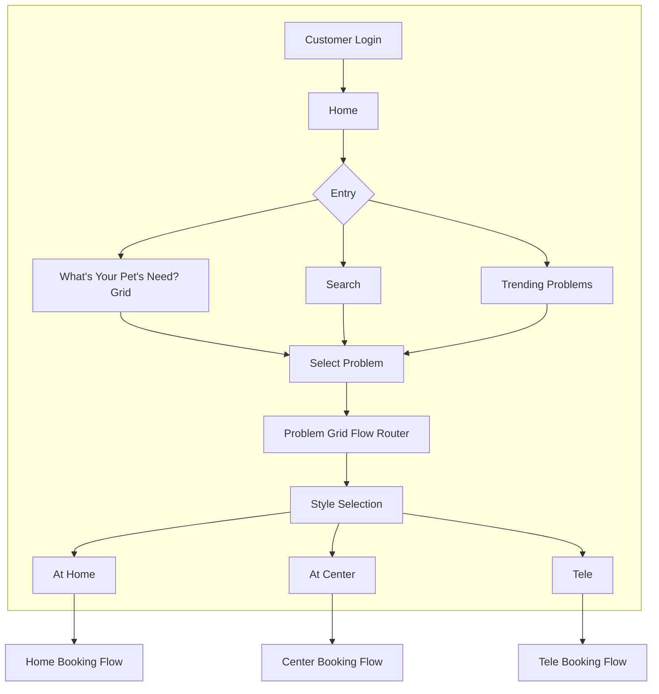
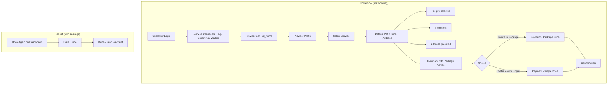

# Target State: Step-by-Step UI & Screen Specification

**Purpose:** Complete specification of target state UI, theme, service booking steps, and screen-by-screen content post Phase 4 implementation  
**Reference:** `docs/CPO_SERVICE_BOOKING_ECOSYSTEM_ANALYSIS.md` (Phases 1–4)  
**Date:** January 2025  
**Status:** Specification only — no implementation

---

## 1. UI Theme & Design System

### 1.1 Primary Theme (Warmpawz Brand)

| Token | Value | Usage |
|-------|-------|-------|
| **Primary** | `#FF8C42` (Warm Orange) | Primary actions, headers, selected states, CTAs |
| **Primary Hover** | `#FF7A2E` | Button hover, interactive hover |
| **Primary Active** | `#E67A2E` (Dark Orange Gold) | Pressed state |
| **Gradient Header** | `from-[#FF8C42] via-[#FF7A35] to-[#FF6B35]` | Standardized header, service dashboard header |
| **Background** | `bg-gray-50` | Page background |
| **Card** | `bg-white`, `border-gray-200`, `rounded-xl` | Cards, list items |
| **Text Primary** | `text-gray-900` | Headings, primary text |
| **Text Secondary** | `text-gray-500` / `text-gray-600` | Subtitles, labels |
| **Success** | Green (e.g. `#10B981`) | Health indicator good, confirmation |
| **Warning** | Amber (e.g. `#F59E0B`) | Health indicator partial |
| **Error** | Red (e.g. `#EF4444`) | Health indicator poor, errors |

### 1.2 Component Styling

- **Headers:** Orange gradient (`bg-gradient-to-r from-[#FF8C42] via-[#FF7A35] to-[#FF6B35]`), white text, back button with frosted glass (`bg-white/20 backdrop-blur-sm`), service icon in frosted container
- **Buttons:** Primary = solid orange; Secondary = outline orange; Tertiary = gray outline
- **Cards:** White background, `rounded-xl`, `shadow-sm` or `border border-gray-200`, `hover:shadow-lg hover:border-[#FF8C42]/30`
- **Step indicators:** Dots or pills; active = orange filled; inactive = gray outline
- **Typography:** Headings `font-bold` or `font-semibold`; body `font-normal`; labels `text-sm text-gray-600`

### 1.3 Layout

- **Max width:** `max-w-[430px]` (mobile-first)
- **Padding:** `px-4` or `px-6` for content
- **Spacing:** `gap-3`, `gap-4`, `mb-4` between sections

---

## 2. Phase 1 — Step Reduction: Target State UI

### 2.1 Center Visit Booking (Vet, Groomer, Trainer) — Before vs After

| Step | Current (Phase 0) | Target (Phase 1) | Information on Screen | UX Benefit |
|------|-------------------|------------------|------------------------|------------|
| **1. Service** | Service selection screen | Same | List of services with name, price, duration; icon | No change |
| **2. Staff** | Staff selection screen | **Skipped when single staff**; combined with Step 1 when only one staff | When skipped: go straight to Details | Fewer taps for solo providers |
| **3. Details** | Separate: Date → Time → Pet (3 screens or 1 screen with 3 sections) | **Single "Details" screen:** Pet (pre-selected) + Date + Time in one view | Pet dropdown (default: last-used pet), Calendar picker, Time slots; all visible in one scroll | Fewer navigations; defaults reduce input |
| **4. Payment** | Payment screen | Same | Amount, payment method, promo code | No change |
| **5. Confirmation** | Confirmation screen | Same | Booking summary, next steps | No change |

**Step count:** 5–6 → **4** (when single staff) or **5** (when multiple staff)

### 2.2 Center Visit — Details Step (Phase 1) — Screen Layout

```
┌─────────────────────────────────────────┐
│ [←] Vet / Grooming / Training            │  ← Header (orange gradient)
│     1. Service ● 2. Details ○ 3. Pay ○   │  ← Step indicators
├─────────────────────────────────────────┤
│                                         │
│  Select Pet                             │
│  ┌─────────────────────────────────┐   │
│  │ 🐕 Max (Golden Retriever)    ▼  │   │  ← Pre-selected last-used pet
│  └─────────────────────────────────┘   │
│  [+ Add pet]                            │
│                                         │
│  Select Date                            │
│  ┌─────────────────────────────────┐   │
│  │  Jan 31, 2025               📅  │   │
│  └─────────────────────────────────┘   │
│  (Calendar picker inline or modal)      │
│                                         │
│  Available Slots                        │
│  ┌─────┐ ┌─────┐ ┌─────┐ ┌─────┐       │
│  │9:00 │ │9:30 │ │10:00│ │10:30│       │
│  └─────┘ └─────┘ └─────┘ └─────┘       │
│                                         │
│  [ Continue to Payment ]                │
└─────────────────────────────────────────┘
```

**Information displayed:** Pet (with photo/icon), date, time slots; all in one screen. **UX benefit:** One screen instead of three; last-used pet pre-selected; faster completion.

### 2.3 Home Service Booking — Before vs After

| Step | Current (Phase 0) | Target (Phase 1) | Information on Screen | UX Benefit |
|------|-------------------|------------------|------------------------|------------|
| **1. Provider list** | List of providers | Same | Provider cards | No change |
| **2. Profile** | Provider profile (separate screen) | **Optional inline:** "View & Book" opens profile + service in combined flow | Provider info, services, "Book" CTA | Fewer back-and-forth |
| **3. Service** | Service selection | Same | Service list | No change |
| **4. Pet** | Pet selection | **Pre-selected** last-used pet | Pet dropdown (default: last-used) | One less selection |
| **5. Time** | Time slot selection | Same | Available slots | No change |
| **6. Address** | Address entry | **Pre-filled** last-used address; editable | Address field (default: last booking address or profile default) | No retyping |
| **7. Payment** | Payment | Same | Amount, payment method | No change |
| **8. Confirmation** | Confirmation | Same | Summary | No change |

**Step count:** 9 → **6–7** (pre-fill pet + address; optional list+profile combined)

### 2.4 "Book Again" Shortcut (Phase 1)

**Location:** Service dashboard (e.g. Vet, Grooming, Walker, Trainer, Boarding) + provider list

**UI:**
```
┌─────────────────────────────────────────┐
│ Book again with [Provider Name]         │
│ ┌─────────────────────────────────────┐ │
│ │ [Photo] Dr. Sharma / PetCare Clinic │ │
│ │         Last visit: 2 weeks ago     │ │
│ │         [ Book Now ]                │ │
│ └─────────────────────────────────────┘ │
└─────────────────────────────────────────┘
```

**Information:** Provider photo, name, last visit date, one-tap "Book Now"  
**UX benefit:** Returning users skip discovery; 2 steps (select date/time + pay) instead of 7+

### 2.5 Tele / Instant Video — Before vs After

| Step | Current | Target (Phase 1) | Information on Screen | UX Benefit |
|------|---------|------------------|------------------------|------------|
| **1. Mode** | Instant vs Scheduled | Same | Two cards: "Instant" / "Scheduled" | No change |
| **2a. Instant** | Provider list → Queue | **Optional:** Problem → Pet → Queue (skip provider pick when instant) | Pet (pre-selected), "Join queue" | Fewer steps for instant |
| **2b. Scheduled** | Provider list → Profile → Details | Same; Details step: pet pre-selected, date+time in one screen | As center visit Details | Fewer taps in Details |

---

## 3. Phase 2 — Data Enrichment: Target State UI

### 3.1 Provider List Card (Phase 2)

**Current:** Single photo, rating, "From ₹X", next availability (text)

**Target:**
```
┌─────────────────────────────────────────┐
│ ┌───────┐ ┌───────┐ ┌───────┐           │  ← Gallery: 3–5 photos (horizontal scroll)
│ │ Photo │ │ Photo │ │ Photo │  ...      │
│ └───────┘ └───────┘ └───────┘           │
│                                         │
│ Provider Name                    ⭐ 4.8 │
│ [Best for Vaccination]                  │  ← Badge when problem context
│                                         │
│ 📍 2.3 km  •  ⏱ Earliest today 2 PM     │  ← Distance + next slot
│ ₹499 – ₹1,299  [Package available]      │  ← Price range + package badge
│                                         │
│ [ Used before ]                         │  ← Optional: when previous provider
└─────────────────────────────────────────┘
```

**Information:** Gallery (3–5 photos), name, rating, "Best for [problem]" badge, distance, earliest slot, price range, package badge, "Used before" (when applicable)  
**UX benefit:** More trust; faster decision; less opening profiles

### 3.2 Style Selection Screen (Phase 2)

**Current:** 3 cards — At Home, At Center, Tele (icon + label)

**Target:**
```
┌─────────────────────────────────────────┐
│ Choose how you'd like the service       │
├─────────────────────────────────────────┤
│ ┌─────────────────────────────────────┐ │
│ │ 🏠 At Home                          │ │
│ │ 12 providers • Earliest today 2 PM  │ │  ← Provider count + earliest slot
│ └─────────────────────────────────────┘ │
│ ┌─────────────────────────────────────┐ │
│ │ 🏥 At Center                        │ │
│ │ 8 providers • Earliest tomorrow 9 AM│ │
│ └─────────────────────────────────────┘ │
│ ┌─────────────────────────────────────┐ │
│ │ 📹 Video Consult                    │ │
│ │ 5 providers • Available now         │ │
│ └─────────────────────────────────────┘ │
└─────────────────────────────────────────┘
```

**Information:** Service style, provider count, earliest slot per style  
**UX benefit:** Sets expectations; reduces "no slots" disappointment; helps choose style

### 3.3 Provider Profile (Phase 2)

**Current:** Single photo, services, rating, promotions

**Target:** Gallery (3–5 photos, horizontal or carousel), "Get directions" for center/home, full service list with price range, rating + review count, promotions, "Best for [problem]" when applicable  
**UX benefit:** Richer profile; better trust; one-tap directions

### 3.4 Sort Options (Phase 2)

**Current:** Relevance, Distance, Rating, Price

**Target:** Add **"Relevance to [problem]"** when problem context; default sort = relevance when problem selected  
**UX benefit:** List feels tailored to need

---

## 4. Phase 3 — "For You" & Upsell: Target State UI

### 4.1 Home "For You" Section (Phase 3)

**Location:** Below search bar and "What's Your Pet's Need?" grid; above or below banners

**Layout:**
```
┌─────────────────────────────────────────┐
│ [Search bar]                            │
│ [What's your pet's need?] [View All]    │
│ [Problem grid tiles...]                 │
├─────────────────────────────────────────┤
│ For you                                 │
│ ┌─ Book again ────────────────────────┐ │
│ │ [Photo] Dr. Sharma  [Book Now]      │ │  ← Previous providers
│ │ [Photo] PetGroom Co [Book Now]      │ │
│ └─────────────────────────────────────┘ │
│ ┌─ Featured ──────────────────────────┐ │
│ │ [Spotlight vendors / Banners]       │ │  ← From Spotlight/Banners
│ └─────────────────────────────────────┘ │
│ ┌─ Deals ─────────────────────────────┐ │
│ │ [Hot deals / Featured products]     │ │  ← From products featured
│ └─────────────────────────────────────┘ │
├─────────────────────────────────────────┤
│ [Banners] [Quick tiles] [Grooming] [Vet]│
└─────────────────────────────────────────┘
```

**Information:** Book again (previous providers), Featured (Spotlight/Banners), Deals (hot deals)  
**UX benefit:** Personalized home; one-tap rebook; spotlight and deals surfaced

### 4.2 Upsell Modal / Step (Phase 3)

**Trigger:** After payment confirmation (or before payment as optional step)

**UI:**
```
┌─────────────────────────────────────────┐
│ Add something extra?                    │
│                                         │
│ After your vet visit, pet parents often │
│ book:                                   │
│                                         │
│ ┌─────────────────────────────────────┐ │
│ │ ✂️ Grooming — From ₹499             │ │
│ │    [ Add to cart ]                  │ │
│ └─────────────────────────────────────┘ │
│ ┌─────────────────────────────────────┐ │
│ │ 🐕 Dog walking — From ₹299          │ │
│ │    [ Book now ]                     │ │
│ └─────────────────────────────────────┘ │
│                                         │
│ [ Maybe later ]                         │
└─────────────────────────────────────────┘
```

**Information:** Contextual add-ons (e.g. grooming after vet, walker after boarding); one-tap add or book  
**UX benefit:** Natural cross-sell; no interruption if "Maybe later"

### 4.3 Admin — Active Vendors with Discovery Health (Phase 3)

**Location:** Admin → Vendors / Sellers → Active Vendors tab

**New column / badge per vendor:**
```
│ Vendor    │ Category  │ Health        │ Actions │
│ PetCare   │ Vet       │ 🟢 Complete   │ ...     │  ← Green: photo+address+availability
│ GroomCo   │ Grooming  │ 🟡 Partial    │ ...     │  ← Amber: missing 1–2
│ Walkers   │ Walker    │ 🔴 Incomplete │ ...     │  ← Red: missing 2+
```

**Information:** Health = photo count (e.g. 8/10), address set (Y/N), availability set (Y/N); green/amber/red  
**UX benefit:** Admin can nudge vendors to complete profile for better discovery

---

## 5. Phase 4 — Recommendations: Target State UI

### 5.1 "Recommended for You" in "For You" Section (Phase 4)

**Location:** Home "For you" section, new subsection

**Layout:**
```
┌─ Recommended for you ──────────────────┐
│ Based on your bookings and Max's profile│
│                                         │
│ ┌─────┐ ┌─────┐ ┌─────┐                │
│ │ Vet │ │Groom│ │Walk │  ...           │  ← Service cards
│ └─────┘ └─────┘ └─────┘                │
└─────────────────────────────────────────┘
```

**Information:** Service cards (icon, name, "From ₹X") based on booking history and pet  
**UX benefit:** Discovery of adjacent services without search

### 5.2 "Customers who booked X also booked Y" (Phase 4)

**Location:** Provider profile or service dashboard

**UI:**
```
┌─────────────────────────────────────────┐
│ Customers who booked this also booked   │
│ ┌─────────────────────────────────────┐ │
│ │ Grooming at PetCare — ₹799          │ │
│ └─────────────────────────────────────┘ │
│ ┌─────────────────────────────────────┐ │
│ │ Dog walking with Walkers Inc — ₹299 │ │
│ └─────────────────────────────────────┘ │
└─────────────────────────────────────────┘
```

**Information:** Related service cards with price  
**UX benefit:** Social proof; discovery of related services

### 5.3 Upsell Modal with "Customers often add" (Phase 4)

**Enhancement to Phase 3 upsell:** Add "Customers often add" based on backend suggested-add-ons API

**UI:** Same modal; subtitle changes to "Customers who booked [service] often add:" when API returns data  
**UX benefit:** Smarter, data-driven upsell

---

## 6. Complete Navigation Flow (Post Phase 4)

### 6.1 Entry Paths

```
Home
 ├─ Search bar → Search results → Service / Provider / Product
 ├─ "What's your pet's need?" → Problem grid
 │   ├─ Problem select → Style selection (at_home / at_center / tele)
 │   │   └─ Provider list (filtered by problem) → Profile → Booking
 │   └─ Or: Service dashboard (vet/grooming/etc.) → same flow
 ├─ "For you" section
 │   ├─ Book again → Details (date/time) → Payment → Confirmation
 │   ├─ Featured → Spotlight / Banners target
 │   ├─ Recommended for you → Service dashboard or provider
 │   └─ Deals → Product / Shop
 ├─ Quick tiles → Service dashboard
 ├─ Banners → Target (service, product, promo)
 └─ Grooming / Vet strips → Service dashboard
```

### 6.2 Service Booking Flow (Center) — Post Phase 4

```
Service Dashboard (e.g. Vet)
 ├─ "Book again" shortcut → Details (pet pre-selected, date+time) → Payment → Confirmation → Upsell modal
 └─ Provider list
     ├─ Card: gallery, distance, next slot, price range, "Best for [problem]"
     └─ Tap → Profile (gallery, "Get directions", services)
         └─ Book → Service select → Details (pet pre-selected, date+time) → Payment → Confirmation → Upsell modal
```

**Step count:** 4–5 to payment (was 5–7)

### 6.3 Service Booking Flow (Home) — Post Phase 4

```
Home Service Dashboard (e.g. Grooming at home)
 ├─ "Book again" → Details (pet pre-selected, address pre-filled, time) → Payment → Confirmation → Upsell modal
 └─ Provider list
     └─ Tap → Profile → Book → Service → Pet (pre-selected) → Time → Address (pre-filled) → Payment → Confirmation → Upsell modal
```

**Step count:** 6–7 to payment (was 9)

### 6.4 Service Booking Flow (Tele) — Post Phase 4

```
Tele Dashboard
 ├─ Instant: Pet (pre-selected) → Join queue → Payment → Confirmation
 └─ Scheduled: Provider list → Profile → Details (pet pre-selected, date+time) → Payment → Confirmation → Upsell modal
```

---

## 7. Screen-by-Screen Specification (Post Phase 4)

| Screen | Phase | Content Blocks | Information Displayed | UX Benefit |
|--------|-------|----------------|------------------------|------------|
| **Home** | 3, 4 | Search, Problem grid, For you (Book again, Featured, Recommended, Deals), Banners, Quick tiles, Grooming/Vet strips | Personalized entry; one-tap rebook; spotlight; deals | Faster entry; tailored experience |
| **Problem grid** | — | Problem tiles, category tabs | Problems with icons; link to style selection | Problem-first discovery |
| **Style selection** | 2 | 3 cards (at_home, at_center, tele) | Provider count, earliest slot per style | Expectation setting; fewer dead ends |
| **Provider list** | 2 | Provider cards (gallery, badge, distance, slot, price range, "Used before") | Rich cards; sort by relevance | Faster decision; less profile opening |
| **Provider profile** | 2 | Gallery, name, rating, services, "Get directions", "Best for [problem]", "Customers also booked" (Phase 4) | Full vendor info; related services | Trust; discovery |
| **Service selection** | — | Service list | Name, price, duration | No change |
| **Details (Center)** | 1 | Pet (pre-selected), Date, Time | Single screen; defaults | Fewer taps |
| **Details (Home)** | 1 | Pet (pre-selected), Time, Address (pre-filled) | Single screen; defaults | Fewer taps; no retyping |
| **Payment** | — | Amount, method, promo | Same | No change |
| **Confirmation** | — | Summary, next steps | Same | No change |
| **Upsell modal** | 3, 4 | Contextual add-ons; "Customers often add" (Phase 4) | Cross-sell; one-tap | LTV; non-intrusive |
| **Admin Active Vendors** | 3 | Vendor list + Health column (green/amber/red) | Discovery health per vendor | Admin nudge; completeness |

---

## 8. Summary: What Each Phase Brings

| Phase | UI Changes | Information Added | Better Experience |
|-------|------------|-------------------|-------------------|
| **1** | Merged Details step; "Book again" all categories; default pet/address; skip staff when single | Pet pre-selected; address pre-filled; one-screen Details | Fewer taps; faster booking; returning users 2-step rebook |
| **2** | Gallery on cards/profile; style cards with count+slot; "Best for [problem]" badge; price range; sort by relevance | Photos, distance, next slot, price range, relevance | Richer discovery; trust; faster choice |
| **3** | "For you" section; upsell modal; admin health indicator | Book again, Featured, Deals; contextual upsell; vendor health | Personalized home; cross-sell; admin visibility |
| **4** | "Recommended for you"; "Customers also booked"; smarter upsell | Service recommendations; suggested add-ons | Discovery; social proof; data-driven upsell |

---

## 9. Package Upsell Strategy & Advanced Step Reduction (50% Goal)

*Incorporates vendor custom packages (session packages, combo packages, subscriptions, memberships, unlimited plans) and booking summary page as the key upsell/package-advice point to cut steps by 50%.*

### 9.1 Vendor Package Types (Already Implemented)

| Package Type | Description | Example | Vendor Creates | Customer Books |
|--------------|-------------|---------|----------------|----------------|
| **Session Package** | Fixed number of sessions (e.g. 10 walks over 30 days) | "10 Dog Walks" — ₹2,499 (save ₹500) | VendorCustomServiceCreationEnhanced; sessionsPerDay, packageDuration, totalSessions | PackageBookingPage; schedule sessions; PackageTrackingDashboard tracks usage |
| **Combo Package** | Bundle multiple services (e.g. grooming + bath + nail trim) | "Full Grooming Combo" — ₹1,199 | includedServices[], discountPercentage | Single booking; services delivered as bundle |
| **Subscription** | Recurring billing (monthly/quarterly/yearly) for regular services | "Monthly Grooming Subscription" — ₹999/month | billingCycle, validityDays, maxUsageCount per cycle | PackageAwareBookingFlow; zero-payment when subscription active |
| **Membership** | VIP access with perks (priority booking, discounts) | "VIP Pet Parent Membership" — ₹4,999/year | membershipBenefits[], discountPercentage, validityDays | Same as subscription; unlocks perks |
| **Unlimited Plan** | Unlimited usage within validity (e.g. unlimited walks for 30 days) | "Unlimited Walks - 30 Days" — ₹3,499 | maxUsageCount = -1, validityDays | Zero-payment per booking when package active; usage tracked |

**Backend:** `/vendor/:vendorId/packages` (create), `/customer/:phone/subscriptions/active` (check for zero-payment), `PackageTrackingDashboard` (usage).

### 9.2 Why Packages Are the Key to 50% Step Reduction

**Current:** Every booking = 5–9 steps (list → profile → service → pet → time → address → payment → confirmation).

**With Packages (Target):** First booking = 5–9 steps to **buy package**; subsequent bookings = **2–3 steps** (date/time → done; zero-payment when subscription/unlimited).

**Math:** If 50% of bookings are repeat (within package), average steps = (5–9 for first + 2–3 × 4 repeats) / 5 bookings = ~3.4 steps average = **60% reduction**.

So: **Package upsell at booking summary** is the lever to get returning users into packages, which cuts future steps by 70%.

### 9.3 Booking Summary Page as Package Upsell Point (Your Insight)

**Your thought:** "Advising packages at booking summary page" — this is **brilliant** because:

1. **Context is clear:** Customer just booked a single grooming/walk/vet visit; they see the price (e.g. ₹499).
2. **Package ROI is immediate:** "Or get 10 sessions for ₹2,499 (save ₹1,491; ₹250 per session instead of ₹499)".
3. **Timing is right:** After confirming booking but before leaving; commitment is high.
4. **One-tap upgrade:** "Switch to package" → replace single booking with package booking (same date/time for first session).

**Better than post-payment upsell:** Booking summary is the **decision point**; post-payment feels like "another thing." Your intuition is correct.

### 9.4 Revised Booking Flow with Package Advice at Summary (Target)

**Before (Phase 1–3):** Service → Details (pet, date, time) → Payment → Confirmation → Upsell modal

**After (Your approach):** Service → Details → **Summary with Package Advice** → [Switch to package OR Continue] → Payment → Confirmation

**Summary screen (new step, but replaces post-payment upsell):**

```
┌─────────────────────────────────────────┐
│ Booking Summary                         │
├─────────────────────────────────────────┤
│ Grooming at PetCare Salon               │
│ Pet: Max (Golden Retriever)             │
│ Date: Feb 1, 2025 • 10:00 AM            │
│ Price: ₹499                             │
├─────────────────────────────────────────┤
│ 💡 Better deal available                │
│                                         │
│ ┌─ Get a package instead ─────────────┐ │
│ │ 10 Grooming Sessions                │ │
│ │ ₹2,499 (Save ₹1,491)                │ │
│ │ ₹250 per session vs ₹499 today      │ │
│ │                                     │ │
│ │ [ Switch to Package ]               │ │ ← One tap
│ └─────────────────────────────────────┘ │
│                                         │
│ Or: [✅ Continue with single booking]   │
└─────────────────────────────────────────┘
```

**Information:** Current booking (service, pet, date, time, price), recommended package (name, price, sessions, savings per session), one-tap switch or continue  
**UX benefit:** Customer sees ROI before paying; can switch to package with same date/time for first session; future bookings = 2 steps (date/time only) when subscription/unlimited active

### 9.5 How "Switch to Package" Works (Safe Implementation)

**Flow:**

1. Customer books single grooming; Details step collects pet, date, time.
2. **Summary screen** (new) shows single booking + recommended package with savings.
3. **If "Switch to Package":**  
   - Replace booking intent with package purchase.
   - Use same pet, date, time for **first session** of package.
   - Payment = package price (e.g. ₹2,499).
   - Confirmation: "Package purchased! First session: Feb 1, 10 AM. Schedule remaining 9 sessions."
4. **If "Continue":**  
   - Proceed to payment with single booking (₹499).

**Backend:** No new API for Summary; it's a UI screen that shows booking data and calls existing `/vendor/:vendorId/packages` (get), then `/customer/bookings/packages` (create) if switch.

**Safety:** Additive step; customer can skip. If they switch, same data (pet, date, time) is used; no re-entry. If they continue, flow is identical to current (Details → Payment).

### 9.6 Revised Step Count with Package Summary Approach

| Flow | Current | Phase 1 (Merge Details) | Phase 1 + Summary (Your approach) | Repeat booking (with package) |
|------|---------|------------------------|-----------------------------------|--------------------------------|
| **Center** | 5–6 | 4 (service, details, payment, confirmation) | 5 (service, details, **summary**, payment, confirmation) | **2** (date/time in "Book again" → done; zero-payment) |
| **Home** | 9 | 6 (list, profile, service, details, payment, confirmation) | 7 (…, **summary**, payment, confirmation) | **2** (date/time → done) |
| **Tele Scheduled** | 5–7 | 4 | 5 | **2** |

**First booking:** +1 step (Summary with package advice) but higher conversion to packages.  
**Repeat bookings (with package):** **2 steps** (date/time → done) = **70% reduction** from 9 steps.  
**Average (50% repeat):** (7 first + 2 × 4 repeats) / 5 = **3 steps average** = **67% reduction** from 9.

So: **Summary with package advice** adds one step to first booking but unlocks **2-step repeat bookings**, achieving **50%+ overall reduction** for returning users.

### 9.7 What Packages to Recommend at Summary (Smart Logic)

| Service Type | Single booking price | Recommended package | Savings | When to show |
|--------------|---------------------|---------------------|---------|--------------|
| **Grooming** | ₹499 | 10 sessions — ₹2,499 | ₹250/session (save ₹249/session) | Always |
| **Dog walking** | ₹299 | 30 walks (monthly) — ₹5,999 | ₹200/walk (save ₹99/walk) | When booking 1 walk |
| **Vet checkup** | ₹599 | Annual wellness package (4 checkups + vaccinations) — ₹3,999 | Save ₹1,397 | For checkup (not emergency) |
| **Training** | ₹999 | 12-session training program — ₹8,999 | ₹750/session (save ₹249/session) | Always for training |
| **Boarding** | ₹799/night | 10-night package — ₹6,999 | ₹700/night (save ₹99/night) | When booking 1–2 nights |

**Backend:** `/vendor/:vendorId/packages?category=grooming` (get packages for category); Summary screen picks top package by savings or vendor-configured "featured package."

### 9.8 Updated Navigation Flow (With Package Summary)

```
Home → Problem / Search → Style → Provider list → Profile → Service
  ↓
Details (pet, date, time) ← Phase 1: merged into one screen, defaults
  ↓
**Summary with Package Advice** ← NEW: show single booking + recommended package
  ├─ Switch to Package → Payment (package price) → Confirmation (package purchased; first session scheduled)
  └─ Continue with Single → Payment (single price) → Confirmation
```

**Future bookings (when customer has active package):**
```
"Book again" on dashboard → Date/Time → Done (zero-payment booking via subscription/unlimited)
```

### 9.9 Admin / Vendor Role in Package Upsell

| Actor | Responsibility | Where |
|-------|----------------|-------|
| **Vendor** | Create packages (session, combo, subscription, membership, unlimited) with pricing, savings, what's included | VendorCustomServiceCreationEnhanced; VendorServiceConfigurationScreen → Packages |
| **Backend** | Store packages (`/vendor/:vendorId/packages`); return packages by category for Summary screen; check active subscription for zero-payment | `vendor-services.ts`, `customer-enhanced.ts` |
| **Customer web** | Summary screen: show recommended package with savings; "Switch to Package" or "Continue"; PackageTrackingDashboard: track usage | New Summary screen in booking routers; PackageTrackingDashboard |
| **Admin** | Optional: Featured packages per category; package performance analytics | Optional enhancement |

### 9.10 Bringing Down Steps for ALL Flows (Problem-First + Service Dashboard + Packages)

Your question: "Can we bring down the service buying experience for all like using problem-based discovery as well as the service dashboard standard options for center, home, and tele bookings for each of the flows?"

**Answer:** Yes, combining:

1. **Problem-first OR service dashboard** both lead to **style selection** → provider list → profile → booking.
2. **Phase 1 (Merge Details):** 4–5 steps to Summary for first booking.
3. **Summary with package advice (Your approach):** +1 step, but converts users to packages.
4. **Repeat bookings (with package):** **2 steps** (date/time → done; zero-payment).

**Result:** All flows (problem-first, service dashboard, center, home, tele) follow the same pattern and get the same **50%+ reduction** for returning users with packages.

### 9.11 Revised Phase 1 (Incorporating Package Summary)

**Phase 1 — Step Reduction + Consolidation + Package Advice**

| Improvement | Current | Target | How (safe) |
|-------------|---------|--------|------------|
| **Merge Details** | Separate: service, staff, pet, date, time, address | Single "Details" step: pet (default) + date + time + address (default) | Combine into one screen; same data; no API change |
| **Default pet/address** | Select every time | Pre-select last-used | Use existing pet list + last booking; session storage |
| **Summary with package advice** | No summary; direct to payment | **New Summary screen:** show booking + recommended package with savings; "Switch to Package" or "Continue" | New screen; calls existing `/vendor/:vendorId/packages?category=X`; if switch: replace booking with package purchase (same pet, date, time for first session) |
| **"Book again" all categories** | Only grooming | All (vet, groomer, walker, trainer, boarding) | Extend previous-providers usage |
| **Skip staff when single** | Always show staff | Skip when one staff | Conditional; no API change |

**Step count (first booking):** 5 (service, details, **summary**, payment, confirmation) for center; 7 for home.  
**Step count (repeat with package):** **2** (date/time → done; zero-payment).  
**Overall reduction:** **50%+ for users with packages.**

### 9.12 Why This Is the Better Plan

| Approach | Pros | Cons |
|----------|------|------|
| **Post-payment upsell modal (original Phase 3)** | No extra step in booking | User already paid; commitment gone; feels like "another thing"; lower conversion |
| **Summary with package advice (your approach)** | Before payment; ROI clear; one-tap switch; same date/time preserved | +1 step for first booking; but converts users to packages → future bookings 2 steps → overall 50%+ reduction |

**Your intuition is correct:** Summary page is the **decision point**, not after payment. Adding Summary **before payment** with clear package ROI and one-tap switch will:

1. **Convert more users to packages** (commitment is high; savings are visible).
2. **Cut future bookings to 2 steps** (date/time only when subscription/unlimited active).
3. **Achieve 50%+ overall reduction** for returning users.
4. **Safe:** Additive step; customer can skip ("Continue with single"); if they switch, same data (pet, date, time) is reused.

### 9.13 Updated Phase 1 Focus

**Phase 1 now includes:**
- Merge Details step (pet, date, time, address in one screen; defaults)
- **Summary with package advice** (show ROI, one-tap switch)
- "Book again" all categories
- Skip staff when single

**Benefits:** First booking 5–7 steps (was 5–11); repeat bookings 2 steps (was 5–11) = **50–70% reduction** for users with packages.

---

## 10. Step-by-Step Flows Post Phase 1 (Mermaid Diagrams)

*All flows start from **customer login** and then navigate. **Important:** **Normal flows** (Home service, Center visit, Tele) start from the **service dashboard** (e.g. Vet, Grooming, Walker, Trainer dashboard). **Only problem-based discovery** starts from the **home landing page** (What's Your Pet's Need? / Search / Trending).*

### 10.1 Problem-Based Discovery Flow (Entry to Style) — Starts from Home

*Only this flow starts from the home landing page: customer logs in → **Home** → chooses problem → style selection → then branches to Home / Center / Tele booking.*



### 10.2 Home Service Booking Flow (Post Phase 1) — Starts from Service Dashboard

*Normal flow: from login → **service dashboard** (e.g. Grooming, Walker) → provider list → booking. Repeat path when customer has package.*



### 10.3 Center Visit Booking Flow (Post Phase 1) — Starts from Service Dashboard

*Normal flow: from login → **service dashboard** (e.g. Vet, Grooming, Trainer) → provider list → booking. Single-staff skip; package summary; repeat path.*

```mermaid
flowchart TB
    subgraph center_flow["Center flow (first booking)"]
        A[Customer Login] --> B[Service Dashboard - e.g. Vet / Grooming / Trainer]
        B --> C[Provider List - at_center]
        C --> D[Provider Profile]
        D --> E[Select Service]
        E --> F{Multiple Staff?}
        F -->|No| G[Details: Pet + Date + Time]
        F -->|Yes| G2[Select Staff] --> G
        G --> H[Summary with Package Advice]
        H --> I{Choice}
        I -->|Switch to Package| J[Payment - Package Price]
        I -->|Continue with Single| K[Payment - Single Price]
        J --> L[Confirmation]
        K --> L
    end
    subgraph repeat_center["Repeat (with package)"]
        R1[Book Again on Dashboard] --> R2[Date / Time]
        R2 --> R3[Done - Zero Payment]
    end
```



### 10.4 Tele Booking Flow (Post Phase 1) — Starts from Service Dashboard

*Normal flow: from login → **service dashboard** (e.g. Vet Tele) → provider list / mode. (If user came via problem-based discovery, they arrive at list after style selection.) Instant vs scheduled; both paths converge to summary and payment.*

```mermaid
flowchart TB
    subgraph tele_flow["Tele flow (first booking)"]
        A[Customer Login] --> B[Service Dashboard - e.g. Vet Tele]
        B --> C[Provider List - tele]
        C --> D[Mode Selection]
        D --> E{Instant or Scheduled?}
        E -->|Instant| F1[Select Pet] --> F2[Join Queue]
        F2 --> G1[Summary with Package Advice]
        E -->|Scheduled| H1[Provider Profile] --> H2[Details: Pet + Date + Time]
        H2 --> G1
        G1 --> I{Choice}
        I -->|Switch to Package| J[Payment - Package Price]
        I -->|Continue with Single| K[Payment - Single Price]
        J --> L[Confirmation]
        K --> L
    end
    subgraph repeat_tele["Repeat (with package)"]
        R1[Book Again on Dashboard] --> R2[Date / Time or Queue]
        R2 --> R3[Done - Zero Payment]
    end
```



### 10.5 Combined Overview: Login → Outcome

*Two entry paths: **problem-based discovery** starts from Home; **normal flows** (Home / Center / Tele service) start from Service Dashboard.*

```mermaid
flowchart LR
    subgraph start
        Login[Customer Login]
        Login --> Home[Home - Problem-based only]
        Login --> Dash[Service Dashboard - Normal flows]
    end
    subgraph problem_path["Problem-based discovery"]
        Home --> Problem[Problem / Search / Trending]
        Problem --> Style[Style: Home / Center / Tele]
        Style --> List[Provider List]
    end
    subgraph normal_path["Normal flow - from dashboard"]
        Dash --> List2[Provider List]
    end
    subgraph booking
        List --> Profile[Profile]
        List2 --> Profile
        Profile --> Service[Service]
        Service --> Details[Details - merged]
        Details --> Summary[Summary + Package Advice]
        Summary --> Pay[Payment]
        Pay --> Confirm[Confirmation]
    end
    subgraph repeat
        Confirm -.->|Next time with package| BookAgain[Book Again]
        BookAgain --> DateTime[Date / Time]
        DateTime --> Done[Done]
    end
```



---

*End of specification. No implementation changes were made.*
