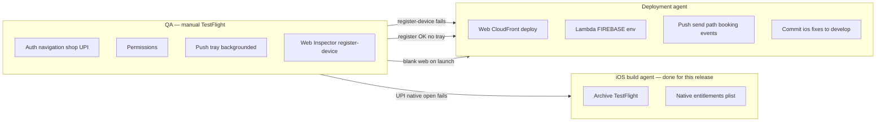

# TestFlight QA manual testing + deployment agent handover

**Date:** 2026-06-22  
**Feature branch:** `feature/ios-build-14-fcm-push-statusbar` (from `develop`)  
**Prerequisite (platform team):** PR #387 merged; prod Lambda has Firebase env. **Web deploy required** after merge for push JS (see Part F).

Both apps are **Capacitor shells** that load **100% UI from live URLs**. Native IPA controls permissions, push entitlements, bundle ID, and plugins — **not** feature logic or push JS.

---

## Build identity (what is on TestFlight)

| | **Customer (End User)** | **Service Provider (Vendor)** |
|---|---|---|
| App Store name | Warmpawz Customer | Warmpawz Service Provider |
| Bundle ID | `com.warmpawz.app` | `com.warmpawz.provider` |
| Version (marketing) | **1.0.7** | **1.0.9** |
| Build number | **14** | **14** *(FCM push + production APNs + status bar + Razorpay compile fix)* |
| Remote URL | `https://customer.warmpawz.com` | `https://vendor.warmpawz.com` |
| Native stack | Capacitor **6** + CocoaPods | Capacitor **8** + SPM |
| Xcode project | `apps/customer-web/ios/App/App.xcworkspace` | `apps/vendor-web/ios/App/App.xcodeproj` |

**Retire old TestFlight builds** from the obsolete main-session stack (e.g. customer 1.0.6/11, vendor 1.0.8/10) and **vendor 1.0.9 (11)** (broken tabs — see Part D). Testers must install the **develop-based** builds above only.

---

## Part D — Vendor iOS tab failure (diagnosis locked)

### Diagnosis

| Environment | Result |
|-------------|--------|
| Safari → `vendor.warmpawz.com` | **Works** |
| TestFlight vendor **1.0.9 (11)** | **Bottom tabs fail** |

**Conclusion:** Vendor web, CloudFront, and Lambda are **not** the cause. The bug is in the **vendor TestFlight native shell**: global `CapacitorHttp.enabled: true` in [`apps/vendor-web/capacitor.config.json`](apps/vendor-web/capacitor.config.json) patches all `fetch`/XHR in the WebView and breaks SPA tab navigation on iOS. Customer app deliberately has **no** global CapacitorHttp (same remote-URL pattern).

### Fix applied (vendor iOS rebuild only)

1. **Removed** global `plugins.CapacitorHttp.enabled` from `capacitor.config.json` (matches customer).
2. **Gallery upload unchanged:** [`postJsonWithXhr`](apps/vendor-web/lib/api-client.ts) already calls **`CapacitorHttp.post()` explicitly** on native — no global patch required (Android or iOS).
3. `npm run build && npx cap sync ios`
4. **Build bumped:** vendor **1.0.9 (12)** — re-archive → TestFlight.

**No changes needed:** customer IPA, vendor-web CloudFront deploy, or Lambda.

### QA re-test after vendor 1.0.9 (12)

- [ ] All bottom tabs that failed on build 11 (bookings, services, earnings, profile, etc.)
- [ ] Dashboard navigation / deep links within vendor shell
- [ ] Gallery upload (Dashboard → Gallery → center photos) — should still log `[GALLERY] Uploading via JSON base64 (native CapacitorHttp)`
- [ ] Push (backgrounded) — unchanged from Part A7

### iOS build agent — archive vendor only

```bash
cd apps/vendor-web
# Confirm capacitor.config.json has NO plugins.CapacitorHttp block
npm run build && npx cap sync ios
# Production entitlements before Archive if TestFlight push testing:
# aps-environment = production in ios/App/App/App.entitlements
open ios/App/App.xcodeproj
# Scheme App → Any iOS Device → Product → Archive → Upload
```

Record: **vendor 1.0.9 (12)**, git SHA, archive date.

---

## Part A — QA manual testing

### A0 — Setup (both apps)

- [ ] **Physical iPhone** (iOS 15+). Push and UPI do **not** work on Simulator.
- [ ] Install from **TestFlight** (not Xcode Run).
- [ ] Delete any old Warmpawz app versions first if bundle conflicts appear.
- [ ] Stable internet (Wi‑Fi or cellular).
- [ ] Use **prod test accounts** (or UAT if team directs — prod API: `https://mss9sa4y01.execute-api.ap-south-1.amazonaws.com`).
- [ ] For push tests: Settings → Notifications → app → **Allow ON**; Lock Screen + Banners ON; disable Focus/DND during push tests.

**Record for every bug:** app (customer/vendor), version + build, iOS version, device model, steps, screenshot/video, time (IST).

---

### A1 — Customer app — smoke & auth

- [ ] Cold launch: splash → loads `customer.warmpawz.com` (no blank WebView / infinite spinner).
- [ ] Login with OTP; complete onboarding if new user.
- [ ] Home loads services, bottom nav, profile accessible.
- [ ] Logout → login again (session persistence).

---

### A2 — Customer app — permissions (native prompts)

Trigger flows that request:

- [ ] **Camera** (pet photo / teleconsultation).
- [ ] **Microphone** (teleconsultation).
- [ ] **Location when in use** (nearby services / booking).
- [ ] **Notifications** (on login or first relevant screen).

If denied once: Settings → Warmpawz Customer → re-enable and retry.

---

### A3 — Customer app — navigation & core flows

Reference: `apps/customer-web/CUSTOMER_NAV_AUDIT.md` §8.

- [ ] **Back behavior:** in-app back vs iOS edge swipe on home shell (`/`).
- [ ] **Shop:** browse → product detail → add to cart → cart.
- [ ] **Checkout:** proceed to payment (Razorpay).
- [ ] **UPI (real device):** payment sheet → tap UPI app (PhonePe/GPay/etc.) → app opens → return to Warmpawz. *Uses `RazorpayBridgeViewController` + `LSApplicationQueriesSchemes`.*
- [ ] **Bookings:** list → open booking → tracking if applicable.
- [ ] **Profile / pets / wallet:** open without crash.
- [ ] **Universal link (optional):** open `https://customer.warmpawz.com/shop/...` from Notes → should open in app if associated domains configured.

---

### A4 — Service Provider app — smoke & auth

- [ ] Cold launch → loads `vendor.warmpawz.com`.
- [ ] Vendor login OTP; lands on dashboard.
- [ ] Bookings list loads; open a booking detail.
- [ ] Services / profile / settings reachable.

---

### A5 — Service Provider app — permissions

- [ ] **Camera** (service photos / documents).
- [ ] **Microphone** (if used in vendor flows).
- [ ] **Location** (radius / home service if applicable).
- [ ] **Photo library** (upload profile / service images).
- [ ] **Notifications** on login.

---

### A6 — Service Provider app — core flows

- [ ] Accept / manage bookings (status updates as per role).
- [ ] Services management screen loads and saves.
- [ ] Earnings / settlements pages load (no blank API errors).
- [ ] Seller hub / orders if enabled for test vendor.
- [ ] Logout → login.

---

### A7 — Push notifications (both apps) — **read carefully**

**Architecture:** Push **registration and tap routing** run in **deployed web JS** (`push-bootstrap.ts` on develop). The IPA only delivers the APNs token to that JS.

| App state | Expected |
|-----------|----------|
| **Foreground** | Usually **no iOS system tray** (OS behavior). In-app handling only. |
| **Background / killed** | **System tray notification** should appear. |
| **Simulator** | Remote push **will not work**. |

#### Customer push test

1. Install TestFlight build **1.0.7 (12)**.
2. Login → allow notifications.
3. **Background the app** (swipe up; do not leave app visible).
4. Ask platform team to send a test push (`POST /push/send`) or trigger a real booking event.
5. [ ] Tray notification appears with sound/badge (if configured).
6. [ ] Tap notification → app opens to correct screen (deep link via `push-navigation.ts`).

#### Vendor push test

Same steps on provider app **1.0.9 (11)** after vendor login.

#### Optional — Web Inspector (QA with Mac + USB iPhone)

Safari → Develop → [iPhone] → `customer.warmpawz.com` → Console, filter `push-bootstrap`:

- [ ] `[push-bootstrap] PushNotifications.register() called`
- [ ] `[push-bootstrap] POST /push/register-device ok`
- [ ] Network: `POST .../push/register-device` → **200**, body includes `"platform":"ios"`

**If register fails:** escalate to **platform/deployment team** (web deploy or API) — not an IPA-only fix.  
**If register OK but no tray:** confirm app was **backgrounded**; escalate with build number + register response.

---

### A8 — Regression flags (escalate immediately)

| Symptom | Likely owner |
|---------|----------------|
| Blank white WebView / 404 on launch | Platform (CloudFront / deploy) |
| Vendor tabs fail in TestFlight but Safari OK | **iOS vendor shell** — global CapacitorHttp (fixed in **1.0.9 build 12**) | Not deploy/Lambda |
| Login/API errors for all users | Platform (Lambda / API) |
| UPI list shows but tap does nothing | iOS native (`RazorpayBridgeViewController`, Info.plist schemes) — **fixed in 1.0.7 build** |
| `[push-bootstrap]` logs missing entirely | Platform (web not deployed from develop) |
| `register-device` 4xx/5xx | Platform (Lambda / auth) |
| Register 200, no tray when backgrounded | Platform (Firebase/APNs send path) or Firebase Console APNs key |
| Crash on launch | iOS build team + attach crash log |

---

### A9 — QA sign-off template

```
Customer 1.0.7 (12) — PASS / FAIL — tester — device — date
Vendor 1.0.9 (11) — PASS / FAIL — tester — device — date
Push (customer, backgrounded) — PASS / FAIL
Push (vendor, backgrounded) — PASS / FAIL
UPI checkout (customer) — PASS / FAIL / N/A
Notes:
```

---

## Part B — Handover to code deployment / platform agent

This section is for the agent that owns **web + Lambda deploys** (generated the iOS build instructions and confirmed PR #387 / prod deploy).

### B1 — What the iOS build agent completed

| Done | Detail |
|------|--------|
| Branch | Checked out **`develop`** (`2b8020928`); discarded obsolete **main** Cap 8 customer session |
| Customer native | `npm ci`, `cap:verify:push` passed, permissions in Info.plist, icon, version **1.0.7 (12)**, production entitlements for archive, **Archive → TestFlight uploaded** |
| Vendor native | `npm install @capacitor/ios`, `cap add ios`, permissions + icon + push AppDelegate hooks, version **1.0.9 (11)**, archive → TestFlight |
| Build fix | `RazorpayBridgeViewController.swift`: `WKNavigationDecision` → **`WKNavigationActionPolicy`** (archive was failing) |
| Xcode | Two windows opened: customer **`.xcworkspace`**, vendor **`.xcodeproj`** |
| Out of scope (not run) | `./scripts/deploy-customer-web.sh`, `deploy-vendor-web.sh`, `deploy-lambda-direct.sh` |

### B2 — What deployment agent already owns (per product owner)

- [x] PR **#387** merged to develop  
- [x] Prod **customer-web + vendor-web** deployed (CloudFront serves develop push JS)  
- [x] Prod **Lambda** deployed  

**QA can run all functional + push registration tests** assuming the above holds. Deployment agent does **not** need to re-deploy for QA to start unless QA finds missing `[push-bootstrap]` logs or API errors.

### B3 — What deployment agent **should** still do (repo / backend hygiene)

These are **not** blockers for QA manual testing if prod is already live, but should be tracked:

| Priority | Item | Why |
|----------|------|-----|
| **High** | **Commit native fixes to develop** | Local-only changes not yet on remote: `RazorpayBridgeViewController.swift` fix, customer Info.plist permissions/version/icon, vendor `ios/` tree, vendor `@capacitor/ios` in `package.json` |
| **High** | Verify **`FIREBASE_*`** env vars on `warmpawz-prod-api-handler` | Required for `POST /push/send` and topic subscribe |
| **Medium** | Confirm iOS **booking/event** pushes use **Firebase FCM** (not SNS APNs mock when `SNS_PLATFORM_APP_IOS_ARN` empty) | `aws-sns-notification-service.ts` — tray may fail on real booking even if manual `/push/send` works |
| **Low** | Remove stray **main-session** files if present on branches: `capacitor-native-init.ts`, `CapacitorNativeInit.tsx` | Not on develop canonical stack; avoid confusion |
| **Low** | Port `scripts/configure-ios-app.sh` / `archive-ios-app.sh` to develop with **production entitlements** flow documented | Optional convenience for next iOS archive |

### B4 — Division of responsibility



| Test / issue | QA alone? | Needs deployment agent? | Needs new iOS build? |
|--------------|-----------|---------------------------|----------------------|
| Login, shop, bookings, vendor dashboard | Yes | No | No |
| UPI opens external app | Yes | No | No (fixed in current customer build) |
| Push tray (backgrounded) after platform sends test | Yes | Only if send/register fails | No if entitlements were production at archive |
| `[push-bootstrap]` logs missing | Diagnose with Web Inspector | **Yes** — redeploy web from develop | No |
| `register-device` 500 | Capture response | **Yes** — Lambda/Firebase | No |
| Booking push never arrives | Yes to reproduce | **Yes** — backend send path | No |
| Wrong app icon / version | Report | No | **Yes** — iOS rebuild |
| Archive/build failure | No | No | **Yes** — iOS agent |

### B5 — Deployment agent verification commands (read-only)

```bash
# Confirm develop push JS is what prod serves (after deploy)
curl -sI https://customer.warmpawz.com | head -5
curl -sI https://vendor.warmpawz.com | head -5

# Lambda env (AWS console or CLI) — must be set on warmpawz-prod-api-handler
# FIREBASE_PROJECT_ID, FIREBASE_CLIENT_EMAIL, FIREBASE_PRIVATE_KEY (or equivalent)
```

Manual push test (platform team only):

```bash
# POST https://mss9sa4y01.execute-api.ap-south-1.amazonaws.com/push/send
# Body: userId, userType, title, body, platform ios — use token from device_tokens after QA login
```

---

## Part C — Quick reference

| Doc | Purpose |
|-----|---------|
| `apps/customer-web/ios-config/IOS_PUSH_SETUP.md` | APNs + Firebase native setup |
| `apps/customer-web/scripts/cap-push-phase4-verify.sh` | Native push prep verify (Mac, pre-archive) |
| `apps/customer-web/scripts/cap-testflight-checklist.sh` | Archive checklist |
| `apps/customer-web/CUSTOMER_NAV_AUDIT.md` | Customer navigation QA |
| `apps/customer-web/IOS_RAZORPAY_UPI_FIX.md` | UPI / Razorpay bridge |

**Prod API:** `https://mss9sa4y01.execute-api.ap-south-1.amazonaws.com`  
**Firebase project:** `warmpawz-b9baf`

---

---

## Part E — Build 14 fixes (status bar, Razorpay, FCM push)

### E1 — Production APNs entitlements (TestFlight)

Both apps have **`aps-environment: production`** in `ios/App/App/App.entitlements`. TestFlight silently drops tray delivery when entitlements stay on `development`.

- Customer: `applinks:customer.warmpawz.com` + production APNs
- Vendor: production APNs; template at `apps/vendor-web/ios-config/App.entitlements.production.example`

### E2 — Black horizontal strip at top

**Cause:** `ios.contentInset: automatic` inset the WebView below the status bar while the native window background stayed black. Web headers already use `env(safe-area-inset-top)` → double gap = black band.

**Fix (native IPA required):**

| Change | Customer | Vendor |
|--------|----------|--------|
| `capacitor.config.json` | `contentInset: never`, `backgroundColor: #FF8C42` | `contentInset: never`, `backgroundColor: #ffffff` |
| Shell VC | `RazorpayBridgeViewController` — orange WebView, `contentInsetAdjustmentBehavior = .never`, `.lightContent` status bar | `WarmpawzShellViewController` — white WebView, same inset fix |

**QA:** orange customer header runs under status bar; no black strip; light status-bar icons on customer.

### E3 — Customer Razorpay bridge compile fix

`RazorpayBridgeViewController.swift` used wrong type `WKNavigationDecision` → **`WKNavigationActionPolicy`**. Without this fix, Release archive fails.

### E4 — iOS push tray (FCM token fix)

**Root cause:** `@capacitor/push-notifications` on iOS returns **64-char APNs hex**. Backend uses Firebase Admin **`sendEachForMulticast`**, which expects **FCM registration tokens** (often contain `:`). APNs hex tokens are deactivated → no tray.

**Fix in this branch (native + JS):**

| Layer | Customer | Vendor |
|-------|----------|--------|
| NPM | `@capacitor-firebase/messaging@^6.3.1` (`--legacy-peer-deps` if needed) | `@capacitor-firebase/messaging@^8.3.0` |
| JS | `lib/push-bootstrap.ts` — iOS uses `FirebaseMessaging.getToken()`, clears stale APNs hex cache | Same |
| Native | `FirebaseApp.configure()` in `AppDelegate.swift`; `pod 'Firebase/Messaging'` in Podfile | `FirebaseApp.configure()` in `AppDelegate.swift`; SPM via Cap 8 |
| Config | `plugins.FirebaseMessaging.presentationOptions` in `capacitor.config.json` | Same + `experimental.ios.spm.packageOptions` symlink for messaging |

**Critical:** Apps load UI from **remote URLs**. After merge, **platform team must deploy** customer-web and vendor-web to prod so TestFlight runs the new `push-bootstrap.ts`. Native IPA alone is not enough for the JS path.

**Verify on device (Web Inspector, app backgrounded for tray test):**

```
[push-bootstrap] Firebase getToken ok   tokenLength > 64, not pure hex
[push-bootstrap] POST /push/register-device ok   tokenLooksFcm: true
```

Firebase Console APNs auth key must remain configured for project `warmpawz-b9baf`.

---

## Part F — iOS build agent runbook (build 14)

### Prerequisites (once per machine)

1. Copy `GoogleService-Info.plist` from each app’s `ios-config/` into `ios/App/App/` (gitignored; required for Firebase).
2. Xcode 15+, Apple Developer signing for `com.warmpawz.app` / `com.warmpawz.provider`.
3. Confirm `App.entitlements` has `aps-environment: production` before Archive.

### Customer — 1.0.7 (14)

```bash
cd apps/customer-web
npm install --legacy-peer-deps   # firebase peer range on Cap 6
npm run build
npx cap sync ios
cd ios/App && pod install
bash scripts/cap-push-phase4-verify.sh
open ios/App/App.xcworkspace    # NOT .xcodeproj — CocoaPods
# Scheme App → Any iOS Device → Product → Archive → Distribute → TestFlight
```

Native verify (optional): `xcodebuild -workspace App.xcworkspace -scheme App -configuration Release -destination 'generic/platform=iOS' build`

### Vendor — 1.0.9 (14)

```bash
cd apps/vendor-web
npm install
npm run build
npx cap sync ios
# Confirm capacitor.config.json has NO global plugins.CapacitorHttp block
open ios/App/App.xcodeproj
# Resolve packages if prompted; Scheme App → Archive → TestFlight
```

Native verify (optional): `xcodebuild -project App.xcodeproj -scheme App -configuration Release -destination 'generic/platform=iOS' build`

Terminal archive helper: `./scripts/archive-ios-app.sh customer|vendor` (customer uses workspace + pods).

### Platform team — web deploy (required for push JS)

After this branch merges to develop:

```bash
./scripts/deploy-customer-web.sh --prod --yes
./scripts/deploy-vendor-web.sh --prod --yes
```

Lambda: confirm `FIREBASE_*` on `warmpawz-prod-api-handler`.

---

## Summary for stakeholders

- **QA:** Test **build 14** — status bar strip, vendor tabs, UPI, push tray (backgrounded) after web deploy + new IPA.
- **Deployment agent:** Deploy customer-web + vendor-web to prod after merge; verify Lambda Firebase env.
- **iOS build agent:** Archive **1.0.7 (14)** customer (`App.xcworkspace`) and **1.0.9 (14)** vendor (`App.xcodeproj`).
