# Warmpawz Pay Bill vs Book Appointment — Vendor Endpoints, Settlement & Cover-Charge Offset

**Type:** Analysis & investigation only (no code changes, no deployment)  
**Date:** 2026-08-04  
**Branch context:** `feature/warmpawz-pay-appointments-unified` / `feature/wappt-cancel-refund-policies`

---

## 1. Executive summary

Warmpawz today runs **two related but separate products** under the Commerce Switch model `warmpawz_pay`:

| Product | Customer intent | Primary data | Vendor APIs today |
|---------|-----------------|--------------|-------------------|
| **Pay Bill** (Scan to Pay) | Walk-in: customer enters clinic bill amount | `payments` row, `payment_source = 'warmpawz_pay'`, **`booking_id = NULL`** | **None** |
| **Book Appointment** (WAPPT) | Scheduled slot: pay flat **appointment fee** upfront | `bookings` row, `commerce_mode = 'warmpawz_appointments'` | **3 cancel/policy routes** + reuse of marketplace bookings/settlements UI |

**Answers to your questions:**

1. **Separate vendor endpoints for Pay Bill vs Book Appointment?**  
   - **Book Appointment:** No new dashboard product API is required — reuse `/vendor/bookings`, `/vendor/dashboard`, `/vendor/:vendorId/settlements` with WAPPT display rules. Only WAPPT-specific cancel/policy routes are separate today.  
   - **Pay Bill vendor dashboard:** **Yes — new vendor endpoints are required.** Pay Bill does not create bookings; existing vendor settlement APIs join `settlements → bookings` and will not show walk-in Pay Bill payments.

2. **Separate settlement endpoint?**  
   - **Not a separate payout rail** — reuse the same `settlements` table and existing vendor payout batch flow, but with **`order_type = 'warmpawz_pay'`** and `payment_id` (not `booking_id`).  
   - **Yes — new or extended read APIs** so vendors can see Pay Bill accruals and payout status. Today settlement accrual after Pay Bill verify is **designed in docs/schema but not implemented in code**.

3. **Cover charge offset before Pay Bill (your desired rule):**  
   - **Not implemented anywhere today.** Current Pay Bill only applies admin **discount %** on the entered bill. Current WAPPT booking charges the full **appointment fee** at book time via `/bookings/create`.  
   - This is a **new cross-product pricing rule** that belongs in Pay Bill **quote/initiate** (server-side), not in vendor endpoints alone.

---

## 2. Product boundary (important)

```mermaid
flowchart TB
  subgraph PayBill["Pay Bill — walk-in"]
    PB1[Customer enters bill amount] --> PB2[POST /customer/warmpawz-pay/initiate]
    PB2 --> PB3[Razorpay]
    PB3 --> PB4[POST /customer/warmpawz-pay/verify]
    PB4 --> PB5[payments completed]
    PB5 -.->|NOT WIRED| PB6[settlements order_type=warmpawz_pay]
  end

  subgraph WAPPT["Book Appointment — scheduled"]
    WA1[Pick vendor + slot] --> WA2[GET .../vendors/:id/fee]
    WA2 --> WA3[POST /bookings/create]
    WA3 --> WA4[Standard booking payment]
    WA4 --> WA5[bookings commerce_mode=warmpawz_appointments]
    WA5 --> WA6[vendor_earnings + settlements via booking_id]
  end
```



These are **not interchangeable**:

- Pay Bill **never** sets `booking_id` on the payment row today.
- WAPPT bookings **never** use `payment_source = 'warmpawz_pay'` today — they use the normal booking payment path.
- Vendor “I got paid via Warmpawz” for **appointments** = booking completion/settlement.  
- Vendor “I got paid via Warmpawz” for **Pay Bill** = payment-centric settlement (once wired).

Reference docs: `docs/WARMPAWZ_PAY_TECHNICAL_ARCHITECTURE_FINAL.md`, `docs/BOOK_APPOINTMENT_AND_WARMPAWZ_PAY_PLANNING.md`.

---

## 3. Current API inventory

### 3.1 Customer — Pay Bill (implemented)

Registration: `backend/lambda/src/endpoints/customer/warmpawz-pay/index.ts`

| Method | Route | Purpose |
|--------|-------|---------|
| GET | `/customer/warmpawz-pay/vendors` | Published merchant list |
| GET | `/customer/warmpawz-pay/vendors/nearby` | Geo list |
| GET | `/customer/warmpawz-pay/vendors/:vendorId` | Merchant detail |
| POST | `/customer/warmpawz-pay/initiate` | Bill amount → discount quote → Razorpay order |
| POST | `/customer/warmpawz-pay/verify` | Signature verify → complete `payments` row |
| GET | `/customer/warmpawz-pay/transactions` | Customer history |

**Pricing today (`wpay-discount.ts`):**

```
payableAmount = max(0.01, originalBill - (originalBill × discountPercent / 100))
```

No appointment lookup. No cover-charge credit.

**Verify today (`customer_warmpawz_pay_verify_post.service.ts`):** updates `payments` only — **no settlement row, no vendor notification, no `vendor_earnings`.**

### 3.2 Customer — Book Appointment / WAPPT (implemented)

Registration: `backend/lambda/src/endpoints/customer/warmpawz-appointments/index.ts`

| Method | Route | Purpose |
|--------|-------|---------|
| GET | `/customer/warmpawz-appointments/discovery/by-category` | Hub discovery |
| GET | `/customer/warmpawz-appointments/vendors/:vendorId/fee` | Admin `appointment_fee` from catalogue |
| GET | `/customer/warmpawz-appointments/policies` | Cancellation tiers |
| GET/POST | `/customer/warmpawz-appointments/bookings/:id/cancellation-policy` etc. | Customer cancel/refund |

**Booking create (shared):** `POST /bookings/create`  
- Detects WAPPT via `isWarmpawzAppointmentsBooking()` / preflight  
- Sets `commerce_mode = 'warmpawz_appointments'`  
- Server overrides amount from catalogue `appointment_fee` (not customer-entered bill)

### 3.3 Vendor — Book Appointment (partial)

File: `backend/lambda/src/endpoints/vendor/endpoints/vendor-wappt-appointments.ts`

| Method | Route | Purpose |
|--------|-------|---------|
| GET | `/vendor/warmpawz-appointments/policies` | Policy tiers |
| GET | `/vendor/warmpawz-appointments/bookings/:bookingId/cancellation-policy` | Provider cancel preview |
| POST | `/vendor/warmpawz-appointments/bookings/:bookingId/cancel` | Provider cancel + refund |

**Everything else reuses marketplace vendor APIs:**

- Schedule/list: `GET /vendor/bookings/:vendorId`
- Stats: `GET /vendor/dashboard/:vendorId`, `GET /vendor/:vendorId/dashboard`
- Payouts: `GET /vendor/:vendorId/settlements` (joins `settlements` → `bookings`)

Display layer hides WAPPT slot fee from vendor UI (`vendor-booking-display.ts`, `vendor-utils.ts`).

### 3.4 Vendor — Pay Bill

**No routes exist.** Grep confirms zero `/vendor/warmpawz-pay/*` handlers.  
**No vendor-web pages** reference Pay Bill / wpay beyond commerce-switch pricing lock.

### 3.5 Admin (for reference)

| Area | Base path |
|------|-----------|
| Pay Bill catalogue & discount | `/admin/warmpawz-pay/catalogue/*`, `/admin/warmpawz-pay/pricing/*` |
| Pay Bill payments list | `/admin/warmpawz-pay/payments` |
| WAPPT catalogue & fees | `/admin/warmpawz-appointments/catalogue/*` (incl. bulk fee) |
| WAPPT policies | `/admin/warmpawz-appointments/policies/*` |

---

## 4. Settlement — how it works and what you need

### 4.1 Current state

| Flow | Accrual mechanism | Visible in `GET /vendor/:vendorId/settlements`? |
|------|-------------------|-----------------------------------------------|
| Marketplace booking | `vendor_earnings` → `settlements` with `booking_id` | Yes |
| WAPPT booking | Same as marketplace (booking-linked) | Yes (as booking settlement) |
| Pay Bill walk-in | **Schema ready** (`1080_warmpawz_pay_phase1_schema.sql`: `order_type = 'warmpawz_pay'`, unique on `payment_id`) | **No — accrual not implemented** |

Existing vendor settlements query (`vendor-dashboard-enhanced.ts` ~1391):

```sql
SELECT s.*, b.service_name, b.booking_date
FROM settlements s
LEFT JOIN bookings b ON s.booking_id = b.id
WHERE s.vendor_id = ANY($vendorIds)
```

Pay Bill settlements would have **`payment_id` set, `booking_id` NULL** — they need either:

- **Option A (recommended):** Extend this API with `order_type` filter and LEFT JOIN `payments` for Pay Bill rows, or  
- **Option B:** New namespace `GET /vendor/warmpawz-pay/settlements` that queries the same `settlements` table but Pay Bill–shaped DTOs.

**Payout execution** (RazorpayX batch, admin approval) can stay **one pipeline** — differentiate by `order_type` in reporting only.

### 4.2 Intended post-verify flow (from architecture doc, not coded)

```
POST /customer/warmpawz-pay/verify (success)
  → async: INSERT settlements (order_type='warmpawz_pay', payment_id, vendor_id, net_amount, status='pending')
  → optional: INSERT transactions (transaction_category='warmpawz_pay')
  → optional: notify vendor ("Customer paid ₹X via Warmpawz Pay")
  → daily batch: group pending settlements → payout
```

Architecture reference: `docs/WARMPAWZ_PAY_TECHNICAL_ARCHITECTURE_FINAL.md` §PostPaymentProcessor, ADR-004 async settlement accrual.

### 4.3 Do you need a **separate settlement endpoint**?

| Need | Separate endpoint? | Recommendation |
|------|-------------------|----------------|
| Vendor sees Pay Bill payout lines | Optional separate **read** API | Extend `/vendor/:vendorId/settlements` OR add `/vendor/warmpawz-pay/transactions` + link to settlement id |
| Creating settlement rows | **Not** a public vendor POST | Internal service/job after payment verify (same as booking settlements today) |
| Triggering RazorpayX payout | **No** | Reuse existing admin/vendor payout batch; filter/include `order_type = 'warmpawz_pay'` |

---

## 5. Vendor Pay Bill dashboard — what to build

### 5.1 Goal (your words)

> Notify vendor that customer paid with Warmpawz; platform will pay vendor via settlement.

This is **notification + ledger visibility**, not a new payment collection UI on vendor side.

### 5.2 Recommended vendor UX (MVP)

| Screen / widget | Data source | Notes |
|-----------------|-------------|-------|
| **Pay Bill activity feed** | New `GET /vendor/warmpawz-pay/payments` | List completed `payments` where `vendor_id = me` AND `payment_source = 'warmpawz_pay'` |
| **Payment detail row** | Same API by id | Customer name (masked phone), paid amount, discount, timestamp, settlement status |
| **Settlement status chip** | Join `settlements` on `payment_id` | `pending` / `processing` / `paid_out` |
| **Push/in-app notification** | After verify + settlement insert | “₹{amount} received via Warmpawz Pay from {customer}” |
| **Earnings tab (optional merge)** | Extend existing payouts tab | Section: “Walk-in Pay Bill” vs “Appointments” |

**Do not** duplicate Book Appointment schedule here — that stays on Home/Bookings with WAPPT display rules.

### 5.3 Suggested vendor API surface (new)

| Method | Route | Purpose |
|--------|-------|---------|
| GET | `/vendor/warmpawz-pay/payments` | Paginated Pay Bill receipts for logged-in vendor |
| GET | `/vendor/warmpawz-pay/payments/:paymentId` | Detail + settlement link |
| GET | `/vendor/warmpawz-pay/summary` | Today/week totals, pending settlement amount |
| GET | `/vendor/warmpawz-pay/settlements` | **Optional** if not extending generic settlements API |

Auth: same vendor session / `x-vendor-id` pattern as `/vendor/bookings`.

### 5.4 Backend prerequisites (before dashboard is truthful)

1. **Settlement accrual** after `dbWpayCompletePayment()` — without this, dashboard shows payments with no payout trail.  
2. **Vendor notification** hook (SMS/push/in-app) on successful verify.  
3. **Net amount rules** — what vendor receives after platform fee (if any); today Pay Bill stores `amount` = customer payable (discounted bill), not vendor share split.

---

## 6. Cover charge offset — your desired Pay Bill rule

### 6.1 What you want

> Before any customer pays via Pay Bill, check if they have an appointment. If yes, the cover charge (whatever they already paid for the appointment) is **deducted** from the bill; then **discount** applies; then they pay the remainder.

Example:

| Step | Amount |
|------|--------|
| Customer enters bill | ₹1,000 |
| Active WAPPT appointment fee already paid | ₹199 |
| Bill after appointment credit | ₹801 |
| Warmpawz Pay discount 10% | −₹80.10 |
| **Customer pays now** | **₹720.90** |

Vendor later receives settlement on **₹720.90** (minus platform rules), not on full ₹1,000.

### 6.2 What exists today

| Rule | Pay Bill initiate | WAPPT booking |
|------|-------------------|---------------|
| Admin discount % on bill | Yes (`computeWpayDiscountQuote`) | N/A |
| Appointment fee at book time | N/A | Yes — full fee via preflight |
| Link payment ↔ booking | No (`booking_id` NULL) | Yes |
| Credit appointment fee against later bill | **No** | **No** |
| `payment_phase` / deposit + balance | **No** (future commerce-switch) | **No** (docs only) |

Planning doc `BOOK_APPOINTMENT_AND_WARMPAWZ_PAY_PLANNING.md` describes future `slot_fee` + `final_balance` — **different model** (small deposit now, balance later). Your rule is **credit already-paid appointment fee against walk-in bill**, which is simpler conceptually but still **new logic**.

### 6.3 Recommended pricing pipeline (server-side only)

Implement in **Pay Bill quote/initiate** (never trust client math):

```
1. originalBill = customer input (validated > 0)
2. eligibleBooking = findActiveWapptBooking(customerId, vendorId, rules)
3. appointmentCredit = eligibleBooking ? min(originalBill, paidAppointmentFee) : 0
4. billAfterCredit = originalBill - appointmentCredit
5. discount = computeWpayDiscountQuote(billAfterCredit, discountPercent)  // apply discount AFTER credit
6. payableAmount = discount.payableAmount
7. Persist quote in payment metadata:
   - quotedOriginalAmount, quotedAppointmentCredit, quotedDiscountAmount, linkedBookingId (optional)
8. Razorpay order for payableAmount only
```

**Eligibility rules to define (product decisions):**

| Question | Options |
|----------|---------|
| Which booking counts as “active appointment”? | Same vendor + same day? Status `confirmed`/`in_progress`? Not cancelled? |
| Which fee counts as credit? | `bookings.total_amount` paid, or catalogue `appointment_fee`, or actual Razorpay captured amount? |
| Tele vs home vs center | All WAPPT or exclude tele? |
| One credit per bill | Cap credit at one appointment fee; prevent double-use across multiple Pay Bill attempts |
| Partial bill less than fee | Credit = min(bill, fee); remainder of fee **not** refunded automatically |

### 6.4 Where this logic does **not** belong

- **Vendor dashboard APIs** — read-only; pricing is customer initiate/verify.  
- **Book Appointment vendor endpoints** — unchanged unless you expose “appointment fee already consumed” on booking detail for support.

### 6.5 Data model additions (future migration — analysis only)

| Field / table | Purpose |
|---------------|---------|
| `payments.metadata.linked_booking_id` | Which appointment fee was credited |
| `payments.metadata.appointment_credit_amount` | Audit trail |
| `bookings.metadata.pay_bill_credit_consumed_at` | Prevent double credit |
| Optional `payment_phase = 'final_balance'` | If you later unify under commerce-switch |

---

## 7. Endpoint strategy — final recommendation

### 7.1 Book Appointment (vendor)

| Action | Endpoint strategy |
|--------|-------------------|
| Schedule, OTP complete, chat | **Reuse** `/vendor/bookings`, dashboard schedule APIs |
| Cancel with WAPPT policy | **Keep** `/vendor/warmpawz-appointments/bookings/:id/cancel` |
| Earnings / payout | **Reuse** `/vendor/:vendorId/settlements` (booking-linked) |
| New dedicated “WAPPT dashboard” | **Not required** — display rules only |

### 7.2 Pay Bill (vendor)

| Action | Endpoint strategy |
|--------|-------------------|
| “Customer paid via Warmpawz” feed | **New** `/vendor/warmpawz-pay/payments` |
| Settlement / payout visibility | **Extend** settlements API **or** new `/vendor/warmpawz-pay/settlements` reading same table |
| Create settlement | **Internal** post-verify processor (not vendor-facing POST) |
| Pricing / cover charge | **Customer** `/initiate` + `/verify` only |

### 7.3 Shared vs separate — summary

```
                    Book Appointment          Pay Bill
                    ─────────────────         ────────
Customer APIs       /warmpawz-appointments/*  /warmpawz-pay/*
Vendor list/schedule  marketplace bookings    NEW pay-bill payments API
Vendor settlement     booking_id path         payment_id + order_type=warmpawz_pay
Admin                 separate catalogues     separate catalogues
```

**Separate customer APIs:** already correct.  
**Separate vendor APIs for Pay Bill:** required.  
**Separate settlement payout rail:** not required — same `settlements` + batch payout, different `order_type`.

---

## 8. Implementation phases (suggested order)

| Phase | Scope | Unblocks |
|-------|--------|----------|
| **P0** | Post-verify settlement accrual for Pay Bill | Honest vendor money trail |
| **P1** | Vendor Pay Bill payments list API + vendor-web tab | “Customer paid via Warmpawz” dashboard |
| **P2** | Extend settlements API for `order_type = 'warmpawz_pay'` | Payout tab shows walk-in + appointments |
| **P3** | Cover charge offset in initiate/verify + metadata | Your bill − appointment fee − discount rule |
| **P4** | Vendor/customer notifications on Pay Bill success | Real-time awareness |
| **P5** | Reconciliation job (`warmpawz_pay.settlement.missing` alert) | Production safety |

Book Appointment vendor work (schedule display, cancel policy) is largely **done** on current branch; Pay Bill vendor surface is **greenfield**.

---

## 9. Gaps and risks

| Gap | Impact |
|-----|--------|
| Pay Bill verify does not insert `settlements` | Vendor dashboard would show payments with no payout status |
| Generic settlements query ignores `payment_id` Pay Bill rows | Payout tab empty for walk-in revenue |
| No appointment ↔ Pay Bill link | Cover charge offset impossible without new query + metadata |
| `final_balance` / deposit model in commerce-switch | Documented but not built — do not assume it exists |
| Double-spend of appointment credit | Need idempotent flag on booking or payment metadata |
| Vendor net vs gross | Clarify whether settlement uses customer `payableAmount` or after platform commission |

---

## 10. Open product questions (decide before build)

1. **Appointment window:** Same calendar day only, or any upcoming `confirmed` booking at that vendor?  
2. **Credit cap:** One Pay Bill per appointment fee, or multiple partial visits?  
3. **Discount base:** After appointment credit (recommended) or on gross bill?  
4. **Vendor visibility:** Show “appointment credit −₹199” on vendor Pay Bill receipt?  
5. **Settlement amount:** Full customer payable to vendor, or platform takes commission on Pay Bill separately from appointments?  
6. **Tele appointments:** Exclude from Pay Bill credit (tele uses marketplace pricing today)?

---

## 11. Key file references

| Topic | Path |
|-------|------|
| Pay Bill initiate | `backend/lambda/src/endpoints/customer/warmpawz-pay/services/customer_warmpawz_pay_initiate_post.service.ts` |
| Pay Bill verify | `backend/lambda/src/endpoints/customer/warmpawz-pay/services/customer_warmpawz_pay_verify_post.service.ts` |
| Discount math | `backend/lambda/src/endpoints/customer/warmpawz-pay/shared/wpay-discount.ts` |
| Pay Bill schema | `db/migrations/1080_warmpawz_pay_phase1_schema.sql` |
| WAPPT booking create | `backend/lambda/src/endpoints/booking/endpoints/bookings-enhanced.booking.ts` |
| WAPPT preflight / fee | `backend/lambda/src/endpoints/warmpawz-appointments/shared/wappt-booking-preflight.ts` |
| Vendor WAPPT cancel | `backend/lambda/src/endpoints/vendor/endpoints/vendor-wappt-appointments.ts` |
| Vendor settlements | `backend/lambda/src/endpoints/vendor/endpoints/vendor-dashboard-enhanced.ts` |
| Architecture target | `docs/WARMPAWZ_PAY_TECHNICAL_ARCHITECTURE_FINAL.md` |
| Slot fee / balance planning | `docs/BOOK_APPOINTMENT_AND_WARMPAWZ_PAY_PLANNING.md` |
| Customer Pay Bill UI | `apps/customer-web/app/warmpawz-pay/` |
| Vendor WAPPT display | `apps/vendor-web/lib/vendor-utils.ts`, `vendor-booking-display.ts` |

---

## 12. Conclusion

- **Book Appointment vendor side:** Keep using existing booking + settlement APIs; WAPPT-specific vendor routes are only for cancellation policy. No second “appointment dashboard” API layer needed.  
- **Pay Bill vendor dashboard:** Requires **new vendor read APIs** and **settlement accrual wiring** after customer verify — reusing the same settlement/payout infrastructure with `order_type = 'warmpawz_pay'`.  
- **Cover charge before Pay Bill:** A **new customer-side pricing step** in initiate/verify; must lookup eligible WAPPT booking, subtract paid appointment fee, then apply discount — **not present in codebase today**.

This document is investigation-only; implementation should follow a phased PR plan with migrations for metadata/settlement accrual and explicit product sign-off on eligibility rules in §10.
