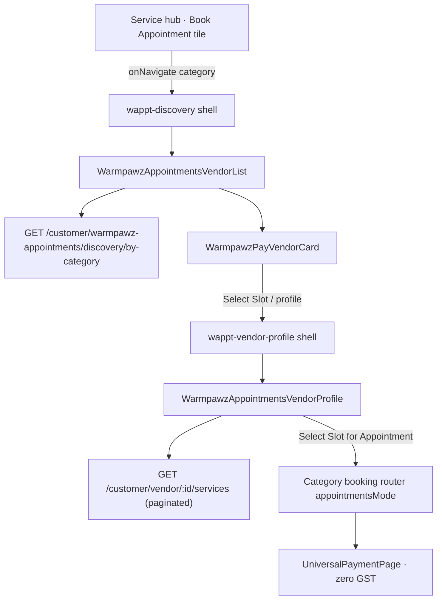

# Warmpawz Appointments (WAPPT) — Reusable UI Components

**Status:** Active (8 hub categories — see `wappt-hub-registry.ts`)  
**Audience:** Customer-web + customer API engineers adding new WAPPT categories  
**Related:** [WARMPAWZ_APPOINTMENTS_JOINT_PLAN.md](./WARMPAWZ_APPOINTMENTS_JOINT_PLAN.md)

---

## Executive answer

| Question | Answer |
|----------|--------|
| Is the **vendor card list page** reusable for any new WAPPT category? | **Yes.** One shared list shell + paginated feed; new categories only need config + routing + backend category support. |
| Is the **vendor profile (pfp)** + slot-only booking flow reusable? | **Yes.** One shared profile UI; services are info-only (no prices/selection); booking skips service pick → slot → summary shows **“Appointment”** + flat fee **without GST**. |

Do **not** fork per-category list/profile UIs. Extend the config maps and wire navigation.

---

## Architecture overview



---

## 1. Reusable vendor list (paginated cards)

### Component

| Piece | Path | Role |
|-------|------|------|
| **Shell route** | `CustomerHomeWrapper` → screen `wappt-discovery` | Single entry for all categories |
| **Discovery wrapper** | `apps/customer-web/components/customer/warmpawz-appointments/WarmpawzAppointmentsDiscovery.tsx` | Thin wrapper; passes `category` to list |
| **Shared list UI** | `apps/customer-web/components/customer/warmpawz-appointments/WarmpawzAppointmentsVendorList.tsx` | **Canonical list frame** — use this for every WAPPT category |
| **List copy / icons** | `apps/customer-web/lib/warmpawz-appointments/wappt-vendor-list-config.ts` | Per-category header, search placeholder, results count |
| **List style toggles** | `apps/customer-web/lib/warmpawz-appointments/wappt-list-style-config.ts` | `at_center` \| `at_home` only; passed through to profile + services API |
| **Feed hook** | `apps/customer-web/hooks/useWarmpawzAppointmentsByCategoryFeed.ts` | Cursor pagination against WAPPT discovery API |
| **Scroll sentinel** | `apps/customer-web/components/customer/shared/DiscoveryVendorFeedSentinel.tsx` | Infinite scroll “Loading more…” |
| **Vendor card** | `apps/customer-web/components/warmpawz-pay/vendor-card/WarmpawzPayVendorCard.tsx` | Shared card chrome (do not duplicate) |
| **Card mapper** | `apps/customer-web/lib/warmpawz-pay/map-discovery-provider-to-vendor-card-props.ts` | Row → card props |

### List UI frame (develop parity)

Matches `ClinicListView` / develop:

- Orange `ServiceDashboardHeader` (category title + “Find a … near you”)
- White rounded sheet: search, style filters (**At centre** / **At home** only — no "View all")
- “N clinics/salons/trainers found”
- Vertical `WarmpawzPayVendorCard` list
- `DiscoveryVendorFeedSentinel` at bottom
- `StandardizedFooter` (Bookings tab active)

### API contract (4-layer, lean DTO)

| Layer | Path |
|-------|------|
| Route | `backend/lambda/src/endpoints/customer/warmpawz-appointments/routes/discovery_by_category_get.route.ts` |
| Handler | `…/handlers/discovery_by_category_get.handler.ts` |
| Service | `…/services/discovery_by_category_get.service.ts` |
| Repo | `…/repos/discovery_by_category_get.repo.ts` |

**Endpoint:** `GET /customer/warmpawz-appointments/discovery/by-category`

Query params: `category`, `serviceStyle` (`all` \| `at_center` \| `at_home`), `limit`, `cursor`.

Response: lean vendor card rows + `nextCursor` (cursor pagination). Client page size default **3** in the feed hook.

### Navigation from list

| Action | Target |
|--------|--------|
| Primary CTA / profile chevron | `wappt-vendor-profile` via `buildWarmpawzAppointmentsProfileNav()` |
| Secondary “Pay with Warmpawz” | `launchWarmpawzPayServiceBooking({ serviceKey, category, vendorId })` |

---

## 2. Reusable vendor profile (pfp)

### Component

| Piece | Path | Role |
|-------|------|------|
| **Shell route** | `CustomerHomeWrapper` → screen `wappt-vendor-profile` | Holds `wapptProfileData` state |
| **Shared profile UI** | `apps/customer-web/components/customer/warmpawz-appointments/WarmpawzAppointmentsVendorProfile.tsx` | **Canonical WAPPT profile** — Zomato-style develop layout |
| **Profile hook** | `apps/customer-web/hooks/useWarmpawzAppointmentsVendorProfile.ts` | Vendor, facility, reviews, **paginated services** |
| **Profile config** | `apps/customer-web/lib/warmpawz-appointments/wappt-vendor-profile-config.ts` | Icons, copy, services API category, style badges |
| **Nav helpers** | `apps/customer-web/lib/warmpawz-appointments-customer.ts` | `buildWarmpawzAppointmentsProfileNav`, `buildWarmpawzAppointmentsBookingNav`, `WAPPT_VENDOR_PROFILE_SCREEN` |

### Profile UI behaviour (all categories)

- **Header:** business name, hero gallery, orange outline Call / Directions / Share
- **Tabs:** Overview · Services · Reviews (same APIs as develop marketplace profile)
- **Services tab:** name, description, duration only — **no prices, no selection**. Rows are loaded for the **list style** the user chose (`at_center` or `at_home`) via `serviceStyle` on `buildVendorServicesPageUrl`.
- **Services list:** scroll-loaded via `buildVendorServicesPageUrl` + `DiscoveryVendorFeedSentinel`
- **Sticky CTA:** **“Select Slot for Appointment”** → booking router with `appointmentsMode: true`

### Booking + payment flow (reusable pattern)

1. Profile CTA → `resolveWarmpawzBookingScreen(category)` (from `wappt-hub-registry.ts` `bookingScreen`)
2. Payload from `buildWarmpawzAppointmentsBookingNav()`:
   - `serviceId` / `bookingMode`: `warmpawz_appointments`
   - `appointmentsMode: true`
   - Flat fee from `GET /customer/warmpawz-appointments/vendor/:vendorId/fee` (per category router)
3. **No service selection step** — slot picker only
4. Summary row label: **`Appointment`** (`getWarmpawzAppointmentServiceLabel()`)
5. Payment: `UniversalPaymentPage` detects `isWarmpawzAppointmentsPaymentRequest()` → **CGST/SGST/IGST forced to 0**

Category booking routers that support `appointmentsMode` (all 8 hubs):

| Hub | Booking screen |
|-----|----------------|
| vet | `vet-booking` |
| grooming | `grooming-booking` |
| training, behaviorist | `training-booking` |
| walker | `walker-booking` |
| boarding | `boarding-booking` |
| sitting | `pet-sitter-booking` |
| nutrition | `nutritionist-booking` |

Shell navigation: `handleWapptShellScreenNavigate` in `wappt-shell-navigation.ts` (used by `CustomerHomeWrapper`).

---

## 3. Hub categories (source of truth)

Registered in `apps/customer-web/lib/wappt-hub-registry.ts`:

`vet`, `grooming`, `training`, `behaviorist`, `walker`, `boarding`, `sitting`, `nutrition`

Jest matrix: `lib/__tests__/wappt-hub-category-matrix.test.ts` (parameterized over all hubs).

## 4. Adding a new WAPPT category (checklist)

Example: adding `boarding` to WAPPT mode.

### A. Backend

- [ ] Admin catalogue: vendor eligible for WAPPT + flat `appointment_fee`
- [ ] `discovery_by_category_get.repo.ts` — include category in discovery SQL / filters
- [ ] `vendor_fee_get` — return fee for the category
- [ ] Run `cd backend/lambda && npm run validate:customer-layers` if touching customer endpoints

### B. Config (customer-web)

- [ ] `wappt-vendor-list-config.ts` — `serviceName`, subtitle, search placeholder, results label, icon
- [ ] `wappt-vendor-profile-config.ts` — `servicesApiCategory`, share persona, style badges, about fallback
- [ ] `warmpawz-appointments-customer.ts` — `resolveWarmpawzBookingScreen()` / `resolveWarmpawzBookingCategory()` if new booking screen name

### C. Navigation (customer-web)

- [ ] Hub tile → `onNavigate('wappt-discovery', { category: '<new>' })` (see `VetServiceRouter`, `GroomingServiceRouter`, `TrainingServiceRouter`)
- [ ] `CustomerHomeWrapper` — ensure `wappt-discovery` / `wappt-vendor-profile` handlers pass through booking nav for the new category (mirror grooming/training blocks)
- [ ] Implement or extend `*BookingRouter` with `appointmentsMode` (copy grooming pattern: flat fee, skip service step, summary “Appointment”)

### D. Do **not**

- [ ] Create a new `*ServicesByStyle` list page for WAPPT discovery
- [ ] Create a new profile component — use `WarmpawzAppointmentsVendorProfile`
- [ ] Show service prices on profile Services tab in WAPPT mode
- [ ] Route WAPPT discovery through legacy `vet-clinic-list` / `grooming_center` without `wappt-discovery`

### E. Smoke test

1. Hub → Book Appointment → new category
2. List: orange header, search, cards, scroll load more
3. Card → profile → Services tab scroll, no prices
4. Select Slot → slot → summary shows “Appointment” + fee, no GST line
5. Pay on dev (UAT OTP `123456`)

---

## 4. File map (quick reference)

```
apps/customer-web/
  components/customer/warmpawz-appointments/
    WarmpawzAppointmentsDiscovery.tsx      # shell entry → list
    WarmpawzAppointmentsVendorList.tsx     # ★ reusable list
    WarmpawzAppointmentsVendorProfile.tsx  # ★ reusable profile
    README.md                              # pointer to this doc
  hooks/
    useWarmpawzAppointmentsByCategoryFeed.ts
    useWarmpawzAppointmentsVendorProfile.ts
  lib/warmpawz-appointments/
    wappt-vendor-list-config.ts
    wappt-vendor-profile-config.ts
  lib/warmpawz-appointments-customer.ts

backend/lambda/src/endpoints/customer/warmpawz-appointments/
  routes/ handlers/ services/ repos/       # 4-layer discovery + fee APIs
```

---

## 5. Current category coverage

All hubs are registered in `apps/customer-web/lib/wappt-hub-registry.ts`.

| Category | List config | Profile config | Booking screen |
|----------|-------------|----------------|----------------|
| `vet` | ✅ | ✅ | `vet-booking` |
| `grooming` | ✅ | ✅ | `grooming-booking` |
| `training` | ✅ | ✅ | `training-booking` |
| `behaviorist` | ✅ | ✅ | `training-booking` |
| `walker` | ✅ | ✅ | `walker-booking` |
| `boarding` | ✅ | ✅ | `boarding-booking` |
| `sitting` | ✅ | ✅ | `pet-sitter-booking` |
| `nutrition` | ✅ | ✅ | `nutritionist-booking` |

---

## 8. Tests and verification

### Customer-web Jest

```bash
cd apps/customer-web

# Shell navigation stack
npm run test:navigation

# WAPPT hub matrix (all 8 categories), shell nav, profile, registry
npx jest lib/__tests__/wappt-hub-category-matrix.test.ts \
  lib/__tests__/wappt-shell-navigation.test.ts \
  lib/__tests__/warmpawz-appointments-profile.test.ts \
  lib/__tests__/wappt-hub-registry.test.ts
```

### Backend Lambda

```bash
cd backend/lambda

npm run validate:customer-layers

npx jest src/endpoints/warmpawz-appointments/shared/__tests__/wappt-booking-preflight.test.ts \
  src/endpoints/warmpawz-appointments/shared/merchant/__tests__/merchant-service-category.resolver.test.ts \
  src/utils/__tests__/booking-notifications-wappt.test.ts
```

### Dev API smoke (optional)

```bash
cd backend/lambda
node scripts/wappt-customer-flow-verify.js --base https://z0b3obweb6.execute-api.ap-south-1.amazonaws.com
```

---

## 6. Booking and payment (WAPPT)

### Client → API contract

| Field | WAPPT value | Notes |
|-------|-------------|-------|
| `serviceId` | `warmpawz_appointments` | **Slug, not a UUID.** Do not resolve on the client. |
| `bookingMode` | `warmpawz_appointments` | Triggers server preflight |
| `serviceName` | `Appointment` | Display label for customer + vendor |
| `selectedServices` | omitted | Flat fee only; no multi-service payload |

**Payment page:** [`UniversalPaymentPage.tsx`](../apps/customer-web/components/customer/payment/UniversalPaymentPage.tsx) skips vendor-service UUID lookup when `isWarmpawzAppointmentsPaymentRequest()` is true. GST is zero for WAPPT.

### Server preflight

[`wappt-booking-preflight.ts`](../backend/lambda/src/endpoints/warmpawz-appointments/shared/wappt-booking-preflight.ts) runs before booking create:

1. Validates vendor is in WAPPT catalogue + flat `appointment_fee`
2. Resolves FK `service_id` to first published `vendor_services` row (internal only)
3. Sets `commerce_mode: warmpawz_appointments`
4. Persists `service_name: Appointment` (`WAPPT_DISPLAY_SERVICE_NAME`)

### Vendor-facing display

For **non-tele** WAPPT bookings (`commerce_mode === warmpawz_appointments`, home or at center):

- Service label: **Appointment** (never the internal catalog service name joined via `service_id`)
- Price: **hidden** from vendor schedule, list, and detail UI (slot fee / cover charge is customer-side only)

**Tele exception:** tele bookings use the marketplace model — service name and price remain visible even if `commerce_mode` is WAPPT.

Shared rules live in [`vendor-booking-display.ts`](../backend/lambda/src/endpoints/warmpawz-appointments/shared/vendor-booking-display.ts) and vendor-web [`vendor-utils.ts`](../apps/vendor-web/lib/vendor-utils.ts).

Applied on:

- [`bookings-enhanced.booking.ts`](../backend/lambda/src/endpoints/booking/endpoints/bookings-enhanced.booking.ts) (persist label on create)
- [`booking-notifications.ts`](../backend/lambda/src/utils/booking-notifications.ts)
- [`vendor-bookings.ts`](../backend/lambda/src/endpoints/vendor/endpoints/vendor-bookings.ts) (list, today, details)
- [`vendor-dashboard-enhanced.ts`](../backend/lambda/src/endpoints/vendor-dashboard-enhanced.ts) (Today's Schedule)
- Vendor UI: `AppointmentCard`, `AppointmentDetailModal`, `VendorDashboard` schedule

---

## 7. Legacy note

`VetServicesByStyle`, `GroomingServicesByStyle`, and `UniversalServicesByStyle` still contain `appointmentsMode` branches for deep links and problem-grid flows. **New WAPPT hub discovery must use `wappt-discovery` → `WarmpawzAppointmentsVendorList` only.** Profile deep links should target `wappt-vendor-profile` → `WarmpawzAppointmentsVendorProfile`.
