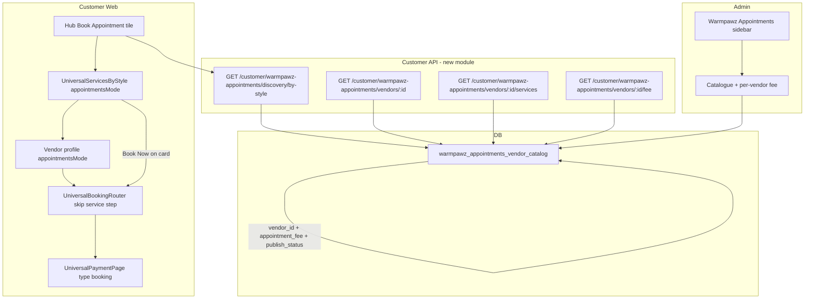

# Warmpawz Appointments — implementation plan

## Goal

Ship **Warmpawz Appointments** on branch `feature/book-an-appointment` (from `develop` or your synced personal branch with current lean discovery). Admin controls **which vendors appear** and **per-vendor flat appointment fee** (draft/published). Customers use a **separate hub tile** (“Book Appointment”) that reuses category/style discovery UI but calls **new versioned APIs** — no prices, non-selectable service catalogue, orange **Book Now** → slot pick → **existing** `UniversalPaymentPage` / booking confirmation.

**Ponytail rule:** mirror [Warmpawz Pay catalogue](backend/lambda/src/endpoints/warmpawz-pay/admin/catalogue/) patterns; do **not** modify existing `GET /customer/services/by-style` behavior.

---

## Architecture



---

## Phase 0 — Branch

```bash
git fetch origin
git checkout develop   # or dev-abhi synced with develop
git checkout -b feature/book-an-appointment
```

---

## Phase 1 — Database (minimal, additive)

**Next migration:** `db/migrations/1085_warmpawz_appointments_schema.sql`  
**RBAC:** `db/migrations/1086_warmpawz_appointments_admin_rbac.sql`

Single catalogue table (fee on row — no second pricing table unless we outgrow it):

```sql
CREATE TABLE IF NOT EXISTS warmpawz_appointments_vendor_catalog (
  id UUID PRIMARY KEY DEFAULT gen_random_uuid(),
  vendor_id UUID NOT NULL UNIQUE,
  appointment_fee NUMERIC(12, 2) NOT NULL DEFAULT 0,
  publish_status TEXT NOT NULL DEFAULT 'draft',  -- draft | published
  published_at TIMESTAMPTZ,
  created_by UUID,
  created_at TIMESTAMPTZ NOT NULL DEFAULT NOW(),
  updated_at TIMESTAMPTZ NOT NULL DEFAULT NOW(),
  CONSTRAINT wappt_catalog_publish_status_chk
    CHECK (publish_status IN ('draft', 'published')),
  CONSTRAINT wappt_catalog_fee_nonneg_chk
    CHECK (appointment_fee >= 0)
);
CREATE INDEX IF NOT EXISTS idx_wappt_catalog_published
  ON warmpawz_appointments_vendor_catalog (publish_status)
  WHERE publish_status = 'published';
```

Optional later: `bookings.metadata.bookingMode = 'warmpawz_appointments'` — **no migration** (JSONB already on bookings/payments paths).

---

## Phase 2 — Admin backend + UI

### Backend (non-customer module — mirror wpay)

New tree: [`backend/lambda/src/endpoints/warmpawz-appointments/admin/catalogue/`](backend/lambda/src/endpoints/warmpawz-appointments/admin/catalogue/)

| Route | Purpose |
|-------|---------|
| `GET /admin/warmpawz-appointments/catalogue` | Paginated list (draft/published, fee, category) |
| `GET /admin/warmpawz-appointments/catalogue/vendor-candidates` | Same category filter pattern as wpay [`merchant-role-sql.ts`](backend/lambda/src/endpoints/warmpawz-pay/shared/merchant/merchant-role-sql.ts) |
| `POST /admin/warmpawz-appointments/catalogue` | Add vendor + `appointment_fee` |
| `POST .../publish` / `unpublish` / `DELETE` / `bulk/*` | Same lifecycle as wpay |
| `PUT /admin/warmpawz-appointments/catalogue/:id/fee` | Update single vendor fee |
| `POST /admin/warmpawz-appointments/catalogue/bulk-fee` | **Copy fee to selected rows** (admin “paste across vendors”) |

Shared eligibility SQL (new, small):

```ts
// warmpawz-appointments/shared/catalogue-eligibility-sql.ts
wapptCatalogueCustomerVisibleSql('c') =>
  c.publish_status = 'published'
  AND vendor approved/active (reuse wpay vendor gate minus bank_verified)
```

Register in [`backend/lambda/src/handler/index.ts`](backend/lambda/src/handler/index.ts) next to wpay admin routes.

### Admin nav + UI

- [`packages/shared-types/src/admin-portal-nav.ts`](packages/shared-types/src/admin-portal-nav.ts): new item **`warmpawz-appointments-catalogue`** — label **Warmpawz Appointments**, permission `admin.warmpawz_appointments`, path `/warmpawz-appointments` (top-level sibling to Warmpawz Pay — not buried in Finance fee tabs).
- [`apps/admin-web/app/warmpawz-appointments/catalogue/page.tsx`](apps/admin-web/app/warmpawz-appointments/catalogue/page.tsx) + shell cloned from [`WarmpawzPayShell.tsx`](apps/admin-web/components/admin/warmpawz-pay/shared/WarmpawzPayShell.tsx).
- Catalogue table columns: vendor, category, eligibility badges (reuse wpay components where possible), **appointment fee (₹)**, publish status, actions.
- Bulk actions: publish/unpublish + **“Apply fee to selected”** input.

---

## Phase 3 — Customer API (4-layer, new versioned routes)

New module: [`backend/lambda/src/endpoints/customer/warmpawz-appointments/`](backend/lambda/src/endpoints/customer/warmpawz-appointments/)  
Shim: [`customerEndpoint/customer-warmpawz-appointments.ts`](backend/lambda/src/endpoints/customer/customerEndpoint/)  
Register **before** `/customer/:customerId` in handler index.

### Endpoints

| Endpoint | Reuse strategy |
|----------|----------------|
| `GET /customer/warmpawz-appointments/discovery/by-style` | Delegate to shared by-style runner with `catalogueFilter: 'wappt'` + `omitPricing: true` |
| `GET /customer/warmpawz-appointments/vendors/:vendorId` | Lean vendor header; include `appointmentFee` from catalogue; **no** `priceMin` |
| `GET /customer/warmpawz-appointments/vendors/:vendorId/services` | Reuse [`vendor-services-list.repo.ts`](backend/lambda/src/endpoints/customer/discovery/repos/vendor-services-list.repo.ts) SQL; map to **no-price DTO**; cursor pagination (same cursor util as discovery) |
| `GET /customer/warmpawz-appointments/vendors/:vendorId/fee` | Thin read for checkout (validates published + returns fee) |

### Shared discovery reuse (smallest diff)

Add **optional** flags to existing by-style internals (default unchanged):

- [`vendor-query-sql.ts`](backend/lambda/src/endpoints/customer/discovery/services/services-by-style/vendor-query-sql.ts): optional `INNER JOIN warmpawz_appointments_vendor_catalog c ON c.vendor_id = v.id AND <visible sql>` when `opts.catalogue === 'wappt'`.
- [`query-enrich.ts`](backend/lambda/src/endpoints/customer/discovery/services/services-by-style/query-enrich.ts): skip `dbFetchDiscoveryListStatsForVendors` when `omitPricing`.
- New [`appointment-vendor-card-dto.ts`](backend/lambda/src/utils/appointment-vendor-card-dto.ts): same shape as [`discovery-vendor-card-dto.ts`](backend/lambda/src/utils/discovery-vendor-card-dto.ts) **without** `priceMin`; attach `appointmentFee` only on detail/fee endpoints (not list cards).

Response envelope matches existing by-style (`vendors`, `nextCursor`, `style`, filters) + optional `appointmentFee` omitted from list.

**Validator:** `cd backend/lambda && npm run validate:customer-layers` after module split.

---

## Phase 4 — Customer UI

### Entry: hub tile

- Add **“Book Appointment”** tile on relevant hub screens (vet, grooming, etc.) in [`CustomerHomeWrapper.tsx`](apps/customer-web/components/customer/wrappers/CustomerHomeWrapper.tsx) / hub config.
- Tile navigates to existing by-style shell screen with `appointmentsMode: true` (new prop), **not** replacing normal discovery.

### Feed hook

- New [`useAppointmentsByStyleFeed.ts`](apps/customer-web/hooks/useAppointmentsByStyleFeed.ts) — copy of [`useByStyleDiscoveryFeed.ts`](apps/customer-web/hooks/useByStyleDiscoveryFeed.ts) pointing at `/customer/warmpawz-appointments/discovery/by-style`.

### List + cards ([`UniversalServicesByStyle.tsx`](apps/customer-web/components/customer/shared/UniversalServicesByStyle.tsx))

Add prop `appointmentsMode?: boolean` (avoid full component fork):

| Normal | Appointments mode |
|--------|-------------------|
| “from ₹X” footer | Orange **Book Now** (`#FF8C42`, filled) |
| Expand/select services | Services load as **read-only catalogue** (no select, no prices) |
| Tap card → profile | Same profile UI, appointments props |

**Card bottom-right:** replace price with same **Book Now** → `onNavigate('booking', { vendorId, serviceStyle, appointmentsMode: true })` skipping profile.

### Vendor profile

- Reuse vet/clinic profile views with `appointmentsMode`: hide all price UI; sticky **Book Appointment** button.
- Services tab: call new paginated services endpoint; render name/duration/description only.

### Booking + payment (reuse, minimal backend touch)

[`UniversalBookingRouter.tsx`](apps/customer-web/components/customer/shared/UniversalBookingRouter.tsx):

- When `appointmentsMode`: **initial step = `details`** (slots), skip `service` step.
- On mount: `GET .../fee` + hidden resolve of first published `vendor_service` for `serviceStyle` (server endpoint or small customer helper) — **only** for `bookings/create` `serviceId` requirement; user never sees it.
- Pass to payment: `price = appointmentFee`, `bookingMode: 'warmpawz_appointments'`.

[`bookings-enhanced.booking.ts`](backend/lambda/src/endpoints/booking/endpoints/bookings-enhanced.booking.ts) — **small, explicit extension**:

- If `metadata.bookingMode === 'warmpawz_appointments'`: validate vendor is in published catalogue; **server-read `appointment_fee`** (ignore client amount); use as `base_price` / `calculatedFinalAmount` base; auto-resolve `serviceId` if omitted.
- Slots: existing `GET /customer/vendor/:vendorId/available-slots` (serviceId optional).

[`UniversalPaymentPage`](apps/customer-web/components/customer/payment/UniversalPaymentPage.tsx): no structural change — receives `baseAmount` from appointment fee; existing Razorpay + confirmation flow.

---

## Phase 5 — Test plan

| Area | Check |
|------|-------|
| Admin | Add vendor + fee, draft → published; bulk fee copy; category filter matches wpay candidates |
| API | Published vendor in by-style v2 list; draft excluded; response has **no** `priceMin`/service prices |
| Pagination | `limit` + `cursor` parity with existing by-style |
| Customer | Hub tile → list → Book Now (card + profile) → slots → pay admin fee → confirmation |
| Regression | Normal `GET /customer/services/by-style` unchanged |
| Layers | `npm run validate:customer-layers` |

---

## File touch summary (expected)

| Area | New / changed |
|------|----------------|
| DB | 2 migrations (1085, 1086) |
| Admin BE | `endpoints/warmpawz-appointments/admin/catalogue/*` (~8–12 files, wpay-shaped) |
| Customer BE | `endpoints/customer/warmpawz-appointments/*` (4 routes × 4 layers) |
| Discovery shared | Optional flags in `vendor-query-sql.ts`, `query-enrich.ts` |
| Utils | `appointment-vendor-card-dto.ts`, `catalogue-eligibility-sql.ts` |
| Booking | Small branch in `bookings-enhanced.booking.ts` |
| Admin UI | `app/warmpawz-appointments/*`, catalogue components (clone wpay) |
| Customer UI | Hub tile, `useAppointmentsByStyleFeed`, `appointmentsMode` props on shared components |

---

## Deliberate simplifications (`ponytail:`)

- **Fee on catalogue row** — not a separate pricing table; upgrade path = extract if we add effective dates / tiers later.
- **Hidden serviceId resolve** — booking row still needs a service FK; user never selects; ceiling = wrong service if vendor has multiple styles (mitigate: resolve by `serviceStyle` + category).
- **No new Razorpay flow** — reuse booking payment rail entirely.
- **No change to global platform fee config** — appointment fee is per-vendor catalogue, separate from Finance → Fee Configuration.
