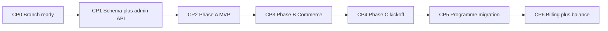
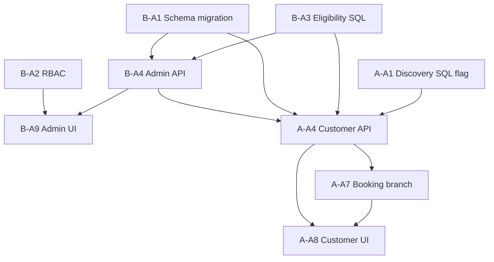

# Warmpawz Appointments — Joint Implementation Plan (Phases A · B · C)

**Branch:** `feature/book-an-appointment`  
**Status:** Active delivery plan  
**Date:** 27 July 2026  
**Team:** Abhi (customer API + customer-web) · Bindu (migrations + admin catalogue/pricing)  
**Related docs:**

| Document | Role |
|----------|------|
| [WARMPAWZ_REUSABLE_UI.md](./WAPPT_REUSABLE_UI.md) | **Reusable list + profile UI** — how to map new WAPPT categories |
| [WARMPAWZ_APPOINTMENTS_IMPLEMENTATION_PLAN.md](./WARMPAWZ_APPOINTMENTS_IMPLEMENTATION_PLAN.md) | MVP technical spec (Phase A detail) |
| [ARCHITECTURE_ANALYSIS_MERCHANT_PROGRAMME.md](./ARCHITECTURE_ANALYSIS_MERCHANT_PROGRAMME.md) | Long-term platform direction (Phase C north star) |

---

## 1. Executive summary

We ship **Warmpawz Appointments** in three phases on one branch, merging work at fixed checkpoints:

| Phase | Goal | Outcome |
|-------|------|---------|
| **A — MVP** | Admin-curated vendors, per-vendor flat fee, hidden prices, Book Now → slot → single payment | Dev-smokeable end-to-end flow |
| **B — Commerce Switch** | Hub tile and booking stamped via programme router | No ad-hoc `appointmentsMode` flags; `commerce_mode` frozen correctly |
| **C — Platform** | Merchant Programme + Billing + two-phase pay (final bill, balance, redemption) | Aligns with architecture analysis; MVP stays live |

**Ponytail rule for Phase A:** wpay-shaped catalogue + versioned customer APIs. **Do not** modify `GET /customer/services/by-style` default behaviour.

**Phase C debt accepted in Phase A:** separate `warmpawz_appointments_vendor_catalog` table (not Merchant Programme yet). Migration path documented in Phase C.

---

## 2. Team ownership

### Bindu — migrations, admin, catalogue backend

| Owns | Does not own |
|------|----------------|
| All `db/migrations/*` for this feature | Customer 4-layer endpoints |
| RBAC seed migrations | `apps/customer-web/**` |
| `backend/lambda/src/endpoints/warmpawz-appointments/admin/**` | Discovery `query-enrich` / by-style internals |
| `packages/shared-types/src/admin-portal-nav.ts` (appointments entry) | `bookings-enhanced.booking.ts` (Abhi proposes; Bindu reviews if payment metadata) |
| `apps/admin-web/**` Warmpawz Appointments UI | Commerce Switch customer routing |
| Shared `catalogue-eligibility-sql.ts` under `warmpawz-appointments/shared/` | |

### Abhi — customer API, discovery hooks, customer-web, booking touch

| Owns | Does not own |
|------|----------------|
| `backend/lambda/src/endpoints/customer/warmpawz-appointments/**` (4-layer) | Migration files |
| Optional flags in discovery `vendor-query-sql.ts`, `query-enrich.ts` | Admin catalogue routes/services |
| `appointment-vendor-card-dto.ts` | Admin-web components |
| `bookings-enhanced.booking.ts` — `warmpawz_appointments` branch | RBAC permission seeds |
| `apps/customer-web/**` — hub tile, feeds, `appointmentsMode` UI | |
| Phase B: `commerce-switch-routing/**`, route adapter | Phase B: commerce config seed migration (Bindu) |
| `npm run validate:customer-layers` for customer module | |

### Shared review

- `backend/lambda/src/handler/index.ts` — whoever adds routes; other reviews registration order.
- API contracts between admin catalogue and customer list (publish_status, appointment_fee column names).
- Feature flags / env gates before prod.

---

## 3. Branch & merge strategy

All work lands on **`feature/book-an-appointment`**. No long-lived personal forks for this feature.

### 3.1 Personal integration branches (optional)

```
develop
  └── feature/book-an-appointment          ← integration branch (target)
        ├── feature/bindu-wappt-migrations-admin   ← Bindu
        └── feature/abhi-wappt-customer-booking   ← Abhi
```

Merge personal branches → `feature/book-an-appointment` **only at checkpoints** (below).

### 3.2 Rebase rule

Before each checkpoint PR, rebase onto latest `feature/book-an-appointment`:

```bash
git fetch origin
git rebase origin/feature/book-an-appointment
```

### 3.3 Checkpoint map



| Checkpoint | Merge into `feature/book-an-appointment` | Gate (must pass) |
|------------|------------------------------------------|------------------|
| **CP0** | Branch exists; architecture + MVP plan docs | Done |
| **CP1** | Bindu: migrations + admin catalogue API (no UI required) | Migrations idempotent; admin list/create/publish returns 200 on dev RDS |
| **CP2** | Abhi: customer API + UI + booking branch | E2E dev smoke (see §5.5); `validate:customer-layers` OK |
| **CP3** | Abhi: commerce switch adapter; Bindu: config seed migration if needed | Hub tile uses commerce route; booking has `commerce_mode` |
| **CP4** | Plan sign-off only — no code requirement | Product + finance approve Phase C scope |
| **CP5** | Bindu: Merchant Programme migration; both: enrollment refactor | Pay Bill + Appointments enrollments unified |
| **CP6** | Billing module + balance payment | Pilot merchant final bill flow |

**Target for `develop` merge:** after **CP3** (MVP + commerce switch) with feature flags off in prod until QA sign-off.

---

## 4. Migration numbering (Bindu)

**Important:** This branch already has overlapping `1080`–`1082` filenames (Commerce Switch + Warmpawz Pay). Bindu must **pick the next free integer** after the highest applied migration on shared dev RDS before adding appointment files.

**Reserved for Warmpawz Appointments (Bindu only):**

| File (provisional) | Purpose |
|--------------------|---------|
| `10XX_warmpawz_appointments_schema.sql` | `warmpawz_appointments_vendor_catalog` table + indexes |
| `10XX_warmpawz_appointments_admin_rbac.sql` | `admin.warmpawz_appointments.*` permissions |
| `10XX_commerce_switch_book_appointment_seed.sql` | Phase B — register `book_appointment` model in platform config (if not code-only) |
| `10XX_merchant_programme_enrollment.sql` | Phase C — programme tables + backfill from wpay + wappt catalogues |
| `10XX_appointment_billing_schema.sql` | Phase C — billing accounts, final bills, redemption ledger |

Abhi **must not** commit migration files. If schema needs a column change, open a ticket for Bindu with the exact SQL intent.

### 4.1 Phase A schema (Bindu — CP1)

```sql
CREATE TABLE IF NOT EXISTS warmpawz_appointments_vendor_catalog (
  id UUID PRIMARY KEY DEFAULT gen_random_uuid(),
  vendor_id UUID NOT NULL UNIQUE,
  appointment_fee NUMERIC(12, 2) NOT NULL DEFAULT 0,
  publish_status TEXT NOT NULL DEFAULT 'draft',
  published_at TIMESTAMPTZ,
  created_by UUID,
  created_at TIMESTAMPTZ NOT NULL DEFAULT NOW(),
  updated_at TIMESTAMPTZ NOT NULL DEFAULT NOW(),
  CONSTRAINT wappt_catalog_publish_status_chk
    CHECK (publish_status IN ('draft', 'published')),
  CONSTRAINT wappt_catalog_fee_nonneg_chk
    CHECK (appointment_fee >= 0)
);

CREATE INDEX IF NOT EXISTS idx_wappt_catalog_published
  ON warmpawz_appointments_vendor_catalog (publish_status)
  WHERE publish_status = 'published';
```

**Contract for Abhi (frozen at CP1):**

- Table: `warmpawz_appointments_vendor_catalog`
- Customer-visible: `publish_status = 'published'` + vendor approved/active
- Fee column: `appointment_fee` (INR, server authority at checkout)
- No `bank_verified` gate for appointments (unlike wpay) unless product changes

---

## 5. Phase A — MVP build

**Objective:** Hub “Book Appointment” tile → admin-curated by-style list (no prices) → Book Now → slots → pay per-vendor flat fee → existing confirmation.

### 5.1 Work breakdown

#### Bindu — CP1 (merge first)

| # | Task | Files / area | Done when |
|---|------|--------------|-----------|
| B-A1 | Schema migration | `db/migrations/10XX_warmpawz_appointments_schema.sql` | Applied on dev RDS |
| B-A2 | RBAC migration | `db/migrations/10XX_warmpawz_appointments_admin_rbac.sql` | Permissions in Create Role UI |
| B-A3 | Eligibility SQL | `warmpawz-appointments/shared/catalogue-eligibility-sql.ts` | Exported `wapptCatalogueCustomerVisibleSql` |
| B-A4 | Admin catalogue module | `endpoints/warmpawz-appointments/admin/catalogue/` (routes→handlers→services→repos) | CRUD + publish/unpublish + bulk |
| B-A5 | Vendor candidates | Reuse wpay `merchant-role-sql` category filter pattern | `GET .../vendor-candidates?category=` |
| B-A6 | Bulk fee endpoint | `POST .../catalogue/bulk-fee` | Apply fee to selected catalogue IDs |
| B-A7 | Handler registration | `handler/index.ts` | Admin routes live |
| B-A8 | Admin nav | `admin-portal-nav.ts`, `admin-sidebar-nav.ts` | “Warmpawz Appointments” sidebar |
| B-A9 | Admin UI | `apps/admin-web/app/warmpawz-appointments/**` | Catalogue table, fee edit, publish, bulk fee |

**Admin routes (minimum):**

```
GET    /admin/warmpawz-appointments/catalogue
GET    /admin/warmpawz-appointments/catalogue/vendor-candidates
GET    /admin/warmpawz-appointments/catalogue/:catalogueId
POST   /admin/warmpawz-appointments/catalogue
PUT    /admin/warmpawz-appointments/catalogue/:catalogueId/fee
POST   /admin/warmpawz-appointments/catalogue/:catalogueId/publish
POST   /admin/warmpawz-appointments/catalogue/:catalogueId/unpublish
DELETE /admin/warmpawz-appointments/catalogue/:catalogueId
POST   /admin/warmpawz-appointments/catalogue/bulk/{publish|unpublish|delete}
POST   /admin/warmpawz-appointments/catalogue/bulk-fee
```

**→ Merge to `feature/book-an-appointment` at CP1.** Notify Abhi with migration numbers + eligibility import path.

---

#### Abhi — starts after CP1 (can prep discovery flags in parallel)

| # | Task | Files / area | Done when |
|---|------|--------------|-----------|
| A-A1 | Discovery SQL flag | `services-by-style/vendor-query-sql.ts` | Optional `INNER JOIN warmpawz_appointments_vendor_catalog` when `catalogue: 'wappt'`; **default unchanged** |
| A-A2 | Discovery enrich flag | `services-by-style/query-enrich.ts` | Skip price stats when `omitPricing: true` |
| A-A3 | Appointment card DTO | `utils/appointment-vendor-card-dto.ts` | No `priceMin` in response |
| A-A4 | Customer 4-layer module | `customer/warmpawz-appointments/**` | All routes below |
| A-A5 | Shim + register | `customerEndpoint/customer-warmpawz-appointments.ts`, `handler/index.ts` | Before `/customer/:customerId` |
| A-A6 | Layer validator | `npm run validate:customer-layers` | Passes |
| A-A7 | Booking create branch | `bookings-enhanced.booking.ts` | `bookingMode: warmpawz_appointments`; server fee; auto `serviceId` |
| A-A8 | Feed hook | `hooks/useAppointmentsByStyleFeed.ts` | Points to versioned API |
| A-A9 | Hub tile | `CustomerHomeWrapper.tsx` + hub config | Separate entry from normal discovery |
| A-A10 | List UI | `UniversalServicesByStyle.tsx`, `UniversalServiceProviderList.tsx` | `appointmentsMode`: no prices, orange Book Now |
| A-A11 | Profile UI | Vet/clinic profile components | Hidden prices; Book Appointment CTA |
| A-A12 | Booking UI | `UniversalBookingRouter.tsx` | Skip service step; slots → payment |
| A-A13 | Services catalogue UI | Profile services tab | Read-only, paginated, no prices |

**Customer routes (minimum):**

```
GET /customer/warmpawz-appointments/discovery/by-style
GET /customer/warmpawz-appointments/vendors/:vendorId
GET /customer/warmpawz-appointments/vendors/:vendorId/services
GET /customer/warmpawz-appointments/vendors/:vendorId/fee
```

**→ Merge to `feature/book-an-appointment` at CP2.**

---

### 5.2 Dependency diagram (Phase A)



### 5.3 Parallel work (safe before CP1)

| Abhi can start early | Blocked until CP1 |
|----------------------|-------------------|
| A-A1, A-A2, A-A3 (no DB) | A-A4 customer repos joining catalogue table |
| A-A8 hook shell (mock URL) | A-A7 fee validation against real table |
| UI props `appointmentsMode` behind flag | E2E with admin-published vendor |

### 5.4 API contract (handshake at CP1)

**List card (no fee on list):**

```json
{
  "success": true,
  "vendors": [{
    "id": "uuid",
    "vendorId": "uuid",
    "name": "Clinic Name",
    "photoUrl": "...",
    "rating": 4.5,
    "reviewCount": 12,
    "availabilityText": "Today 4:00 PM",
    "serviceStyle": "at_center"
  }],
  "nextCursor": "..."
}
```

**Fee endpoint (checkout authority):**

```json
{
  "success": true,
  "vendorId": "uuid",
  "appointmentFee": 299.00,
  "currency": "INR"
}
```

**Booking create metadata:**

```json
{
  "metadata": {
    "bookingMode": "warmpawz_appointments"
  }
}
```

Server ignores client `price` for this mode; reads `appointment_fee` from catalogue.

### 5.5 CP2 acceptance test (both)

1. Bindu publishes vendor X at ₹299 in admin.
2. Abhi opens hub → Book Appointment → vet → at_center → vendor X visible, **no price**.
3. Book Now on card → slot picker → summary shows ₹299 (+ tax/fees per existing calculator).
4. Razorpay on dev → booking confirmed.
5. Draft vendor Y **not** in list.
6. `GET /customer/services/by-style` unchanged for same category (regression).

---

## 6. Phase B — Commerce Switch integration

**Objective:** Replace one-off `appointmentsMode` routing with Commerce Switch programme router; freeze `bookings.commerce_mode` correctly.

**Prerequisite:** CP2 complete.

### 6.1 Work breakdown

#### Bindu

| # | Task | Files | Done when |
|---|------|-------|-----------|
| B-B1 | Commerce config seed (if needed) | `db/migrations/10XX_commerce_switch_book_appointment_seed.sql` | `book_appointment` in platform_settings / admin_settings |
| B-B2 | Admin commerce panel (optional) | `CommerceSwitchPanel.tsx` | Toggle documents `book_appointment` model |

#### Abhi

| # | Task | Files | Done when |
|---|------|-------|-----------|
| A-B1 | Register model | `commerce-switch/registry/bootstrap-models.ts` | `book_appointment` descriptor with `slot_fee` capability |
| A-B2 | Route adapter | `commerce-switch-routing/adapters/book-appointment-route-adapter.ts` | Replaces wpay stub for appointment entry |
| A-B3 | Hub tile routing | `resolve-service-booking-commerce-route.ts`, hub tiles | Tile calls commerce resolver |
| A-B4 | Booking commerce stamp | `resolve-commerce-model-for-booking-create.ts` | Appointments booking → `commerce_mode: book_appointment` |
| A-B5 | Remove duplicate flags | Customer UI | `appointmentsMode` becomes thin wrapper over commerce route |

**Hard exclusions unchanged:** tele, meal, ecommerce, pharmacy, package — `isCommerceExcludedService` must still return marketplace.

### 6.2 CP3 acceptance test

1. Commerce config active model = `book_appointment` (dev).
2. Hub tile → appointment flow (not marketplace).
3. New booking row: `commerce_mode = 'book_appointment'`, `commerce_version` set.
4. Tele booking still `marketplace`.
5. Fallback: if adapter unavailable, hub tile does **not** break (marketplace fallback OK with dev warning).

**→ Merge at CP3. Ready for `develop` PR after QA.**

---

## 7. Phase C — Platform alignment (post-MVP)

**Objective:** Evolve toward [ARCHITECTURE_ANALYSIS_MERCHANT_PROGRAMME.md](./ARCHITECTURE_ANALYSIS_MERCHANT_PROGRAMME.md) without breaking Phase A/B.

**Prerequisite:** CP3 merged; Warmpawz Pay branch merged to `develop` (M0/M1 in architecture doc); PostPaymentProcessor live for Pay Bill.

### 7.1 Sub-phases

| Sub-phase | Scope | Primary owner |
|-----------|-------|---------------|
| **C1 — Merchant Programme** | Single enrollment table; migrate wpay + wappt catalogues | Bindu (migrations + admin); Abhi (customer SQL join update) |
| **C2 — Fee bundle** | Base + convenience + platform (category defaults) | Bindu (admin config); Abhi (checkout display) |
| **C3 — Billing module** | Final bill, vendor issuance, customer view | Bindu (schema + admin); Abhi (customer APIs) |
| **C4 — Balance payment** | Redemption Option R1; balance Razorpay leg | Both; Bindu settlements |
| **C5 — Hidden price policy** | Per-enrollment toggle (default visible for pilot) | Bindu admin; Abhi DTO gating |

### 7.2 Work breakdown (summary)

#### C1 — Merchant Programme (CP5)

**Bindu:**

- Migration: `merchant_programme_enrollment`, `merchant_programme_config` (typed JSON per programme)
- Backfill: `warmpawz_pay_vendor_catalog` → `programme_type = pay_bill`
- Backfill: `warmpawz_appointments_vendor_catalog` → `programme_type = book_appointment`
- Admin: unified “Vendor Programmes” shell (tabs per programme)
- Deprecation plan for standalone catalogue tables (read-only period)

**Abhi:**

- Customer discovery join → enrollment table + `programme_type = book_appointment`
- No customer-visible regression during backfill

#### C2 — Fee bundle

**Bindu:** Admin config for base / convenience / platform per category or enrollment.  
**Abhi:** Billing quote API consumed at checkout (replaces single `appointment_fee` display).

#### C3 — Billing module (CP6)

**Bindu:**

- Tables: `billing_accounts`, `final_bills`, `redeemable_credits`, `balance_due`
- Vendor final bill API + admin oversight

**Abhi:**

- Customer: view final bill, pay balance
- Booking flow: after service → balance payment intent

#### C4 — Redemption & settlement

- **Option R1:** base fee only redeems toward final bill (architecture doc §9.5)
- Bindu: settlement snapshots per payment phase
- Abhi: customer receipt copy

### 7.3 Phase C checkpoints

| Checkpoint | Merge content |
|------------|---------------|
| CP4 | Phase C scope signed (product/finance) — doc only |
| CP5 | C1 Merchant Programme on branch |
| CP6 | C3 + C4 billing + balance (pilot merchants) |

### 7.4 What Phase C explicitly defers

- Marketplace booking migration to wpay payment intents
- Membership / insurance programmes
- Mandatory hidden prices globally

---

## 8. Coordination rituals

### 8.1 Before each checkpoint

| Who | Action |
|-----|--------|
| Both | Rebase on `feature/book-an-appointment` |
| Bindu | Post migration numbers applied on dev RDS in team channel |
| Abhi | Post `validate:customer-layers` output |
| Both | 15-min sync: API contract changes? |

### 8.2 PR rules

- PR target: `feature/book-an-appointment` (not `develop`) until CP3 QA done.
- One logical concern per PR where possible (Bindu: migrations+admin API; Abhi: customer module).
- Cross-review: Abhi reviews Bindu’s eligibility SQL; Bindu reviews Abhi’s booking fee enforcement.

### 8.3 Feature flags (recommended)

| Flag | Phase | Owner |
|------|-------|-------|
| `WARMPAWZ_APPOINTMENTS_ADMIN_ENABLED` | A | Bindu |
| `PROGRAMME_BOOK_APPOINTMENT_CUSTOMER` | A | Abhi |
| `COMMERCE_MODEL_BOOK_APPOINTMENT` | B | Bindu seed + Abhi adapter |

Prod: all off until CP2 QA on dev.

---

## 9. Deploy order (dev)

Per checkpoint merge to `feature/book-an-appointment`:

| Order | Component | When |
|-------|-----------|------|
| 1 | Migrations (Bindu) | CP1 |
| 2 | Lambda | After each checkpoint |
| 3 | Admin web | CP1 (admin) / CP2 (full) |
| 4 | Customer web | CP2 |

```bash
# After CP2 example
ENVIRONMENT=dev node scripts/run-migration-rds-node.js <bindu_migration>.sql
./scripts/deploy-lambda-direct.sh
./scripts/deploy-admin-web.sh
./scripts/deploy-customer-web.sh
```

---

## 10. Risk register

| Risk | Mitigation | Owner |
|------|------------|-------|
| Migration number collision (1080–1085) | Bindu audits highest on dev RDS before new files | Bindu |
| Abhi blocked on CP1 | Early publish of eligibility SQL + table contract | Bindu |
| `serviceId` auto-resolve wrong service | Resolve by `serviceStyle` + category; log chosen id | Abhi |
| Commerce switch fallback hides bugs | Dev-only warning; explicit CP3 test | Abhi |
| Phase A catalogue debt | CP5 Merchant Programme migration planned | Both |
| wpay not merged before Phase C settlement | CP4 gate: wpay M1 complete | Both |

---

## 11. Document history

| Version | Date | Change |
|---------|------|--------|
| 1.0 | 27 Jul 2026 | Initial joint plan — Phases A/B/C, Abhi/Bindu split, checkpoints |

---

*Implementation follows this plan. Update this doc when checkpoints complete or scope changes.*
