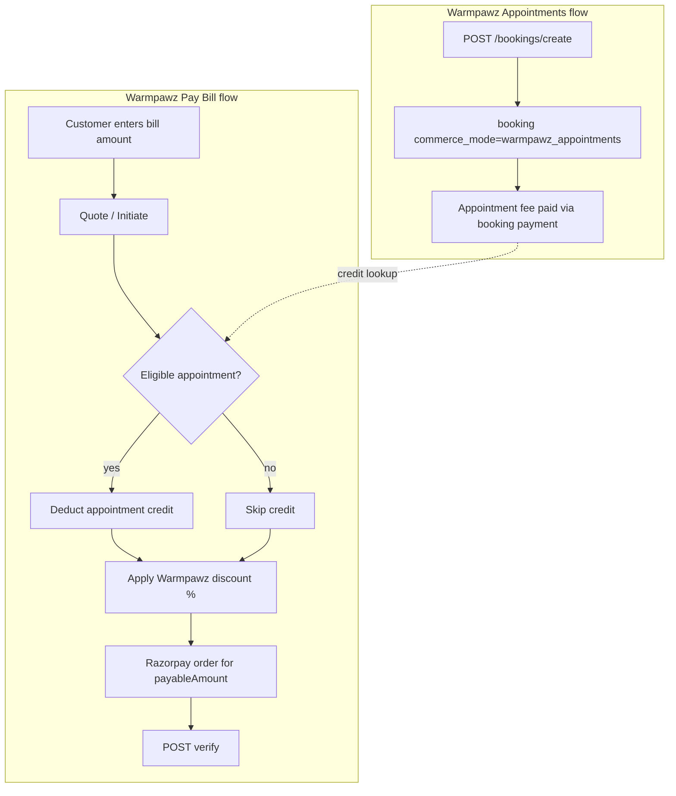

# Warmpawz Commerce Mode — Architecture Investigation

**Type:** Investigation only (no code, no migrations, no deployment)  
**Date:** 2026-08-04  
**Scope:** Complete remaining architecture decisions inside the **Warmpawz** commerce mode  
**Out of scope:** Redesigning Commerce Switch; adding new commerce modes

---

## Fixed context (do not change)

Commerce Switch is implemented with **exactly two modes**:

```
Commerce Switch
│
├── Marketplace
│
└── Warmpawz  (code: commerce model id `warmpawz_pay`)
      │
      ├── Pay Bill          (walk-in bill payment)
      └── Appointments      (scheduled slot + appointment fee)
```

**Terminology mapping (code ↔ product):**

| Product name | Commerce Switch | Runtime discriminator |
|--------------|-----------------|------------------------|
| Marketplace | `marketplace` | `bookings.commerce_mode = 'marketplace'` (default) |
| Warmpawz (mode) | `warmpawz_pay` | Active model from Commerce Switch config |
| Warmpawz **Appointments** | Same mode | `bookings.commerce_mode = 'warmpawz_appointments'` |
| Warmpawz **Pay Bill** | Same mode | `payments.payment_source = 'warmpawz_pay'`, `booking_id` NULL |

Descriptor (already registered): `backend/lambda/src/commerce-switch/registry/bootstrap-models.ts` —  
`WARMPAWZ_PAY_MODEL_DESCRIPTOR`: *"Warmpawz Pay scan-to-pay plus admin-curated Book Appointment flow"*.

Pay Bill and Appointments are **separate business flows** inside one commerce mode. They share Commerce Switch gating (e.g. vendor price lock when `warmpawz_pay` is active) but use **different aggregates** (bookings vs payments).

---

## Current implementation snapshot

| Layer | Appointments flow | Pay Bill flow |
|-------|-------------------|---------------|
| Customer APIs | `/customer/warmpawz-appointments/*` + `POST /bookings/create` | `/customer/warmpawz-pay/*` |
| Admin APIs | `/admin/warmpawz-appointments/*` | `/admin/warmpawz-pay/*` |
| Vendor APIs | 3 WAPPT cancel/policy routes + **reuse** `/vendor/bookings`, `/vendor/dashboard`, `/vendor/:id/settlements` | **None** |
| Vendor UI | Bookings/home schedule with WAPPT display rules | **None** |
| Settlement accrual | Booking completion → `vendor_earnings` → `settlements` (booking-linked) | **Designed in schema/docs; not wired after verify** |
| Pricing | Admin `appointment_fee` in `warmpawz_appointments_vendor_catalog` | Admin discount % in `warmpawz_pay_merchant_pricing` |

---

## Investigation 1 — Pay Bill: dedicated Vendor APIs vs extending existing Warmpawz vendor APIs

### Question

Within the Warmpawz commerce mode, does Pay Bill need **dedicated** vendor APIs, or should **existing** vendor APIs be extended?

### Analysis

There is **no unified `/vendor/warmpawz/*` module** today. Warmpawz is split by business flow at the **customer/admin** layer:

- `backend/lambda/src/endpoints/customer/warmpawz-pay/`
- `backend/lambda/src/endpoints/customer/warmpawz-appointments/`
- `backend/lambda/src/endpoints/warmpawz-pay/admin/`
- `backend/lambda/src/endpoints/warmpawz-appointments/admin/`
- Vendor: `vendor-wappt-appointments.ts` (Appointments-only cancel/policy) + generic `vendor-bookings.ts`, `vendor-dashboard-enhanced.ts`

**Appointments — extend existing (already the pattern):**

| Need | Right approach |
|------|----------------|
| Schedule / list | Extend **reuse** `GET /vendor/bookings/:vendorId` (same query as Bookings tab; home schedule already aligned) |
| Complete / OTP | Reuse existing vendor booking actions |
| Cancel + refund policy | **Dedicated** routes justified: `GET/POST /vendor/warmpawz-appointments/bookings/:id/*` (policy differs from marketplace) |
| Earnings visibility | Reuse `GET /vendor/:vendorId/settlements` (booking-linked rows) |

No second “Appointments vendor module” is required beyond the small WAPPT cancel surface.

**Pay Bill — dedicated read APIs required (cannot extend booking APIs):**

Pay Bill never creates a `bookings` row. Payment rows use:

- `payments.payment_source = 'warmpawz_pay'`
- `payments.booking_id IS NULL`

Therefore `GET /vendor/bookings`, dashboard schedule mappers, and booking-centric settlement joins **cannot** represent Pay Bill activity without contorting the booking model.

### Decision

| Flow | Vendor API strategy |
|------|---------------------|
| **Appointments** | **Extend existing** vendor booking + settlement APIs; keep **only** flow-specific routes where behaviour differs (cancel/refund policy). |
| **Pay Bill** | **Add dedicated read APIs** under the Warmpawz Pay Bill module namespace (e.g. `/vendor/warmpawz-pay/...`). Do **not** fork payout/settlement batch logic. |

**Recommended new vendor endpoints (Pay Bill only):**

| Method | Route | Purpose |
|--------|-------|---------|
| GET | `/vendor/warmpawz-pay/payments` | Paginated Pay Bill receipts for vendor (`payments` where `payment_source = 'warmpawz_pay'`) |
| GET | `/vendor/warmpawz-pay/payments/:paymentId` | Detail + linked settlement status |
| GET | `/vendor/warmpawz-pay/summary` | Optional aggregates (today/week count, pending settlement total) |

**Do not add:** vendor POST to create payments, vendor POST to create settlements, or duplicate Razorpay verify.

**Optional consolidation (UI-only):** A single vendor-web “Warmpawz” tab can **call two API families** (bookings + warmpawz-pay/payments) without merging them into one backend monolith.

---

## Investigation 2 — Appointment Fee Credit integration with Pay Bill

### Business rule (target)

```
Customer has Appointment → Appointment Fee already paid
  → Customer chooses Pay Bill
  → System checks eligible appointment
  → Appointment Fee deducted from bill
  → Warmpawz Discount applies (on remainder)
  → Final payable amount → Razorpay
```

### Where this logic belongs

**Inside the Warmpawz commerce mode, Pay Bill customer flow only** — not in vendor APIs, not in Appointments booking create, not in Commerce Switch resolver.



### Recommended layer placement

| Step | Module | Rationale |
|------|--------|-----------|
| Eligibility query (customer + vendor + rules) | **Shared Warmpawz service** callable from Pay Bill (e.g. under `endpoints/warmpawz-pay/shared/` or `warmpawz-appointments/shared/` — cross-flow read only) | Appointments owns booking data; Pay Bill owns bill math |
| Pricing pipeline | **`customer/warmpawz-pay` initiate (and optional pre-initiate quote GET)** | Today: `executeCustomerWarmpawzPayInitiatePost` + `computeWpayDiscountQuote` only |
| Persist audit fields | **Payment row metadata** (and optional booking flag) | Verify must re-validate quote; no client-side math |
| Verify re-check | **`customer/warmpawz-pay/verify`** | Same eligibility + amounts before completing payment |

**Today:** `computeWpayDiscountQuote(originalAmount, discountPercent)` applies discount to the **full bill** with **no appointment lookup** (`wpay-discount.ts`, `customer_warmpawz_pay_initiate_post.service.ts`).

### Server-side pricing pipeline (canonical order)

```
1. originalBill        ← customer input (validated > 0)
2. appointmentCredit ← min(originalBill, creditedFee) if eligible booking exists, else 0
3. billAfterCredit     ← originalBill - appointmentCredit
4. discountQuote       ← computeWpayDiscountQuote(billAfterCredit, discountPercent)
5. payableAmount       ← discountQuote.payableAmount
```

Discount **after** credit matches your stated rule and avoids double-benefit on the fee portion. Appointment credit is **customer-side only** — it does not increase the platform's allowable Warmpawz discount budget (see **Commercial validation rule** ADR).

### Eligibility rules to lock before implementation (product)

These are **architecture decisions**, not schema:

| Rule | Options to decide |
|------|-------------------|
| Which booking qualifies | Same `vendor_id`; status in (`confirmed`, `in_progress`); not cancelled; same calendar day vs any upcoming |
| Credit amount | Paid capture amount on booking vs catalogue `appointment_fee` vs `bookings.total_amount` |
| One-time credit | Flag on booking or payment metadata so fee is not credited twice across multiple Pay Bill attempts |
| Bill less than fee | Credit = `min(bill, fee)`; excess fee not auto-refunded |
| Tele appointments | Include or exclude (tele uses marketplace-style pricing in WAPPT display rules today) |

### Cross-flow coupling (acceptable within same commerce mode)

- Pay Bill **reads** Appointments data (`bookings` where `commerce_mode = 'warmpawz_appointments'`).
- Pay Bill **does not write** booking state except optional idempotent “credit consumed” marker.
- Appointments flow **unchanged** at book time; credit is a **downstream Pay Bill concern**.

### Anti-patterns (reject)

- Putting credit math in vendor dashboard APIs  
- Creating a third commerce mode for “Pay Bill with credit”  
- Duplicating appointment fee in Pay Bill admin catalogue (fee source stays Appointments catalogue)

---

## Investigation 3 — Settlement architecture (reuse Marketplace infrastructure)

### Principle

Warmpawz participates in settlement **through the existing `settlements` + payout pipeline**, differentiated by **row shape and `order_type`**, not duplicate finance subsystems.

Marketplace infrastructure to reuse:

- `settlements` table + status lifecycle (`pending` → `processing` → paid out)
- `vendor_earnings` (where applicable)
- `POST /settlements/request`, batch jobs in `settlement&payouts/endpoints/settlements.ts`
- Vendor read: `GET /vendor/:vendorId/settlements` (`vendor-dashboard-enhanced.ts`)
- Vendor UI: `VendorEarningsSettlementDashboard.tsx` → `/finance/settlements`

### Two accrual paths inside Warmpawz mode

| Flow | Trigger | Settlement anchor | `order_type` | Today |
|------|---------|-------------------|--------------|-------|
| **Appointments** | Booking completed / earnings realized | `booking_id` | Marketplace-style booking settlement (not separate enum required) | **Works** via existing booking → `vendor_earnings` path |
| **Pay Bill** | Payment verify success | `payment_id`, `booking_id` NULL | `warmpawz_pay` | **Schema ready** (`1080`: unique index on `settlements(payment_id)` where `order_type = 'warmpawz_pay'`); **accrual code missing** |

Pay Bill verify today (`dbWpayCompletePayment`) **only updates `payments`** — no settlement insert, no vendor notification (see `customer_warmpawz_pay_verify_post.service.ts`).

### Settlement creation (Warmpawz Pay Bill)

**Decision:** Internal **post-verify processor** inside the Warmpawz Pay Bill module (architecture doc calls this PostPaymentProcessor; MVP may be in-process async).

Warmpawz Pay Bill **creates the settlement entry only**. It must **not** implement its own commission or net-payable math — see **Architecture decision — Settlement calculation** below.

Responsibilities of the Pay Bill post-verify processor:

1. **Enqueue / insert settlement request** — anchor: `order_type = 'warmpawz_pay'`, `payment_id`, `vendor_id`, `settlement_status = 'pending'`; pass **gross commercial inputs** (customer `payableAmount`, payment metadata for discounts/credits) into the **existing Marketplace settlement pipeline**
2. **Invoke existing settlement calculation** — `resolveVendorCommissionPolicy`, `buildFundingAwareSettlementSnapshot` / `computeFundingAwareSettlement`, or the same path used when booking earnings are realized (`backend/lambda/src/finance/settlement/*`, `settlement&payouts/endpoints/settlements.ts`)
3. Persist computed `commission_amount`, `net_amount` / `vendor_amount` on the settlement row (written by Marketplace engine, not hand-calculated in Pay Bill module)
4. Optional: `transactions` row with `transaction_category = 'warmpawz_pay'`
5. Idempotent (unique index already defined in migration 1080)
6. Failure → reconciliation job; **never roll back** successful payment verify

**Do not** create a vendor-facing POST to accrue settlements.  
**Do not** duplicate commission tiers, platform cut, or payout batch logic inside `customer/warmpawz-pay/`.

Appointments **continue** using booking-linked accrual; no change to Commerce Switch.

### Settlement visibility (vendor + admin)

**Decision:** **Extend** existing read APIs rather than duplicate.

| Consumer | Change |
|----------|--------|
| Vendor `GET /vendor/:vendorId/settlements` | Include rows where `order_type = 'warmpawz_pay'`; LEFT JOIN `payments` when `booking_id` IS NULL; expose `flowType`: `appointment` \| `pay_bill` |
| Admin | Already has `GET /admin/warmpawz-pay/payments`; align with settlement status join for ops |
| Payout request | Reuse `POST /settlements/request`; ensure pending Pay Bill settlements roll into same `availableForPayout` math |

Current vendor settlements query joins **only** `bookings` — Pay Bill rows are invisible until extended.

### Reconciliation

Align with `docs/WARMPAWZ_PAY_TECHNICAL_ARCHITECTURE_FINAL.md`:

| Check | Action |
|-------|--------|
| `payments.payment_status = completed` AND no `settlements` row within N minutes | Alert `warmpawz_pay.settlement.missing`; backfill job |
| Pay Bill verify / webhook race | `FOR UPDATE` on payment row (documented pattern) |
| Duplicate settlement | Unique partial index on `payment_id` (already in 1080) |
| Promo/discount audit | Separate async track; payment success must not depend on it |

Appointments reconciliation **reuses** existing booking/settlement reconciliation; add reporting filters by `commerce_mode = 'warmpawz_appointments'` where needed.

### What not to duplicate

- RazorpayX payout creation (`createPayout` in settlements module)  
- Vendor tier / minimum payout rules  
- Bank verification gates  

---

## Investigation 4 — Vendor Dashboard (Warmpawz commerce mode)

### UX requirement

Vendor must clearly see:

- **Appointment payments** (scheduled WAPPT bookings)  
- **Pay Bill payments** (walk-in Warmpawz Pay)  
- **Pending settlements** (both flows)  
- **Completed settlements** (both flows)  

### Current UI

| Surface | Appointments | Pay Bill |
|---------|--------------|----------|
| Home schedule / Bookings tab | Yes (WAPPT display rules) | No |
| Earnings / Settlements (`VendorEarningsSettlementDashboard`) | Yes (booking-linked) | No |
| Dedicated Warmpawz section | No | No |

### Minimum API changes (backend)

**Priority order:**

| # | API change | Serves |
|---|------------|--------|
| 1 | **New** `GET /vendor/warmpawz-pay/payments` (+ optional detail) | Pay Bill activity feed, “customer paid via Warmpawz” |
| 2 | **Extend** `GET /vendor/:vendorId/settlements` with `flowType` / `order_type` and payment join | Pending vs completed settlements for **both** flows in one payout tab |
| 3 | **Reuse** `GET /vendor/bookings/:vendorId` (no new list API) | Appointment payments / schedule — filter client- or server-side by `commerce_mode = 'warmpawz_appointments'` |
| 4 | **Optional** `GET /vendor/warmpawz-pay/summary` | Dashboard header tiles without loading full lists |
| 5 | **Internal** post-verify settlement accrual (Investigation 3) | Makes settlement columns truthful for Pay Bill |

**Not required for MVP dashboard:**

- New Appointments vendor list API (bookings API suffices)  
- Separate payout request endpoint for Pay Bill  
- New commerce mode or Commerce Switch resolver changes  

### Minimum UI changes (vendor-web — architectural note only)

Single **“Warmpawz”** area (or sub-tabs under Finance) with:

| Tab | Data source |
|-----|-------------|
| Appointments | Existing bookings components + `commerce_mode` filter |
| Pay Bill | New list bound to `/vendor/warmpawz-pay/payments` |
| Settlements | Existing settlements page + render `flowType` badge (`Appointment` / `Pay Bill`) |

Notifications (push/in-app): fire from post-verify processor — *“Customer paid ₹X via Warmpawz Pay”* — optional P1 after accrual exists.

---

## Investigation 5 — Remaining architectural gaps (Warmpawz mode)

Gaps below are **inside Warmpawz commerce mode only**, ordered by build dependency.

### P0 — Blocks honest vendor money trail

| Gap | Impact |
|-----|--------|
| Pay Bill verify does not accrue `settlements` (`order_type = 'warmpawz_pay'`) | Vendor dashboard cannot show pending/completed payout for walk-in payments |
| Vendor settlements API ignores payment-linked rows | Pay Bill invisible in Finance tab |

### P1 — Blocks Pay Bill vendor dashboard

| Gap | Impact |
|-----|--------|
| No vendor Pay Bill read APIs | Cannot list “customer paid via Warmpawz” |
| No vendor notification on Pay Bill success | Vendor learns only if customer tells them |
| ~~Net-to-vendor amount rules undefined~~ | **Decided:** reuse Marketplace commission calculation (see Settlement calculation ADR) |

### P2 — Blocks Appointment Fee Credit

| Gap | Impact |
|-----|--------|
| No eligibility service (appointment lookup for Pay Bill) | Credit rule cannot run |
| Initiate/verify only apply discount to gross bill | Wrong payable amount vs product rule |
| No idempotent “credit consumed” contract | Double credit risk |
| Product rules unset (§ Investigation 2 table) | Engineering cannot finalize quote API |
| **No discount vs commission validation** | Platform can configure loss-making `%` off (see Commercial validation ADR) |

### P3 — Appointments flow polish (existing mode)

| Gap | Impact |
|-----|--------|
| `GET /customer/warmpawz-appointments/discovery/by-style` route file exists but may be unregistered in module `index.ts` | Discovery feed gap for some UI paths |
| Commerce Switch capabilities `slot_fee`, `final_balance` in descriptor | **Experimental / not implemented** — current Appointments charge **full appointment fee** upfront, not deposit+balance |
| Vendor sees hidden fee (by design) | Ensure support/docs explain appointment vs Pay Bill revenue lines |

### P4 — Operations & parity

| Gap | Impact |
|-----|--------|
| Reconciliation job for missing Pay Bill settlements | Production risk per architecture doc |
| Admin cross-report: Appointments bookings vs Pay Bill payments vs settlements | Finance ops visibility |
| Shared merchant catalogues (`warmpawz_pay_vendor_catalog` vs `warmpawz_appointments_vendor_catalog`) | Admin must publish in both for full Warmpawz mode UX |

### Explicitly out of scope (per instruction)

- New commerce modes  
- Commerce Switch registry / resolver redesign  
- Replacing Marketplace settlement batch  
- Code and migrations in this document  

---

## Investigation 6 — Appointment Resolution Strategy (Pay Bill fee credit)

### Question

When Pay Bill runs, how does the system identify **which** Warmpawz Appointment booking’s fee should be credited?

### Candidate approaches

| Approach | Mechanism | Pros | Cons |
|----------|-----------|------|------|
| **A. `customer_id` + `vendor_id` only** | Pay Bill initiate receives vendor + phone; server finds “the” booking | Simple client; no extra UI | **Ambiguous** when customer has 2+ eligible appointments at same vendor (reschedule, multi-pet, same-day double booking) |
| **B. Client-supplied `booking_id`** | Customer app sends `bookingId` on initiate/verify | Explicit UX when customer picks an appointment | **Not trustworthy alone** — client can send wrong/stale UUID; must still be validated server-side |
| **C. Active appointment resolver (server)** | Shared service queries `bookings` with eligibility rules; returns 0 or 1 canonical row (or ranked list) | **Authoritative**; idempotent credit consumption; same rules at quote + verify | Requires product rules for tie-break (see below) |
| **D. Appointment QR / session token** | Scan at counter links Pay Bill session to a booking | Strong in-store correlation; good for walk-in | **Not implemented**; overlaps future QR Pay Bill session (`source_entity_id` in architecture doc); overkill for MVP credit |

### Codebase alignment

- Pay Bill initiate today accepts only `vendorId`, `originalAmount`, `phone` — **no booking lookup** (`customer_warmpawz_pay_initiate_post.service.ts`).
- Active bookings pattern exists for convenience APIs (`customer_bookings_active_get.service.ts`) but is **generic** (all commerce modes, no WAPPT credit rules).
- Follow-up eligibility uses a **dedicated resolver query** (`customer_customerid_bookings_followupeligible_get.repo.ts`) — same pattern to copy for Pay Bill credit.
- Signed quote tokens (Pay Bill architecture doc) bind **amount math**, not appointment identity — appointment resolution belongs in the **quote pipeline**, stored in payment metadata after resolve.

### Recommendation (canonical)

**Use C — server-side Active Eligible Appointment Resolver**, scoped by authenticated `customer_id` + Pay Bill `vendor_id`.

```
resolveEligibleWapptAppointmentCredit({ customerId, vendorId, asOf? })
  → { bookingId, creditAmount } | null
```

**Rules (lock with product before build):**

| Rule | Recommended default |
|------|---------------------|
| Commerce mode | `bookings.commerce_mode = 'warmpawz_appointments'` |
| Status | `confirmed` or `in_progress` (exclude `cancelled`, `completed`, `pending_payment`) |
| Fee paid | Completed capture on booking payment (`payments.payment_status = 'completed'` for that `booking_id`) |
| Credit not yet consumed | `bookings.metadata.wappt_fee_credited_payment_id IS NULL` (or dedicated column when migrated) |
| Same vendor | `bookings.vendor_id = vendorId` |
| Time window | **Same calendar day (IST)** as booking slot **or** slot start within ±N hours of `asOf` — avoids crediting last week’s visit |
| Tele | **Exclude** non-tele for credit MVP (tele already shows vendor price; different commercial model) |
| Credit amount | `min(originalBill, paidAppointmentFee)` where paid fee = completed payment amount on booking |
| Tie-break (multiple eligible) | Prefer **soonest upcoming slot**; if tied, **lowest `booking_id`** (deterministic) |

**Client `bookingId` (approach B):** **Optional hint only.** If sent, resolver **must** confirm that booking passes all rules; if it fails, fall back to auto-resolve or return `no_credit` — never trust client ID alone.

**QR / session token (approach D):** **Deferred (Phase B).** When Pay Bill QR sessions exist, session creation may **pin** `booking_id` into the resolver input — but MVP credit does not depend on QR.

### Where it runs

| Step | Action |
|------|--------|
| Initiate | Resolver → compute credit → discount on remainder → persist `metadata.creditedBookingId`, `metadata.appointmentCredit` on payment row |
| Verify | Re-run resolver + match stored `creditedBookingId`; reject if eligibility changed; on success mark booking credit consumed (idempotent) |

### Anti-patterns (reject)

- Using `customer_id + vendor_id` **without** eligibility + tie-break (silent wrong credit)  
- Letting client `booking_id` **skip** server rules  
- Creating booking rows from Pay Bill to “attach” credit  
- Vendor APIs participating in appointment resolution  

---

## Investigation 7 — Pay Bill vendor settlement status lifecycle

### Product flow (vendor-visible)

```
Payment Completed
        ↓
Vendor dashboard: Settlement status = Awaiting Settlement
        ↓
Settlement accrual job (post-verify processor)
        ↓
Settlement batch / payout pipeline (existing Marketplace infrastructure)
        ↓
Vendor dashboard: Settlement status = Settled
```

### System mapping (do not expose internal enum names raw)

| Vendor label | When | Backend signals |
|--------------|------|-----------------|
| **Payment status: Paid** | Razorpay verify success | `payments.payment_status = 'completed'` |
| **Settlement status: Awaiting Settlement** | Paid, accrual pending or settlement row `pending` / `processing` | Payment completed **and** (`settlements` row missing **or** `settlement_status IN ('pending','processing')`) |
| **Settlement status: Settled** | Payout batch processed | `settlements.settlement_status IN ('completed','processed')` **or** booking `settlement_status = 'settled'` for Appointments path |

Pay Bill today stops at **Paid** — verify completes payment only; no settlement row (`customer_warmpawz_pay_verify_post.service.ts`). Vendor has **no** Pay Bill surface yet.

### Accrual trigger (Pay Bill)

Immediately after successful verify (async acceptable):

1. **Create settlement entry** (`order_type = 'warmpawz_pay'`, `payment_id`, `vendor_id`, `settlement_status = 'pending'`) — **without** Pay Bill–specific commission math
2. **Run existing Marketplace settlement calculation** on that entry (vendor tier / commission agreement → platform commission → vendor net)
3. Vendor Pay Bill list/detail APIs expose **derived** `settlementStatus`: `awaiting_settlement` \| `settled`, and **vendor net settlement only** (per Appointment fee visibility rules)
4. Existing settlement batch (`settlement&payouts/endpoints/settlements.ts`) executes payout → **Settled**; vendor UI reads same field as Marketplace

Appointments continue using **booking-linked** settlement; vendor label vocabulary should be **shared** (`Awaiting Settlement` / `Settled`) even when underlying anchor differs (`booking_id` vs `payment_id`).

### Notifications (optional P1)

Post-verify + post-accrual: in-app/push *“Customer paid via Warmpawz Pay — awaiting settlement”*; separate notification when batch marks **Settled** (reuse Marketplace settlement notifications where possible).

---

## Architecture decision — Appointment fee visibility (vendor application)

### Principle

The **Appointment Fee** paid by the customer is a **customer ↔ Warmpawz** transaction. It is **not** vendor revenue and must **not** be displayed as such in the vendor application.

The vendor’s commercial relationship begins at **settlement calculation**, not at customer checkout.

### Vendor may see (operational + settlement-centric)

| Field | Purpose |
|-------|---------|
| Customer details | Service delivery |
| Appointment date & time | Schedule |
| Service (label) | Context — Home may hide generic “Appointment” label per existing WAPPT UI rules |
| Pet details | Service delivery |
| Appointment status | Operations |
| Payment status | **Paid / Pending** (binary — did customer complete required payment for the booking?) |
| Settlement status | **Awaiting Settlement / Settled** (vendor money trail) |
| Final vendor settlement amount | **When applicable** — net payable to vendor after platform rules |

### Vendor must not see

- Appointment fee amount paid by customer  
- Base appointment price / catalogue fee  
- Platform discounts, coupons, promotions  
- Platform commission  
- Customer payment breakdown (original bill, credit, discount, gateway)  
- Gateway transaction IDs, Razorpay references  

Pay Bill walk-in: vendor sees **settlement amount** and statuses above, not customer’s bill math.

### Implementation alignment (existing + target)

| Area | Today | Target |
|------|-------|--------|
| WAPPT booking cards | `shouldShowVendorBookingPrice()` hides price for non-tele WAPPT (`vendor-utils.ts`) | Keep; extend to **all** customer-facing amounts on vendor booking detail |
| Pay Bill vendor APIs (new) | N/A | Return `payableToVendor` / settlement fields only — **omit** `originalAmount`, `discountAmount`, `appointmentCredit` |
| Finance tab | Booking `total_amount` sometimes visible | Filter WAPPT: show settlement line, not customer fee |
| Admin / customer apps | Full breakdown | Unchanged — visibility rule is **vendor-app only** |

### Reason

Displaying customer-facing pricing in the vendor app blurs **platform pricing**, promotions, and commission. The vendor app stays **settlement-centric** for Warmpawz Appointments and Pay Bill, not **payment-centric**.

---

## Architecture decision — Settlement calculation

### Principle

Warmpawz Pay does **not** introduce a new vendor settlement calculation. Vendor settlement must **reuse the existing Marketplace settlement calculation and commission configuration** — the production-tested single source of truth.

### Existing Marketplace behaviour (unchanged)

Marketplace already calculates vendor settlement using:

- Vendor commission agreement / tier (`resolveVendorCommissionPolicy`)
- Platform commission (`computeFundingAwareSettlement`, booking `commission_percentage`)
- Settlement snapshot persistence (`build-settlement-snapshot.ts`, `persist-settlement-snapshot.ts`)
- `vendor_earnings` + `settlements` lifecycle
- Payout workflow (`settlement&payouts/endpoints/settlements.ts`, RazorpayX batch)

### Warmpawz Pay Bill flow (target)

```
Customer Payment
        ↓
Payment Verification          ← Warmpawz Pay module
        ↓
Settlement Record Creation    ← Warmpawz Pay: entry only (payment_id anchor)
        ↓
Existing Marketplace Settlement Calculation
        ↓
Platform Commission Deduction
        ↓
Vendor Net Settlement
        ↓
Existing Payout Process
```

Warmpawz Pay **only creates the settlement entry** (and links it to the completed `payments` row). The **settlement amount** — commission base, platform commission, vendor net — must be produced by the **same Marketplace settlement engine** used for bookings and shop orders.

### Responsibility split

| Owner | Responsibility |
|-------|----------------|
| **Warmpawz Pay module** | Create payment; verify payment; create settlement **request/entry** (`order_type = 'warmpawz_pay'`, `payment_id`); supply commercial inputs (gross/payable amounts, metadata for platform vs vendor funding if applicable) |
| **Marketplace settlement engine** | Calculate vendor commission; calculate platform commission; calculate vendor payable (`net_amount` / `vendor_amount`); drive settlement lifecycle; execute payout |

### Commercial input for Pay Bill (engineering note)

Pay Bill customer `payableAmount` is **not** automatically equal to vendor settlement. The settlement engine needs an agreed **commission base** for walk-in bills (e.g. post-discount customer paid amount, or pre-discount bill with funding-aware offer metadata — product must align with how Marketplace treats platform-funded Warmpawz discount). That choice affects **inputs** to the existing calculator, not a new calculator.

Appointment fee **credit** is a customer↔Warmpawz adjustment before Pay Bill discount; it must not bypass commission policy — credit reduces what the customer pays, not a separate vendor settlement shortcut unless explicitly modeled in funding-aware settlement (same as platform offers elsewhere).

---

## Architecture decision — Commercial validation rule

### Principle

Warmpawz Pay discounts are **100% platform-funded**. The vendor does not fund Warmpawz Pay promotions. The platform-funded discount must **never exceed the commercial commission available** for the transaction — otherwise the platform funds more discount than it can recover from commission → **loss-making**.

### Validation formulas

**Percentage-based pricing (Pay Bill today — `PRICING_DISCOUNT_TYPE.PERCENTAGE`):**

```
platformDiscountPercentage <= vendorCommissionPercentage
```

where `vendorCommissionPercentage` = `resolveVendorCommissionPolicy(vendorId).commissionRate` (tier / subscription / default — same source as Marketplace settlement).

**Fixed-value promotions (future):**

```
platformDiscountAmount <= availablePlatformCommission
```

where `availablePlatformCommission` is the platform commission **currency amount** computed for that transaction's commercial base (not a separate Warmpawz Pay formula — derive from the same commission base/rate the Marketplace settlement engine would use).

### Appointment fee credit (explicit exclusion)

The **Appointment Fee Credit** is a **customer-side pricing adjustment** (customer ↔ Warmpawz). It reduces what the customer pays before Warmpawz discount is applied. It **does not** increase the platform's allowable discount budget.

```
allowableDiscountBudget = f(vendorCommission, commercialBase)   // unchanged by appointment credit
appointmentCredit       // customer-side only; excluded from discount headroom
```

Credit and discount stack in the **customer payable pipeline** (credit first, then discount on remainder — Investigation 2), but commission-headroom validation applies only to the **platform-funded Warmpawz discount**, not to credit.

### Mandatory enforcement points

| Point | When | Requirement |
|-------|------|-------------|
| **Publish gate** | Admin create / update / **enable** `warmpawz_pay_merchant_pricing` | Promotion **cannot be published** (active) if validation fails — reject with clear admin error |
| **Quote gate** | Pay Bill quote / `POST /customer/warmpawz-pay/initiate` | **Revalidate** against current vendor commission (and bill amount for future fixed promos); reject or refuse quote if rule fails — covers tier changes after publish |

Optional **P2 backstop:** settlement accrual alert if stored payment metadata implies a violation (reconciliation only; publish + quote gates are authoritative).

**Today:** No enforcement in `WarmpawzPayPricingService` or `customer_warmpawz_pay_initiate_post.service.ts` — **gap (P1)** before wide rollout.

### Relationship to settlement calculation ADR

This rule bounds **platform-funded offer inputs** passed into the Marketplace settlement engine. It does not replace settlement calculation; it ensures Warmpawz Pay promotions stay within commission headroom so discount funding and vendor settlement remain economically consistent.

### Anti-patterns (reject)

- Allowing admin to publish 15% Warmpawz discount for a vendor on 10% commission without validation  
- Silently clamping discount in customer UI without admin visibility  
- Treating appointment fee credit as extra platform discount budget  
- Vendor-funded Warmpawz Pay discounts (must remain 100% platform-funded)  

---

### Benefits (settlement calculation ADR)

- Single commission calculation logic  
- No duplicated finance rules  
- Consistent vendor payouts across Marketplace and Warmpawz  
- Easier finance reconciliation  
- No risk of commission mismatch between products  

### Anti-patterns (reject — settlement calculation)

- Hand-computing `net_amount = payableAmount` inside `customer/warmpawz-pay/verify`  
- New Warmpawz-specific commission tables or tier overrides  
- Separate payout batch for Pay Bill  
- Vendor UI showing customer `payableAmount` as “your earnings”  

### Code references (Marketplace engine — reuse, do not fork)

| Component | Path |
|-----------|------|
| Commission policy | `backend/lambda/src/finance/commission/resolve-vendor-commission-policy.ts` |
| Funding-aware settlement | `backend/lambda/src/finance/settlement/compute-funding-aware-settlement.ts` |
| Snapshot build | `backend/lambda/src/finance/settlement/build-settlement-snapshot.ts` |
| Vendor earnings from snapshot | `backend/lambda/src/finance/settlement/create-vendor-earnings-from-snapshot.ts` |
| Payout / batch | `backend/lambda/src/endpoints/settlement&payouts/endpoints/settlements.ts` |

---

## Summary decision table

| Topic | Decision |
|-------|----------|
| **Investigation 1 — Pay Bill vendor APIs** | **Dedicated read APIs** under `/vendor/warmpawz-pay/*`; Appointments **extend** existing `/vendor/bookings` + settlements |
| **Investigation 2 — Appointment Fee Credit** | **Pay Bill customer initiate/verify** + shared eligibility read from Appointments bookings; discount **after** credit |
| **Investigation 3 — Settlement** | **Reuse** Marketplace `settlements`/payout; Pay Bill accrual via `order_type = 'warmpawz_pay'` + `payment_id`; **extend** vendor settlements GET |
| **Investigation 4 — Vendor dashboard** | One Warmpawz UI with two data sources (bookings + pay-bill payments) + extended settlements; **minimum 2 API changes** (new payments list + extend settlements) plus internal accrual |
| **Investigation 5 — Gaps** | Accrual + vendor APIs + credit quote pipeline are the critical path before vendor Pay Bill dashboard |
| **Investigation 6 — Appointment resolution** | **Server-side Active Eligible Appointment Resolver** (`customer_id` + `vendor_id` + rules); optional client `bookingId` hint; QR/session **Phase B** |
| **Investigation 7 — Pay Bill settlement UX** | Paid → **Awaiting Settlement** (pending accrual/settlement row) → batch → **Settled**; map to existing `settlements` lifecycle |
| **Appointment fee visibility** | Vendor app **settlement-centric**; hide appointment fee and all customer payment breakdown; show Paid/Pending + Awaiting Settlement/Settled + net settlement only |
| **Settlement calculation** | Warmpawz Pay **creates settlement entry only**; **Marketplace settlement engine** calculates commission and vendor net; **single payout pipeline** |
| **Commercial validation** | Discounts **100% platform-funded**; `platformDiscountPercentage <= vendorCommissionPercentage` (fixed: `platformDiscountAmount <= availablePlatformCommission`); enforce at **publish** + **quote**; appointment credit does not increase discount budget |

---

## Key references (existing codebase)

| Area | Path |
|------|------|
| Commerce Switch models | `backend/lambda/src/commerce-switch/registry/bootstrap-models.ts` |
| Pay Bill customer module | `backend/lambda/src/endpoints/customer/warmpawz-pay/` |
| Appointments customer module | `backend/lambda/src/endpoints/customer/warmpawz-appointments/` |
| Appointments booking create | `backend/lambda/src/endpoints/booking/endpoints/bookings-enhanced.booking.ts` |
| WAPPT preflight / fee | `backend/lambda/src/endpoints/warmpawz-appointments/shared/wappt-booking-preflight.ts` |
| Vendor WAPPT cancel | `backend/lambda/src/endpoints/vendor/endpoints/vendor-wappt-appointments.ts` |
| Vendor bookings / settlements | `backend/lambda/src/endpoints/vendor/endpoints/vendor-bookings.ts`, `vendor-dashboard-enhanced.ts` |
| Settlement batch | `backend/lambda/src/endpoints/settlement&payouts/endpoints/settlements.ts` |
| Pay Bill schema (settlement index) | `db/migrations/1080_warmpawz_pay_phase1_schema.sql` |
| Pay Bill architecture target | `docs/WARMPAWZ_PAY_TECHNICAL_ARCHITECTURE_FINAL.md` |
| Vendor settlements UI | `apps/vendor-web/components/vendor/VendorEarningsSettlementDashboard.tsx` |

---

*End of investigation document.*
