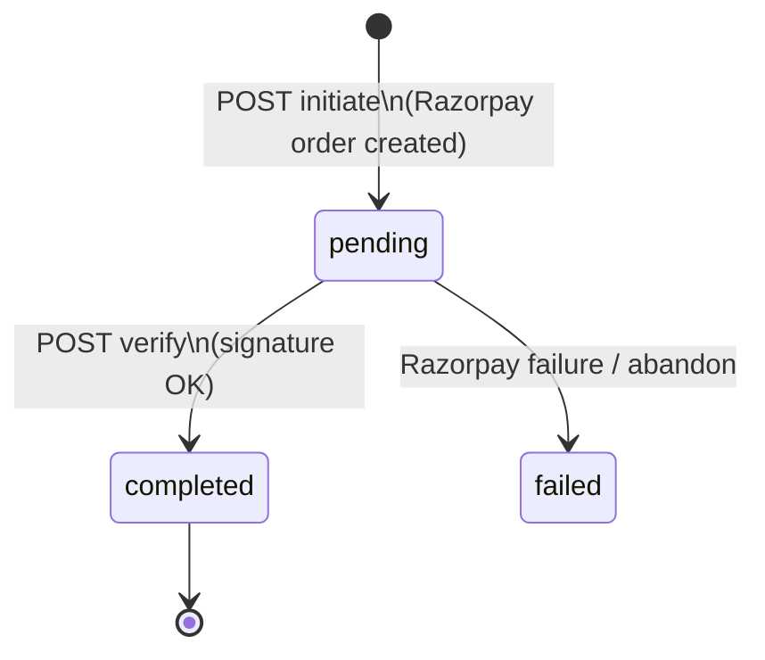
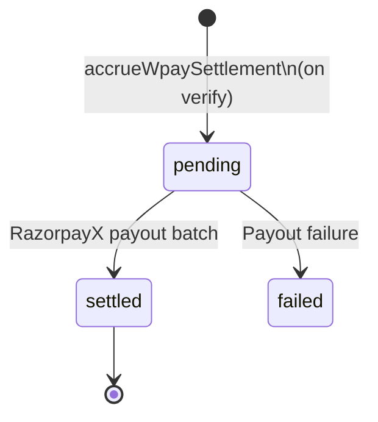
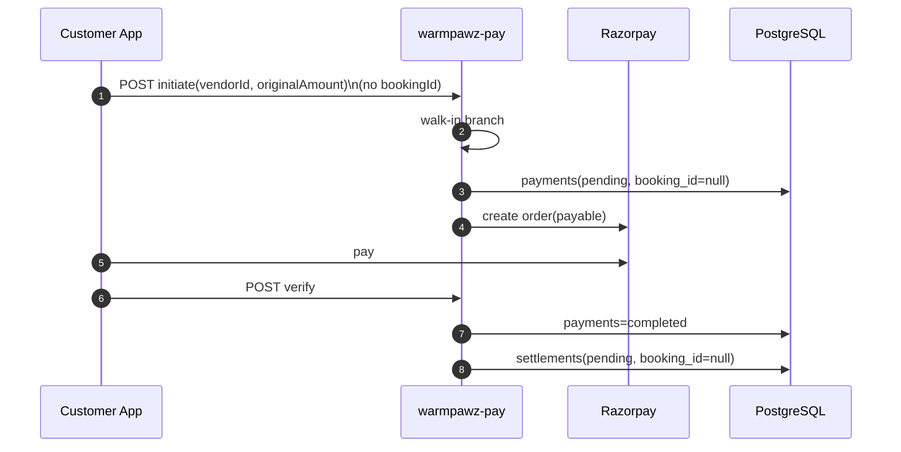
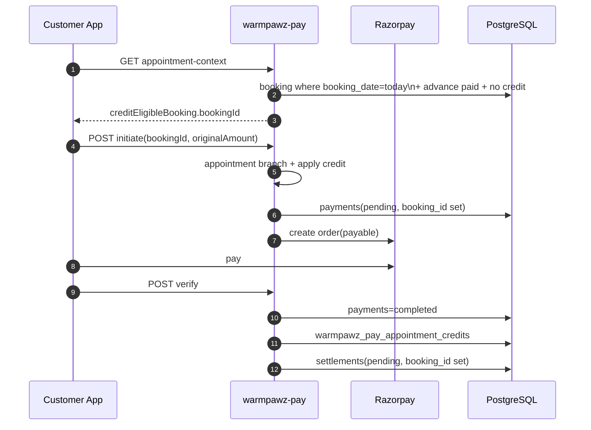

# Warmpawz Pay — MVP Architecture (ADR)

| Field | Value |
|-------|-------|
| **Status** | Accepted — implementation ready (refined) |
| **Date** | 2026-08-05 |
| **Scope** | Warmpawz Pay module (`backend/lambda/src/endpoints/customer/warmpawz-pay/`) |
| **Out of scope** | Payment intent, quote service, vendor payment request, dynamic QR, billing, refunds, disputes, split pay |

---

## 1. Context

Warmpawz is a pet healthcare platform (Node.js, TypeScript, Hono, PostgreSQL, modular monolith, Razorpay, RazorpayX).

**Warmpawz Pay is not billing software.** Clinics continue to produce physical bills or use their own clinic software. Warmpawz only:

1. Accepts a **single gross amount** entered by the customer.
2. Applies **platform discount** (if configured).
3. Deducts **booking advance** (appointment journey only).
4. Collects payment via Razorpay.
5. Accrues **vendor settlement**.

Vendor **does not approve or verify** Pay Bill payments in MVP — they see successful transactions in the dashboard; those payments accrue to settlement. No vendor amount entry.

---

## 2. Locked MVP decisions

| # | Decision |
|---|----------|
| 1 | Two journeys: **Walk-in Pay Bill** and **Appointment Pay Bill** |
| 2 | Clinic owns the bill; Warmpawz stores **payment transaction only** (no line items) |
| 3 | Customer manually enters gross amount — **accepted for MVP** |
| 4 | Disputes **out of scope** |
| 5 | One bill → one payment → one settlement (no split pay) |
| 6 | No payment intent, quote service, vendor request, dynamic QR, refund engine |

---

## 3. Architecture overview

Evolve the **existing** `warmpawz-pay` customer module. Do **not** split into microservices or new bounded contexts.

```
┌──────────────────────────────────────────────────────────────────┐
│                     warmpawz-pay (module)                         │
│                                                                   │
│  Routes (unchanged URLs)                                          │
│    GET  /customer/warmpawz-pay/appointment-context                │
│    POST /customer/warmpawz-pay/initiate                           │
│    POST /customer/warmpawz-pay/verify                             │
│    GET  /customer/warmpawz-pay/vendors|transactions|...           │
│                                                                   │
│              customer_warmpawz_pay_initiate_post.service          │
│              ┌─────────────────────────────────────┐             │
│              │ if (bookingId) { validate + credit }  │             │
│              │ else           { walk-in only       }  │             │
│              └─────────────────────────────────────┘             │
│                            │                                      │
│              wpay-discount.ts │ wpay-razorpay-order.ts             │
│              verify service │ accrueWpaySettlement                 │
└──────────────────────────────────────────────────────────────────┘
```

### 3.1 One payment engine, server-derived journey

| Question | Answer |
|----------|--------|
| Share payment engine? | **Yes** — same initiate/verify/Razorpay/settlement pipeline |
| Separate controllers? | **No** — same routes |
| Separate policy classes? | **No** — inline `if (bookingId)` in initiate/verify services |
| How is journey determined? | **Server-side:** `bookingId == null` → walk-in; `bookingId` present → appointment pay |

**Client sends only:** `vendorId`, `phone`, `originalAmount`, optional `bookingId`.

**Rationale:** Fewer fields, no client/server mode mismatch, less UI work, fits 7-hour MVP.

---

## 4. Journey definitions

### 4.A Walk-in Pay Bill

| Step | Actor | Action |
|------|-------|--------|
| 1 | Customer | Visits clinic (no Warmpawz appointment) |
| 2 | Clinic | Gives physical bill |
| 3 | Customer | Opens Warmpawz Pay → selects vendor |
| 4 | Customer | Enters gross amount |
| 5 | System | Applies discount → payable |
| 6 | Customer | Pays via Razorpay |
| 7 | System | `payments.completed` → `settlements.pending` |

**Invariants:** `payments.booking_id = NULL`, `appointmentFeeCredit = 0`.

**Analogy:** Paytm / PhonePe merchant QR (customer-entered amount). Acceptable for MVP.

---

### 4.B Appointment Pay Bill

| Step | Actor | Action |
|------|-------|--------|
| 1 | Customer | Books WAPPT slot; may pay booking advance |
| 2 | Customer | Visits clinic on **appointment date** (`bookings.booking_date`) |
| 3 | Clinic | Gives physical bill |
| 4 | Customer | Opens Warmpawz Pay → same vendor |
| 5 | System | Finds **active same-day appointment** with paid advance |
| 6 | Customer | Enters gross amount; client passes `bookingId` from appointment-context |
| 7 | System | Validates booking; deducts advance (once) + discount → payable |
| 8 | Customer | Pays via Razorpay |
| 9 | System | Completes Pay Bill lifecycle: credit consumed, settlement accrued (vendor earnings visible) |
| 10 | Vendor | Complete OTP → appointment `completed` + `otp_verified` |

**Appointment eligibility (MVP — all conditions required):**

```
booking.commerce_mode = 'warmpawz_appointments'
AND booking.customer_id = :customerId
AND booking.vendor_id = :vendorId
AND booking.booking_date = CURRENT_DATE          -- Asia/Kolkata; no grace period
AND booking.status NOT IN ('cancelled', 'refunded')   -- OTP may set completed; does NOT block credit
AND booking advance captured (hasCustomerPaidCapture)
AND NOT EXISTS warmpawz_pay_appointment_credits WHERE booking_id = booking.id
```

Pay Bill credit eligibility is **fact-based** — not `booking.status != completed`. OTP completion (`status = completed`, `otp_verified = true`) does not consume cover credit. Settlement accrues on completed Pay Bill payment; appointment completion is owned by vendor complete OTP only.

---

## 5. Shared vs separate code

### 5.1 Shared (do not duplicate)

| Component | Existing path |
|-----------|---------------|
| Discount / quote math | `shared/wpay-discount.ts` |
| Razorpay order + signature | `utils/wpay-razorpay-order.ts` |
| Payment repo | `repos/wpay-payment.repo.ts` |
| Settlement accrual | `shared/accrue-wpay-settlement.ts` |
| Appointment credit helpers | `shared/wpay-appointment-credit.ts` |
| Vendor catalogue / pricing | existing repos + `warmpawz_pay_merchant_pricing` |
| Customer UI checkout | `apps/customer-web/lib/warmpawz-pay/wpay-razorpay-checkout.ts` |

### 5.2 Journey differences (inline in services — no new classes)

| Concern | Walk-in (`bookingId` null) | Appointment (`bookingId` set) |
|---------|---------------------------|--------------------------------|
| Eligibility | Vendor in Pay Bill catalogue | + booking passes §4.B rule |
| Advance credit | `0` | `resolveWapptAppointmentFeeCredit` |
| `payments.booking_id` | `NULL` | booking UUID |
| `settlements.booking_id` | `NULL` | same UUID |
| Post-verify | complete payment + settlement | + insert credit row + settlement (booking stays open until OTP) |
| Appointment context API | ignored | UX: discover `bookingId` |

### 5.3 Not in MVP

| Component | Phase |
|-----------|-------|
| Ledger / double-entry | Phase 2 |
| Refund engine | Phase 2 |
| Razorpay webhook | Phase 2 (recommended soon) |
| `payment_events` table | Phase 2 |
| `payments.pay_mode`, `payments.visit_date` | **Not needed** — journey derived from `booking_id` |

---

## 6. REST APIs (evolved, not replaced)

Base path: `/customer/warmpawz-pay`

### 6.1 GET `/appointment-context`

**Used by:** Appointment journey UX (optional for walk-in).

**Query:** `vendorId`, `phone`

**Response (stable shape; OTP fields deprecated):**

```json
{
  "success": true,
  "hasOpenAppointment": false,
  "openAppointment": null,
  "creditEligibleBooking": { "bookingId", "appointmentFee", ... }
}
```

**MVP rule:** `creditEligibleBooking` = **active** same-day WAPPT booking with advance paid and credit not consumed. `openAppointment` is always `null` (OTP gate removed). UI passes returned `bookingId` on initiate.

Walk-in: both null → initiate without `bookingId`.

---

### 6.2 POST `/initiate`

**Body:**

```json
{
  "vendorId": "uuid",
  "phone": "9876543210",
  "originalAmount": 2300,
  "bookingId": "uuid"
}
```

| Field | Required | Notes |
|-------|----------|-------|
| `vendorId` | Yes | UUID |
| `phone` | Yes | Customer phone |
| `originalAmount` | Yes | Gross bill amount, > 0 |
| `bookingId` | No | Omit or null → **walk-in**; present → **appointment pay** |

**Server flow (`customer_warmpawz_pay_initiate_post.service.ts`):**

```typescript
// Journey derived on server — client never sends payMode
if (bookingId) {
  // Appointment pay
  validateBookingForPayCredit(bookingId, customerId, vendorId);
  appointmentFeeCredit = await resolveWpayAppointmentFeeCredit(...);
  paymentsBookingId = bookingId;
} else {
  // Walk-in pay
  appointmentFeeCredit = 0;
  paymentsBookingId = null;
}

quote = computeWpayDiscountQuote(originalAmount, discountPercent, { appointmentFeeCredit });
createWpayRazorpayOrder({ ..., bookingId: paymentsBookingId, quote });
```

1. Resolve customer from phone.
2. Load vendor + discount from catalogue/pricing.
3. Branch on `bookingId` (above).
4. `computeWpayDiscountQuote` → `createWpayRazorpayOrder`.
5. Return Razorpay fields + quote breakdown + `amountPaise`.

---

### 6.3 POST `/verify`

**Body (unchanged):**

```json
{
  "paymentId": "uuid",
  "phone": "9876543210",
  "razorpay_order_id": "...",
  "razorpay_payment_id": "...",
  "razorpay_signature": "..."
}
```

**Server flow:**

1. Load pending payment; idempotent if already `completed`.
2. Verify Razorpay HMAC + order id match.
3. Re-validate quote vs `payments.metadata` (appointment credit if `payments.booking_id` set).
4. `payments` → `completed`.
5. If `payments.booking_id` set: `dbConsumeAppointmentCredit` (§8).
6. `accrueWpaySettlement` (uses `payments.booking_id`).
7. Notification: Phase 2 (log OK for MVP).

---

### 6.4 Vendor read (existing)

- `GET /vendor/warmpawz-pay/payments`
- Vendor dashboard earnings (`order_type = 'warmpawz_pay'`)

No new vendor write APIs in MVP.

---

## 7. Database model

### 7.1 Existing tables (keep — no new MVP migration required)

| Table | Role |
|-------|------|
| `payments` | Pay Bill hub; `payment_source = 'warmpawz_pay'` |
| `settlements` | Vendor accrual; `order_type = 'warmpawz_pay'` |
| `warmpawz_pay_vendor_catalog` | Pay Bill vendor visibility |
| `warmpawz_pay_merchant_pricing` | Discount % + platform withhold % |
| `warmpawz_pay_appointment_credits` | One advance consumption per booking |
| `bookings` | WAPPT appointments; **`booking_date` is visit date** |

### 7.2 MVP schema changes

**None required** for journey discrimination.

| Column | Walk-in | Appointment |
|--------|---------|-------------|
| `payments.booking_id` | `NULL` | WAPPT booking UUID |
| `payments.original_amount` | Gross entered | Gross entered |
| `payments.amount` | Payable | Payable |
| `payments.metadata` | Quote snapshot | + `appointmentFeeCredit`, `appointmentFeeBookingId` |
| `settlements.booking_id` | `NULL` | From `payments.booking_id` |
| `settlements.payment_id` | FK | FK |

**Optional (only if index missing — check before adding):**

```sql
CREATE INDEX IF NOT EXISTS idx_payments_wpay_booking
  ON payments (booking_id)
  WHERE payment_source = 'warmpawz_pay' AND booking_id IS NOT NULL;
```

**Do not add:** `pay_mode`, `visit_date`, quotes, payment_requests, invoices.

### 7.3 Booking advance representation

| Layer | Source of truth |
|-------|-----------------|
| Visit date | `bookings.booking_date` |
| Advance captured | `payments` linked to booking (appointment fee at book time) |
| Credit consumed | `warmpawz_pay_appointment_credits.booking_id` (PK) |
| Pay Bill transaction | `payments` where `payment_source = 'warmpawz_pay'` and `booking_id` set |

**Apply advance at initiate:**

```
appointmentFeeCredit = bookingId ? min(originalAmount, paidAdvance) : 0
billBase               = originalAmount - appointmentFeeCredit
discountAmount         = billBase × discountPercent / 100
payableAmount          = max(0.01, billBase - discountAmount)
```

---

## 8. Pay Bill payment lifecycle (appointment journey — after successful verify)

**Goal:** Record Pay Bill payment, advance consumption, and accrue vendor settlement. Appointment completion is **not** set here — vendor complete OTP owns `status=completed` + `otp_verified`. Vendor revenue accrues via wpay settlement — **not** `ensureVendorEarningsForCompletedBooking`.

**Source of truth:**

| Fact | Where |
|------|-------|
| Pay Bill paid | `payments` (`completed`, `payment_source = 'warmpawz_pay'`, `booking_id` set) |
| Advance consumed | `warmpawz_pay_appointment_credits` row |
| Visit date | `bookings.booking_date` |
| Vendor earnings (Pay Bill) | `settlements` row (`order_type = 'warmpawz_pay'`) on verify |
| Appointment completed | `bookings.status = 'completed'` + `otp_verified` (set by vendor complete OTP) |

**On verify success when `payments.booking_id` is set:**

1. Insert `warmpawz_pay_appointment_credits` (idempotent PK on `booking_id`).
2. Complete payment + `accrueWpaySettlement` (earnings visible immediately).
3. **Do not** set `bookings.status = 'completed'`, update `bookings.metadata`, or call marketplace earnings helpers.

**Payment lifecycle complete when:**

```sql
EXISTS (
  SELECT 1 FROM payments p
  WHERE p.booking_id = :bookingId
    AND p.payment_source = 'warmpawz_pay'
    AND p.payment_status = 'completed'
)
AND EXISTS (
  SELECT 1 FROM warmpawz_pay_appointment_credits c
  WHERE c.booking_id = :bookingId
)
```

**Phase 2:** Optional `bookings.status = 'payment_settled'` for reporting.

---

## 9. Payment lifecycle



**States:** `payments.payment_status`: `pending` → `completed`.

**Idempotency:** Set `idempotency_key` on initiate (column + unique index exist from migration 1080).

---

## 10. Settlement lifecycle



| Field | Walk-in | Appointment |
|-------|---------|-------------|
| `order_type` | `warmpawz_pay` | `warmpawz_pay` |
| `payment_id` | Pay Bill payment | Pay Bill payment |
| `booking_id` | `NULL` | `payments.booking_id` |
| `settlement_breakup` | gross, discount, withhold | + `appointmentFeeCredit` |

**Code change:** `accrue-wpay-settlement.ts` — set `booking_id` from `payment.booking_id` instead of hardcoded `NULL`.

---

## 11. Reconciliation (MVP)

Manual / SQL; no new admin UI.

| Check | How |
|-------|-----|
| Completed payment, no settlement | `payments` LEFT JOIN `settlements` |
| Appointment pay linked correctly | `payments.booking_id` JOIN `bookings.booking_date` |
| Credit ↔ payment | `warmpawz_pay_appointment_credits.payment_id` → `payments.id` |
| Duplicate credit | PK on `booking_id` |
| Orphan pending | `payment_status = 'pending'` age |

---

## 12. Audit logging (MVP)

No `payment_events` table.

| Event | Record |
|-------|--------|
| Initiate | `payments.metadata` + `created_at` |
| Complete | `payments.completed_at`, Razorpay IDs |
| Credit consumed | `warmpawz_pay_appointment_credits` |
| Settlement | `settlements.settlement_breakup` |

**Do not** write Pay Bill details to `bookings.metadata`.

---

## 13. Sequence diagrams

### 13.1 Walk-in Pay Bill



### 13.2 Appointment Pay Bill



---

## 14. Fraud & risk (MVP — accepted)

| Risk | MVP stance | Phase 2 |
|------|------------|---------|
| Customer under-reports gross | Accepted — clinic owns bill; vendor sees amount on dashboard | Vendor confirm |
| Fake appointment credit | Server validates `bookingId` + §4.B rules | Tighter audit |
| Double advance credit | PK on `booking_id` | Same |
| Client sends wrong `bookingId` | Server validates ownership + vendor + date | Same |
| No webhook | Client verify only | Webhook |
| Disputes | Out of scope | Dispute workflow |

---

## 15. MVP implementation checklist (~5.5 hours, 2 developers)

### Developer A — Backend (~2.75h)

| # | Task | Files |
|---|------|-------|
| A1 | Initiate: inline `if (bookingId)` branch; set `payments.booking_id` | `customer_warmpawz_pay_initiate_post.service.ts`, `wpay-razorpay-order.ts` |
| A2 | Simplify eligibility SQL (§4.B) | `wpay-appointment-context.repo.ts`, `wpay-appointment-credit.ts` |
| A3 | Verify: credit consume only; no booking metadata/status writes | `customer_warmpawz_pay_verify_post.service.ts` |
| A4 | Settlement: `booking_id` from payment | `accrue-wpay-settlement.ts` |
| A5 | Set `idempotency_key` on initiate | `wpay-razorpay-order.ts` |
| A6 | Extend unit tests for eligibility + settlement | `shared/__tests__/` |

### Developer B — Customer UI (~2.75h)

| # | Task | Files |
|---|------|-------|
| B1 | Initiate: send `bookingId` only when context provides it (no payMode/visitDate) | `wpay-razorpay-checkout.ts` |
| B2 | Walk-in UX when no credit-eligible booking | `WarmpawzPayVendorClient.tsx` |
| B3 | Quote preview aligned with server | `wpay-quote.ts` |
| B4 | Smoke test both journeys on dev | Manual |

### Already done (keep)

- Minimal Razorpay checkout — `wpay-razorpay-checkout.ts`
- `razorpaySafeDescription()` — `razorpay-utils.ts`
- `amountPaise` on initiate response
- `warmpawz_pay_appointment_credits` table

### Explicitly skip

- Policy classes, new migrations, `pay_mode`, `visit_date`, booking metadata updates, webhooks, refunds.

---

## 16. Phase 2 enhancements (post-MVP)

| Item | Priority |
|------|----------|
| Razorpay `payment.captured` webhook | High |
| Server-side `maxDiscountAmount` | High |
| Pay Bill refund + settlement reversal | High |
| Block advance refund if credit consumed | High |
| `payment_events` audit table | Medium |
| Vendor push notification | Medium |
| Vendor confirm / dispute | Medium |
| Booking status `payment_settled` | Low |

---

## 17. Final recommendation

1. **One initiate service, inline branching** on `bookingId` — no policy classes, no client `payMode`.
2. **No new columns** — journey = `payments.booking_id IS NULL` vs set; visit date = `bookings.booking_date`.
3. **`payments` is the only Pay Bill source of truth** — no `bookings.metadata` payment copies.
4. **Simple eligibility:** same visit day + cover captured + credit not consumed + not cancelled/refunded (`otp_verified` / `completed` allowed).
5. **Three code fixes:** settlement `booking_id`, eligibility SQL, idempotency key.

Sized for **~5.5 hours with 2 developers and Cursor agents**.

---

## Appendix A — Quote formula

```
originalAmount         = customer input
appointmentFeeCredit = bookingId ? min(original, paidAdvance) : 0
billBase               = originalAmount - appointmentFeeCredit
discountAmount         = billBase × discountPercent / 100
payableAmount          = max(0.01, billBase - discountAmount)
```

## Appendix B — Key existing files

| Area | Path |
|------|------|
| Initiate | `services/customer_warmpawz_pay_initiate_post.service.ts` |
| Verify | `services/customer_warmpawz_pay_verify_post.service.ts` |
| Appointment context | `services/customer_warmpawz_pay_appointment_context_get.service.ts` |
| Credit rules | `shared/wpay-appointment-credit.ts` |
| Discount | `shared/wpay-discount.ts` |
| Settlement | `shared/accrue-wpay-settlement.ts` |
| Customer UI | `app/warmpawz-pay/vendors/[vendorId]/WarmpawzPayVendorClient.tsx` |
| Checkout | `lib/warmpawz-pay/wpay-razorpay-checkout.ts` |
