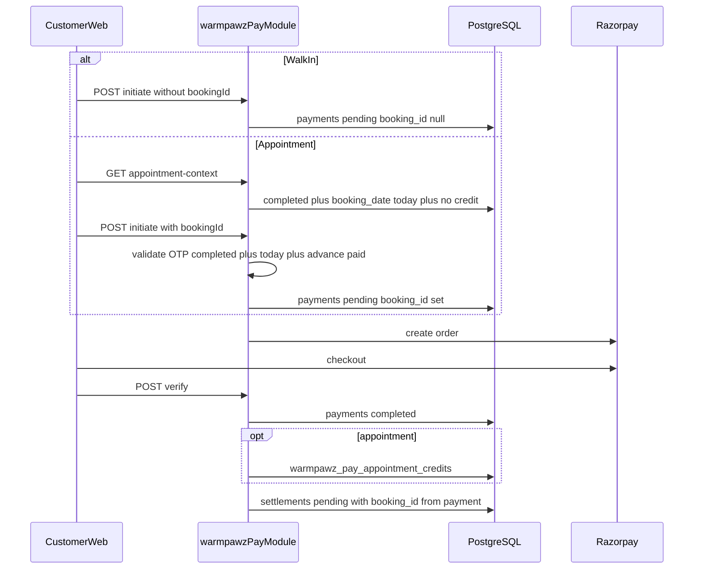

# Warmpawz Pay MVP Implementation Plan

Based on [docs/WARMPAWZ_PAY_MVP_ARCHITECTURE.md](WARMPAWZ_PAY_MVP_ARCHITECTURE.md). Evolve the existing module at `backend/lambda/src/endpoints/customer/warmpawz-pay/` and customer UI under `apps/customer-web/lib/warmpawz-pay/`.

**Estimated effort:** ~5.5–6.5 hours (2 developers + Cursor agents, within 7h budget)

---

## Current state vs ADR gaps

Most ADR structure already exists on branch `feature/warmpawz-pay-appointments-unified`:

| Area | Status | Gap |
|------|--------|-----|
| Initiate `if (bookingId)` branch | Done | Missing **today date** validation on booking |
| Client payload (`vendorId`, `phone`, `originalAmount`, `bookingId?`) | Done | — |
| OTP UX + credit gate in UI | Done | Minor smoke validation only |
| Razorpay minimal checkout + `amountPaise` | Done | Deploy backend for full parity |
| Credit consume on verify | Done | — |
| `status = 'completed'` for credit | Done | — |
| `payments.booking_id` on insert | **Missing** | `wpay-razorpay-order.ts` hardcodes `booking_id: null` |
| `booking_date = today` in credit query | **Missing** | `wpay-appointment-context.repo.ts` only filters `status = 'completed'` |
| Settlement `booking_id` | **Missing** | `accrue-wpay-settlement.ts` inserts `NULL` |
| `idempotency_key` on initiate | **Missing** | Column + index exist (migration 1080); never set in insert |
| `WpayPaymentRow.booking_id` | **Missing** | Not selected in `wpay-payment.repo.ts`; settlement cannot read it after verify |

**Explicitly out of scope:** migrations, `pay_mode`, `visit_date`, policy classes, booking metadata/status updates, webhooks, refunds.

---

## Target flow (unchanged URLs)

---

## Developer A — Backend (~2.75h)

### A1. Appointment eligibility — today + OTP completed

**Files:** `wpay-appointment-context.repo.ts`, `wpay-appointment-credit.ts`

- Import `ymdInIst()` from `ist-scheduling.ts`.
- Update `dbFindCreditEligibleWapptBookingForPay`: `AND b.booking_date = $4::date` (today IST).
- Keep `AND b.status = 'completed'`.
- Add `assertBookingEligibleForPayCredit(booking)`; call from `resolveWapptAppointmentFeeCredit`.

### A2. Payment insert — link booking + idempotency

**Files:** `wpay-razorpay-order.ts`, `customer_warmpawz_pay_initiate_post.service.ts`

- Set `booking_id` and deterministic `idempotency_key` on payment insert.

### A3. Payment repo — expose booking_id to settlement

**File:** `wpay-payment.repo.ts`

- Add `booking_id` to type, SELECT, and RETURNING.

### A4. Settlement — propagate booking_id

**File:** `accrue-wpay-settlement.ts`

- Replace hardcoded `NULL` with `payment.booking_id ?? null`.

### A5. Verify — confirm no booking side effects

**File:** `customer_warmpawz_pay_verify_post.service.ts`

- No `bookings.metadata` or `bookings.status` updates.

### A6. Unit tests

- Credit: reject when `booking_date` is not today.
- Settlement: assert `booking_id` in INSERT.

---

## Developer B — Customer UI (~2.75h)

### B1. Initiate payload audit

- No `payMode` / `visitDate`; `bookingId` only when credit eligible.

### B2. Appointment OTP gate + walk-in path

- Block pay until `creditEligibleBooking`; walk-in without `bookingId`.

### B3. Quote parity

- Client preview matches `computeWpayDiscountQuote`.

### B4. Dev smoke test

| Journey | Steps |
|---------|-------|
| Walk-in | Pay without bookingId; settlement `booking_id` null |
| Appointment | OTP complete → credit → pay; settlement `booking_id` set |
| Negative | Wrong day or incomplete booking → 409 on forged `bookingId` |

---

## Integration and deploy (~1h buffer)

1. `cd backend/lambda && npm run build` + targeted tests.
2. Deploy dev: `./scripts/deploy-lambda-direct.sh` + `./scripts/deploy-customer-web.sh`.
3. Post-deploy SQL reconciliation checks.

No migration run required.

---

## Definition of done

- Walk-in and appointment journeys work on dev with existing routes unchanged.
- `payments.booking_id` set only for appointment pay.
- Eligibility: customer + vendor + today + completed + advance paid + credit not consumed.
- Verify writes credit row only; no booking metadata/status mutation.
- Settlement accrues with correct `booking_id`.
- Unit tests pass for eligibility and settlement.
