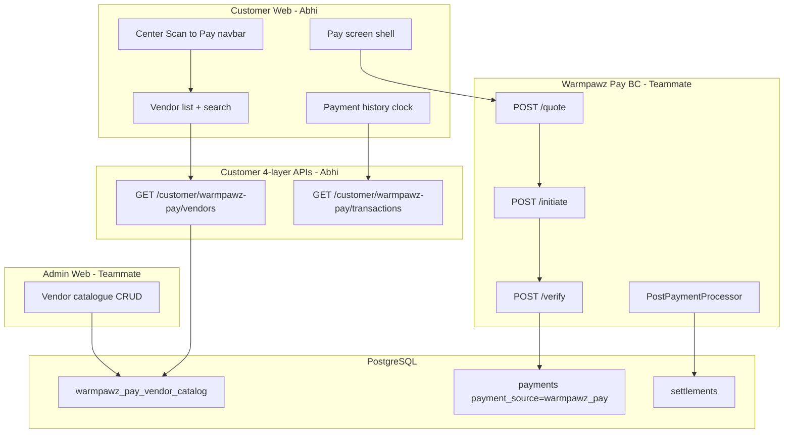

# Warmpawz Pay — Sprint Plan (2-person team)

**Branch:** `feature/warmpawpay` (coordination + planning)  
**Architecture reference:** `D:\dd\WARMPAWZ_PAY_TECHNICAL_ARCHITECTURE_FINAL.md`  
**Status:** Approved for implementation — July 2026  
**Team size:** 2 engineers (down from original 4-person split)

---

## 1. Executive summary

Warmpawz Pay is a **standalone walk-in payment product**: customer taps a center navbar button, picks a published vendor from a lean catalogue, enters a bill amount, gets a discount, pays via Razorpay, and can view payment history. Admin manages the vendor catalogue (discount %, draft/publish) and settlement reporting.

**Nothing is shipped yet** in the repo — no `warmpawz-pay` endpoints, no admin UI, no navbar button.

---

## 2. Team roles

| Engineer | Focus | Primary branches |
|----------|-------|------------------|
| **Abhi** | Customer journey end-to-end: 4-layer customer read APIs, customer-web (navbar, vendor list, history, pay-screen layout shell) | `feature/abhi-wpay-customer` |
| **Teammate** | Schema, admin catalogue + settlements UI, Razorpay payment flow (quote/initiate/verify), post-payment async | `feature/wpay-schema`, `feature/wpay-admin`, `feature/wpay-payment-flow`, `feature/wpay-post-payment` |

**Shared integration:** One person acts as **integration owner** for `handler/index.ts` registration, feature flag, and final E2E validation.

**Pay screen split (agreed):** Abhi builds layout/shell (amount input, bill summary, CTA); teammate wires Razorpay open timing — do **not** change Razorpay initiation order per `customer-navigation.mdc`.

---

## 3. Merge and push order

Merge **sequentially** into `develop`. Do not merge all branches at once.

```text
develop
  │
  ├─① feature/wpay-schema                    ← TEAMMATE — merge FIRST (blocks everyone)
  │     db/migrations: payment_source, original_amount, warmpawz_pay_vendor_catalog, indexes
  │
  ├─② feature/wpay-admin                     ← TEAMMATE — after ①
  │     Admin catalogue CRUD + publish toggle + settlements sub-sidebar
  │
  ├─③ feature/wpay-payment-flow              ← TEAMMATE — after ①
  │     POST /v1/warmpawz-pay/quote | initiate | verify
  │     (can run parallel with ② if no handler conflicts)
  │
  ├─④ feature/wpay-post-payment              ← TEAMMATE — after ③
  │     PostPaymentProcessor, settlement insert, reconciliation jobs
  │
  ├─⑤ feature/abhi-wpay-customer             ← ABHI — after ① (needs catalogue table)
  │     Customer 4-layer read APIs + customer-web UI
  │
  └─⑥ feature/warmpawpay                     ← INTEGRATION — after ⑤ + ③
        Route registration, feature flag, joint E2E, docs
        PR target: develop
```

### Push order (recommended)

| Step | Who | Action |
|------|-----|--------|
| 1 | Teammate | Push `feature/wpay-schema` → PR to `develop` → merge |
| 2 | Teammate | Apply migration on dev RDS: `ENVIRONMENT=dev node scripts/run-migration-rds-node.js <file>.sql` |
| 3 | Teammate | Push `feature/wpay-admin` (rebase on develop) → PR → merge |
| 4 | Teammate | Push `feature/wpay-payment-flow` (rebase on develop) → PR → merge |
| 5 | Abhi | Push `feature/abhi-wpay-customer` (rebase on develop after step 1) → PR → merge |
| 6 | Teammate | Push `feature/wpay-post-payment` → PR → merge |
| 7 | Either | Integration PR from `feature/warmpawpay` if any glue remains → merge |
| 8 | Team | Deploy dev: `./scripts/deploy-lambda-direct.sh && ./scripts/deploy-customer-web.sh && ./scripts/deploy-admin-web.sh` |
| 9 | Team | Manual smoke on dev (see §8) |

### Conflict avoidance rules

1. **One owner per file** — e.g. only teammate edits `payment-orchestrator.service.ts`.
2. **Avoid everyone editing** `handler/index.ts` — integration owner merges registrations.
3. **Depend on interfaces** — schema owner defines repo interfaces; others consume.
4. **Short-lived branches** — rebase every 2–3 days; merge within the sprint.
5. **Customer API gate** — any `backend/lambda/src/endpoints/customer/**` work must pass `npm run validate:customer-layers`.

---

## 4. Cross-team API contracts

### 4.1 Catalogue table (teammate owns migration)

```sql
-- Proposed: warmpawz_pay_vendor_catalog
vendor_id          UUID UNIQUE NOT NULL REFERENCES vendors(id)
discount_percent   NUMERIC(5,2) NOT NULL
max_discount_amount NUMERIC(12,2) NULL   -- optional cap e.g. "upto ₹200"
publish_status     TEXT NOT NULL DEFAULT 'draft'  -- draft | published
published_at       TIMESTAMPTZ
created_at, updated_at, created_by
```

**Customer visibility:** `publish_status = 'published'` AND vendor `status = active` AND `bank_verified` AND `pay_bill_enabled` (or equivalent flags).

### 4.2 Customer read APIs (Abhi owns — 4-layer)

Module: `backend/lambda/src/endpoints/customer/warmpawz-pay/`

| Method | Path | Purpose | Page size |
|--------|------|---------|-----------|
| GET | `/customer/warmpawz-pay/vendors` | Published vendor list + search | 5 (cursor) |
| GET | `/customer/warmpawz-pay/vendors/:vendorId` | Pay screen header | single |
| GET | `/customer/warmpawz-pay/transactions` | Payment history | 5 (cursor) |
| GET | `/customer/warmpawz-pay/transactions/:paymentId` | Detail (optional v1) | — |

Query params: `q` (name search), `limit`, `cursor`, `phone` or JWT `customerId`.

### 4.3 Lean DTOs

**Vendor card (list):**
```ts
{ vendorId: string; name: string; address: string }
```

**Vendor detail (pay shell):**
```ts
{ vendorId, name, address, discountPercent, maxDiscountAmount?, offerLabel }
```

**Transaction card (history):**
```ts
{ paymentId, vendorId, vendorName, originalAmount, discountAmount, payableAmount, paidAt }
```

**List envelope:**
```ts
{ success: true, vendors|transactions: T[], total: number, nextCursor: string | null }
```

Reuse `resolveVendorListSqlPage` / `encodeDiscoveryCursor` with **default limit 5**.

### 4.4 Payment write APIs (teammate owns)

Base: `/v1/warmpawz-pay`

| Method | Path | Purpose |
|--------|------|---------|
| POST | `/v1/warmpawz-pay/quote` | Signed quote token |
| POST | `/v1/warmpawz-pay/initiate` | Create payment + Razorpay order |
| POST | `/v1/warmpawz-pay/verify` | Complete payment |

### 4.5 Admin APIs (teammate owns)

| Area | Endpoints (sketch) |
|------|-------------------|
| Catalogue | `GET/POST/PUT /admin/warmpawz-pay/vendors`, publish toggle |
| Settlements | `GET /admin/warmpawz-pay/payments` — vendor, customer, original, discounted, date/time |

---

## 5. Abhi — detailed task list

### Phase 0 — Contract lock (Day 1)

- [ ] Review teammate's `feature/wpay-schema` PR before coding repos
- [ ] Confirm `warmpawz_pay_vendor_catalog` columns + eligibility flags
- [ ] Confirm customer DTO shapes and pagination envelope with teammate
- [ ] Confirm pay-shell integration points: quote → initiate → verify request/response shapes
- [ ] Run §0 dirty-tree gate per `endpoint-4-layer-parity.mdc` — work only on wpay files on a clean branch

### Phase 1 — Customer read APIs (Days 2–4)

**Branch:** `feature/abhi-wpay-customer` (off `develop` after schema merge)

Create `backend/lambda/src/endpoints/customer/warmpawz-pay/`:

```
routes/
  customer_warmpawz_pay_vendors_get.route.ts
  customer_warmpawz_pay_vendors_vendorid_get.route.ts
  customer_warmpawz_pay_transactions_get.route.ts
  customer_warmpawz_pay_transactions_paymentid_get.route.ts  (optional v1)
handlers/   → thin delegates
services/   → validation, status codes, DTO mapping
repos/      → SQL only (catalogue JOIN vendors; payments WHERE payment_source = 'warmpawz_pay')
index.ts    → registerCustomerWarmpawzPayEndpoints(app)
```

**Per endpoint:**
- [ ] `GET /customer/warmpawz-pay/vendors` — published only, `q` search on `business_name`, cursor page 5
- [ ] `GET /customer/warmpawz-pay/vendors/:vendorId` — detail for pay screen
- [ ] `GET /customer/warmpawz-pay/transactions` — completed payments for customer
- [ ] Register in `customer/index.ts` (coordinate handler registration with integration owner)
- [ ] Contract test: `__tests__/wpay-list-response.test.ts`
- [ ] `npm run validate:customer-layers` passes

### Phase 2 — Customer-web navbar + routes (Days 4–5)

- [ ] Add raised center **Scan to Pay** button in `BottomNavigation.tsx` (between Shop and Bookings)
- [ ] Extend `CustomerTabId` + `CUSTOMER_ROUTES.warmpawzPay` → `/warmpawz-pay` (`policy: 'focus'`)
- [ ] Add `goToWarmpawzPay()` in `navigation-service.ts`
- [ ] Wire `CustomerHomeWrapper.handleBottomNav` + `customer-account-sidebar-host.handleTabbedBottomNav`
- [ ] Gate on `WARMPAWZ_PAY_ENABLED` runtime flag (read only; teammate defines flag)
- [ ] Update `--customer-tabbed-nav-offset` in `globals.css` if FAB height changes
- [ ] `npm run test:navigation`

### Phase 3 — Vendor list page (Days 5–6)

**Route:** `app/warmpawz-pay/page.tsx`

- [ ] Header: "Warmpawz Pay" + **Clock icon** → `/warmpawz-pay/history`
- [ ] Search bar with debounced `q` param
- [ ] Plain vendor cards: name, address, chevron (no services, ratings, slots)
- [ ] Infinite scroll via `useDiscoveryVendorFeed` pattern, `pageSize: 5`
- [ ] Helper: `lib/warmpawz-pay/wpay-vendor-list.ts`
- [ ] Tap card → `/warmpawz-pay/vendors/[vendorId]`

### Phase 4 — Payment history page (Day 6)

**Route:** `app/warmpawz-pay/history/page.tsx`

- [ ] Paginated list from `GET /customer/warmpawz-pay/transactions`
- [ ] Row: vendor name, original amount, discount, final paid, date/time
- [ ] Hook: `useWpayTransactionFeed` (cursor pattern)
- [ ] Back → vendor list

### Phase 5 — Pay screen shell (Days 7–8)

**Route:** `app/warmpawz-pay/vendors/[vendorId]/page.tsx`

- [ ] Load vendor detail from customer API
- [ ] Vendor card + offer banner from `discountPercent` / `maxDiscountAmount`
- [ ] Bill amount input + quick amount chips (₹500, ₹1000, …)
- [ ] Client-side preview summary (authoritative numbers from quote API)
- [ ] "Proceed to Pay" button → calls teammate `quote` → `initiate` → **teammate opens Razorpay**
- [ ] Success state → history or confirmation
- [ ] **Do not** change Razorpay open timing

### Phase 6 — Verification (Day 9)

- [ ] `validate:customer-layers` green
- [ ] `test:navigation` green
- [ ] Manual dev smoke: admin publishes vendor → appears in list → pay (with teammate) → history row
- [ ] PR: `feature/abhi-wpay-customer` → `develop`

---

## 6. Teammate — detailed task list

### Phase 0 — Schema (Days 1–2) — **MERGE FIRST**

**Branch:** `feature/wpay-schema`

- [ ] Migration: `payment_source TEXT NOT NULL` (no DEFAULT) on `payments`
- [ ] Migration: `original_amount NUMERIC(12,2)` on `payments`
- [ ] Migration: `warmpawz_pay_vendor_catalog` table (see §4.1)
- [ ] Migration: vendor eligibility columns if needed (`pay_bill_enabled`, etc.)
- [ ] Partial indexes per architecture doc §7.1:
  - `idx_payments_wpay_customer_date`
  - `idx_payments_wpay_vendor_date`
  - `idx_payments_wpay_pending`
  - `idx_payments_wpay_idempotency`
- [ ] Settlement unique index: `UNIQUE (payment_id) WHERE order_type = 'warmpawz_pay'`
- [ ] `promotion_usages.payment_id` nullable FK + unique partial index
- [ ] `transactions.transaction_category` CHECK extended with `'warmpawz_pay'`
- [ ] Repository interfaces: `PaymentIntentRepository`, `CatalogRepository`, `SettlementAccrualRepository`
- [ ] Unit test: insert always sets `payment_source = 'warmpawz_pay'`
- [ ] Apply on dev RDS after PR merge
- [ ] PR → `develop`

### Phase 1 — Admin catalogue (Days 3–5)

**Branch:** `feature/wpay-admin` (after schema merge)

- [ ] Nav entry in `packages/shared-types/src/admin-portal-nav.ts`
- [ ] Route: `apps/admin-web/app/warmpawz-pay/page.tsx`
- [ ] Sub-sidebar: **Catalogue** | **Settlements**
- [ ] Catalogue tab:
  - [ ] Add vendor (search/select from approved vendors)
  - [ ] Set discount % (+ optional max discount cap)
  - [ ] Draft / published toggle (reuse `CatalogActiveSwitch` pattern)
  - [ ] List all catalogue entries with status
- [ ] API: `GET/POST/PUT /admin/warmpawz-pay/vendors`
- [ ] API: publish/unpublish toggle endpoint
- [ ] Settlements tab:
  - [ ] Table: vendor, customer, original amount, discounted final, date/time
  - [ ] Filter `payment_source = 'warmpawz_pay'`
  - [ ] API: `GET /admin/warmpawz-pay/payments`
- [ ] PR → `develop`

### Phase 2 — Payment flow (Days 4–7)

**Branch:** `feature/wpay-payment-flow` (after schema merge)

Module: `backend/lambda/src/endpoints/warmpawz-pay/`

- [ ] `QuoteService` — discount engine domain `WARMPAWZ_PAY`, signed HMAC token
- [ ] `PaymentOrchestrator` — initiate + verify
- [ ] `RazorpayAdapter` (local, not monolith)
- [ ] `POST /v1/warmpawz-pay/quote`
- [ ] `POST /v1/warmpawz-pay/initiate` (idempotency key)
- [ ] `POST /v1/warmpawz-pay/verify` (FOR UPDATE, idempotent)
- [ ] Zod DTOs in `dto/`
- [ ] Rate limits: quote 30/min, initiate 10/min, verify 10/min
- [ ] `validate:warmpawz-pay-deps` CI script (forbidden imports)
- [ ] Export Razorpay hook for Abhi's pay shell
- [ ] PR → `develop`

### Phase 3 — Post-payment async (Days 7–9)

**Branch:** `feature/wpay-post-payment` (after payment-flow merge)

- [ ] `PostPaymentProcessor` (idempotent per subsystem)
- [ ] Async settlement insert (`order_type = 'warmpawz_pay'`)
- [ ] Async promotion usage insert
- [ ] Async admin ledger (`transactions`)
- [ ] Notifications via notification service
- [ ] Reconciliation jobs:
  - [ ] `reconcile-pending-payments`
  - [ ] `reconcile-missing-settlements`
  - [ ] `reconcile-missing-promo-usage`
- [ ] Integration tests + smoke script `_warmpawz-pay-smoke-fixtures.json`
- [ ] PR → `develop`

### Phase 4 — Feature flag + integration (Day 10)

- [ ] `WARMPAWZ_PAY_ENABLED` flag (Lambda env + customer/admin runtime config)
- [ ] Register `registerWarmpawzPayRoutes(app)` in `handler/index.ts` (integration owner)
- [ ] Admin refund API: `POST /v1/admin/warmpawz-pay/refunds` (Sprint 1 stretch / Sprint 2)
- [ ] Joint E2E with Abhi on dev

---

## 7. Customer-web file map (Abhi)

| File | Change |
|------|--------|
| `components/customer/bottomNavigation/BottomNavigation.tsx` | Center Scan to Pay FAB |
| `lib/navigation/route-registry.ts` | `warmpawzPay` route + tab id |
| `lib/navigation/navigation-service.ts` | `goToWarmpawzPay()` |
| `lib/customer-account-sidebar-host.tsx` | Tab handler |
| `components/customer/wrappers/CustomerHomeWrapper.tsx` | Shell handler (if needed) |
| `app/warmpawz-pay/page.tsx` | Vendor list |
| `app/warmpawz-pay/history/page.tsx` | Payment history |
| `app/warmpawz-pay/vendors/[vendorId]/page.tsx` | Pay shell |
| `lib/warmpawz-pay/wpay-vendor-list.ts` | API helpers |
| `hooks/useWpayTransactionFeed.ts` | History cursor feed |

---

## 8. Definition of done (sprint)

### Abhi

- [ ] All customer read APIs live with lean DTOs + cursor pagination (5/page)
- [ ] `validate:customer-layers` passes
- [ ] Center navbar → vendor list → vendor pay shell → history flow works
- [ ] Clock icon shows past payments with correct amounts
- [ ] Feature hidden when flag off
- [ ] `test:navigation` passes

### Teammate

- [ ] Schema on dev RDS
- [ ] Admin can add vendor, set discount %, publish/unpublish
- [ ] Admin settlements tab shows wpay payments
- [ ] Quote → initiate → verify completes a test payment on dev
- [ ] Post-payment processor creates settlement + promo usage rows
- [ ] Reconciliation jobs scheduled on dev

### Joint

- [ ] Admin publishes vendor → customer sees card in list
- [ ] Customer pays → payment appears in customer history + admin settlements
- [ ] No forbidden cross-imports (`validate:warmpawz-pay-deps`)
- [ ] Dev deploy smoke signed off

---

## 9. Architecture diagram



---

## 10. Risks

| Risk | Owner | Mitigation |
|------|-------|------------|
| Catalogue table not in architecture doc | Teammate | Add to schema PR; Abhi blocks repo until merged |
| Handler registration conflicts | Integration owner | Single PR for `handler/index.ts` |
| Dirty customer endpoint tree | Abhi | Fresh branch; wpay files only |
| Razorpay timing regression | Teammate | Abhi does not touch open timing |
| Duplicate history APIs | Both | Abhi owns `/customer/...` reads; teammate HistoryService shares SQL via repo interface |

---

## 11. Verification commands

```bash
# Customer layer compliance (Abhi)
cd backend/lambda && npm run validate:customer-layers

# Customer navigation (Abhi)
cd apps/customer-web && npm run test:navigation

# Warmpawz Pay dependency guard (Teammate)
cd backend/lambda && npm run validate:warmpawz-pay-deps

# Dev migration (Teammate, after schema PR merge)
ENVIRONMENT=dev node scripts/run-migration-rds-node.js <migration_file>.sql

# Dev deploy (integration)
./scripts/deploy-lambda-direct.sh
./scripts/deploy-customer-web.sh
./scripts/deploy-admin-web.sh
```

---

**Document owner:** Abhi  
**Last updated:** July 23, 2026  
**Coordination branch:** `feature/warmpawpay`
