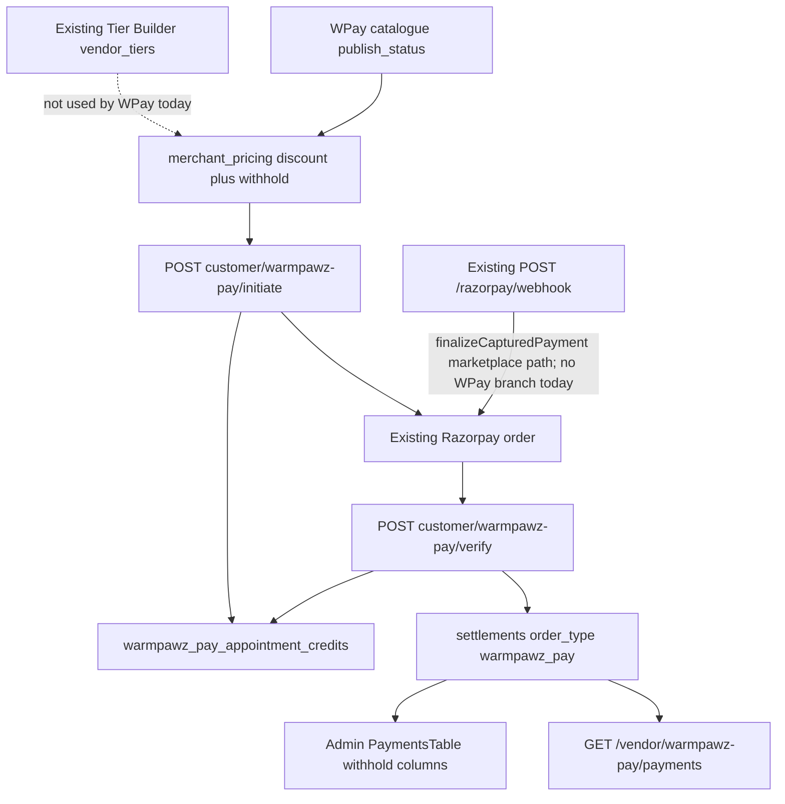
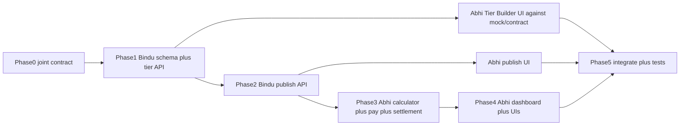

# Warmpawz Pay commercial refactor (Bindu / Abhi)

This is a **refactor of the existing WPay bounded context**, not a rebuild. Payment provider, Razorpay webhook, verify, appointment-credit table, and `settlements` (`order_type = 'warmpawz_pay'`) stay.

Do not start feature code until this contract is agreed. Implementation work should land on developer feature branches; this document lives on `feature-tier-system` (cut from `feature-guest-user`).

| Role | Branch |
|------|--------|
| Plan / contract | `feature-tier-system` |
| Bindu implementation | `feature/bindu-wpay-tier-publish` |
| Abhi implementation | `feature/abhi-wpay-commercial-engine` |
| PR target | `develop` |

**Locked product defaults**

- Convenience is **global** (one WPay amount + GST rate), not per vendor.
- Convenience GST is **exclusive** (`F × G`).
- WPay revenue GST is **inclusive** (`revenue × G / (100 + G)`).
- Appointment credit does **not** shrink `Q` before C/D.
- Historical withhold rows are **never** converted.

---

## 1. Existing architecture (discovered)



**Current commercial model (must not be reused for new transactions):**

```text
billBase = Q − appointment_credit
discount = billBase × D
pay_now = billBase − discount
withhold = pay_now × withhold%
vendor = pay_now − withhold
```

**Target commercial model:**

```text
gross_commission = Q × C
discount = Q × D
vendor_payable = Q × (1 − C)
service_payable = Q × (1 − D)
wpay_revenue = gross_commission − discount
pay_now = service_payable − appointment_credit + F + F×G
```

Constraint: `0 ≤ D < C ≤ 100`.

---

## 2. Reuse map (prefer MODIFY / REUSE)

### Payment / webhook — NO CHANGE / REUSE

- [`backend/lambda/src/utils/wpay-razorpay-order.ts`](../backend/lambda/src/utils/wpay-razorpay-order.ts) — Razorpay order + pending `payments` (`payment_source = 'warmpawz_pay'`), idempotency key.
- [`POST /customer/warmpawz-pay/initiate`](../backend/lambda/src/endpoints/customer/warmpawz-pay/services/customer_warmpawz_pay_initiate_post.service.ts)
- [`POST /customer/warmpawz-pay/verify`](../backend/lambda/src/endpoints/customer/warmpawz-pay/services/customer_warmpawz_pay_verify_post.service.ts)
- [`POST /razorpay/webhook`](../backend/lambda/src/endpoints/razorpay/endpoints/razorpay.razorpay.ts) + [`finalizeCapturedPayment`](../backend/lambda/src/utils/payments/finalize-captured-payment.ts)
- [`POST /payments/razorpay/webhook`](../backend/lambda/src/endpoints/payments-enhanced.ts) (legacy alias)
- Razorpay client / `razorpay_webhook_events` idempotency

**Webhook fact:** WPay today completes on **verify** (signature). Generic webhook `payment.captured` → `finalizeCapturedPayment` has **no** `payment_source = 'warmpawz_pay'` branch. Do **not** add a second webhook. If webhook capture of a WPay row is required for robustness, add a thin existing-path hook in `finalizeCapturedPayment` that calls the same `accrueWpaySettlement` (idempotent). That is MODIFY EXISTING only if needed; default is leave webhook infrastructure untouched.

### Appointment credit — REUSE

- [`wpay-appointment-credit.ts`](../backend/lambda/src/endpoints/customer/warmpawz-pay/shared/wpay-appointment-credit.ts) — same-day IST, paid capture, cancelled/refunded block
- [`1096_warmpawz_pay_appointment_credits.sql`](../db/migrations/1096_warmpawz_pay_appointment_credits.sql) — one row per booking
- Context GET + consume on verify — keep gates

### Settlement — MODIFY EXISTING

- [`accrue-wpay-settlement.ts`](../backend/lambda/src/endpoints/customer/warmpawz-pay/shared/accrue-wpay-settlement.ts) — still inserts `settlements` with `order_type = 'warmpawz_pay'`
- [`wpay-vendor-settlement.ts`](../backend/lambda/src/endpoints/warmpawz-pay/shared/pricing/wpay-vendor-settlement.ts) — withhold helper stays for **historical / computed fallback only**
- [`wpay-settlement-policy.ts`](../backend/lambda/src/endpoints/customer/warmpawz-pay/shared/wpay-settlement-policy.ts) — keep walk-in vs appointment-linked accrual gates

### Tier Builder — MODIFY EXISTING

- Table [`vendor_tiers`](../db/migrations/008_financial_flows_complete.sql)
- CRUD in [`admin-advanced.ts`](../backend/lambda/src/endpoints/admin/endpoints/admin-advanced.ts) (~6435–6648) `POST/PUT /admin/tiers`
- UI [`TierManagement.tsx`](../apps/admin-web/components/admin/finance/tierManagement/TierManagement.tsx)
- **Default is global** (`is_default`) for new-vendor onboarding — do not split marketplace vs WPay defaults

### WPay publishing — MODIFY EXISTING

- [`warmpawz_pay_vendor_catalog`](../db/migrations/1083_warmpawz_pay_phase1_schema.sql)
- [`warmpawz_pay_merchant_pricing`](../db/migrations/1085_warmpawz_pay_merchant_pricing.sql) + withhold column from [`1095`](../db/migrations/1095_warmpawz_pay_platform_withhold.sql)
- Pricing API [`pricing.requests.ts`](../backend/lambda/src/endpoints/warmpawz-pay/admin/pricing/dto/pricing.requests.ts)
- Catalogue UI [`CatalogueTable.tsx`](../apps/admin-web/components/admin/warmpawz-pay/catalogue/CatalogueTable.tsx)
- Permissions [`admin.warmpawz_pay.*`](../backend/lambda/src/endpoints/warmpawz-pay/admin/catalogue/authorization/permissions.ts) — REUSE

### Dashboard — MODIFY EXISTING

- [`PaymentsTable.tsx`](../apps/admin-web/components/admin/warmpawz-pay/dashboard/PaymentsTable.tsx)
- [`warmpawz-pay-payments.service.ts`](../backend/lambda/src/endpoints/warmpawz-pay/admin/payments/services/warmpawz-pay-payments.service.ts)
- [`payments.responses.ts`](../backend/lambda/src/endpoints/warmpawz-pay/admin/payments/dto/payments.responses.ts)

### Personas — REUSE (server-side)

- Admin: existing `admin.warmpawz_pay` / `dashboard.view` / `pricing.write`
- Vendor: [`vendor-wpay-payments.ts`](../backend/lambda/src/endpoints/vendor/endpoints/vendor-wpay-payments.ts) — quoted, paid, **vendor earnings only**. Strip withhold/revenue/GST/margin from vendor DTO.
- Customer: initiate/verify + [`WarmpawzPayVendorClient.tsx`](../apps/customer-web/app/warmpawz-pay/vendors/[vendorId]/WarmpawzPayVendorClient.tsx) — quote, discount, credit, convenience, convenience GST, pay now. Never commission / WPay revenue / vendor payable.

---

## 3. Schema (Bindu) — additive, next numbers as of this branch

Highest file at plan time: [`db/migrations/1100_entity_audit_log.sql`](../db/migrations/1100_entity_audit_log.sql). **Re-list `db/migrations` immediately before writing** — if `develop` moved, take the next free prefix. Same file is used for DEV and PROD (`ENVIRONMENT=dev|prod node scripts/run-migration-rds-node.js`). Do not invent a parallel prod number. Historical `*_prod.sql` files are unrelated one-offs.

### Proposed files (Bindu)

**[ADD NEW]** `db/migrations/1101_vendor_tiers_commerce_applicability.sql`

```sql
ALTER TABLE vendor_tiers
  ADD COLUMN IF NOT EXISTS marketplace_enabled BOOLEAN NOT NULL DEFAULT true,
  ADD COLUMN IF NOT EXISTS warmpawz_pay_enabled BOOLEAN NOT NULL DEFAULT false;
```

Backfill: existing rows stay marketplace-on, WPay-off. Marketplace default + onboarding unchanged.

**[ADD NEW]** `db/migrations/1102_wpay_merchant_pricing_tier_id.sql`

```sql
ALTER TABLE warmpawz_pay_merchant_pricing
  ADD COLUMN IF NOT EXISTS tier_id UUID REFERENCES vendor_tiers(id);
```

Keep `platform_withhold_percent` and `discount_value`. Do **not** backfill withhold → commission. New publishes require `tier_id`. Old rows remain readable (`commercial_model` inferred: `tier_id IS NULL` → withhold).

**[ADD NEW]** `db/migrations/1103_wpay_convenience_admin_settings.sql`

Insert `admin_settings` keys (category `wpay` or `fees` with `wpay_` prefix so [`feeCalculator.ts`](../backend/lambda/src/utils/feeCalculator.ts) never reads them):

- `wpay_convenience_fee` default `0`
- `wpay_convenience_gst_rate` default `18`
- `wpay_platform_gst_rate` default `18` (inclusive extraction)

No new payment tables. Snapshots go in existing `payments.metadata` + `settlements.settlement_breakup` JSON.

---

## 4. Shared contract (agree before Phase 2 UI)

### Commercial calculator (Abhi implements; Bindu does not fork)

```ts
commercialModel: 'tier_commission' | 'withhold'
Q, C, D, appointmentCredit, F, G_conv, G_platform
→ { grossCommission, discountAmount, vendorPayable, servicePayable, wpayRevenue,
    platformGst, netWpayRevenue, convenienceFee, convenienceGst, convenienceGross,
    payNow, appointmentFeeCredit }
```

Money: existing `round2` / `NUMERIC` — no raw JS float persistence.

### Snapshot keys (extend metadata / settlement_breakup)

`commercialModel`, `tierId`, `tierNameSnapshot`, `commissionPercentSnapshot`, `discountPercentSnapshot`, `quotedAmount`, `grossCommissionAmount`, `discountAmount`, `vendorPayableAmount`, `wpayRevenueAmount`, `platformGstRateSnapshot`, `platformGstAmount`, `netWpayRevenueAmount`, `appointmentFeeCredit`, `convenienceFee`, `convenienceGstRateSnapshot`, `convenienceGstAmount`, `payNowAmount`, plus keep old withhold keys on historical rows.

### APIs

| Owner | Change |
| ----- | ------ |
| Bindu | Live path is **`/admin/payments/tiers`**. Every GET/POST/PUT returns `marketplaceEnabled` + `warmpawzPayEnabled`. `GET /admin/payments/tiers?warmpawzPayEnabled=true&isActive=true` is the WPay publish dropdown. |
| Bindu | `POST/PUT /admin/warmpawz-pay/pricing`: **`tierId` + `discountValue` required**. Reject `platformWithholdPercent` on new writes (400 / strict). Server: load `vendor_tiers.commission_rate`, reject unless `warmpawz_pay_enabled AND is_active`, reject unless `discountValue < commission_rate`. Response includes inherited `commissionRate`, `platformMargin = C − D`. Keep `platformWithholdPercent` on GET for historical rows. |
| Bindu | Catalogue list/detail join: `tierId`, `tierName`, `commissionRate`, `platformMargin` (read-only). |
| Abhi | Initiate/verify/quote: `payNow` includes convenience; customer payload never includes C / revenue. |
| Abhi | Admin payments DTO: add new columns; keep withhold fields **only** when `commercialModel === 'withhold'`. |
| Abhi | Vendor DTO: vendor payable + quoted + paid + status only. |
| Bindu | `GET/PUT /admin/warmpawz-pay/settings/convenience` → `{ convenienceFee, convenienceGstRate, platformGstRate }` on `admin_settings` category `wpay` only. Abhi builds the settings UI. |

### Dual-read rule

Admin dashboard: if `settlement_breakup.commercialModel === 'tier_commission'` (or `tierId` present), show new columns from snapshot. Else show withhold columns from existing fields. Never recompute from live tier.

---

## 5. Bindu task list

1. Confirm next migration number; land 1101–1103; apply **dev** only after commit. Prod only when explicitly requested.
2. Extend tier CRUD SQL + response in [`admin-advanced.ts`](../backend/lambda/src/endpoints/admin/endpoints/admin-advanced.ts) (and [`tier-system.ts`](../backend/lambda/src/endpoints/tier-system.ts) if that list path is still live). Preserve `is_default` / soft `is_active`.
3. WPay-eligible tier query for catalogue dropdown.
4. Pricing: [`merchant-pricing.repository.ts`](../backend/lambda/src/endpoints/warmpawz-pay/repositories/merchant-pricing.repository.ts), [`pricing.requests.ts`](../backend/lambda/src/endpoints/warmpawz-pay/admin/pricing/dto/pricing.requests.ts), [`warmpawz-pay-pricing.service.ts`](../backend/lambda/src/endpoints/warmpawz-pay/admin/pricing/services/warmpawz-pay-pricing.service.ts), [`pricing-audit.service.ts`](../backend/lambda/src/endpoints/warmpawz-pay/admin/pricing/services/pricing-audit.service.ts), [`vendor-catalog.repository.ts`](../backend/lambda/src/endpoints/warmpawz-pay/repositories/vendor-catalog.repository.ts).
5. Server guardrails: `D < C`, WPay-enabled active tier, publish still requires existing readiness.
6. Convenience settings API (new keys only). Do not change [`FeeConfigurationManager`](../apps/admin-web/components/admin/finance/FeeConfigurationManager.tsx) or [`feeCalculator.ts`](../backend/lambda/src/utils/feeCalculator.ts).
7. Document request/response in this file if the contract changes. No UI.

**Bindu must not:** Razorpay, webhook, verify, settlement engine rewrite, marketplace checkout.

---

## 6. Abhi task list

1. **[MODIFY EXISTING]** Expand [`wpay-discount.ts`](../backend/lambda/src/endpoints/customer/warmpawz-pay/shared/wpay-discount.ts) into the full calculator (keep filename or add `computeWpayCommercialQuote` in the same module — do not add a parallel package). Update [`wpay-quote.ts`](../apps/customer-web/lib/warmpawz-pay/wpay-quote.ts) to match.
2. Wire initiate + verify to calculator; snapshot metadata in [`wpay-razorpay-order.ts`](../backend/lambda/src/utils/wpay-razorpay-order.ts). Charge Razorpay **`payNow`**.
3. Settlement: new transactions write `vendor_payable = Q×(1−C)` into `settlements.net_amount` and `wpay_revenue` into `commission_amount` (or breakup fields — pick one and document). Historical rows unchanged. Keep withhold helper for old `commercialModel`.
4. Cases 1–7, 13–14 unit tests beside existing [`wpay-discount.test.ts`](../backend/lambda/src/endpoints/customer/warmpawz-pay/shared/__tests__/wpay-discount.test.ts) and [`accrue-wpay-settlement` tests](../backend/lambda/src/endpoints/customer/warmpawz-pay/shared/__tests__/accrue-wpay-settlement.test.ts).
5. UI: Applies To on [`TierManagement.tsx`](../apps/admin-web/components/admin/finance/tierManagement/TierManagement.tsx) under Set as Default.
6. UI: Catalogue — tier dropdown, read-only commission, discount guardrail; remove withhold input for new publish.
7. UI: Admin dashboard + **[ADD NEW]** transaction drawer; historical withhold rows still render old columns.
8. Customer Pay Bill: convenience + GST + credit after service payable. Vendor list: no platform margin.
9. Global convenience settings UI on WPay admin (not Marketplace Finance).
10. Cases 8–12 integration/UI: old withhold row, tier C change, deactivated WPay tier, marketplace-only vs Both.

**Abhi must not:** migrations, second initiate/verify/webhook, marketplace feeCalculator / GST lineage files. If a protected GST file is unavoidable: `GST-PROTECTED-CHANGE` + `npm run test:gst-financial`.

---

## 7. File impact (classified)

| File | Class | Owner |
| ---- | ----- | ----- |
| `db/migrations/1101_*.sql` … `1103_*.sql` | ADD NEW | Bindu |
| `admin-advanced.ts` tier CRUD | MODIFY | Bindu |
| `tier-system.ts` | MODIFY if still serving list | Bindu |
| `merchant-pricing.repository.ts` + pricing DTOs/service/audit | MODIFY | Bindu |
| `vendor-catalog.repository.ts` | MODIFY | Bindu |
| WPay convenience settings endpoint | ADD NEW (thin, admin_settings) | Bindu |
| `wpay-discount.ts` + tests | MODIFY | Abhi |
| `wpay-quote.ts` + customer tests | MODIFY | Abhi |
| initiate / verify services | MODIFY | Abhi |
| `wpay-razorpay-order.ts` metadata | MODIFY | Abhi |
| `accrue-wpay-settlement.ts` | MODIFY | Abhi |
| `wpay-vendor-settlement.ts` | REUSE (historical) | Abhi |
| `wpay-appointment-credit.ts` | REUSE | — |
| `wpay-settlement-policy.ts` | REUSE | — |
| Razorpay webhook / `finalizeCapturedPayment` | NO CHANGE unless thin WPay accrue hook | Abhi only if needed |
| `feeCalculator.ts` / Marketplace Finance UI | NO CHANGE | — |
| Protected GST modules | NO CHANGE | — |
| `TierManagement.tsx` | MODIFY | Abhi |
| `CatalogueTable.tsx` + pricing admin types | MODIFY | Abhi |
| `PaymentsTable.tsx` + admin payments DTO/service | MODIFY | Abhi |
| Transaction drawer | ADD NEW | Abhi |
| `WarmpawzPayVendorClient.tsx` | MODIFY | Abhi |
| `vendor-wpay-payments.ts` | MODIFY (hide platform internals) | Abhi |
| Existing RBAC permissions | REUSE | — |

---

## 8. Sequence and risks



**Shared-file freeze:** After Phase 1, Bindu does not edit `wpay-discount.ts`, initiate/verify, or dashboard. After Phase 2 contract is tagged, Abhi does not edit pricing Zod/SQL. If both need `vendor-catalog.repository.ts`, Bindu lands join columns first; Abhi only consumes.

**Risks**

- **Economic change:** old 5% withhold-of-paid ≠ new 20% of quote. Do not map withhold% to C.
- **Credit formula change:** current tests expect discount-on-`Q−A`. Replace tests; do not keep both formulas.
- **Appointment GST UI/server mismatch** (WAPPT checkout zeros GST; create may still tax the flat fee) — out of scope; do not add convenience there.
- **Webhook vs verify:** do not assume webhook already settles WPay; do not build a new consumer.
- **`is_default` is global** — backfill `marketplace_enabled=true` so Marketplace onboarding does not flip.
- **Dirty customer 4-layer tree:** WPay customer routes are already layered; stay in `endpoints/customer/warmpawz-pay/**`. Run `npm run validate:customer-layers` after Abhi edits.
- **GST guard:** keep new GST math inside WPay modules.

**Backward compatibility**

- Marketplace tiers, checkout, convenience (currently 0 on bookings) untouched.
- WAPPT appointment booking/payment untouched.
- Old WPay payments: withhold snapshot forever (Case 8).
- New publishes require a WPay-enabled tier (Case 10–12).

---

## 9. Test matrix (Abhi owns; Bindu covers publish/tier API)

| Case | Inputs | Expected |
| ---- | ------ | -------- |
| 1 | Q=₹10,000, C=20%, D=15%, no credit, no convenience | vendor ₹8,000, discount ₹1,500, WPay revenue ₹500, service payable ₹8,500 |
| 2 | Case 1 + appointment credit ₹200 | vendor ₹8,000, revenue ₹500, pay before convenience ₹8,300 |
| 3 | Case 2 + F=₹20 + GST 18% | convenience GST ₹3.60, pay now ₹8,323.60 |
| 4 | Walk-in + convenience | pay now ₹8,523.60 |
| 5 | C=20%, D=20% | REJECT |
| 6 | C=20%, D=21% | REJECT |
| 7 | C=20%, D=15% | ACCEPT |
| 8 | Historical 5% withhold transaction | unchanged |
| 9 | Tier C later 20% → 25% | historical snapshot stays 20% |
| 10 | Tier no longer WPay-enabled | historical records intact; cannot select for new publish |
| 11 | Marketplace-only tier | not in WPay dropdown |
| 12 | Both tier | in WPay publishing and Marketplace |
| 13 | Payment webhook arrives twice | existing idempotency preserved |
| 14 | Collected amount ≠ calculated pay now | existing failure handling; do not silently settle |

Extra: customer DTO omits C/revenue; vendor DTO omits revenue/GST; webhook double-delivery still idempotent via existing `razorpay_webhook_events` / verify completed short-circuit.

---

## 10. What we will not do

No second payment stack, webhook, Redis/queues/workers, new database, withhold→commission backfill, marketplace convenience activation, or new WPay Tier Builder.
