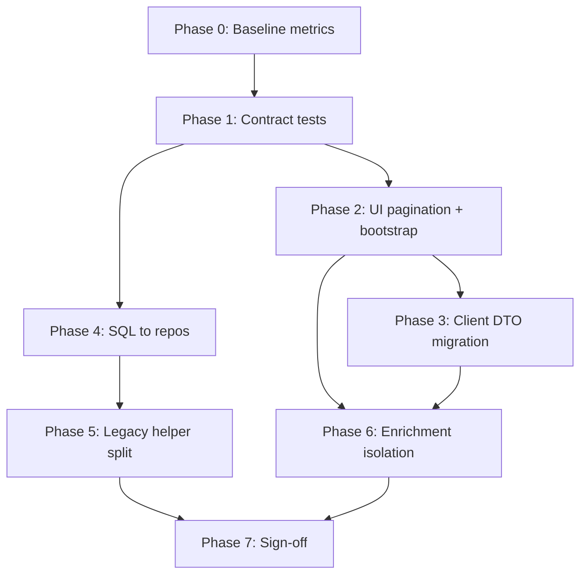

# Discovery Module — Phased Gap Closure Plan

**Status:** Active execution plan to meet [optimization-exit-criteria.md](./optimization-exit-criteria.md).  
**Baseline RCA:** [discovery-perf-rca.md](./discovery-perf-rca.md).  
**Branch:** `feature/abhi-discovery-perf` (and follow-on feature branches).

---

## Non-negotiables (do not break)

These are **protected** across every phase:

| Area | Lock |
|------|------|
| User flows | Home → category → style → vendor list → services → profile → book → pay |
| Business rules | Radius, specialization, role/category filters, vet hub filters, launch gates |
| Booking | `vendor/:id/services` **without** `limit`/`cursor` keeps full shape + packages |
| Payment | Razorpay open timing unchanged |
| Navigation | customer-web nav stack (`customer-navigation.mdc`) — no raw `/checkout` pushes |
| API paths | Existing paths remain; additive fields OK; removing `providers` twin only after client migration |
| Mobile | `WarmpawzCustomer` uses `/service-discovery/*` — treat as **Phase 6+** unless explicitly scoped |

**Principle:** shrink payloads and queries; **never** remove capability the UI still needs — load it on the correct screen instead.

---

## Current state snapshot (2026-07-21)

| Area | Done | Gap |
|------|------|-----|
| Vendor card DTO + `vendors`-only envelope | ✅ (code) | Dev API still returns `providers` twin until deploy |
| Cursor pagination (API) | ✅ default 3 vendors, 5 services | Deploy + UI sweep in progress |
| `category-bootstrap` endpoint | ✅ (code) | 404 on dev API until deploy; vet hub wired |
| Service file split (≤200 LOC modules) | ✅ | SQL still outside repos; legacy-helpers huge |
| Hub infinite scroll | ✅ vet, grooming, training | by-style P0 screens in progress |
| `useByStyleDiscoveryFeed` + benchmark script | ✅ Phase 0 tooling | Baseline captured; redeploy for accurate after |
| UniversalServiceProviderList pagination | ✅ | ClinicListView, GroomingServicesByStyle pending |
| VetServicesByStyle pagination | ✅ | Lazy service fetch on expand |
| Payload / query benchmarks | 🟡 | Script + first dev run; post-deploy re-run |
| Layer purity (SQL in repo only) | ❌ | Phase 4 |
| E2E flow sign-off | ❌ | Phase 7 |

---

## Phase overview

```text
Phase 0 ─ Measure baseline (blocker for sign-off)
Phase 1 ─ Lock contracts + benchmarks gate
Phase 2 ─ UI pagination + bootstrap (customer-web)
Phase 3 ─ Client DTO migration (remove providers fallback)
Phase 4 ─ Repository + SQL ownership
Phase 5 ─ Legacy helper decomposition
Phase 6 ─ Enrichment isolation + N+1 client cleanup
Phase 7 ─ Verification + exit sign-off
```

Phases are sequential in **intent**; Phase 2 and 3 can overlap per screen if tests pass.

---

## Phase 0 — Baseline measurement

**Goal:** Establish evidence. No refactor claims without this.

### Tasks

1. Add `scripts/benchmark-discovery-payloads.sh` (or `.js`):
   - Fixed dev API base + lat/lng + category/role matrix
   - Record: status, raw bytes, gzip bytes, `vendors.length`, top-level keys
   - Endpoints: `discover-services`, `services/by-style`, `vendor/:id/services` (card + legacy), `category-bootstrap`
2. Run against **pre-refactor** tag or `develop` if still old behaviour; run against feature branch.
3. Add `scripts/forensic-discovery-db-trace.js` output template (SQL count per endpoint) — use existing script if present.
4. Save summary to `docs/benchmarks/discovery/README.md` (table only; raw JSON gitignored).

### Exit gate

- [ ] Baseline + current numbers in docs
- [ ] Same query params documented for reproducibility

### Risk

None — read-only.

---

## Phase 1 — Contract lock + regression harness

**Goal:** Prevent backsliding while UI and layers catch up.

### Tasks

1. Extend `discovery-response-contract.test.ts`:
   - `buildVendorListResponse` never includes `providers`
   - Default page sizes (3 / 5)
   - `fullEnrich` / legacy paths explicit
2. Document locked contracts in `discovery-perf-rca.md` (already started) — link to exit criteria.
3. CI: ensure `npm run validate:customer-layers` + discovery tests run on PRs touching `discovery/`.

### Exit gate

- [ ] Contract tests green
- [ ] `validate:customer-layers` green

### Do not break

- Legacy booking response when no `limit`/`cursor`

---

## Phase 2 — Customer-web progressive loading (UI)

**Goal:** Every **long list screen** uses cursor feeds; category chrome loads separately from vendor SQL.

### Priority screens (P0)

| Screen / hook | Endpoint | Action |
|---------------|----------|--------|
| `VetServicesByStyle.tsx` | by-style | `useDiscoveryVendorFeed` + sentinel |
| `GroomingServicesByStyle.tsx` | by-style | same |
| `UniversalServiceProviderList.tsx` | by-style | same |
| `ClinicListView.tsx` | discover + by-style | same |
| `VendorListingByStyle.tsx` (vet/grooming) | by-style | same |

### Priority screens (P1)

| Screen | Action |
|--------|--------|
| `useBoardingVendorDiscovery.ts` | cursor feed |
| `HomeServiceProviderListView.tsx` | cursor feed |
| `ProblemBasedFlowRouter.tsx` | cursor on by-style |
| Home teasers (`useHomePageData`, `CustomerHomeComplete`) | keep small limit; optional no scroll |

### Category bootstrap

| Hub | Action |
|-----|--------|
| Vet | ✅ `useCategoryBootstrap` — done |
| Grooming, Training | Wire bootstrap problems; keep static tiles until API has icons |
| Others | As needed |

### Shared pattern

Reuse existing:

- `hooks/useDiscoveryVendorFeed.ts`
- `hooks/useHubVendorDiscovery.ts` (or generalize to `useStyleDiscoveryFeed`)
- `components/customer/shared/DiscoveryVendorFeedSentinel.tsx`
- `lib/discovery-list.ts` (`discoveryVendorList`, `discoveryNextCursor`)

### Exit gate

- [ ] P0 screens: infinite scroll + `limit=3` + `nextCursor`
- [ ] No screen relies on 20+ vendors in first paint for core flows
- [ ] `npm run test:navigation` if nav touched

### Do not break

- Vendor expand → lazy `vendor/:id/services` for plan rows (hub cards)
- Profile mode (`vendorId` filter) — may disable pagination
- Sitting custom loader (`customLoadRows`) — `hasMore: false` OK

---

## Phase 3 — Client DTO migration

**Goal:** Single list shape; remove silent legacy tolerance.

### Tasks

1. Replace `response.providers || response.vendors` with `discoveryVendorList(response)` everywhere in customer-web discovery paths.
2. Remove `providers` fallback from `lib/discovery-list.ts` once call sites migrated (or keep one release with deprecation comment).
3. Stop expecting `services[]` on vendor list cards unless `fullEnrich=true` (booking/debug only).

### Exit gate

- [ ] Grep: no `response.providers` in discovery list components
- [ ] Manual smoke: vet/grooming/training hub + by-style + clinic list

### Do not break

- Booking flows that call full `vendor/:id/services`

---

## Phase 4 — Repository + SQL ownership

**Goal:** Meet layer checklist — SQL executes only from repos.

### Tasks

1. Move SQL strings from:
   - `discover-services/fetch-services-sql.ts`
   - `services-by-style/vendor-query-sql.ts`, `fetch-services-sql.ts`, `category.ts` fragments  
   → into `repos/discover-services.repo.ts`, `repos/services-by-style.repo.ts` (or `repos/discovery/*.repo.ts`).
2. Keep **shared** EXISTS builders in `lib/discovery-vendor-query.ts` but **invoke from repos**, not services.
3. Split `discovery-vendor-query.ts` (~718 LOC) into:
   - `lib/discovery/sql/exists.ts`
   - `lib/discovery/sql/category-filters.ts`
   - `lib/discovery/sql/vendor-status.ts`
4. Services: parse → call repo → enrich → paginate → `buildVendorListResponse` only.

### Exit gate

- [ ] `validate:customer-layers` passes
- [ ] No `query(` / `select(` in `discovery/services/**` except repos
- [ ] Contract tests + benchmark script still pass (same SQL semantics)

### Do not break

- Filter parity: vet, training, boarding, sitting relaxed radius, specialization EXISTS

---

## Phase 5 — Legacy helper decomposition

**Goal:** Eliminate `legacy-helpers.repo.ts` as god file (~1.8k LOC).

### Target modules

| New module | Owns |
|------------|------|
| `utils/discovery/specialization.mapper.ts` | Spec keys, batch load, display labels |
| `utils/discovery/availability.helper.ts` | Next slot, IST formatting |
| `utils/discovery/vendor-distance.helper.ts` | Haversine, radius lookup |
| `utils/discovery/listing-photo.helper.ts` | Photo URL resolution |
| `repos/discovery-vendor-stats.repo.ts` | Stats batch SQL |

Migrate imports in `query-enrich.ts` files first; delete moved functions from legacy file.

### Exit gate

- [ ] `legacy-helpers.repo.ts` &lt; 300 LOC OR deleted
- [ ] No new imports of legacy file from new code

### Do not break

- Slot display strings on cards
- Specialization filter on problem grid flows

---

## Phase 6 — Enrichment isolation

**Goal:** List screens never pay profile/booking enrichment cost.

### Backend

- Confirm `includeAvailability: false` on all card list paths
- `fullEnrich=true` only for documented debug/booking bridges
- Profile endpoint owns reviews, facility, gallery

### Frontend

- **Remove N+1** in `UniversalServicesByStyle` home/tele: list cards from VendorCardDTO; fetch services only on expand or navigate to “view services”
- Align with progressive model in RCA

### Exit gate

- [ ] Trace: list request does not fan out to N `vendor/:id/services`
- [ ] Benchmark: by-style list payload stable when scrolling (no service blob growth)

---

## Phase 7 — Verification + exit sign-off

**Goal:** Complete [optimization-exit-criteria.md](./optimization-exit-criteria.md) module checklist.

### Functional matrix (customer-web)

```text
☐ Home
☐ Category discovery (bootstrap)
☐ Style selection
☐ Vendor cards + infinite scroll
☐ View services (paginated cards)
☐ Load more services
☐ Vendor profile
☐ Booking
☐ Appointment flow
```

### Commands

```bash
cd backend/lambda && npm run validate:customer-layers
npx jest src/utils/__tests__/discovery-response-contract.test.ts
# ./scripts/benchmark-discovery-payloads.sh
# ./scripts/validate_discovery.sh
cd apps/customer-web && npm run test:navigation   # if nav touched
```

### Sign-off

Fill module table in `optimization-exit-criteria.md` § Module sign-off template; link PR + benchmark summary.

### Optional later: WarmpawzCustomer

Separate plan if native app must use `/customer/discover-services` or stay on `/service-discovery/*` with parallel DTO work.

---

## Phase dependency diagram



---

## Suggested PR slicing (reviewable units)

| PR | Scope |
|----|--------|
| 1 | Phase 0 scripts + benchmark doc |
| 2 | Phase 2 P0 — VetServicesByStyle + UniversalServiceProviderList pagination |
| 3 | Phase 2 P0 — Grooming + ClinicListView |
| 4 | Phase 3 — providers fallback removal |
| 5 | Phase 4 — repo SQL move (discover-services) |
| 6 | Phase 4 — repo SQL move (by-style) |
| 7 | Phase 5 — legacy helper split (incremental) |
| 8 | Phase 6 — UniversalServicesByStyle N+1 removal |
| 9 | Phase 7 — docs + sign-off |

---

## Success metrics (Discovery-specific)

| Metric | Baseline (fill in Phase 0) | Target |
|--------|---------------------------|--------|
| discover-services response (gzip) | ___ KB | ≥50% reduction |
| by-style response (gzip) | ___ KB | ≥50% reduction |
| vendor-services card page (gzip) | ___ KB | bounded ~40 KB class |
| SQL per vendor list request | ___ | ≤3 (vendor + stats + setup batch) |
| Service file max LOC | 700+ monolith | ≤200 per module |
| UI list screens with cursor | 4 / ~20 | all P0+P1 |
| legacy-helpers.repo LOC | ~1800 | &lt;300 or removed |

---

## References

- [optimization-exit-criteria.md](./optimization-exit-criteria.md) — reusable rulebook
- [discovery-perf-rca.md](./discovery-perf-rca.md) — contracts + SQL ladder
- [.cursor/rules/endpoint-4-layer-parity.mdc](../.cursor/rules/endpoint-4-layer-parity.mdc)
- `.cursor/rules/optimization-exit-criteria.mdc` — agent pointer
