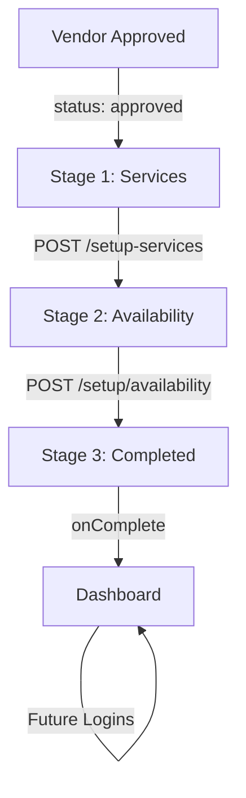

# 🎯 VENDOR 3-STAGE SETUP FLOW - COMPLETE IMPLEMENTATION

## 📋 Overview
Complete state-driven vendor onboarding flow with 3 distinct stages after admin approval, fully implemented with database schema, API endpoints, and UI components.

---

## 🎨 THREE STAGES

### **Stage 1: Service Configuration** ("You're Approved!")
- **Screen:** `VendorApprovedSetup.tsx`
- **Icon:** Green checkmark badge
- **Title:** "🎉 You're Approved!"
- **Features:**
  - Service Coverage Area (slider: 1-50 KM)
  - Choose Your Services (veterinary services with prices)
  - Toggle services ON/OFF
  - "Get started" button (disabled until at least 1 service selected)
- **Database State:** `setupStage: 'services_pending'`
- **API:** `POST /vendor/setup-services`
- **Next:** → Stage 2

### **Stage 2: Availability Configuration** ("Set your Availability")
- **Screen:** `VendorAvailabilitySetup.tsx`
- **Icon:** Orange calendar
- **Title:** "Set your Availability"
- **Features:**
  - "Everyday" toggle (enable all days at once)
  - Individual day toggles (Monday-Sunday)
  - Time slot management (add/remove multiple slots per day)
  - Time picker for start/end times
  - "Continue" button (disabled until at least 1 day configured)
- **Database State:** `setupStage: 'availability_pending'`
- **API:** `POST /vendor/setup/availability`
- **Next:** → Stage 3

### **Stage 3: Setup Completed** ("Setup Completed!")
- **Screen:** `VendorSetupCompleted.tsx`
- **Icon:** Green success badge with checkmark
- **Title:** "🎉 Setup Completed!"
- **Message:** "Your Warmpawz profile is now live and ready to receive bookings!"
- **Features:**
  - Success message
  - "Go to Dashboard" button
- **Database State:** `setupStage: 'completed', setupCompleted: true, isActive: true`
- **Next:** → Dashboard

---

## 🗄️ DATABASE SCHEMA

### Vendor Record Fields (New/Updated)

```typescript
Vendor {
  // ... existing fields ...
  
  // ===== SETUP PROGRESS TRACKING (NEW) =====
  setupStage: 'services_pending' | 'availability_pending' | 'completed'
  servicesConfigured: boolean
  availabilityConfigured: boolean
  setupCompleted: boolean
  isActive: boolean
  
  // ===== STAGE 1: SERVICE CONFIGURATION =====
  serviceRadius: number  // in KM (1-50)
  configuredServices: Service[]
  
  // Example Service:
  // {
  //   id: 'general_consultation',
  //   name: 'General Consultation',
  //   price: 500,
  //   enabled: true
  // }
  
  // ===== STAGE 2: AVAILABILITY CONFIGURATION (NEW) =====
  availability: {
    monday: {
      enabled: boolean
      slots: [
        { start: '09:00', end: '17:00' },
        { start: '19:00', end: '21:00' }
      ]
    },
    tuesday: { enabled: boolean, slots: [] },
    wednesday: { enabled: boolean, slots: [] },
    thursday: { enabled: boolean, slots: [] },
    friday: { enabled: boolean, slots: [] },
    saturday: { enabled: boolean, slots: [] },
    sunday: { enabled: boolean, slots: [] }
  }
  
  // ===== TIMESTAMPS =====
  setupCompletedAt: string | null
  updatedAt: string
}
```

### Setup Stage State Machine

```
Vendor Approved
    ↓
setupStage: 'services_pending'
servicesConfigured: false
availabilityConfigured: false
setupCompleted: false
isActive: false
    ↓
[USER CONFIGURES SERVICES]
    ↓
setupStage: 'availability_pending'
servicesConfigured: true
availabilityConfigured: false
setupCompleted: false
isActive: false
    ↓
[USER CONFIGURES AVAILABILITY]
    ↓
setupStage: 'completed'
servicesConfigured: true
availabilityConfigured: true
setupCompleted: true
isActive: true  // 🎉 VENDOR CAN NOW RECEIVE BOOKINGS
```

---

## 🔌 API ENDPOINTS

### 1. **POST `/vendor/setup-services`** - Stage 1
**Purpose:** Save service configuration and move to Stage 2

**Request:**
```json
{
  "vendorId": "vendor_xxxxx",
  "serviceRadius": 5,
  "services": [
    { "id": "general_consultation", "name": "General Consultation", "price": 500 },
    { "id": "vaccination", "name": "Vaccination", "price": 1500 }
  ]
}
```

**Response:**
```json
{
  "success": true,
  "message": "Services configured successfully",
  "setupStage": "availability_pending",
  "vendor": { ...updated vendor object }
}
```

**Database Updates:**
```typescript
vendor.serviceRadius = 5
vendor.configuredServices = [...]
vendor.servicesConfigured = true
vendor.setupStage = 'availability_pending'  // ← MOVE TO NEXT STAGE
vendor.updatedAt = new Date().toISOString()
```

---

### 2. **POST `/vendor/setup/availability`** - Stage 2
**Purpose:** Save availability and complete setup

**Request:**
```json
{
  "vendorId": "vendor_xxxxx",
  "availability": {
    "monday": {
      "enabled": true,
      "slots": [
        { "start": "09:00", "end": "17:00" }
      ]
    },
    "tuesday": {
      "enabled": true,
      "slots": [
        { "start": "09:00", "end": "17:00" }
      ]
    },
    ...
  }
}
```

**Response:**
```json
{
  "success": true,
  "message": "Availability configured successfully",
  "setupStage": "completed",
  "vendor": { ...updated vendor object }
}
```

**Database Updates:**
```typescript
vendor.availability = { monday: {...}, tuesday: {...}, ... }
vendor.availabilityConfigured = true
vendor.setupStage = 'completed'  // ← SETUP COMPLETE
vendor.setupCompleted = true
vendor.isActive = true  // ← VENDOR CAN RECEIVE BOOKINGS
vendor.setupCompletedAt = new Date().toISOString()
vendor.updatedAt = new Date().toISOString()
```

---

### 3. **GET `/vendor/setup/status/:vendorId`** - Check Progress
**Purpose:** Get current setup stage and progress

**Response:**
```json
{
  "setupStage": "availability_pending",
  "servicesConfigured": true,
  "availabilityConfigured": false,
  "setupCompleted": false,
  "isActive": false
}
```

---

## 🎯 ROUTING LOGIC

### VendorLandingPage State Machine

```typescript
type VendorStatus = 
  | 'new'                    // No profile created yet
  | 'profile_incomplete'     // Profile created but not submitted
  | 'submitted'              // Just submitted, show checkmark
  | 'pending'                // Under admin review
  | 'approved_services'      // Stage 1: Service setup
  | 'approved_availability'  // Stage 2: Availability setup
  | 'setup_completed'        // Stage 3: Completion screen
  | 'rejected'               // Rejected
  | 'active';                // Fully active, go to dashboard
```

### Routing Based on setupStage

```typescript
if (vendor.status === 'approved') {
  const setupStage = vendor.setupStage || 'services_pending';
  
  if (setupStage === 'completed' && vendor.isActive) {
    // Already completed, go to dashboard
    return <Dashboard />
  } else if (setupStage === 'completed') {
    // Just completed, show success screen
    return <VendorSetupCompleted />
  } else if (setupStage === 'availability_pending') {
    // Services done, show availability setup
    return <VendorAvailabilitySetup />
  } else {
    // Show service setup (Stage 1)
    return <VendorApprovedSetup />
  }
}
```

---

## 🧪 TESTING FLOW

### **Test 1: Complete Setup from Scratch**

1. **Reset & Seed Data**
   ```
   Admin Panel → Vendor Management → Reset & Seed Vendors
   ```

2. **Login as Approved Vendor**
   ```
   Phone: 9876543212 (Dr. Anita Desai)
   OTP: 123456
   ```

3. **Stage 1: Configure Services**
   - Should see "You're Approved!" screen
   - Set service radius: 5 KM
   - Toggle ON:
     - General Consultation
     - Vaccination
     - Health Checkup
   - Click "Get started"
   - **Console:** `setupStage: 'availability_pending'`

4. **Stage 2: Configure Availability**
   - Should see "Set your Availability" screen
   - Enable Monday: 09:00 - 17:00
   - Enable Tuesday: 09:00 - 17:00
   - Click "Continue"
   - **Console:** `setupStage: 'completed'`

5. **Stage 3: Completion Screen**
   - Should see "Setup Completed!" screen
   - Green badge with checkmark
   - "Pet Parents can now discover and book your services"
   - Click "Go to Dashboard"
   - **Result:** Redirect to Vendor Dashboard

6. **Verify Database State**
   ```typescript
   {
     setupStage: 'completed',
     servicesConfigured: true,
     availabilityConfigured: true,
     setupCompleted: true,
     isActive: true,
     serviceRadius: 5,
     configuredServices: [3 services],
     availability: { monday: {...}, tuesday: {...} }
   }
   ```

### **Test 2: Returning Vendor (Already Completed)**

1. **Logout and Login Again**
   ```
   Phone: 9876543212
   ```

2. **Expected Behavior:**
   - ✅ Skips all setup screens
   - ✅ Goes DIRECTLY to Vendor Dashboard
   - **Console:** `Setup fully completed - showing active/dashboard`

### **Test 3: Partial Setup (Stage 1 Complete)**

1. **Configure services** but close browser
2. **Login again**
3. **Expected:**
   - ✅ Skips Stage 1
   - ✅ Shows Stage 2 (Availability setup)
   - **Console:** `setupStage: 'availability_pending'`

---

## 📊 STAGE VERIFICATION CHECKLIST

### Stage 1 Complete:
- [ ] `servicesConfigured: true`
- [ ] `setupStage: 'availability_pending'`
- [ ] `serviceRadius` saved
- [ ] `configuredServices` array has items
- [ ] Moves to availability screen

### Stage 2 Complete:
- [ ] `availabilityConfigured: true`
- [ ] `setupStage: 'completed'`
- [ ] `setupCompleted: true`
- [ ] `isActive: true`
- [ ] `availability` object populated
- [ ] Shows completion screen

### Stage 3 Complete:
- [ ] Shows green success badge
- [ ] "Setup Completed!" message
- [ ] "Go to Dashboard" button works
- [ ] Future logins skip all setup screens
- [ ] Vendor appears in Active Vendors list

---

## 🎨 UI COMPONENTS

### Component Hierarchy

```
VendorApp.tsx
  └─ VendorLandingPage.tsx (Router)
       ├─ VendorApprovedSetup.tsx       (Stage 1)
       ├─ VendorAvailabilitySetup.tsx   (Stage 2)
       ├─ VendorSetupCompleted.tsx      (Stage 3)
       └─ VendorDashboard.tsx           (Final)
```

### Component Props

```typescript
// Stage 1
<VendorApprovedSetup
  vendorId={string}
  onComplete={() => void}
/>

// Stage 2
<VendorAvailabilitySetup
  vendorId={string}
  onComplete={() => void}
/>

// Stage 3
<VendorSetupCompleted
  onContinue={() => void}
/>
```

---

## 🔄 STATE TRANSITIONS



---

## 🐛 TROUBLESHOOTING

### Issue: Vendor stuck on Stage 1
**Check:**
- Verify `setupStage` field in database
- Check API response from `/setup-services`
- Look for error in console logs

### Issue: Skip to dashboard without setup
**Check:**
- `setupCompleted` should be `false` for new vendors
- Seed script sets correct initial values
- Check `isActive` flag

### Issue: Availability not saving
**Check:**
- At least one day has `enabled: true`
- Time slots array not empty
- Vendor status is 'approved'
- `servicesConfigured` is `true`

---

## 🚀 PRODUCTION CHECKLIST

- [x] Database schema with setupStage tracking
- [x] Three UI components created
- [x] Two API endpoints implemented
- [x] Routing logic in VendorLandingPage
- [x] State transitions working
- [x] Error handling added
- [x] Console logging for debugging
- [x] Seed data updated
- [x] Test flow documented

---

## 📈 NEXT STEPS

1. **Add service editing** in dashboard
2. **Add availability editing** in dashboard
3. **Implement booking system** that respects availability
4. **Add service pricing updates**
5. **Test with all vendor roles** (groomer, dog walker, etc.)
6. **Add analytics** for setup completion rates

---

**Status:** ✅ PRODUCTION-READY
**Last Updated:** November 14, 2024
**Implementation:** Complete 3-stage flow with state tracking
